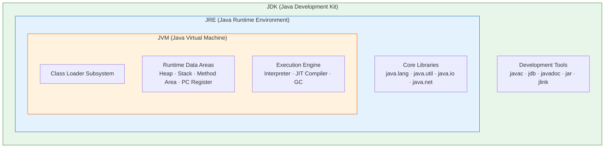
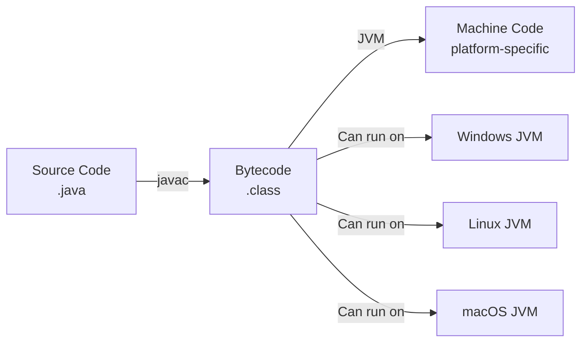
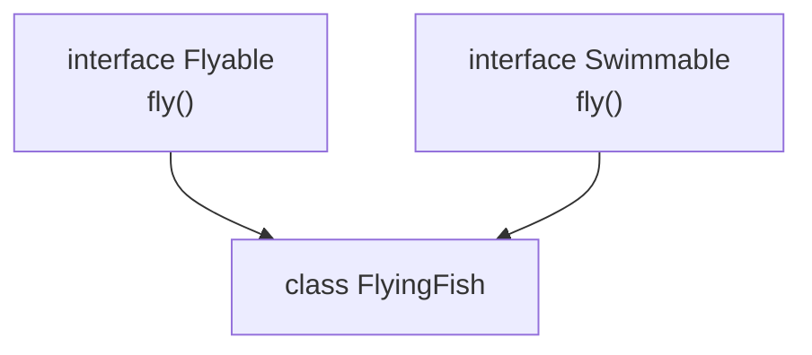

# Java Core & OOP — Comprehensive Guide for FAANG Interview Preparation

**Target audience:** Experienced developers preparing for Google, Meta, Amazon, Apple, and other top-tier technical interviews. Covers JVM internals, OOP principles, SOLID, and the subtle edge cases that separate good candidates from great ones.

[Home](README.md) | [Next: Generics & Type System →](02-Java-Generics-and-Type-System.md)

---

## Table of Contents

1. [JVM, JDK, JRE Architecture](#1-jvm-jdk-jre-architecture)
2. [Compilation and Bytecode](#2-compilation-and-bytecode)
3. [Data Types, Variables, Type Casting](#3-data-types-variables-type-casting)
4. [Control Flow and Loops](#4-control-flow-and-loops)
5. [Classes and Objects](#5-classes-and-objects)
6. [Four Pillars of OOP](#6-four-pillars-of-oop)
7. [SOLID Principles](#7-solid-principles)
8. [Composition vs Inheritance](#8-composition-vs-inheritance)
9. [Object Class Methods Deep Dive](#9-object-class-methods-deep-dive)
10. [Immutable Classes](#10-immutable-classes)
11. [Enums](#11-enums)
12. [Keywords Deep Dive](#12-keywords-deep-dive)
13. [Interview-Focused Summary](#13-interview-focused-summary)

---

## 1. JVM, JDK, JRE Architecture

### 1.1 Overview

The Java platform is layered into three concentric components, each building on the one inside it.

| Component | Full Name | Role |
|-----------|-----------|------|
| **JVM** | Java Virtual Machine | Executes bytecode, manages memory, provides runtime environment |
| **JRE** | Java Runtime Environment | JVM + core libraries (`java.lang`, `java.util`, etc.) needed to *run* Java programs |
| **JDK** | Java Development Kit | JRE + development tools (`javac`, `jdb`, `javadoc`, `jlink`, etc.) needed to *develop* Java programs |

### 1.2 Architecture Diagram



### 1.3 JVM Internals

**Class Loader Subsystem** follows a delegation hierarchy:

1. **Bootstrap ClassLoader** — loads `java.base` module classes (`java.lang.Object`, `java.lang.String`)
2. **Platform ClassLoader** (was Extension) — loads platform/extension modules
3. **Application ClassLoader** — loads classes from the application classpath

**Runtime Data Areas:**

| Area | Per-Thread? | Stores |
|------|-------------|--------|
| **Heap** | Shared | Object instances, arrays |
| **Method Area (Metaspace)** | Shared | Class metadata, constant pool, static variables |
| **Stack** | Per-thread | Frames (local variables, operand stack, return address) |
| **PC Register** | Per-thread | Address of current executing instruction |
| **Native Method Stack** | Per-thread | Native method call frames |

**Execution Engine:**

- **Interpreter** — reads and executes bytecode line by line (slow for hot paths)
- **JIT Compiler (C1/C2)** — compiles hot bytecode to native machine code at runtime
- **Garbage Collector** — reclaims heap memory from unreachable objects (G1 is default since Java 9)

> **Google/FAANG Perspective:** Understanding JVM memory areas is critical for debugging `OutOfMemoryError` in production. Know the difference between heap OOM and Metaspace OOM.

---

## 2. Compilation and Bytecode

### 2.1 The Compilation Pipeline



```text
$ javac HelloWorld.java          # Produces HelloWorld.class
$ javap -c HelloWorld.class      # Disassemble bytecode
$ java HelloWorld                # JVM loads, verifies, executes
```

### 2.2 Bytecode Verification

Before executing any `.class` file, the JVM **bytecode verifier** checks:

1. The file has the correct magic number (`0xCAFEBABE`)
2. Structural integrity of the constant pool
3. Type safety — operand stack never overflows/underflows
4. No illegal casts or access to `private` members of other classes
5. All local variables are initialized before use

### 2.3 Write Once, Run Anywhere (WORA)

The bytecode is **platform-independent**; the JVM is **platform-dependent**. Each OS/architecture has its own JVM implementation that translates bytecode to native instructions. This is the essence of WORA.

```java
public class PlatformInfo {
    public static void main(String[] args) {
        System.out.println("OS:   " + System.getProperty("os.name"));
        System.out.println("Arch: " + System.getProperty("os.arch"));
        System.out.println("JVM:  " + System.getProperty("java.vm.name"));
        // Same bytecode, different output per platform
    }
}
```

> **Interview Tip:** A common trick question: "Is Java 100% platform independent?" Answer: The *language and bytecode* are platform-independent; the *JVM* is platform-dependent. Also, JNI/native code breaks portability.

---

## 3. Data Types, Variables, Type Casting

### 3.1 Primitive Types

Java has exactly **8 primitive types**. Everything else is a reference type.

| Type | Size | Min Value | Max Value | Default | Wrapper Class |
|------|------|-----------|-----------|---------|---------------|
| `byte` | 8 bits | -128 | 127 | 0 | `Byte` |
| `short` | 16 bits | -32,768 | 32,767 | 0 | `Short` |
| `int` | 32 bits | -2³¹ | 2³¹ - 1 | 0 | `Integer` |
| `long` | 64 bits | -2⁶³ | 2⁶³ - 1 | 0L | `Long` |
| `float` | 32 bits | ~±3.4E+38 | ~±3.4E+38 | 0.0f | `Float` |
| `double` | 64 bits | ~±1.7E+308 | ~±1.7E+308 | 0.0d | `Double` |
| `char` | 16 bits | '\u0000' | '\uffff' | '\u0000' | `Character` |
| `boolean` | ~1 bit* | false | true | false | `Boolean` |

*\*JVM-implementation-dependent; often stored as `int` (32 bits) on the stack.*

### 3.2 Reference Types

Classes, interfaces, arrays, and enums. Default value is `null`. Stored on the heap; the variable on the stack holds a *reference* (pointer) to the heap object.

### 3.3 Type Casting

**Widening (Implicit)** — no data loss, done automatically:

```text
byte → short → int → long → float → double
              char → int
```

**Narrowing (Explicit)** — possible data loss, requires cast:

```java
double pi = 3.14159;
int truncated = (int) pi;        // 3 — fractional part lost

int big = 130;
byte small = (byte) big;         // -126 — overflow wraps around
```

### 3.4 Type Promotion Rules in Expressions

```java
byte a = 10;
byte b = 20;
// byte c = a + b;  // COMPILE ERROR: a + b is promoted to int
int c = a + b;      // correct

byte x = 50;
// x = x * 2;       // COMPILE ERROR: result is int
x = (byte) (x * 2); // correct, explicit cast needed

// Rule: In any expression, byte/short/char are promoted to int first.
// If any operand is long, the whole expression becomes long.
// If any operand is float, the whole expression becomes float.
// If any operand is double, the whole expression becomes double.
```

> **Interview Tip:** `byte b = 10; b = b + 1;` does NOT compile. But `byte b = 10; b += 1;` DOES compile because compound assignment operators include an implicit cast.

---

## 4. Control Flow and Loops

### 4.1 Conditional Statements

```java
// Enhanced switch (Java 14+) — no fall-through, returns a value
String quarter = switch (month) {
    case 1, 2, 3   -> "Q1";
    case 4, 5, 6   -> "Q2";
    case 7, 8, 9   -> "Q3";
    case 10, 11, 12 -> "Q4";
    default -> throw new IllegalArgumentException("Invalid month: " + month);
};
```

### 4.2 Loops and Labeled Break/Continue

```java
outer:
for (int i = 0; i < matrix.length; i++) {
    for (int j = 0; j < matrix[i].length; j++) {
        if (matrix[i][j] == target) {
            System.out.println("Found at [" + i + "][" + j + "]");
            break outer;
        }
    }
}
```

### 4.3 For-Each (Enhanced For)

Works with arrays and any `Iterable<T>`. Cannot modify the underlying collection, cannot access the index.

```java
for (String name : names) {
    System.out.println(name);
}
```

---

## 5. Classes and Objects

### 5.1 Class Anatomy

```java
public class Employee {

    // Static field — belongs to the class, shared across all instances
    private static int nextId = 1;

    // Instance fields
    private final int id;
    private String name;
    private double salary;

    // Static initializer block — runs once when the class is loaded
    static {
        System.out.println("Employee class loaded");
    }

    // Instance initializer block — runs before every constructor
    {
        this.id = nextId++;
    }

    // Default constructor
    public Employee() {
        this("Unknown", 0.0);   // constructor chaining with this()
    }

    // Parameterized constructor
    public Employee(String name, double salary) {
        this.name = name;
        this.salary = salary;
    }

    // Copy constructor
    public Employee(Employee other) {
        this(other.name, other.salary);
    }

    // Instance method
    public void raiseSalary(double percent) {
        this.salary += this.salary * percent / 100;
    }

    // Static method — no access to instance fields or `this`
    public static int getEmployeeCount() {
        return nextId - 1;
    }
}
```

### 5.2 Constructor Chaining

- `this(...)` must be the **first statement** in a constructor — chains to another constructor in the same class.
- `super(...)` must be the **first statement** — chains to a parent class constructor.
- You **cannot** use both `this()` and `super()` in the same constructor.
- If you write neither, the compiler inserts `super()` (no-arg) implicitly.

### 5.3 Order of Initialization

When `new Employee("Alice", 100000)` is called:

1. Static fields and static blocks (in source order) — **once per class load**
2. Instance fields and instance initializer blocks (in source order)
3. Constructor body

```java
public class InitOrder {
    static { System.out.println("1. Static block"); }
    { System.out.println("3. Instance block"); }

    private int x = initField();

    private int initField() {
        System.out.println("4. Instance field init");
        return 42;
    }

    static int y = initStaticField();

    private static int initStaticField() {
        System.out.println("2. Static field init");
        return 99;
    }

    public InitOrder() {
        System.out.println("5. Constructor body");
    }
}
// Output: 1 → 2 → 3 → 4 → 5
```

### 5.4 Static Nested Classes vs Inner Classes

```java
public class Outer {
    private int x = 10;

    // Static nested class — no reference to Outer instance
    static class StaticNested {
        void show() {
            // Cannot access x directly
        }
    }

    // Inner class — holds implicit reference to Outer.this
    class Inner {
        void show() {
            System.out.println(x); // can access Outer's fields
        }
    }
}
```

> **Interview Tip:** Inner classes hold a hidden reference to the enclosing instance, which can cause memory leaks in Android/long-lived contexts. Google strongly recommends static nested classes unless you truly need access to the outer instance.

---

## 6. Four Pillars of OOP

### 6.1 Encapsulation

**Data hiding** (restricting direct access) is a *mechanism*; **encapsulation** (bundling data + behavior) is the *principle*.

#### Access Modifiers

| Modifier | Same Class | Same Package | Subclass (other pkg) | World |
|----------|:----------:|:------------:|:--------------------:|:-----:|
| `private` | ✅ | ❌ | ❌ | ❌ |
| *(default)* | ✅ | ✅ | ❌ | ❌ |
| `protected` | ✅ | ✅ | ✅ | ❌ |
| `public` | ✅ | ✅ | ✅ | ✅ |

```java
public class BankAccount {
    private double balance;

    public double getBalance() {
        return balance;
    }

    public void deposit(double amount) {
        if (amount <= 0) throw new IllegalArgumentException("Amount must be positive");
        this.balance += amount;
    }

    public void withdraw(double amount) {
        if (amount > balance) throw new InsufficientFundsException(balance, amount);
        this.balance -= amount;
    }
}
```

> **Google/FAANG Perspective:** In production code, fields are almost always `private`. Use the narrowest access level possible. If a method is only used internally, make it `private` — this reduces the API surface and makes refactoring safer.

---

### 6.2 Inheritance

```java
public class Vehicle {
    protected String make;
    protected int year;

    public Vehicle(String make, int year) {
        this.make = make;
        this.year = year;
    }

    public String describe() {
        return year + " " + make;
    }
}

public class ElectricVehicle extends Vehicle {
    private int rangeKm;

    public ElectricVehicle(String make, int year, int rangeKm) {
        super(make, year);    // MUST be first statement
        this.rangeKm = rangeKm;
    }

    @Override
    public String describe() {
        return super.describe() + " (EV, range: " + rangeKm + " km)";
    }
}
```

#### Method Overriding Rules

1. Method signature (name + parameter types) must be identical
2. Return type must be the same or a **covariant** (subtype) return
3. Access modifier must be the **same or more permissive** (cannot narrow)
4. Cannot override `final`, `static`, or `private` methods
5. Checked exceptions: overriding method can throw **same, subclass, or no** checked exception — never a broader one

#### The Diamond Problem



Java avoids the diamond problem for *classes* by disallowing multiple class inheritance. With interfaces, if two interfaces provide conflicting `default` methods, the implementing class **must override** to resolve ambiguity:

```java
interface Flyable {
    default void move() { System.out.println("Fly"); }
}

interface Swimmable {
    default void move() { System.out.println("Swim"); }
}

class FlyingFish implements Flyable, Swimmable {
    @Override
    public void move() {
        Flyable.super.move();   // explicitly choose one, or provide custom logic
    }
}
```

---

### 6.3 Polymorphism

#### Compile-Time Polymorphism (Method Overloading)

Resolved by the compiler based on: **number**, **type**, and **order** of parameters.

```java
public class MathUtils {
    public static int add(int a, int b)          { return a + b; }
    public static double add(double a, double b) { return a + b; }
    public static int add(int a, int b, int c)   { return a + b + c; }
}
```

**Overloading pitfalls — varargs ambiguity:**

```java
public class Ambiguous {
    static void print(int... nums)    { System.out.println("varargs"); }
    static void print(int a, int b)   { System.out.println("two ints"); }

    public static void main(String[] args) {
        print(1, 2);   // "two ints" — exact match wins over varargs
        print(1);      // "varargs"
    }
}
```

#### Runtime Polymorphism (Dynamic Dispatch)

The JVM decides which overridden method to call based on the **actual object type** at runtime, not the reference type.

```java
public class Shape {
    public double area() { return 0; }
}

public class Circle extends Shape {
    private final double radius;

    public Circle(double radius) { this.radius = radius; }

    @Override
    public double area() { return Math.PI * radius * radius; }
}

public class Rectangle extends Shape {
    private final double width, height;

    public Rectangle(double w, double h) { this.width = w; this.height = h; }

    @Override
    public double area() { return width * height; }
}

// Dynamic dispatch in action
Shape shape = new Circle(5.0);
System.out.println(shape.area());  // 78.54 — Circle.area() is called
shape = new Rectangle(4, 6);
System.out.println(shape.area());  // 24.0 — Rectangle.area() is called
```

**Covariant Return Types:**

```java
class Producer {
    public Object create() { return new Object(); }
}

class StringProducer extends Producer {
    @Override
    public String create() {   // String is a subtype of Object — valid covariant return
        return "hello";
    }
}
```

---

### 6.4 Abstraction

#### Abstract Classes vs Interfaces

| Feature | Abstract Class | Interface |
|---------|---------------|-----------|
| Instantiation | No | No |
| Constructors | Yes | No |
| State (instance fields) | Yes | Only `public static final` constants |
| Method types | Abstract + concrete | Abstract + `default` + `static` + `private` (9+) |
| Inheritance | Single (`extends`) | Multiple (`implements`) |
| Access modifiers on methods | Any | `public` (abstract/default), `private` (9+) |
| Use when | Sharing state/code among related classes | Defining a capability contract across unrelated classes |

#### Java 8+ Interface Evolution

```java
public interface DataSource {

    // Abstract — implementing class MUST provide
    List<String> fetchRecords(String query);

    // Default method (Java 8) — provides a default implementation
    default List<String> fetchAll() {
        return fetchRecords("SELECT *");
    }

    // Static method (Java 8) — utility, called via interface name
    static DataSource inMemory(List<String> data) {
        return query -> data;
    }

    // Private method (Java 9) — shared helper for default methods
    private void log(String message) {
        System.out.println("[DataSource] " + message);
    }
}
```

#### Functional Interfaces

An interface with exactly **one abstract method** (SAM). Can be used as the target for lambda expressions.

```java
@FunctionalInterface
public interface Transformer<T, R> {
    R transform(T input);
    // default and static methods don't count toward SAM
}

Transformer<String, Integer> lengthOf = String::length;
```

---

## 7. SOLID Principles

### 7.1 Single Responsibility Principle (SRP)

*A class should have only one reason to change.*

```java
// ❌ VIOLATION — UserService handles persistence, validation, AND email
public class UserService {
    public void registerUser(String name, String email) {
        if (!email.contains("@")) throw new IllegalArgumentException("Bad email");
        saveToDatabase(name, email);
        sendWelcomeEmail(email);
    }

    private void saveToDatabase(String name, String email) { /* SQL logic */ }
    private void sendWelcomeEmail(String email) { /* SMTP logic */ }
}
```

```java
// ✅ FIX — separate responsibilities into focused classes
public class UserValidator {
    public void validate(String email) {
        if (!email.contains("@")) throw new IllegalArgumentException("Bad email");
    }
}

public class UserRepository {
    public void save(String name, String email) { /* SQL logic */ }
}

public class EmailService {
    public void sendWelcome(String email) { /* SMTP logic */ }
}

public class UserRegistrationService {
    private final UserValidator validator;
    private final UserRepository repository;
    private final EmailService emailService;

    public UserRegistrationService(UserValidator v, UserRepository r, EmailService e) {
        this.validator = v;
        this.repository = r;
        this.emailService = e;
    }

    public void register(String name, String email) {
        validator.validate(email);
        repository.save(name, email);
        emailService.sendWelcome(email);
    }
}
```

---

### 7.2 Open/Closed Principle (OCP)

*Open for extension, closed for modification.*

```java
// ❌ VIOLATION — adding a new shape requires modifying this method
public class AreaCalculator {
    public double calculate(Object shape) {
        if (shape instanceof Circle c) {
            return Math.PI * c.radius * c.radius;
        } else if (shape instanceof Rectangle r) {
            return r.width * r.height;
        }
        throw new UnsupportedOperationException();
    }
}
```

```java
// ✅ FIX — new shapes extend without modifying existing code
public interface Shape {
    double area();
}

public record Circle(double radius) implements Shape {
    @Override
    public double area() { return Math.PI * radius * radius; }
}

public record Triangle(double base, double height) implements Shape {
    @Override
    public double area() { return 0.5 * base * height; }
}

public class AreaCalculator {
    public double totalArea(List<Shape> shapes) {
        return shapes.stream().mapToDouble(Shape::area).sum();
    }
}
```

---

### 7.3 Liskov Substitution Principle (LSP)

*Subtypes must be substitutable for their base types without altering correctness.*

```java
// ❌ VIOLATION — the classic Rectangle/Square problem
public class Rectangle {
    protected int width, height;

    public void setWidth(int w)  { this.width = w; }
    public void setHeight(int h) { this.height = h; }
    public int area()            { return width * height; }
}

public class Square extends Rectangle {
    @Override
    public void setWidth(int w)  { this.width = w; this.height = w; }
    @Override
    public void setHeight(int h) { this.width = h; this.height = h; }
}

// Client code that BREAKS with Square:
void resize(Rectangle r) {
    r.setWidth(5);
    r.setHeight(10);
    assert r.area() == 50;  // FAILS for Square — area is 100
}
```

```java
// ✅ FIX — use an interface that doesn't expose mutators violating invariants
public interface Shape {
    int area();
}

public record Rectangle(int width, int height) implements Shape {
    @Override public int area() { return width * height; }
}

public record Square(int side) implements Shape {
    @Override public int area() { return side * side; }
}
```

---

### 7.4 Interface Segregation Principle (ISP)

*No client should be forced to depend on methods it does not use.*

```java
// ❌ VIOLATION — a fat interface forces all implementations to handle everything
public interface Worker {
    void code();
    void test();
    void attendMeeting();
    void manageSprints();
}
```

```java
// ✅ FIX — segregate into focused interfaces
public interface Coder      { void code(); }
public interface Tester     { void test(); }
public interface Attendee   { void attendMeeting(); }
public interface Manager    { void manageSprints(); }

public class Developer implements Coder, Tester, Attendee {
    @Override public void code()          { /* ... */ }
    @Override public void test()          { /* ... */ }
    @Override public void attendMeeting() { /* ... */ }
}

public class ScrumMaster implements Attendee, Manager {
    @Override public void attendMeeting() { /* ... */ }
    @Override public void manageSprints() { /* ... */ }
}
```

---

### 7.5 Dependency Inversion Principle (DIP)

*High-level modules should not depend on low-level modules. Both should depend on abstractions.*

```java
// ❌ VIOLATION — NotificationService directly depends on concrete EmailSender
public class EmailSender {
    public void send(String to, String body) { /* SMTP logic */ }
}

public class NotificationService {
    private final EmailSender emailSender = new EmailSender(); // tightly coupled

    public void notify(String user, String message) {
        emailSender.send(user, message);
    }
}
```

```java
// ✅ FIX — depend on an abstraction; inject the implementation
public interface MessageChannel {
    void send(String to, String body);
}

public class EmailChannel implements MessageChannel {
    @Override
    public void send(String to, String body) { /* SMTP logic */ }
}

public class SlackChannel implements MessageChannel {
    @Override
    public void send(String to, String body) { /* Slack API logic */ }
}

public class NotificationService {
    private final MessageChannel channel;

    public NotificationService(MessageChannel channel) {
        this.channel = channel;   // constructor injection
    }

    public void notify(String user, String message) {
        channel.send(user, message);
    }
}
```

---

## 8. Composition vs Inheritance

### 8.1 The Problem with Inheritance

Inheritance creates a **tight coupling** between parent and child. Changes in the parent can silently break the child. The classic broken example:

```java
public class InstrumentedHashSet<E> extends HashSet<E> {
    private int addCount = 0;

    @Override
    public boolean add(E e) {
        addCount++;
        return super.add(e);
    }

    @Override
    public boolean addAll(Collection<? extends E> c) {
        addCount += c.size();
        return super.addAll(c);  // BUG: HashSet.addAll() internally calls add()
    }

    public int getAddCount() { return addCount; }
}

var set = new InstrumentedHashSet<String>();
set.addAll(List.of("a", "b", "c"));
set.getAddCount();  // Returns 6, not 3! Double-counted.
```

### 8.2 Composition to the Rescue (Delegation Pattern)

```java
public class InstrumentedSet<E> implements Set<E> {
    private final Set<E> delegate;
    private int addCount = 0;

    public InstrumentedSet(Set<E> delegate) {
        this.delegate = delegate;
    }

    @Override
    public boolean add(E e) {
        addCount++;
        return delegate.add(e);
    }

    @Override
    public boolean addAll(Collection<? extends E> c) {
        addCount += c.size();
        return delegate.addAll(c);  // delegate's addAll doesn't call OUR add()
    }

    public int getAddCount() { return addCount; }

    // Delegate all other Set methods
    @Override public int size()                      { return delegate.size(); }
    @Override public boolean isEmpty()               { return delegate.isEmpty(); }
    @Override public boolean contains(Object o)      { return delegate.contains(o); }
    @Override public Iterator<E> iterator()          { return delegate.iterator(); }
    @Override public Object[] toArray()              { return delegate.toArray(); }
    @Override public <T> T[] toArray(T[] a)          { return delegate.toArray(a); }
    @Override public boolean remove(Object o)        { return delegate.remove(o); }
    @Override public boolean containsAll(Collection<?> c)     { return delegate.containsAll(c); }
    @Override public boolean retainAll(Collection<?> c)       { return delegate.retainAll(c); }
    @Override public boolean removeAll(Collection<?> c)       { return delegate.removeAll(c); }
    @Override public void clear()                    { delegate.clear(); }
}
```

### 8.3 When to Use Which

| Criterion | Inheritance | Composition |
|-----------|-------------|-------------|
| Relationship | IS-A (Dog *is a* Animal) | HAS-A (Car *has an* Engine) |
| Coupling | Tight — child depends on parent internals | Loose — only depends on interface |
| Flexibility | Fixed at compile time | Can swap implementations at runtime |
| Code reuse | Implicit through parent | Explicit through delegation |
| Recommendation | Use sparingly, only for genuine type hierarchies | **Preferred** — Effective Java Item 18 |

> **Google/FAANG Perspective:** Google's Java style guide encourages composition over inheritance. In code reviews, extending a concrete class is a yellow flag; extending an abstract class designed for inheritance is acceptable.

---

## 9. Object Class Methods Deep Dive

Every Java class implicitly extends `java.lang.Object`, which provides these key methods.

### 9.1 equals() and hashCode()

#### The Contract

1. **Reflexive:** `x.equals(x)` is `true`
2. **Symmetric:** `x.equals(y)` ↔ `y.equals(x)`
3. **Transitive:** if `x.equals(y)` and `y.equals(z)`, then `x.equals(z)`
4. **Consistent:** repeated calls return the same result if objects haven't changed
5. **Non-null:** `x.equals(null)` is always `false`

**The critical rule:** If two objects are `equals()`, they **must** have the same `hashCode()`. The reverse is not required (collisions are allowed).

#### Correct Implementation

```java
public class Money {
    private final int amount;
    private final String currency;

    public Money(int amount, String currency) {
        this.amount = amount;
        this.currency = Objects.requireNonNull(currency);
    }

    @Override
    public boolean equals(Object o) {
        if (this == o) return true;
        if (!(o instanceof Money money)) return false;
        return amount == money.amount && currency.equals(money.currency);
    }

    @Override
    public int hashCode() {
        return Objects.hash(amount, currency);
    }
}
```

#### What Happens When You Violate the Contract

```java
public class BadKey {
    private final int id;

    public BadKey(int id) { this.id = id; }

    @Override
    public boolean equals(Object o) {
        if (!(o instanceof BadKey bk)) return false;
        return id == bk.id;
    }

    // MISSING hashCode() override!
}

Map<BadKey, String> map = new HashMap<>();
map.put(new BadKey(1), "one");
map.get(new BadKey(1));   // null! Different hashCode → different bucket → not found
```

> **Interview Tip:** If you override `equals()`, you **must** override `hashCode()`. This is the #1 source of bugs with `HashMap` and `HashSet`.

---

### 9.2 toString()

```java
@Override
public String toString() {
    return "Money{amount=" + amount + ", currency='" + currency + "'}";
}
```

Best practices: include all meaningful fields, use a consistent format, make it parseable if possible but don't depend on the format programmatically.

---

### 9.3 clone() — Shallow vs Deep Copy

#### Why clone() is Broken

- `Cloneable` is a **marker interface** with no methods — the `clone()` method lives in `Object`
- The default `Object.clone()` does a **shallow copy** — reference fields still point to the same objects
- Subclasses can break the cloning contract
- `CloneNotSupportedException` is a checked exception — awkward API

```java
public class Department implements Cloneable {
    private String name;
    private List<String> employees;  // mutable reference field

    @Override
    public Department clone() {
        try {
            Department copy = (Department) super.clone();
            copy.employees = new ArrayList<>(this.employees);  // deep copy the list
            return copy;
        } catch (CloneNotSupportedException e) {
            throw new AssertionError();  // can't happen if we implement Cloneable
        }
    }
}
```

#### Better Alternatives

```java
// Copy constructor
public Department(Department other) {
    this.name = other.name;
    this.employees = new ArrayList<>(other.employees);
}

// Static factory
public static Department copyOf(Department original) {
    return new Department(original.name, new ArrayList<>(original.employees));
}
```

---

### 9.4 finalize() — Deprecated and Dangerous

**Removed for good reason in newer Java versions.**

Problems:
- No guarantee *when* (or even *if*) it will run
- Severe performance cost — objects with finalizers take ~50x longer to GC
- Finalizer attacks can resurrect objects and break security
- Can cause resource leaks if you rely on it instead of explicit cleanup

**Alternatives:**

```java
// 1. try-with-resources (preferred for closeable resources)
try (var conn = dataSource.getConnection()) {
    // use connection
}   // auto-closed here

// 2. Cleaner API (Java 9+) for rare native resource cases
public class NativeResource implements AutoCloseable {
    private static final Cleaner CLEANER = Cleaner.create();
    private final Cleaner.Cleanable cleanable;

    public NativeResource() {
        long nativePtr = allocateNative();
        this.cleanable = CLEANER.register(this, () -> freeNative(nativePtr));
    }

    @Override
    public void close() {
        cleanable.clean();
    }
}
```

---

## 10. Immutable Classes

### 10.1 How to Create an Immutable Class

1. Declare the class `final` (prevent subclassing)
2. Make all fields `private final`
3. Provide no setters
4. Initialize all fields via the constructor
5. Return **defensive copies** of mutable fields

```java
public final class ImmutableEvent {
    private final String name;
    private final LocalDateTime timestamp;
    private final List<String> attendees;

    public ImmutableEvent(String name, LocalDateTime timestamp, List<String> attendees) {
        this.name = Objects.requireNonNull(name);
        this.timestamp = Objects.requireNonNull(timestamp);
        this.attendees = List.copyOf(attendees);   // defensive copy + unmodifiable
    }

    public String getName()               { return name; }
    public LocalDateTime getTimestamp()    { return timestamp; }  // LocalDateTime is already immutable
    public List<String> getAttendees()     { return attendees; }  // already unmodifiable
}
```

### 10.2 String Immutability and the String Pool

```java
String s1 = "hello";           // String pool
String s2 = "hello";           // Reuses the same pooled object
String s3 = new String("hello"); // New object on heap, bypasses pool

System.out.println(s1 == s2);     // true  — same reference in pool
System.out.println(s1 == s3);     // false — different objects
System.out.println(s1.equals(s3)); // true  — same content

String s4 = s3.intern();
System.out.println(s1 == s4);     // true  — intern() returns pooled instance
```

**Why is String immutable?**

- **Thread safety** — can be shared across threads without synchronization
- **Security** — class names, file paths, network URLs are passed as Strings; mutation would be a security hole
- **Hash caching** — `String` caches its `hashCode` for use as `HashMap` keys
- **String pool** — only works because Strings can't change after creation

### 10.3 Java Records (Java 16+) — Immutability Made Easy

```java
public record Point(int x, int y) {
    // Compiler auto-generates: constructor, getters (x(), y()), equals, hashCode, toString
    // All fields are private final by default

    // Compact constructor for validation
    public Point {
        if (x < 0 || y < 0) throw new IllegalArgumentException("Coordinates must be non-negative");
    }
}
```

> **Google/FAANG Perspective:** Immutability is a core principle in Google's codebase. Immutable objects are inherently thread-safe, can be freely shared and cached, and make code much easier to reason about. Prefer `List.of()`, `Map.of()`, and records whenever possible.

---

## 11. Enums

### 11.1 Beyond Simple Constants

Enums in Java are full classes — they can have fields, constructors, and methods.

```java
public enum HttpStatus {
    OK(200, "OK"),
    CREATED(201, "Created"),
    BAD_REQUEST(400, "Bad Request"),
    UNAUTHORIZED(401, "Unauthorized"),
    NOT_FOUND(404, "Not Found"),
    INTERNAL_SERVER_ERROR(500, "Internal Server Error");

    private final int code;
    private final String reason;

    HttpStatus(int code, String reason) {
        this.code = code;
        this.reason = reason;
    }

    public int getCode()      { return code; }
    public String getReason() { return reason; }

    public boolean isSuccess() { return code >= 200 && code < 300; }
    public boolean isError()   { return code >= 400; }

    public static HttpStatus fromCode(int code) {
        for (HttpStatus status : values()) {
            if (status.code == code) return status;
        }
        throw new IllegalArgumentException("Unknown HTTP status code: " + code);
    }
}
```

### 11.2 Strategy Pattern with Abstract Methods

```java
public enum Operation {
    ADD {
        @Override public double apply(double a, double b) { return a + b; }
    },
    SUBTRACT {
        @Override public double apply(double a, double b) { return a - b; }
    },
    MULTIPLY {
        @Override public double apply(double a, double b) { return a * b; }
    },
    DIVIDE {
        @Override public double apply(double a, double b) {
            if (b == 0) throw new ArithmeticException("Division by zero");
            return a / b;
        }
    };

    public abstract double apply(double a, double b);
}

// Usage — no switch statement needed, extensible by adding new enum constants
double result = Operation.MULTIPLY.apply(3, 7);  // 21.0
```

### 11.3 EnumSet and EnumMap

These are high-performance, specialized collections backed by bit vectors and arrays.

```java
// EnumSet — backed by a single long (up to 64 values) — O(1) operations
Set<HttpStatus> errorStatuses = EnumSet.of(
    HttpStatus.BAD_REQUEST, HttpStatus.UNAUTHORIZED, HttpStatus.NOT_FOUND
);

Set<HttpStatus> allSuccesses = EnumSet.range(HttpStatus.OK, HttpStatus.CREATED);

// EnumMap — backed by an array indexed by ordinal — faster than HashMap
Map<HttpStatus, String> templates = new EnumMap<>(HttpStatus.class);
templates.put(HttpStatus.NOT_FOUND, "404.html");
templates.put(HttpStatus.INTERNAL_SERVER_ERROR, "500.html");
```

### 11.4 Enum Singleton Pattern

Thread-safe, serialization-safe, reflection-safe — the simplest correct singleton.

```java
public enum AppConfig {
    INSTANCE;

    private final Map<String, String> properties = new HashMap<>();

    public void load(String path) {
        // load properties from file
    }

    public String get(String key) {
        return properties.get(key);
    }
}

// Usage
AppConfig.INSTANCE.get("db.url");
```

> **Interview Tip:** Joshua Bloch (Effective Java) calls enum singletons "the best way to implement a singleton." Unlike `static final` or double-checked locking, enums handle serialization and reflection attacks for free.

---

## 12. Keywords Deep Dive

### 12.1 `final`

| Context | Effect |
|---------|--------|
| **Variable** | Cannot be reassigned after initialization (but the object it points to can still be mutated if mutable) |
| **Method** | Cannot be overridden by subclasses |
| **Class** | Cannot be extended (e.g., `String`, `Integer`) |

```java
final List<String> names = new ArrayList<>();
names.add("Alice");   // ALLOWED — the list object itself is mutated
// names = new ArrayList<>();  // COMPILE ERROR — cannot reassign the reference
```

```java
// Blank final — must be assigned exactly once, in the constructor
public class Config {
    private final String environment;

    public Config(String env) {
        this.environment = env;  // assigned here
    }
}
```

### 12.2 `static`

| Context | Effect |
|---------|--------|
| **Field** | Shared across all instances, belongs to the class |
| **Method** | Can be called without an instance; cannot access `this` or instance members |
| **Block** | Runs once when the class is loaded; used for complex static initialization |
| **Nested class** | Does not hold a reference to the enclosing instance |
| **Import** | `import static java.lang.Math.PI;` — import static members directly |

### 12.3 `transient`

Marks a field to be **excluded from serialization**.

```java
public class UserSession implements Serializable {
    private String username;
    private transient String authToken;    // excluded — security-sensitive
    private transient Socket connection;   // excluded — non-serializable
}
```

### 12.4 `volatile`

Guarantees **visibility** of changes across threads, but does NOT provide atomicity.

```java
public class ShutdownFlag {
    private volatile boolean running = true;

    public void stop() {
        running = false;   // write is immediately visible to all threads
    }

    public void run() {
        while (running) {
            // without volatile, the JIT may hoist this read out of the loop
            doWork();
        }
    }
}
```

**What `volatile` guarantees:**
- Every read comes from main memory (not CPU cache)
- Every write flushes to main memory immediately
- Prevents instruction reordering around volatile accesses

**What `volatile` does NOT guarantee:**
- Atomicity of compound operations (`count++` is read-modify-write — use `AtomicInteger`)

```java
private volatile int count = 0;
count++;  // NOT atomic! This is: read count → increment → write count
          // Two threads can both read 0, both write 1 — lost update

// Use AtomicInteger instead
private final AtomicInteger count = new AtomicInteger(0);
count.incrementAndGet();  // truly atomic
```

### 12.5 `strictfp`

Ensures floating-point calculations follow the IEEE 754 standard strictly, producing consistent results across all platforms. Rarely used — since Java 17, all FP operations are strict by default, making this keyword effectively obsolete.

### 12.6 `native`

Declares a method implemented in platform-specific native code (C/C++) via JNI. Used by the JDK internally (`System.arraycopy`, `Object.hashCode`). Rarely used in application code.

### 12.7 `instanceof` and Pattern Matching

```java
// Traditional
if (obj instanceof String) {
    String s = (String) obj;
    System.out.println(s.length());
}

// Pattern matching (Java 16+)
if (obj instanceof String s) {
    System.out.println(s.length());  // s is already cast and scoped
}

// Pattern matching in switch (Java 21+)
String describe(Object obj) {
    return switch (obj) {
        case Integer i  -> "Integer: " + i;
        case String s   -> "String of length " + s.length();
        case int[] arr  -> "int array of length " + arr.length;
        case null       -> "null";
        default         -> "Unknown: " + obj.getClass().getName();
    };
}
```

---

## 13. Interview-Focused Summary

### Quick-Reference Q&A

| # | Question | Key Answer |
|---|----------|------------|
| 1 | What is the difference between JDK, JRE, and JVM? | JDK = JRE + dev tools; JRE = JVM + libraries; JVM = bytecode execution engine |
| 2 | Is Java pass-by-value or pass-by-reference? | Always **pass-by-value**. For objects, the *reference* (pointer) is copied by value — the original reference cannot be reassigned, but the object it points to can be mutated. |
| 3 | Can you override a `static` method? | No. Static methods are resolved at compile time (method hiding, not overriding). |
| 4 | Can you override a `private` method? | No. Private methods are not visible to subclasses. A subclass can define a method with the same signature, but it is a new method, not an override. |
| 5 | What is the difference between `==` and `equals()`? | `==` compares references (memory addresses); `equals()` compares logical content (when overridden). |
| 6 | Why must you override `hashCode()` when you override `equals()`? | The contract states equal objects must have equal hash codes. Violating this breaks `HashMap`, `HashSet`, and any hash-based collection. |
| 7 | What is the diamond problem and how does Java solve it? | Ambiguity when two parent types define the same method. Java avoids it for classes (single inheritance) and forces explicit override resolution for interface default methods. |
| 8 | Abstract class vs interface — when to use which? | Abstract class for shared state + partial implementation among related classes. Interface for defining a capability across unrelated classes, or when multiple inheritance is needed. |
| 9 | What makes a class immutable? | `final` class, `private final` fields, no setters, defensive copies of mutable fields in constructor and getters. |
| 10 | Why is `String` immutable in Java? | Thread safety, string pool reuse, hash code caching, security (class loading, network URLs). |
| 11 | What is the difference between method overloading and overriding? | Overloading = same name, different parameters, resolved at compile time. Overriding = same signature in a subclass, resolved at runtime (dynamic dispatch). |
| 12 | Explain `volatile` vs `synchronized`. | `volatile` ensures visibility of a single variable across threads but not atomicity. `synchronized` ensures both visibility and atomicity by acquiring a lock. |
| 13 | What is covariant return type? | An overriding method can return a subtype of the return type declared in the parent method (e.g., return `String` instead of `Object`). |
| 14 | Why does `b = b + 1` not compile for `byte b` but `b += 1` does? | `b + 1` promotes to `int`; assigning `int` to `byte` requires explicit cast. The `+=` operator includes an implicit narrowing cast. |
| 15 | What is constructor chaining? | Calling one constructor from another using `this()` (same class) or `super()` (parent class). Must be the first statement. |
| 16 | Can a constructor be `private`? | Yes. Used in singleton pattern, factory methods, and utility classes (to prevent instantiation). |
| 17 | What is the best way to implement a singleton in Java? | Enum singleton (`enum Singleton { INSTANCE; }`) — thread-safe, serialization-safe, reflection-safe. |
| 18 | Explain the order of initialization in a Java class. | Static fields/blocks (once at class load) → Instance fields/blocks (per object creation) → Constructor body. |
| 19 | What is the delegation pattern and why prefer it over inheritance? | An object forwards calls to a contained helper object (composition). Avoids tight coupling, fragile base class problem, and allows runtime flexibility. |
| 20 | What are sealed classes (Java 17+)? | Classes that restrict which other classes can extend them using `permits`. Enables exhaustive pattern matching in switch expressions. |

### Top Edge Cases Interviewers Love

1. **`Integer` caching:** `Integer.valueOf(127) == Integer.valueOf(127)` is `true`, but `Integer.valueOf(128) == Integer.valueOf(128)` is `false` (cache range is -128 to 127)
2. **String pool:** `"abc" == "abc"` is `true`, but `new String("abc") == new String("abc")` is `false`
3. **`finally` always runs:** Even after `return` — the `finally` block executes before the method returns. Exception: `System.exit()` or JVM crash.
4. **Autoboxing `NullPointerException`:** `Integer x = null; int y = x;` throws NPE during unboxing
5. **Varargs and autoboxing:** `void foo(int... a)` vs `void foo(Integer... a)` — calling `foo(1, 2)` prefers the `int` version
6. **Shadowing vs overriding:** Fields are *shadowed* (resolved by reference type), methods are *overridden* (resolved by object type)
7. **`static` methods and polymorphism:** `Parent.staticMethod()` and `Child.staticMethod()` are independent — no dynamic dispatch for static methods

---

*Last updated: April 2026. Covers Java 8 through Java 21+ features where noted.*

---

[Home](README.md) | [Next: Generics & Type System →](02-Java-Generics-and-Type-System.md)
