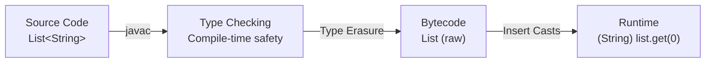

# Java Generics and Type System — Complete Guide

**Target audience:** Senior engineers preparing for FAANG/top-tier system design and coding interviews. Covers every corner of Java's type system and generics that interviewers probe.

[← Previous: Core Java & OOP](01-Java-Core-and-OOP-Guide.md) | [Home](README.md) | [Next: Exception Handling →](03-Java-Exception-Handling-Guide.md)

---

## Table of Contents

1. [Java Type System Overview](#1-java-type-system-overview)
2. [Primitives vs Wrapper Classes](#2-primitives-vs-wrapper-classes)
3. [Why Generics Exist](#3-why-generics-exist)
4. [Generic Classes](#4-generic-classes)
5. [Generic Interfaces](#5-generic-interfaces)
6. [Generic Methods](#6-generic-methods)
7. [Bounded Type Parameters](#7-bounded-type-parameters)
8. [Wildcards](#8-wildcards)
9. [PECS Principle](#9-pecs-principle---producer-extends-consumer-super)
10. [Type Erasure](#10-type-erasure)
11. [Generic Limitations and Restrictions](#11-generic-limitations-and-restrictions)
12. [Recursive Type Bounds](#12-recursive-type-bounds)
13. [Real-World Generic Patterns](#13-real-world-generic-patterns)
14. [Interview Traps and Tricky Questions](#14-interview-traps-and-tricky-questions)
15. [Interview-Focused Summary](#15-interview-focused-summary)

---

## 1. Java Type System Overview

Java is a **statically typed, strongly typed** language. Every variable has a declared type checked at compile time.

### 1.1 Primitive Types (8 Types)

| Type      | Size    | Default | Range |
|-----------|---------|---------|-------|
| `byte`    | 8 bits  | 0       | -128 to 127 |
| `short`   | 16 bits | 0       | -32,768 to 32,767 |
| `int`     | 32 bits | 0       | -2³¹ to 2³¹-1 |
| `long`    | 64 bits | 0L      | -2⁶³ to 2⁶³-1 |
| `float`   | 32 bits | 0.0f    | IEEE 754 |
| `double`  | 64 bits | 0.0d    | IEEE 754 |
| `char`    | 16 bits | '\u0000'| 0 to 65,535 (Unicode) |
| `boolean` | ~1 bit  | false   | true / false |

### 1.2 Reference Types

- **Classes** — `String`, `Object`, user-defined
- **Interfaces** — `Comparable`, `Serializable`
- **Arrays** — `int[]`, `String[]` (arrays are objects)
- **Enums** — `enum Color { RED, GREEN, BLUE }`
- **Annotations** — `@Override`, `@Nullable`

### 1.3 Type Hierarchy — Everything Extends Object

```mermaid
graph TD
    Object --> String
    Object --> Number
    Number --> Integer
    Number --> Double
    Number --> Long
    Object --> Boolean
    Object --> "Arrays (Object[])"
    Object --> "User Classes"
    Object --> Enum
```

> **Key insight:** Primitives are *not* objects. They live on the stack, have no methods, and cannot be `null`. This is why generics cannot use primitives directly — `List<int>` is illegal.

---

## 2. Primitives vs Wrapper Classes

### 2.1 The Eight Wrappers

| Primitive | Wrapper     | Boxing Call              | Unboxing Call        |
|-----------|-------------|--------------------------|----------------------|
| `byte`    | `Byte`      | `Byte.valueOf(b)`        | `byteValue()`       |
| `short`   | `Short`     | `Short.valueOf(s)`       | `shortValue()`      |
| `int`     | `Integer`   | `Integer.valueOf(i)`     | `intValue()`        |
| `long`    | `Long`      | `Long.valueOf(l)`        | `longValue()`       |
| `float`   | `Float`     | `Float.valueOf(f)`       | `floatValue()`      |
| `double`  | `Double`    | `Double.valueOf(d)`      | `doubleValue()`     |
| `char`    | `Character` | `Character.valueOf(c)`   | `charValue()`       |
| `boolean` | `Boolean`   | `Boolean.valueOf(b)`     | `booleanValue()`    |

### 2.2 Autoboxing and Unboxing (Java 5+)

```java
List<Integer> nums = new ArrayList<>();
nums.add(42);          // autoboxing: int → Integer.valueOf(42)
int val = nums.get(0); // unboxing:   Integer.intValue() → int
```

### 2.3 The Integer Cache Trap (-128 to 127)

```java
Integer a = 127;
Integer b = 127;
System.out.println(a == b);    // true  — same cached object

Integer c = 128;
Integer d = 128;
System.out.println(c == d);    // false — different heap objects!
System.out.println(c.equals(d)); // true — correct comparison
```

`Integer.valueOf()` caches values in [-128, 127]. Outside that range, `==` compares references, not values.

> **Google/FAANG perspective:** This is a classic screening question. Interviewers expect you to explain *why* it happens (the `IntegerCache` inner class) and that `.equals()` should always be used for wrapper comparisons.

### 2.4 Performance Implications

```java
// BAD — triggers ~10 million boxing operations
Long sum = 0L;
for (long i = 0; i < Integer.MAX_VALUE; i++) {
    sum += i; // unbox sum, add, rebox result
}

// GOOD — stays on the stack
long sum = 0L;
for (long i = 0; i < Integer.MAX_VALUE; i++) {
    sum += i;
}
```

Each autoboxing creates a heap object (outside the cache range). In tight loops this means GC pressure and ~5-10x slowdown.

### 2.5 NullPointerException on Unboxing

```java
Integer wrapped = null;
int value = wrapped; // NPE at runtime — unboxing calls null.intValue()
```

---

## 3. Why Generics Exist

### 3.1 Pre-Java 5: Raw Collections

```java
List names = new ArrayList(); // raw type
names.add("Alice");
names.add(42); // compiles fine — no type safety

String first = (String) names.get(0); // manual cast
String second = (String) names.get(1); // ClassCastException at runtime!
```

Problems:
- **No compile-time type checking** — anything goes into the collection.
- **Manual casting everywhere** — boilerplate and error-prone.
- **Runtime failures** — `ClassCastException` only discovered in production.

### 3.2 Post-Java 5: Generics

```java
List<String> names = new ArrayList<>();
names.add("Alice");
// names.add(42); // COMPILE ERROR — caught immediately

String first = names.get(0); // no cast needed
```

Generics provide:
1. **Compile-time type safety** — invalid types are caught before code ships.
2. **Elimination of casts** — the compiler inserts them automatically.
3. **Enabling generic algorithms** — write once, use for any type.

---

## 4. Generic Classes

### 4.1 Defining a Generic Class

```java
public class Box<T> {
    private T content;

    public void put(T item) { this.content = item; }
    public T get() { return content; }
}

Box<String> stringBox = new Box<>();
stringBox.put("hello");
String s = stringBox.get(); // no cast
```

### 4.2 Type Parameter Naming Conventions

| Letter | Meaning               | Example                     |
|--------|-----------------------|-----------------------------|
| `T`    | Type                  | `Box<T>`                    |
| `E`    | Element               | `List<E>`, `Set<E>`         |
| `K`    | Key                   | `Map<K, V>`                 |
| `V`    | Value                 | `Map<K, V>`                 |
| `N`    | Number                | `Calc<N extends Number>`    |
| `R`    | Return type           | `Function<T, R>`            |
| `S,U`  | 2nd, 3rd type params  | `BiFunction<T, U, R>`       |

### 4.3 Multiple Type Parameters

```java
public class Pair<K, V> {
    private final K key;
    private final V value;

    public Pair(K key, V value) {
        this.key = key;
        this.value = value;
    }

    public K getKey()   { return key; }
    public V getValue() { return value; }
}

Pair<String, Integer> entry = new Pair<>("age", 30);
```

### 4.4 The Result Pattern (Production-Grade)

Used extensively at Google/Meta for representing success/failure without exceptions:

```java
public class Result<T> {
    private final T value;
    private final String error;
    private final boolean success;

    private Result(T value, String error, boolean success) {
        this.value = value;
        this.error = error;
        this.success = success;
    }

    public static <T> Result<T> ok(T value) {
        return new Result<>(value, null, true);
    }

    public static <T> Result<T> fail(String error) {
        return new Result<>(null, error, false);
    }

    public T getOrThrow() {
        if (!success) throw new RuntimeException(error);
        return value;
    }

    public <R> Result<R> map(Function<T, R> mapper) {
        if (!success) return Result.fail(error);
        return Result.ok(mapper.apply(value));
    }
}

Result<User> result = userService.findById(id);
String name = result.map(User::getName).getOrThrow();
```

---

## 5. Generic Interfaces

### 5.1 Comparable<T>

```java
public class Employee implements Comparable<Employee> {
    private final String name;
    private final int salary;

    public Employee(String name, int salary) {
        this.name = name;
        this.salary = salary;
    }

    @Override
    public int compareTo(Employee other) {
        return Integer.compare(this.salary, other.salary);
    }
}

List<Employee> team = List.of(new Employee("Alice", 120000), new Employee("Bob", 95000));
List<Employee> sorted = team.stream().sorted().toList();
```

### 5.2 Custom Generic Interfaces

```java
public interface Repository<T, ID> {
    T findById(ID id);
    List<T> findAll();
    T save(T entity);
    void deleteById(ID id);
}

public interface Transformer<IN, OUT> {
    OUT transform(IN input);
}

public class StringToIntTransformer implements Transformer<String, Integer> {
    @Override
    public Integer transform(String input) {
        return Integer.parseInt(input);
    }
}
```

### 5.3 Implementing a Generic Interface with a Concrete Type vs. Staying Generic

```java
// Concrete implementation — fixes the type parameter
public class UserRepository implements Repository<User, Long> {
    @Override
    public User findById(Long id) { /* ... */ }
    // ...
}

// Generic implementation — propagates the type parameter
public class InMemoryRepository<T, ID> implements Repository<T, ID> {
    private final Map<ID, T> store = new HashMap<>();

    @Override
    public T findById(ID id) { return store.get(id); }

    @Override
    public T save(T entity) { /* ... */ return entity; }
    // ...
}
```

---

## 6. Generic Methods

### 6.1 Syntax

The type parameter `<T>` comes **before** the return type:

```java
public class ArrayUtils {

    public static <T> List<T> asList(T... elements) {
        List<T> list = new ArrayList<>();
        Collections.addAll(list, elements);
        return list;
    }

    public static <T extends Comparable<T>> T max(T a, T b) {
        return a.compareTo(b) >= 0 ? a : b;
    }
}

List<String> names = ArrayUtils.asList("Alice", "Bob", "Charlie");
String bigger = ArrayUtils.max("apple", "banana"); // "banana"
```

### 6.2 Type Inference

The compiler infers the type from arguments — you rarely need to specify it explicitly:

```java
// Compiler infers <String>
List<String> list = ArrayUtils.asList("a", "b");

// Explicit type witness (rarely needed, but useful for ambiguity)
List<String> list2 = ArrayUtils.<String>asList("a", "b");
```

### 6.3 How Collections.sort Works Internally

```java
// Actual JDK signature
public static <T extends Comparable<? super T>> void sort(List<T> list) {
    list.sort(null);
}
```

Breaking this down:
- `<T extends Comparable<? super T>>` — T must be comparable to itself *or any supertype*.
- This lets `List<Apple>` be sorted if `Fruit implements Comparable<Fruit>`, because `Apple extends Fruit` and `Fruit` is `Comparable<? super Apple>`.

```java
class Fruit implements Comparable<Fruit> {
    String name;
    @Override
    public int compareTo(Fruit o) { return name.compareTo(o.name); }
}

class Apple extends Fruit {}

List<Apple> apples = new ArrayList<>();
Collections.sort(apples); // works because Comparable<? super Apple> matches Comparable<Fruit>
```

---

## 7. Bounded Type Parameters

### 7.1 Upper Bounds

```java
// Only accepts Number or its subclasses
public static <T extends Number> double sum(List<T> numbers) {
    double total = 0;
    for (T num : numbers) {
        total += num.doubleValue(); // doubleValue() is guaranteed by Number
    }
    return total;
}

sum(List.of(1, 2, 3));       // List<Integer> — works
sum(List.of(1.5, 2.5));      // List<Double>  — works
// sum(List.of("a", "b"));   // COMPILE ERROR — String is not a Number
```

### 7.2 Multiple Bounds

```java
// T must extend Comparable AND implement Serializable
public static <T extends Comparable<T> & Serializable> T findMax(List<T> items) {
    return items.stream().max(Comparator.naturalOrder()).orElseThrow();
}
```

**Rules for multiple bounds:**
- At most **one class** bound (must come first).
- Any number of **interface** bounds after the class.
- Syntax: `<T extends ClassBound & Interface1 & Interface2>`

```java
// Valid
<T extends Number & Comparable<T> & Serializable>

// Invalid — two class bounds
// <T extends Number & String>

// Invalid — class not first
// <T extends Serializable & Number>
```

### 7.3 Why `extends` for Both Classes and Interfaces

In bounds, `extends` means "is a subtype of" — it covers both class inheritance and interface implementation. Java reuses the keyword to keep the syntax simpler rather than introducing `<T implements Serializable>`.

---

## 8. Wildcards

### 8.1 Unbounded Wildcard `<?>`

"I don't know or care about the type."

```java
public static void printAll(List<?> list) {
    for (Object item : list) {
        System.out.println(item);
    }
}

printAll(List.of(1, 2, 3));
printAll(List.of("a", "b"));
```

You **cannot add** to a `List<?>` (except `null`) because the compiler doesn't know the element type.

### 8.2 Upper Bounded Wildcard `<? extends T>`

"Some unknown type that IS-A T." — Read-only semantics.

```java
public static double sumOfList(List<? extends Number> list) {
    double sum = 0;
    for (Number n : list) {  // safe to read as Number
        sum += n.doubleValue();
    }
    return sum;
}

sumOfList(List.of(1, 2, 3));       // List<Integer>
sumOfList(List.of(1.1, 2.2));      // List<Double>
```

### 8.3 Lower Bounded Wildcard `<? super T>`

"Some unknown type that is a supertype of T." — Write semantics.

```java
public static void addIntegers(List<? super Integer> list) {
    list.add(1);   // safe — Integer is always assignable to ? super Integer
    list.add(2);
}

List<Number> nums = new ArrayList<>();
addIntegers(nums); // works — Number is a supertype of Integer

List<Object> objs = new ArrayList<>();
addIntegers(objs); // works — Object is a supertype of Integer
```

### 8.4 Wildcard Comparison Table

| Wildcard | Can Read As | Can Write | Use When |
|---|---|---|---|
| `<?>` | `Object` | Nothing (only `null`) | Type doesn't matter |
| `<? extends T>` | `T` | Nothing (only `null`) | Producing/reading values |
| `<? super T>` | `Object` | `T` and subtypes | Consuming/writing values |

---

## 9. PECS Principle — Producer Extends, Consumer Super

### 9.1 The Rule

> If a parameterized type represents a **producer** (you read from it), use `<? extends T>`.
> If it represents a **consumer** (you write to it), use `<? super T>`.
> If both, use exact type `<T>`.

### 9.2 Collections.copy() — The Classic Example

```java
// JDK signature
public static <T> void copy(List<? super T> dest, List<? extends T> src) {
    for (int i = 0; i < src.size(); i++) {
        dest.set(i, src.get(i));
    }
}
```

- `src` is a **producer** — we read from it → `? extends T`
- `dest` is a **consumer** — we write to it → `? super T`

```java
List<Number> target = new ArrayList<>(Arrays.asList(0, 0, 0));
List<Integer> source = List.of(1, 2, 3);
Collections.copy(target, source); // T inferred as Integer
// target is now [1, 2, 3]
```

### 9.3 PECS in Practice

```java
// Stack that follows PECS
public class GenericStack<T> {
    private final List<T> elements = new ArrayList<>();

    public void push(T item) { elements.add(item); }
    public T pop() { return elements.remove(elements.size() - 1); }

    // Push all FROM src — src produces → extends
    public void pushAll(Iterable<? extends T> src) {
        for (T item : src) push(item);
    }

    // Pop all INTO dest — dest consumes → super
    public void popAll(Collection<? super T> dest) {
        while (!elements.isEmpty()) dest.add(pop());
    }
}

GenericStack<Number> stack = new GenericStack<>();
List<Integer> ints = List.of(1, 2, 3);
stack.pushAll(ints); // Iterable<? extends Number> accepts List<Integer>

List<Object> objects = new ArrayList<>();
stack.popAll(objects); // Collection<? super Number> accepts List<Object>
```

### 9.4 PECS Decision Table

| Scenario | Wildcard | Why |
|---|---|---|
| Reading items from a collection | `<? extends T>` | Collection produces values |
| Writing items to a collection | `<? super T>` | Collection consumes values |
| Both reading and writing | `<T>` (no wildcard) | Need exact type |
| Return type of a method | Avoid wildcards | Callers shouldn't deal with wildcards |
| `Comparable<>` / `Comparator<>` | Always `<? super T>` | They consume a T to compare |

> **Google/FAANG perspective:** Interviewers test PECS by asking you to fix a generic method signature that won't compile. Know the `Collections.copy()` signature by heart.

---

## 10. Type Erasure

### 10.1 What the Compiler Does

Java generics are a **compile-time-only** mechanism. After compilation:
1. All type parameters are replaced with their **bounds** (or `Object` if unbounded).
2. The compiler inserts **casts** where needed.
3. The compiler generates **bridge methods** to preserve polymorphism.

```text
BEFORE ERASURE (source code)          AFTER ERASURE (bytecode)
─────────────────────────────         ─────────────────────────
List<String> list = ...;              List list = ...;
list.add("hello");                    list.add("hello");
String s = list.get(0);              String s = (String) list.get(0);
```

### 10.2 Erasure of Generic Classes

```java
// Source
public class Box<T> {
    private T value;
    public T get() { return value; }
}

// After erasure (T is unbounded → replaced with Object)
public class Box {
    private Object value;
    public Object get() { return value; }
}
```

```java
// Source — bounded type parameter
public class NumBox<T extends Number> {
    private T value;
    public T get() { return value; }
}

// After erasure (T extends Number → replaced with Number)
public class NumBox {
    private Number value;
    public Number get() { return value; }
}
```

### 10.3 Bridge Methods

```java
public class StringBox extends Box<String> {
    @Override
    public String get() { return super.get(); }
}
```

After erasure, `Box.get()` returns `Object` but `StringBox.get()` returns `String`. The compiler generates a **bridge method**:

```java
// Compiler-generated bridge method
public Object get() {          // overrides Box.get()
    return this.get();         // delegates to StringBox.get() returning String
}
```

You can see bridge methods via reflection:

```java
for (Method m : StringBox.class.getDeclaredMethods()) {
    System.out.println(m.getName() + " bridge=" + m.isBridge());
}
// get bridge=false
// get bridge=true
```

### 10.4 Consequences of Erasure

```java
// These two methods have the SAME erasure — won't compile
public void process(List<String> list) { }
public void process(List<Integer> list) { } // COMPILE ERROR: same erasure

// At runtime, you cannot distinguish:
List<String> strings = new ArrayList<>();
List<Integer> ints = new ArrayList<>();
System.out.println(strings.getClass() == ints.getClass()); // true — both are ArrayList
```

---

## 11. Generic Limitations and Restrictions

### 11.1 Comprehensive Restrictions Table

| Operation | Allowed? | Why |
|---|---|---|
| `List<int>` | No | Primitives are not objects; use `List<Integer>` |
| `obj instanceof T` | No | T is erased at runtime |
| `obj instanceof List<String>` | No | `List<String>` is erased to `List` |
| `obj instanceof List<?>` | Yes | Unbounded wildcard survives erasure |
| `new T()` | No | Compiler doesn't know T's constructor |
| `new T[10]` | No | Would create `Object[]` pretending to be `T[]` |
| `T.class` | No | T is not reifiable |
| `static T field;` | No | Static fields shared across all parameterizations |
| `catch (T e)` | No | Exception handling needs exact type at runtime |
| `class Foo<T extends Throwable>` — throw T | Allowed with trick | Via unchecked cast |
| `List<String>.class` | No | Not a reifiable type |

### 11.2 Cannot Use Primitives

```java
// List<int> list = new ArrayList<>(); // COMPILE ERROR
List<Integer> list = new ArrayList<>(); // use wrapper type

// Project Valhalla (future Java) aims to fix this with value types
```

### 11.3 Cannot Instantiate Type Parameters

```java
public class Factory<T> {
    // T obj = new T(); // COMPILE ERROR

    // Workaround 1: Class token
    public T create(Class<T> clazz) throws Exception {
        return clazz.getDeclaredConstructor().newInstance();
    }

    // Workaround 2: Supplier
    public T create(Supplier<T> supplier) {
        return supplier.get();
    }
}

Factory<StringBuilder> factory = new Factory<>();
StringBuilder sb = factory.create(StringBuilder::new);
```

### 11.4 Cannot Create Generic Arrays

```java
// T[] arr = new T[10]; // COMPILE ERROR

// Workaround — unchecked cast
@SuppressWarnings("unchecked")
T[] arr = (T[]) new Object[10];

// Better — use List<T> instead of T[]
```

Why? Arrays carry their component type at runtime (`String[]` knows it holds `String`). Generic arrays would violate this:

```java
// If this were allowed:
Object[] arr = new List<String>[10];  // hypothetical
arr[0] = List.of(42);                // no ArrayStoreException — erased to List
List<String> oops = arr[0];          // heap pollution
```

### 11.5 Cannot Have Static Fields of Type Parameter

```java
public class Singleton<T> {
    // private static T instance; // COMPILE ERROR

    // Why? Singleton<String> and Singleton<Integer> share the SAME static field.
    // What would T be? String? Integer? Undefined.
}
```

---

## 12. Recursive Type Bounds

### 12.1 `<T extends Comparable<T>>`

The most common recursive bound — T can compare itself to other T's:

```java
public static <T extends Comparable<T>> T max(Collection<T> collection) {
    T result = null;
    for (T element : collection) {
        if (result == null || element.compareTo(result) > 0) {
            result = element;
        }
    }
    return result;
}
```

### 12.2 Enum's Declaration: `Enum<E extends Enum<E>>`

```java
// Simplified JDK source
public abstract class Enum<E extends Enum<E>> implements Comparable<E> {
    private final String name;
    private final int ordinal;

    public final int compareTo(E other) {
        return Integer.compare(this.ordinal, other.ordinal);
    }
}
```

Why the recursion? It ensures:
- `compareTo` accepts only the **same enum type** (not any `Enum`).
- `Color.RED.compareTo(Direction.NORTH)` is a compile error.
- `values()` returns `E[]`, not `Enum[]`.

```java
public enum Color { RED, GREEN, BLUE }
// The compiler generates: class Color extends Enum<Color>
```

### 12.3 Builder Pattern with Recursive Generics

Used for class hierarchies where each subclass builder returns the correct type:

```java
public abstract class Pizza {
    final String size;
    final boolean cheese;

    protected abstract static class Builder<T extends Builder<T>> {
        String size = "MEDIUM";
        boolean cheese = false;

        public T size(String size)    { this.size = size; return self(); }
        public T cheese(boolean val)  { this.cheese = val; return self(); }

        protected abstract T self(); // subclass returns its own type
        public abstract Pizza build();
    }

    protected Pizza(Builder<?> builder) {
        this.size = builder.size;
        this.cheese = builder.cheese;
    }
}

public class Calzone extends Pizza {
    final boolean sauceInside;

    public static class Builder extends Pizza.Builder<Builder> {
        boolean sauceInside = false;

        public Builder sauceInside(boolean val) {
            this.sauceInside = val;
            return this;
        }

        @Override protected Builder self() { return this; }
        @Override public Calzone build() { return new Calzone(this); }
    }

    private Calzone(Builder builder) {
        super(builder);
        this.sauceInside = builder.sauceInside;
    }
}

Calzone cal = new Calzone.Builder()
    .size("LARGE")        // returns Calzone.Builder, not Pizza.Builder
    .cheese(true)         // still Calzone.Builder
    .sauceInside(true)    // Calzone-specific
    .build();
```

> **FAANG interview tip:** The recursive builder pattern from Effective Java (Item 2) is frequently asked in system design follow-ups. Know how `self()` solves the return-type problem.

---

## 13. Real-World Generic Patterns

### 13.1 Type-Safe Heterogeneous Container (Effective Java Item 33)

A container that can hold values of **different types** with compile-time safety:

```java
public class TypeSafeMap {
    private final Map<Class<?>, Object> map = new HashMap<>();

    public <T> void put(Class<T> type, T value) {
        map.put(type, type.cast(value));
    }

    public <T> T get(Class<T> type) {
        return type.cast(map.get(type));
    }
}

TypeSafeMap prefs = new TypeSafeMap();
prefs.put(String.class, "dark-mode");
prefs.put(Integer.class, 42);
prefs.put(Boolean.class, true);

String theme = prefs.get(String.class);   // "dark-mode" — no cast needed
Integer count = prefs.get(Integer.class); // 42
```

The key insight: `Class<T>` serves as a **type token** — it carries the type info that erasure removes.

### 13.2 Generic DAO/Repository Pattern

```java
public abstract class AbstractRepository<T, ID extends Serializable> {
    private final Class<T> entityClass;

    @SuppressWarnings("unchecked")
    protected AbstractRepository() {
        this.entityClass = (Class<T>) ((ParameterizedType) getClass()
            .getGenericSuperclass()).getActualTypeArguments()[0];
    }

    public T findById(EntityManager em, ID id) {
        return em.find(entityClass, id);
    }

    public List<T> findAll(EntityManager em) {
        String jpql = "SELECT e FROM " + entityClass.getSimpleName() + " e";
        return em.createQuery(jpql, entityClass).getResultList();
    }

    public T save(EntityManager em, T entity) {
        em.persist(entity);
        return entity;
    }
}

public class UserRepository extends AbstractRepository<User, Long> {
    public List<User> findByEmail(EntityManager em, String email) {
        return em.createQuery("SELECT u FROM User u WHERE u.email = :email", User.class)
                 .setParameter("email", email)
                 .getResultList();
    }
}
```

### 13.3 Event/Listener System

```java
public interface EventListener<E> {
    void onEvent(E event);
}

public class EventBus {
    private final Map<Class<?>, List<EventListener<?>>> listeners = new ConcurrentHashMap<>();

    public <E> void register(Class<E> eventType, EventListener<E> listener) {
        listeners.computeIfAbsent(eventType, k -> new CopyOnWriteArrayList<>())
                 .add(listener);
    }

    @SuppressWarnings("unchecked")
    public <E> void publish(E event) {
        List<EventListener<?>> handlers = listeners.get(event.getClass());
        if (handlers != null) {
            for (EventListener<?> handler : handlers) {
                ((EventListener<E>) handler).onEvent(event);
            }
        }
    }
}

record UserCreated(String userId, Instant timestamp) {}
record OrderPlaced(String orderId, BigDecimal total) {}

EventBus bus = new EventBus();
bus.register(UserCreated.class, event ->
    System.out.println("New user: " + event.userId()));
bus.register(OrderPlaced.class, event ->
    System.out.println("Order: " + event.orderId() + " $" + event.total()));

bus.publish(new UserCreated("u-123", Instant.now()));
```

### 13.4 Generic Method Chaining with Fluent APIs

```java
public class QueryBuilder<T> {
    private final Class<T> resultType;
    private final StringBuilder query = new StringBuilder();
    private final Map<String, Object> params = new LinkedHashMap<>();

    private QueryBuilder(Class<T> resultType) {
        this.resultType = resultType;
    }

    public static <T> QueryBuilder<T> select(Class<T> type) {
        QueryBuilder<T> qb = new QueryBuilder<>(type);
        qb.query.append("SELECT e FROM ").append(type.getSimpleName()).append(" e");
        return qb;
    }

    public QueryBuilder<T> where(String condition, String param, Object value) {
        query.append(query.toString().contains("WHERE") ? " AND " : " WHERE ");
        query.append(condition);
        params.put(param, value);
        return this;
    }

    public QueryBuilder<T> orderBy(String field) {
        query.append(" ORDER BY e.").append(field);
        return this;
    }

    public List<T> execute(EntityManager em) {
        TypedQuery<T> typedQuery = em.createQuery(query.toString(), resultType);
        params.forEach(typedQuery::setParameter);
        return typedQuery.getResultList();
    }
}

List<User> activeAdmins = QueryBuilder.select(User.class)
    .where("e.active = :active", "active", true)
    .where("e.role = :role", "role", "ADMIN")
    .orderBy("createdAt")
    .execute(entityManager);
```

---

## 14. Interview Traps and Tricky Questions

### 14.1 Rapid-Fire Q&A

| # | Question | Key Answer |
|---|----------|------------|
| 1 | What is a raw type and why is it dangerous? | A generic class used without type parameters (`List` instead of `List<String>`). It bypasses compile-time checks and can cause `ClassCastException` at runtime. Exists only for backward compatibility with pre-Java 5 code. |
| 2 | What happens with generics at runtime? | They are **erased**. `List<String>` becomes `List`. No type info is available via `getClass()` at runtime. |
| 3 | Explain the diamond operator `<>`. | Introduced in Java 7. Lets the compiler infer type arguments on the right side: `List<String> l = new ArrayList<>()`. Reduces boilerplate. |
| 4 | Can you override a generic method with a more specific type? | Yes. `Box<String>` overriding `get()` to return `String` instead of `Object`. The compiler generates a bridge method to maintain polymorphism. |
| 5 | Why can't you do `new T()`? | Due to type erasure, the JVM doesn't know what `T` is at runtime. No constructor info is available. Use `Class<T>` token or `Supplier<T>` as workarounds. |
| 6 | What is heap pollution? | When a variable of a parameterized type refers to an object of a different parameterized type. Often caused by mixing raw types with generic types. Can lead to unexpected `ClassCastException`. |
| 7 | Difference between `List<Object>` and `List<?>` | `List<Object>` — you can add any `Object`. `List<?>` — you can only add `null` (read-only for practical purposes). `List<String>` is NOT a subtype of `List<Object>` but IS a subtype of `List<?>`. |
| 8 | Why is `List<String>` not a subtype of `List<Object>`? | Because generics are **invariant**. If it were allowed, you could add an `Integer` to a `List<String>` through the `List<Object>` reference, breaking type safety. Arrays are covariant and DO allow this — which causes `ArrayStoreException`. |
| 9 | What is a reifiable type? | A type whose full type info is available at runtime: primitives, non-generic classes, raw types, `List<?>`. Non-reifiable: `List<String>`, `T`, `List<? extends Number>`. |
| 10 | Can generic types extend `Throwable`? | No. `class MyException<T> extends Exception` is illegal. You cannot catch or throw generic exception types. |
| 11 | What is `@SafeVarargs`? | Suppresses heap-pollution warnings for varargs methods with generic parameters. Valid on `final`, `static`, or `private` methods (Java 9+). The developer guarantees no heap pollution occurs. |
| 12 | What is a type witness? | Explicit type argument: `Collections.<String>emptyList()`. Rarely needed — compiler infers types. Useful when inference fails or for readability. |
| 13 | Can you have a `List<List<String>>`? | Yes. Generics can be nested. After erasure it becomes `List<List>` → `List`. All casts are inserted by the compiler. |
| 14 | What is the difference between `<T>` and `<?>`? | `<T>` declares a named type parameter you can reference. `<?>` is a wildcard — an unnamed unknown type you can't reference. Use `<T>` when you need to correlate types across parameters/return. |
| 15 | How do you get type info at runtime despite erasure? | (1) Pass a `Class<T>` token. (2) Use anonymous subclass trick with `TypeReference` / `ParameterizedType`. (3) Annotations. Jackson, Gson, and Guice all use the `TypeReference` pattern. |
| 16 | What is an intersection type? | A type formed by `&` in bounds: `<T extends A & B>`. T must satisfy all bounds. A must be a class (if present); B, C, etc. must be interfaces. |

### 14.2 Code Traps

**Trap 1: Generics and Arrays**

```java
// Compiles but throws ArrayStoreException
Object[] arr = new String[10];
arr[0] = 42; // ArrayStoreException at RUNTIME

// Generics prevent this at COMPILE time
// List<Object> list = new ArrayList<String>(); // COMPILE ERROR
```

**Trap 2: Overloading with Erased Types**

```java
// Won't compile — same erasure
public class Processor {
    // void process(List<String> list) {}
    // void process(List<Integer> list) {} // COMPILE ERROR: both erase to process(List)

    // Fix: use different method names
    void processStrings(List<String> list) {}
    void processIntegers(List<Integer> list) {}
}
```

**Trap 3: Capturing a Wildcard**

```java
public static void swap(List<?> list, int i, int j) {
    // list.set(i, list.get(j)); // COMPILE ERROR — can't put Object into List<?>

    // Fix: capture the wildcard with a helper
    swapHelper(list, i, j);
}

private static <T> void swapHelper(List<T> list, int i, int j) {
    T temp = list.get(i);
    list.set(i, list.get(j));
    list.set(j, temp);
}
```

**Trap 4: Comparing Generic Types**

```java
// This does NOT do what you expect
public static <T> boolean isEqual(T a, T b) {
    return a == b; // reference comparison, not value!
}

// Correct
public static <T> boolean isEqual(T a, T b) {
    return Objects.equals(a, b);
}
```

---

## 15. Interview-Focused Summary

### Mental Model: How Generics Flow Through Compilation



### The Five Rules You Must Know

1. **Generics are invariant:** `List<Dog>` is NOT a subtype of `List<Animal>`. Use wildcards for flexibility.
2. **PECS:** Producer `extends`, Consumer `super`. Know the `Collections.copy` signature.
3. **Type erasure removes everything:** At runtime, all you have is `Object` (or the bound). No `instanceof`, no `new T()`.
4. **Use `Class<T>` as a type token** to recover type info at runtime when needed.
5. **Recursive bounds** `<T extends Comparable<T>>` ensure self-referential type safety. Know the Enum declaration.

### Key Signatures to Memorize

```java
// Collections.sort — most asked signature
public static <T extends Comparable<? super T>> void sort(List<T> list)

// Collections.copy — PECS example
public static <T> void copy(List<? super T> dest, List<? extends T> src)

// Collections.max
public static <T extends Object & Comparable<? super T>> T max(Collection<? extends T> coll)

// Enum declaration
public abstract class Enum<E extends Enum<E>> implements Comparable<E>, Serializable
```

### Quick Decision Guide

```text
Need to READ from a generic collection?    → <? extends T>
Need to WRITE to a generic collection?     → <? super T>
Need to do BOTH?                           → <T> (exact type)
Need type info at runtime?                 → Pass Class<T>
Need to create instances of T?             → Pass Supplier<T> or Class<T>
Need a builder hierarchy?                  → Recursive generics <B extends Builder<B>>
Need a type-safe container of mixed types? → Type-safe heterogeneous container (Class<T> keys)
```

### What FAANG Interviewers Probe

- Can you explain type erasure and its consequences without prompting?
- Can you write a PECS-correct method signature on a whiteboard?
- Do you know *why* `List<String>` is not a subtype of `List<Object>` (invariance vs. covariance)?
- Can you spot and fix heap pollution in varargs code?
- Do you understand when `==` vs `.equals()` fails with autoboxed wrappers?
- Can you implement the type-safe heterogeneous container from scratch?
- Do you know the Enum declaration trick and why it works?

> **Final tip:** In FAANG interviews, generics questions are rarely standalone — they appear inside design questions ("design a type-safe event bus"), coding rounds ("why doesn't this compile?"), and concurrency discussions ("is `ConcurrentHashMap<K,V>` thread-safe with respect to type safety?"). Master the fundamentals and you'll handle them in any context.

---

[← Previous: Core Java & OOP](01-Java-Core-and-OOP-Guide.md) | [Home](README.md) | [Next: Exception Handling →](03-Java-Exception-Handling-Guide.md)
