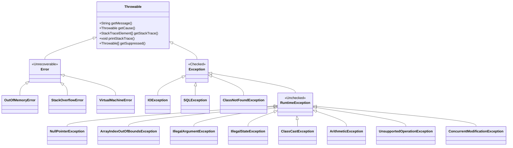

# Java Exception Handling — Complete Guide

> For senior engineers preparing for Google, Meta, Amazon, Apple, and other top-tier interviews.
> Covers exception hierarchy, mechanics, best practices, anti-patterns, and real-world strategies.

[← Previous: Generics & Type System](02-Java-Generics-and-Type-System.md) | [Home](README.md) | [Next: Collections Deep Dive →](04-Java-Collections-Deep-Dive.md)

---

## Table of Contents

1. [What Are Exceptions](#1-what-are-exceptions)
2. [Exception Hierarchy](#2-exception-hierarchy)
3. [Checked vs Unchecked Exceptions](#3-checked-vs-unchecked-exceptions)
4. [Exception Handling Mechanics](#4-exception-handling-mechanics)
5. [Throwing Exceptions](#5-throwing-exceptions)
6. [Custom Exceptions](#6-custom-exceptions)
7. [Best Practices (Google/FAANG Style)](#7-best-practices-googlefaang-style)
8. [Anti-Patterns](#8-anti-patterns)
9. [Google's Approach to Exceptions](#9-googles-approach-to-exceptions)
10. [Interview-Focused Summary](#10-interview-focused-summary)

---

## 1. What Are Exceptions

An **exception** is an event that disrupts the normal flow of a program's execution. Java's exception mechanism provides a structured, type-safe way to signal and handle errors — separating the error-detection site from the error-handling site.

### Why Exceptions Over Return Codes

| Aspect | Return Codes | Exceptions |
|---|---|---|
| **Ignorability** | Easily ignored by caller | Cannot be silently ignored (checked) |
| **Propagation** | Must be manually passed up the call stack | Automatically propagate until caught |
| **Separation** | Error handling mixed with business logic | Clean separation of concerns |
| **Type Safety** | Typically an int, no semantic meaning | Strongly typed, carry context |
| **Stack Trace** | None | Full diagnostic trace |

```java
// Return code approach — fragile and easy to ignore
int status = saveOrder(order);
if (status == -1) { /* disk full? network error? who knows */ }

// Exception approach — explicit, typed, impossible to ignore
try {
    orderRepository.save(order);
} catch (PersistenceException e) {
    logger.error("Failed to save order {}: {}", order.getId(), e.getMessage(), e);
    throw new OrderProcessingException("Order save failed", e);
}
```

> **FAANG Perspective:** Google's Java style guide strongly favors exceptions over error codes. Return codes lead to "error-code spaghetti" where every function call is wrapped in an `if` check.

---

## 2. Exception Hierarchy

### Class Diagram



### Key Branches

- **`Throwable`** — Root of the entire hierarchy. Both `Error` and `Exception` extend it.
- **`Error`** — Serious JVM-level problems. You should almost **never** catch these. Examples: `OutOfMemoryError` (heap exhaustion), `StackOverflowError` (infinite recursion), `VirtualMachineError` (JVM is broken).
- **`Exception`** — Recoverable conditions your application should anticipate and handle.
- **`RuntimeException`** — Subclass of `Exception` that is **unchecked**. Indicates programming errors (bugs), not external failures.

---

## 3. Checked vs Unchecked Exceptions

### Comparison Table

| Property | Checked Exception | Unchecked Exception | Error |
|---|---|---|---|
| **Superclass** | `Exception` (not `RuntimeException`) | `RuntimeException` | `Error` |
| **Compile-time check** | Yes — must catch or declare | No | No |
| **Typical cause** | External failures (I/O, network, DB) | Programming bugs | JVM/system failures |
| **Recovery** | Usually possible | Fix the code instead | Rarely possible |
| **Examples** | `IOException`, `SQLException` | `NullPointerException`, `IllegalArgumentException` | `OutOfMemoryError` |
| **`throws` clause** | Required | Optional (not recommended) | N/A |

### Compile-Time Enforcement

```java
// Checked — compiler forces you to handle it
public byte[] readConfig(String path) throws IOException {
    return Files.readAllBytes(Path.of(path));  // IOException is checked
}

// Unchecked — no compiler enforcement
public int divide(int a, int b) {
    return a / b;  // ArithmeticException if b == 0, but compiler won't complain
}
```

### The Philosophical Debate

**Checked exceptions** are unique to Java. Most modern languages (Kotlin, Scala, C#, Go) either omit them or treat all exceptions as unchecked.

**Arguments for checked exceptions:**
- Force the caller to think about failure modes
- Self-documenting API contracts
- Prevent silent error swallowing at compile time

**Arguments against:**
- Leak implementation details into interfaces
- Create verbose, boilerplate-heavy code
- Encourage `catch (Exception e) {}` anti-pattern just to silence the compiler
- Problematic with lambdas and streams (functional interfaces don't declare checked exceptions)

> **Google's stance:** Prefer unchecked exceptions for programming errors. Use checked exceptions sparingly — only when the caller can realistically recover.

---

## 4. Exception Handling Mechanics

### 4.1 `try-catch` Basics

```java
try {
    Connection conn = dataSource.getConnection();
    PreparedStatement ps = conn.prepareStatement("SELECT * FROM users WHERE id = ?");
    ps.setLong(1, userId);
    ResultSet rs = ps.executeQuery();
    // process results
} catch (SQLException e) {
    logger.error("Database query failed for user {}", userId, e);
    throw new DataAccessException("Failed to fetch user", e);
}
```

### 4.2 Multiple Catch Blocks — Order Matters

Catch blocks are evaluated **top-to-bottom**. More specific exceptions must come first; otherwise the code won't compile.

```java
try {
    Object obj = Class.forName(className).getDeclaredConstructor().newInstance();
} catch (ClassNotFoundException e) {
    logger.error("Class not found: {}", className);
} catch (ReflectiveOperationException e) {
    // Catches InstantiationException, IllegalAccessException, etc.
    logger.error("Reflection failed for: {}", className, e);
} catch (Exception e) {
    // Broadest catch — last resort
    logger.error("Unexpected error creating instance of {}", className, e);
}
```

```text
❌ COMPILE ERROR — broader type before narrower type:

catch (Exception e) { ... }
catch (IOException e) { ... }   // Unreachable — already caught above
```

### 4.3 `finally` Block

The `finally` block **always** executes — whether the try block completes normally, throws an exception, or even contains a `return` statement. The only exceptions: `System.exit()` or JVM crash.

```java
Connection conn = null;
try {
    conn = dataSource.getConnection();
    return executeQuery(conn);
} catch (SQLException e) {
    throw new DataAccessException("Query failed", e);
} finally {
    if (conn != null) {
        try {
            conn.close();
        } catch (SQLException e) {
            logger.warn("Failed to close connection", e);
        }
    }
}
```

#### The Return-Value Trap

```java
public static int trickyReturn() {
    try {
        return 1;
    } finally {
        return 2;  // ⚠ This OVERRIDES the return in try — method returns 2
    }
}
```

> **Interview Tip:** If both `try` and `finally` have `return` statements, the `finally` return wins. This is a classic trick question. **Never** put `return` in a `finally` block in real code.

### 4.4 Multi-Catch (Java 7+)

When multiple exception types require identical handling, use the pipe (`|`) operator. The caught variable is **implicitly final**.

```java
try {
    Object config = loadFromYaml(path);
    validateConfig(config);
} catch (IOException | YamlParseException e) {
    // Single handler for both — 'e' is effectively final
    throw new ConfigurationException("Failed to load config from " + path, e);
}
```

```text
Restrictions:
- Exception types in multi-catch cannot be related by inheritance
  ❌ catch (IOException | FileNotFoundException e)  // FileNotFoundException IS-A IOException
```

### 4.5 `try-with-resources` (Java 7+)

Resources implementing `AutoCloseable` are automatically closed in **reverse declaration order** (LIFO) when the try block exits — whether normally or via exception.

```java
try (Connection conn = dataSource.getConnection();
     PreparedStatement ps = conn.prepareStatement(SQL);
     ResultSet rs = ps.executeQuery()) {

    while (rs.next()) {
        results.add(mapRow(rs));
    }
    return results;
}
// Close order: rs → ps → conn (reverse of declaration)
// No explicit finally needed
```

#### Suppressed Exceptions

If the try block throws exception A, and `close()` throws exception B, then B is **suppressed** (attached to A via `addSuppressed()`). The primary exception A is still thrown.

```java
try (ProblematicResource res = new ProblematicResource()) {
    res.doWork();  // throws PrimaryException
}
// res.close() throws CloseException — suppressed, attached to PrimaryException

// Accessing suppressed exceptions:
catch (PrimaryException e) {
    Throwable[] suppressed = e.getSuppressed();
    for (Throwable t : suppressed) {
        logger.warn("Suppressed during close: {}", t.getMessage());
    }
}
```

#### Custom AutoCloseable Implementation

```java
public class ManagedConnection implements AutoCloseable {
    private final Connection connection;
    private final String poolId;

    public ManagedConnection(String url, String poolId) throws SQLException {
        this.poolId = poolId;
        this.connection = DriverManager.getConnection(url);
        logger.debug("Acquired connection from pool {}", poolId);
    }

    public PreparedStatement prepare(String sql) throws SQLException {
        return connection.prepareStatement(sql);
    }

    @Override
    public void close() throws SQLException {
        logger.debug("Releasing connection back to pool {}", poolId);
        if (!connection.isClosed()) {
            connection.close();
        }
    }
}

// Usage:
try (ManagedConnection conn = new ManagedConnection(DB_URL, "primary")) {
    PreparedStatement ps = conn.prepare("SELECT 1");
    ps.execute();
}
```

---

## 5. Throwing Exceptions

### `throw` vs `throws`

| Keyword | Purpose | Location | Example |
|---|---|---|---|
| `throw` | Actually throws an exception instance | Inside method body | `throw new IllegalArgumentException("bad");` |
| `throws` | Declares that a method may throw | Method signature | `void read() throws IOException` |

### Rethrowing Exceptions

```java
public void processPayment(PaymentRequest request) throws PaymentException {
    try {
        gateway.charge(request);
    } catch (GatewayTimeoutException e) {
        logger.warn("Gateway timeout for request {}", request.getId());
        throw e;  // Rethrow as-is — preserves original stack trace
    } catch (GatewayException e) {
        // Wrap in a domain exception — add context while preserving cause
        throw new PaymentException(
            "Payment failed for order " + request.getOrderId(), e);
    }
}
```

### Exception Chaining

Every exception can carry a **cause** — the lower-level exception that triggered it. This preserves the full diagnostic chain.

```java
// Via constructor (preferred)
throw new ServiceException("User lookup failed", originalSqlException);

// Via initCause (when constructor doesn't accept a cause)
ServiceException se = new ServiceException("User lookup failed");
se.initCause(originalSqlException);
throw se;
```

```text
Output when printed:
ServiceException: User lookup failed
    at com.app.UserService.findUser(UserService.java:45)
Caused by: java.sql.SQLException: Connection refused
    at com.mysql.jdbc.Driver.connect(Driver.java:320)
    ... 15 more
```

### Wrapping Lower-Level Exceptions

A well-designed service layer **never leaks** infrastructure exceptions to callers.

```java
public class UserRepository {

    public User findById(long id) {
        try {
            return jdbcTemplate.queryForObject(
                "SELECT * FROM users WHERE id = ?", rowMapper, id);
        } catch (EmptyResultDataAccessException e) {
            throw new UserNotFoundException("No user with id " + id, e);
        } catch (DataAccessException e) {
            throw new RepositoryException("Failed to query user " + id, e);
        }
    }
}
```

---

## 6. Custom Exceptions

### When to Create Custom Exceptions

- Your domain has **specific failure modes** callers need to distinguish
- Standard exceptions don't convey enough semantic meaning
- You need to carry **additional context** (error codes, request IDs, affected entities)

### Realistic Microservice Exception Hierarchy

```java
public abstract class DomainException extends RuntimeException {
    private final String errorCode;
    private final Instant timestamp;

    protected DomainException(String errorCode, String message, Throwable cause) {
        super(message, cause);
        this.errorCode = errorCode;
        this.timestamp = Instant.now();
    }

    protected DomainException(String errorCode, String message) {
        this(errorCode, message, null);
    }

    public String getErrorCode() { return errorCode; }
    public Instant getTimestamp() { return timestamp; }
}

public class OrderNotFoundException extends DomainException {
    private final String orderId;

    public OrderNotFoundException(String orderId) {
        super("ORDER_NOT_FOUND",
              String.format("Order '%s' does not exist", orderId));
        this.orderId = orderId;
    }

    public String getOrderId() { return orderId; }
}

public class InsufficientBalanceException extends DomainException {
    private final BigDecimal requested;
    private final BigDecimal available;

    public InsufficientBalanceException(BigDecimal requested, BigDecimal available) {
        super("INSUFFICIENT_BALANCE",
              String.format("Requested %s but only %s available", requested, available));
        this.requested = requested;
        this.available = available;
    }

    public BigDecimal getRequested() { return requested; }
    public BigDecimal getAvailable() { return available; }
}
```

### Using Custom Exceptions

```java
public class OrderService {

    public void cancelOrder(String orderId, String userId) {
        Order order = orderRepository.findById(orderId)
            .orElseThrow(() -> new OrderNotFoundException(orderId));

        if (!order.getOwnerId().equals(userId)) {
            throw new UnauthorizedAccessException(userId, "order", orderId);
        }

        if (order.getStatus() == OrderStatus.SHIPPED) {
            throw new IllegalStateException(
                "Cannot cancel order " + orderId + " — already shipped");
        }

        BigDecimal refund = order.getTotal();
        BigDecimal balance = walletService.getBalance(userId);
        walletService.credit(userId, refund);
        orderRepository.updateStatus(orderId, OrderStatus.CANCELLED);
    }
}
```

> **FAANG Perspective:** At scale, custom exception hierarchies map directly to HTTP status codes or gRPC error codes. `OrderNotFoundException` → 404/NOT_FOUND, `InsufficientBalanceException` → 400/FAILED_PRECONDITION, `UnauthorizedAccessException` → 403/PERMISSION_DENIED.

---

## 7. Best Practices (Google/FAANG Style)

### 7.1 Catch Specific Exceptions

```java
// ❌ BAD — catches everything including NullPointerException, OutOfMemoryError
try {
    processOrder(order);
} catch (Exception e) {
    logger.error("Something went wrong", e);
}

// ✅ GOOD — catch only what you expect and can handle
try {
    processOrder(order);
} catch (PaymentDeclinedException e) {
    notifyCustomer(order, e.getDeclineReason());
} catch (InventoryException e) {
    backorderItem(order, e.getItemId());
}
```

### 7.2 Never Swallow Exceptions

```java
// ❌ NEVER do this — the silent killer
try {
    riskyOperation();
} catch (IOException e) {
    // swallowed — no logging, no rethrowing, debugging nightmare
}

// ✅ At minimum, log it
try {
    riskyOperation();
} catch (IOException e) {
    logger.error("I/O failure during risky operation", e);
    throw new ProcessingException("Operation failed", e);
}
```

### 7.3 Don't Use Exceptions for Control Flow

```java
// ❌ BAD — using exception as a glorified goto
public boolean isInteger(String s) {
    try {
        Integer.parseInt(s);
        return true;
    } catch (NumberFormatException e) {
        return false;
    }
}

// ✅ BETTER — check before you leap, or use Optional
public boolean isInteger(String s) {
    return s != null && s.matches("-?\\d+");
}
```

### 7.4 Prefer Standard Exceptions

| Exception | When to Use |
|---|---|
| `IllegalArgumentException` | Caller passed an invalid parameter |
| `IllegalStateException` | Object is in wrong state for the requested operation |
| `NullPointerException` | Null was passed where non-null was required |
| `UnsupportedOperationException` | Requested operation is not supported |
| `IndexOutOfBoundsException` | Index parameter is out of range |
| `ConcurrentModificationException` | Concurrent modification detected where not allowed |

### 7.5 Include Context in Exception Messages

```java
// ❌ BAD — useless message
throw new IllegalArgumentException("Invalid value");

// ✅ GOOD — tells you exactly what went wrong
throw new IllegalArgumentException(
    String.format("Expected age between 0 and 150, but got %d for user %s", age, userId));
```

### 7.6 Fail Fast with Precondition Checks

```java
import com.google.common.base.Preconditions;

public class TransferService {

    public void transfer(Account from, Account to, BigDecimal amount) {
        Preconditions.checkNotNull(from, "Source account must not be null");
        Preconditions.checkNotNull(to, "Target account must not be null");
        Preconditions.checkArgument(
            amount.compareTo(BigDecimal.ZERO) > 0,
            "Transfer amount must be positive, got: %s", amount);
        Preconditions.checkState(
            from.isActive(),
            "Source account %s is not active", from.getId());

        // All preconditions satisfied — proceed with business logic
        from.debit(amount);
        to.credit(amount);
    }
}
```

### 7.7 Log at Catch, Throw at Detection

```java
// Detection site — throw, don't log
public User getUser(long id) {
    User user = cache.get(id);
    if (user == null) {
        throw new UserNotFoundException("User not found: " + id);
    }
    return user;
}

// Catch site — log with context, then handle or translate
public ResponseEntity<UserDto> getUserEndpoint(@PathVariable long id) {
    try {
        User user = userService.getUser(id);
        return ResponseEntity.ok(toDto(user));
    } catch (UserNotFoundException e) {
        logger.warn("User lookup miss: {}", e.getMessage());
        return ResponseEntity.notFound().build();
    }
}
```

### 7.8 Never Use `printStackTrace()` in Production

```java
// ❌ Writes to stderr, unstructured, no timestamp, no correlation
catch (Exception e) {
    e.printStackTrace();
}

// ✅ Use structured logging with SLF4J/Logback
catch (Exception e) {
    logger.error("Request processing failed for requestId={}", requestId, e);
}
```

### 7.9 Exception Handling in Streams and Lambdas

Checked exceptions and functional interfaces don't mix. The standard functional interfaces (`Function`, `Consumer`, `Supplier`) don't declare any checked exceptions.

```java
// ❌ Won't compile — map() expects Function<T,R>, which has no throws clause
List<byte[]> contents = paths.stream()
    .map(path -> Files.readAllBytes(path))  // IOException is checked
    .collect(Collectors.toList());

// ✅ Option A: Wrap in a utility method
List<byte[]> contents = paths.stream()
    .map(path -> readUnchecked(path))
    .collect(Collectors.toList());

private static byte[] readUnchecked(Path path) {
    try {
        return Files.readAllBytes(path);
    } catch (IOException e) {
        throw new UncheckedIOException("Failed to read: " + path, e);
    }
}

// ✅ Option B: Custom functional interface that allows checked exceptions
@FunctionalInterface
public interface ThrowingFunction<T, R> {
    R apply(T t) throws Exception;

    static <T, R> Function<T, R> unchecked(ThrowingFunction<T, R> f) {
        return t -> {
            try {
                return f.apply(t);
            } catch (Exception e) {
                throw new RuntimeException(e);
            }
        };
    }
}

// Usage:
List<byte[]> contents = paths.stream()
    .map(ThrowingFunction.unchecked(Files::readAllBytes))
    .collect(Collectors.toList());
```

---

## 8. Anti-Patterns

### Anti-Pattern 1: Swallowing Exceptions

```java
// ❌ BAD
try {
    updateInventory(item, quantity);
} catch (InventoryException e) {
    // 🦗 crickets — exception vanishes, inventory is now inconsistent
}

// ✅ FIX
try {
    updateInventory(item, quantity);
} catch (InventoryException e) {
    logger.error("Inventory update failed for item={}, qty={}", item.getId(), quantity, e);
    throw new OrderProcessingException("Cannot fulfill order — inventory error", e);
}
```

### Anti-Pattern 2: Catching `Exception` or `Throwable`

```java
// ❌ BAD — catches NullPointerException, OutOfMemoryError, everything
try {
    processData(input);
} catch (Throwable t) {
    return fallbackValue;
}

// ✅ FIX — catch only what you expect
try {
    processData(input);
} catch (DataFormatException e) {
    logger.warn("Malformed input: {}", e.getMessage());
    return fallbackValue;
}
```

### Anti-Pattern 3: Exceptions for Control Flow

```java
// ❌ BAD — exception-driven iteration
public static int countElements(Iterator<?> iterator) {
    int count = 0;
    try {
        while (true) {
            iterator.next();
            count++;
        }
    } catch (NoSuchElementException e) {
        return count;
    }
}

// ✅ FIX — use the API as designed
public static int countElements(Iterator<?> iterator) {
    int count = 0;
    while (iterator.hasNext()) {
        iterator.next();
        count++;
    }
    return count;
}
```

### Anti-Pattern 4: Throwing `Exception` Instead of Specific Types

```java
// ❌ BAD — forces every caller to catch the broadest type
public User findUser(long id) throws Exception {
    // ...
}

// ✅ FIX — declare specific exceptions
public User findUser(long id) throws UserNotFoundException, DataAccessException {
    // ...
}
```

### Anti-Pattern 5: `finally` Block Hiding the Original Exception

```java
// ❌ BAD — if cleanup() throws, the original exception from doWork() is lost
try {
    doWork();
} finally {
    cleanup();  // if this throws, original exception is masked
}

// ✅ FIX — guard the finally block
try {
    doWork();
} finally {
    try {
        cleanup();
    } catch (Exception e) {
        logger.warn("Cleanup failed (original exception preserved)", e);
    }
}

// ✅ BEST — use try-with-resources, which handles suppression automatically
try (Resource res = acquireResource()) {
    res.doWork();
}
```

### Anti-Pattern 6: Log-and-Rethrow (Double Logging)

```java
// ❌ BAD — same exception logged at every layer as it propagates
public void serviceMethod() throws ServiceException {
    try {
        repository.query();
    } catch (DataAccessException e) {
        logger.error("Query failed", e);        // logged here
        throw new ServiceException("Fail", e);  // AND logged by caller
    }
}

// ✅ FIX — either log OR rethrow, not both
// Option A: Translate and throw (let the final handler log)
public void serviceMethod() throws ServiceException {
    try {
        repository.query();
    } catch (DataAccessException e) {
        throw new ServiceException("Data query failed", e);
    }
}

// Option B: Log and handle (don't rethrow)
public void serviceMethod() {
    try {
        repository.query();
    } catch (DataAccessException e) {
        logger.error("Query failed, using cached result", e);
        return cachedResult;
    }
}
```

---

## 9. Google's Approach to Exceptions

### 9.1 Precondition Checking with Guava

Google's internal code and open-source libraries use `Preconditions` extensively to **fail fast** at the entry point of every public method.

```java
import static com.google.common.base.Preconditions.*;

public class ShardManager {

    public void assignShard(String shardId, String serverId, int replicaCount) {
        checkNotNull(shardId, "shardId must not be null");
        checkNotNull(serverId, "serverId must not be null");
        checkArgument(replicaCount > 0 && replicaCount <= 5,
            "replicaCount must be between 1 and 5, got: %s", replicaCount);
        checkState(isInitialized(),
            "ShardManager must be initialized before assigning shards");

        // Safe to proceed — all preconditions validated
        internalAssign(shardId, serverId, replicaCount);
    }
}
```

| Method | Throws | Use When |
|---|---|---|
| `checkNotNull(ref, msg)` | `NullPointerException` | Parameter must not be null |
| `checkArgument(expr, msg)` | `IllegalArgumentException` | Parameter violates a constraint |
| `checkState(expr, msg)` | `IllegalStateException` | Object is in an invalid state |
| `checkElementIndex(i, size)` | `IndexOutOfBoundsException` | Index is out of bounds |

### 9.2 Using `Optional` to Avoid Exceptions

Instead of throwing `NotFoundException` for expected "absence," return `Optional`.

```java
// ❌ Throws for a non-exceptional condition
public User getUser(long id) {
    User user = userMap.get(id);
    if (user == null) throw new UserNotFoundException(id);
    return user;
}

// ✅ Return Optional — caller decides how to handle absence
public Optional<User> findUser(long id) {
    return Optional.ofNullable(userMap.get(id));
}

// Caller usage:
User user = userService.findUser(id)
    .orElseThrow(() -> new UserNotFoundException(id));

String displayName = userService.findUser(id)
    .map(User::getDisplayName)
    .orElse("Anonymous");
```

> **Convention at Google:** Methods named `findXxx` return `Optional`. Methods named `getXxx` throw if absent.

### 9.3 Exception Handling at gRPC/API Boundaries

At service boundaries, exceptions must be **translated** into structured error responses — never leaked as raw stack traces.

```java
@GrpcService
public class OrderGrpcService extends OrderServiceGrpc.OrderServiceImplBase {

    @Override
    public void getOrder(GetOrderRequest request, StreamObserver<Order> observer) {
        try {
            Order order = orderService.findOrder(request.getOrderId());
            observer.onNext(order);
            observer.onCompleted();
        } catch (OrderNotFoundException e) {
            observer.onError(Status.NOT_FOUND
                .withDescription(e.getMessage())
                .asRuntimeException());
        } catch (UnauthorizedAccessException e) {
            observer.onError(Status.PERMISSION_DENIED
                .withDescription("Access denied")
                .asRuntimeException());
        } catch (Exception e) {
            logger.error("Unexpected error in getOrder", e);
            observer.onError(Status.INTERNAL
                .withDescription("Internal server error")
                .asRuntimeException());
        }
    }
}
```

### 9.4 REST API Global Exception Handler (Spring Boot)

```java
@RestControllerAdvice
public class GlobalExceptionHandler {

    @ExceptionHandler(OrderNotFoundException.class)
    public ResponseEntity<ErrorResponse> handleNotFound(OrderNotFoundException e) {
        ErrorResponse body = new ErrorResponse(
            e.getErrorCode(), e.getMessage(), e.getTimestamp());
        return ResponseEntity.status(HttpStatus.NOT_FOUND).body(body);
    }

    @ExceptionHandler(InsufficientBalanceException.class)
    public ResponseEntity<ErrorResponse> handleBadRequest(InsufficientBalanceException e) {
        ErrorResponse body = new ErrorResponse(
            e.getErrorCode(), e.getMessage(), e.getTimestamp());
        return ResponseEntity.status(HttpStatus.BAD_REQUEST).body(body);
    }

    @ExceptionHandler(Exception.class)
    public ResponseEntity<ErrorResponse> handleUnexpected(Exception e) {
        logger.error("Unhandled exception", e);
        ErrorResponse body = new ErrorResponse(
            "INTERNAL_ERROR", "An unexpected error occurred", Instant.now());
        return ResponseEntity.status(HttpStatus.INTERNAL_SERVER_ERROR).body(body);
    }
}

public record ErrorResponse(String errorCode, String message, Instant timestamp) {}
```

### 9.5 Resilience Patterns in Microservices

#### Circuit Breaker (Resilience4j)

```java
@Service
public class PaymentService {

    private final CircuitBreaker circuitBreaker = CircuitBreaker.ofDefaults("paymentGateway");

    public PaymentResult charge(PaymentRequest request) {
        return circuitBreaker.executeSupplier(() -> {
            try {
                return gateway.charge(request);
            } catch (GatewayTimeoutException e) {
                throw new PaymentTemporaryException("Gateway timeout", e);
            } catch (GatewayException e) {
                throw new PaymentPermanentException("Gateway rejected payment", e);
            }
        });
    }
}
```

#### Retry with Exponential Backoff

```java
public <T> T retryWithBackoff(Supplier<T> operation, int maxRetries) {
    int attempt = 0;
    while (true) {
        try {
            return operation.get();
        } catch (TransientException e) {
            attempt++;
            if (attempt >= maxRetries) {
                throw new ServiceUnavailableException(
                    "Operation failed after " + maxRetries + " attempts", e);
            }
            long backoffMs = (long) Math.pow(2, attempt) * 100 + ThreadLocalRandom.current().nextLong(50);
            logger.warn("Attempt {}/{} failed, retrying in {}ms", attempt, maxRetries, backoffMs);
            try {
                Thread.sleep(backoffMs);
            } catch (InterruptedException ie) {
                Thread.currentThread().interrupt();
                throw new ServiceUnavailableException("Retry interrupted", ie);
            }
        }
    }
}
```

---

## 10. Interview-Focused Summary

### Rapid-Fire Q&A

| # | Question | Key Answer |
|---|---|---|
| 1 | What is the root class of all exceptions? | `Throwable`. Both `Error` and `Exception` extend it. |
| 2 | Difference between `Error` and `Exception`? | `Error` = unrecoverable JVM/system issues. `Exception` = recoverable application issues. |
| 3 | Checked vs unchecked exceptions? | Checked extend `Exception` (not `RuntimeException`), enforced at compile time. Unchecked extend `RuntimeException`, no compile-time enforcement. |
| 4 | Difference between `throw` and `throws`? | `throw` creates and throws an exception instance in method body. `throws` declares exceptions a method may throw in its signature. |
| 5 | Can `finally` block prevent a return? | Yes — if `finally` has its own `return`, it overrides the `try` block's return value. |
| 6 | When does `finally` NOT execute? | `System.exit()`, JVM crash, infinite loop/deadlock in `try`, or daemon thread killed. |
| 7 | What if both `catch` and `finally` throw? | The exception from `finally` propagates; the `catch` exception is **lost** (not suppressed). This is why try-with-resources is preferred. |
| 8 | What are suppressed exceptions? | When using try-with-resources, if the try body throws and `close()` also throws, the close exception is added as a suppressed exception on the primary one. Retrieved via `getSuppressed()`. |
| 9 | Can you catch `OutOfMemoryError`? | Technically yes (it's a `Throwable`), but recovery is unreliable since the JVM is in a degraded state. Only do it for graceful logging/shutdown. |
| 10 | What is exception chaining? | Wrapping a lower-level exception as the `cause` of a higher-level one. Preserves the full diagnostic trace across abstraction layers. |
| 11 | What is `try-with-resources`? | Java 7+ syntax that auto-closes `AutoCloseable` resources, handling suppressed exceptions properly. |
| 12 | Resource closing order in try-with-resources? | **Reverse** declaration order (LIFO). Last declared, first closed. |
| 13 | Why not use `printStackTrace()`? | Writes to `stderr`, unstructured, no timestamps, no log levels, no correlation IDs. Use SLF4J/Logback instead. |
| 14 | Can a `finally` block throw an exception? | Yes, and it will mask the original exception from `try`/`catch`. Guard it with a nested try-catch. |
| 15 | Why are checked exceptions problematic with lambdas? | Standard functional interfaces (`Function`, `Consumer`) don't declare checked exceptions. You must wrap them in unchecked exceptions or use custom functional interfaces. |
| 16 | `final` vs `finally` vs `finalize`? | `final` = modifier (constant, non-overridable). `finally` = block that always executes after try. `finalize()` = deprecated GC hook on `Object` — never use. |
| 17 | How to create a custom exception? | Extend `RuntimeException` (unchecked) or `Exception` (checked). Provide constructors accepting message and cause. Add domain-specific fields. |
| 18 | What does `Preconditions.checkNotNull()` throw? | `NullPointerException` — validates method parameters at entry. |
| 19 | Can you rethrow a caught exception? | Yes, using `throw e;`. The original stack trace is preserved. You can also wrap it: `throw new HigherException("msg", e);`. |
| 20 | How does multi-catch differ from multiple catch blocks? | Multi-catch (`catch (A \| B e)`) handles multiple unrelated types in one block. The variable `e` is implicitly final. Types cannot be related by inheritance. |

### Key Principles Cheat Sheet

```text
1. Catch specific, throw specific
2. Never swallow — log or propagate
3. Fail fast — validate preconditions early
4. Include context in messages (who, what, why)
5. Translate exceptions at layer boundaries
6. Use try-with-resources for all closeable resources
7. Prefer unchecked for programming errors
8. Use Optional for expected absence, exceptions for true failures
9. Log at catch site, throw at detection site
10. Guard finally blocks — they can mask exceptions
```

---

*End of guide. Master these patterns and you'll handle any exception-related question thrown at you — pun intended.*

---

[← Previous: Generics & Type System](02-Java-Generics-and-Type-System.md) | [Home](README.md) | [Next: Collections Deep Dive →](04-Java-Collections-Deep-Dive.md)
