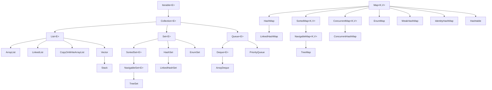
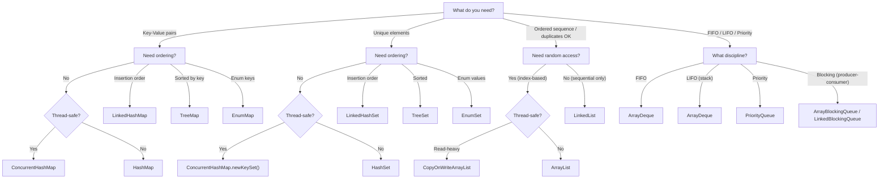

# Java Collections Framework — Deep Dive

> A comprehensive, FAANG-interview-ready guide to the Java Collections Framework as an **API and engineering tool**. Aimed at senior engineers who need to know *which* collection to pick, *why* it behaves the way it does internally, and *how* to use it in production-grade code.

[← Previous: Exception Handling](03-Java-Exception-Handling-Guide.md) | [Home](README.md) | [Next: Streams & Functional Programming →](05-Java-Streams-and-Functional-Programming.md)

---

## Table of Contents

1. [Collections Framework Overview](#1-collections-framework-overview)
2. [List Implementations](#2-list-implementations)
3. [Set Implementations](#3-set-implementations)
4. [Map Implementations](#4-map-implementations)
5. [Queue and Deque](#5-queue-and-deque)
6. [Comparable vs Comparator](#6-comparable-vs-comparator)
7. [Utility Classes](#7-utility-classes)
8. [Unmodifiable vs Immutable Collections](#8-unmodifiable-vs-immutable-collections)
9. [Fail-Fast vs Fail-Safe Iterators](#9-fail-fast-vs-fail-safe-iterators)
10. [Choosing the Right Collection](#10-choosing-the-right-collection)
11. [Performance Characteristics](#11-performance-characteristics)
12. [Interview-Focused Summary](#12-interview-focused-summary)

---

## 1. Collections Framework Overview

### Why It Exists

Before Java 1.2 (1998), developers used `Vector`, `Hashtable`, and raw arrays — each with incompatible APIs. The Collections Framework introduced a **unified architecture** for representing and manipulating groups of objects.

### Core Benefits

| Benefit | Description |
|---|---|
| **Interoperability** | Any `List` works wherever a `List` is expected — swap implementations without changing client code |
| **Polymorphism** | Program to the `Map` interface; the runtime decides if it's a `HashMap` or `TreeMap` |
| **Reduced effort** | No more writing custom linked lists — battle-tested, optimized implementations ship with the JDK |
| **Algorithm reuse** | `Collections.sort()` works on any `List`; `Collections.binarySearch()` on any sorted `List` |
| **Thread-safe wrappers** | `Collections.synchronizedMap()`, `ConcurrentHashMap` — concurrency without reinventing the wheel |

### Complete Hierarchy



> **Key insight:** `Map` does **not** extend `Collection`. They are parallel hierarchies. A `Map` is not a group of elements — it's a group of key-value *mappings*.

---

## 2. List Implementations

A `List` is an **ordered** collection (sequence) that allows **duplicates** and provides **positional access**.

### 2.1 ArrayList

The workhorse of Java collections. Internally backed by a **resizable `Object[]` array**.

#### Internal Mechanics

- **Default initial capacity:** 10 (only allocated on first `add`, not at construction)
- **Growth formula:** `newCapacity = oldCapacity + (oldCapacity >> 1)` — roughly 1.5x
- **Growth sequence:** 10 → 15 → 22 → 33 → 49 → ...
- Random access via `elementData[index]` — **O(1)**
- Add at end (amortized) — **O(1)** (occasional O(n) for array copy during resize)
- Add/remove at arbitrary index — **O(n)** due to `System.arraycopy`

```java
// Pre-sizing when you know the count avoids repeated resizing
List<String> usernames = new ArrayList<>(10_000);

// trimToSize() releases unused capacity after bulk loading
usernames.addAll(fetchUsernamesFromDB());
((ArrayList<String>) usernames).trimToSize();

// subList returns a VIEW, not a copy — mutations reflect back
List<String> firstTen = usernames.subList(0, 10);
firstTen.clear(); // removes first 10 from 'usernames' too!
```

> **Interview tip:** If you know you'll add exactly N elements, pass N to the constructor. The default capacity of 10 forces multiple resizes for large datasets.

### 2.2 LinkedList

A **doubly-linked list** that implements both `List<E>` and `Deque<E>`.

```text
 null ← [prev|"A"|next] ⇄ [prev|"B"|next] ⇄ [prev|"C"|next] → null
          ↑ head (first)                          ↑ tail (last)
```

#### Characteristics

- **O(1)** add/remove at head or tail (`addFirst`, `addLast`, `removeFirst`, `removeLast`)
- **O(n)** random access — must traverse from head or tail (JDK optimizes: traverses from whichever end is closer)
- Each node carries ~40 bytes overhead (prev pointer + next pointer + object header)
- Implements `Deque` — usable as a stack or queue

```java
LinkedList<Task> taskQueue = new LinkedList<>();
taskQueue.addLast(new Task("process-payment"));
taskQueue.addLast(new Task("send-email"));

Task next = taskQueue.pollFirst(); // dequeue from front
```

> **When to prefer LinkedList:** Almost never. `ArrayDeque` beats it for stack/queue use. The only edge case is when you hold an iterator to the middle and insert/remove around it frequently.

### 2.3 CopyOnWriteArrayList

A **thread-safe** variant where every mutative operation (`add`, `set`, `remove`) creates a **fresh copy** of the underlying array.

```java
// Perfect for listener/observer lists — many reads, rare writes
CopyOnWriteArrayList<EventListener> listeners = new CopyOnWriteArrayList<>();

// Registration (rare) — copies the entire array
listeners.add(new ClickListener());

// Notification (frequent) — iterates over a snapshot, no locking needed
for (EventListener listener : listeners) {
    listener.onEvent(event); // safe even if another thread adds/removes
}
```

#### Key Properties

- **Iterators are snapshot-based** — reflect the state at the time of creation; never throw `ConcurrentModificationException`
- **Write cost:** O(n) per mutation (full array copy)
- **Read cost:** O(1) for `get(index)`, no synchronization
- **Ideal for:** event listener lists, configuration lists, publish-subscribe registries

### 2.4 Vector and Stack (Legacy)

`Vector` is essentially a **synchronized `ArrayList`** — every method is `synchronized`, creating unnecessary contention.

`Stack` extends `Vector` (a design mistake — composition would have been correct) and exposes `push`, `pop`, `peek`.

```java
// DON'T
Vector<String> v = new Vector<>();
Stack<String> s = new Stack<>();

// DO
List<String> list = Collections.synchronizedList(new ArrayList<>());
Deque<String> stack = new ArrayDeque<>(); // single-threaded stack
Deque<String> concurrentStack = new ConcurrentLinkedDeque<>(); // concurrent
```

### 2.5 List Implementations — Comparison

| Feature | ArrayList | LinkedList | CopyOnWriteArrayList | Vector |
|---|---|---|---|---|
| Internal structure | Resizable array | Doubly-linked list | Copy-on-write array | Resizable array |
| `get(index)` | **O(1)** | O(n) | **O(1)** | **O(1)** |
| `add(E)` (end) | **Amortized O(1)** | **O(1)** | O(n) | Amortized O(1) |
| `add(index, E)` | O(n) | O(n)* | O(n) | O(n) |
| `remove(index)` | O(n) | O(n)* | O(n) | O(n) |
| Thread-safe | No | No | **Yes** | Yes (synchronized) |
| Iterator type | Fail-fast | Fail-fast | **Snapshot** | Fail-fast |
| Null elements | Yes | Yes | Yes | Yes |
| Use when | Default choice | Deque operations (prefer ArrayDeque) | Read-heavy concurrent | Never (legacy) |

*LinkedList `add`/`remove` is O(1) if you already have an iterator at position; O(n) by index.

---

## 3. Set Implementations

A `Set` is a collection that contains **no duplicate elements**. Formally: no two elements `e1` and `e2` such that `e1.equals(e2)`.

### 3.1 HashSet

Backed internally by a **`HashMap`** — elements are stored as keys with a dummy `PRESENT` value.

```java
// From OpenJDK source:
private transient HashMap<E, Object> map;
private static final Object PRESENT = new Object();

public boolean add(E e) {
    return map.put(e, PRESENT) == null;
}
```

#### Characteristics

- **O(1)** average for `add`, `remove`, `contains` (degrades to O(log n) with collisions in Java 8+)
- **No order guarantee** — iteration order is unpredictable and may change after rehashing
- Allows **one null** element
- Initial capacity 16, load factor 0.75 (inherited from HashMap defaults)

```java
Set<String> uniqueEmails = new HashSet<>();
uniqueEmails.add("alice@corp.com");
uniqueEmails.add("bob@corp.com");
uniqueEmails.add("alice@corp.com"); // ignored — already present

System.out.println(uniqueEmails.size()); // 2
```

### 3.2 LinkedHashSet

A `HashSet` that maintains **insertion order** via a doubly-linked list running through all entries.

```java
Set<String> insertionOrdered = new LinkedHashSet<>();
insertionOrdered.add("banana");
insertionOrdered.add("apple");
insertionOrdered.add("cherry");

System.out.println(insertionOrdered); // [banana, apple, cherry] — always
```

- Same O(1) performance as `HashSet`
- Slightly higher memory (linked list pointers per entry)
- Useful when you need deduplication but also predictable iteration order

### 3.3 TreeSet

A `NavigableSet` backed by a **Red-Black Tree** (`TreeMap` internally).

```java
TreeSet<Integer> scores = new TreeSet<>();
scores.addAll(List.of(85, 92, 78, 95, 88));

scores.first();        // 78
scores.last();         // 95
scores.headSet(90);    // [78, 85, 88] — elements strictly less than 90
scores.tailSet(90);    // [92, 95]     — elements >= 90
scores.ceiling(80);    // 85           — smallest element >= 80
scores.floor(80);      // 78           — largest element <= 80
scores.subSet(80, 93); // [85, 88, 92] — [80, 93)
```

#### Characteristics

- **O(log n)** for `add`, `remove`, `contains`
- Elements must be `Comparable` or a `Comparator` must be provided at construction
- **Null not allowed** (throws `NullPointerException` — can't compare null)
- Guaranteed sorted iteration order

### 3.4 EnumSet

A specialized `Set` for enum types, implemented as a **bit vector** internally.

```java
public enum Permission { READ, WRITE, EXECUTE, DELETE, ADMIN }

// Internally a single long (RegularEnumSet for ≤64 constants)
EnumSet<Permission> userPerms = EnumSet.of(Permission.READ, Permission.WRITE);
EnumSet<Permission> adminPerms = EnumSet.allOf(Permission.class);
EnumSet<Permission> noPerms = EnumSet.noneOf(Permission.class);

// Complement
EnumSet<Permission> denied = EnumSet.complementOf(userPerms);
// [EXECUTE, DELETE, ADMIN]
```

#### Internal Implementation

- **`RegularEnumSet`**: Used when the enum has ≤ 64 constants. Stores everything in a single `long` — bitwise operations for add/remove/contains.
- **`JumboEnumSet`**: Used when the enum has > 64 constants. Uses a `long[]` array.
- **Extremely fast** — all operations are O(1) bitwise operations
- **Compact** — no boxing, no hashing

### 3.5 Set Implementations — Comparison

| Feature | HashSet | LinkedHashSet | TreeSet | EnumSet |
|---|---|---|---|---|
| Internal structure | HashMap | LinkedHashMap | Red-Black Tree | Bit vector |
| `add` / `contains` | **O(1)** | **O(1)** | O(log n) | **O(1)** |
| Ordering | None | **Insertion order** | **Sorted** | **Enum declaration order** |
| Null allowed | One null | One null | **No** | **No** |
| Thread-safe | No | No | No | No |
| Memory overhead | Moderate | Moderate+ | Higher | **Minimal** |
| Use when | Default, unordered unique elements | Need insertion order | Need sorted iteration | Enum constants |

---

## 4. Map Implementations

A `Map<K,V>` maps **keys** to **values**. No duplicate keys; each key maps to at most one value.

### 4.1 HashMap — Deep Dive

The most commonly used `Map` implementation. Understanding its internals is essential for interviews.

#### Structure

```text
HashMap (capacity=16, loadFactor=0.75, threshold=12)
┌───────────────────────────────────────────────────────┐
│ table[] (Node<K,V>[])                                  │
├────┬────┬────┬────┬────┬────┬────┬────┬───────────────┤
│ [0]│ [1]│ [2]│ [3]│ [4]│ [5]│ [6]│ [7]│  ... [15]     │
│null│  ● │null│null│  ● │null│null│null│  ...  null     │
└────┴──┼─┴────┴────┴──┼─┴────┴────┴────┴───────────────┘
        │               │
        ▼               ▼
     [K1,V1]         [K4,V4]
        │               │
        ▼               ▼
     [K2,V2]         [K5,V5]  ← linked list (≤7 nodes)
        │               │
        ▼               ▼
      null           [K6,V6]
                        │
                        ...  → if ≥8 nodes: TREEIFY → Red-Black Tree
```

#### Key Parameters

| Parameter | Default | Description |
|---|---|---|
| **Initial capacity** | 16 | Must be a power of 2 |
| **Load factor** | 0.75 | Threshold ratio for rehashing |
| **Treeify threshold** | 8 | Bucket converts from linked list to red-black tree |
| **Untreeify threshold** | 6 | Tree converts back to linked list on resize |
| **Min treeify capacity** | 64 | Table must be ≥64 before treeification (otherwise resizes first) |

#### Hash Computation

```java
// HashMap.hash() — spreads higher bits into lower bits
static final int hash(Object key) {
    int h;
    return (key == null) ? 0 : (h = key.hashCode()) ^ (h >>> 16);
}

// Bucket index = hash & (capacity - 1)
// Because capacity is always a power of 2, this is equivalent to hash % capacity
// but much faster (bitwise AND vs modulo)
```

The XOR with the upper 16 bits (`h >>> 16`) compensates for hash functions that differ only in higher bits — ensures both halves of the hash contribute to the bucket index.

#### Java 8 Treeification

When a single bucket exceeds **8** nodes and the table capacity is ≥ 64, the linked list is converted to a **red-black tree**. This bounds worst-case lookup from O(n) to **O(log n)**.

When the tree shrinks to ≤ **6** nodes (during resize), it converts back to a linked list.

#### Null Key Handling

HashMap explicitly handles `null` keys: `hash(null)` returns `0`, so the null key always goes into bucket 0.

```java
Map<String, Integer> map = new HashMap<>();
map.put(null, 42);          // allowed — stored in bucket 0
map.get(null);              // returns 42
map.put(null, 99);          // replaces value — still one null key
```

#### Rehashing

When `size > capacity * loadFactor` (e.g., 12 for default), the table **doubles** in size and all entries are rehashed. This is O(n) but amortized across all insertions.

```java
// Sizing hint: if you expect 100 entries, avoid rehashing
Map<String, User> users = new HashMap<>(134);
// 134 because: 100 / 0.75 = 133.3, next power of 2 = 256
// Or simply: new HashMap<>(100 * 4 / 3 + 1)
```

> **Interview tip:** "What happens when two keys have the same hashCode?" — They go into the same bucket. `equals()` distinguishes them within the bucket. If `equals()` is inconsistent with `hashCode()`, the map breaks silently.

### 4.2 LinkedHashMap

A `HashMap` that maintains a **doubly-linked list** running through all entries, providing predictable iteration order.

#### Two Ordering Modes

1. **Insertion order** (default) — entries iterate in the order they were first inserted
2. **Access order** — entries iterate from least-recently-accessed to most-recently-accessed

```java
// Access-order mode: third constructor parameter = true
Map<String, String> accessOrdered = new LinkedHashMap<>(16, 0.75f, true);
```

#### LRU Cache Implementation

```java
public class LRUCache<K, V> extends LinkedHashMap<K, V> {
    private final int maxSize;

    public LRUCache(int maxSize) {
        super(maxSize * 4 / 3 + 1, 0.75f, true); // access-order
        this.maxSize = maxSize;
    }

    @Override
    protected boolean removeEldestEntry(Map.Entry<K, V> eldest) {
        return size() > maxSize;
    }

    public static void main(String[] args) {
        LRUCache<String, byte[]> imageCache = new LRUCache<>(100);
        imageCache.put("avatar_1.png", loadImage("avatar_1.png"));
        imageCache.put("avatar_2.png", loadImage("avatar_2.png"));
        // When size exceeds 100, the least-recently-accessed entry is evicted
    }
}
```

> **Interview classic:** "Implement an LRU cache." This is the JDK-native answer — far simpler than building a doubly-linked list + HashMap from scratch, though interviewers may want you to do both.

### 4.3 TreeMap

A `NavigableMap` backed by a **Red-Black Tree**. Keys are sorted either by their natural ordering or by a provided `Comparator`.

```java
TreeMap<LocalDate, BigDecimal> dailyRevenue = new TreeMap<>();
dailyRevenue.put(LocalDate.of(2025, 1, 1), new BigDecimal("15230.50"));
dailyRevenue.put(LocalDate.of(2025, 1, 5), new BigDecimal("18440.00"));
dailyRevenue.put(LocalDate.of(2025, 1, 10), new BigDecimal("22100.75"));
dailyRevenue.put(LocalDate.of(2025, 1, 15), new BigDecimal("19800.25"));

// Range query: revenue from Jan 5 to Jan 12
SortedMap<LocalDate, BigDecimal> weekTwo = dailyRevenue.subMap(
    LocalDate.of(2025, 1, 5),  // inclusive
    LocalDate.of(2025, 1, 12)  // exclusive
);

// Navigation methods
dailyRevenue.ceilingKey(LocalDate.of(2025, 1, 3));  // 2025-01-05 (>=)
dailyRevenue.floorKey(LocalDate.of(2025, 1, 3));    // 2025-01-01 (<=)
dailyRevenue.higherKey(LocalDate.of(2025, 1, 5));   // 2025-01-10 (strictly >)
dailyRevenue.lowerKey(LocalDate.of(2025, 1, 5));    // 2025-01-01 (strictly <)

// Descending view
NavigableMap<LocalDate, BigDecimal> descending = dailyRevenue.descendingMap();
```

- **O(log n)** for `put`, `get`, `remove`, `containsKey`
- **Null keys not allowed** (throws `NullPointerException`)
- Null values are allowed

### 4.4 EnumMap

A specialized `Map` for **enum keys**, backed by an internal array indexed by the enum's `ordinal()`.

```java
public enum HttpMethod { GET, POST, PUT, DELETE, PATCH }

EnumMap<HttpMethod, RequestHandler> router = new EnumMap<>(HttpMethod.class);
router.put(HttpMethod.GET, new GetHandler());
router.put(HttpMethod.POST, new PostHandler());
router.put(HttpMethod.DELETE, new DeleteHandler());

RequestHandler handler = router.get(HttpMethod.GET); // array lookup — O(1)
```

- **Extremely fast** — direct array index, no hashing
- **Compact** — no Entry objects, no hash table overhead
- Maintains **enum declaration order** during iteration
- Null keys not allowed, null values allowed

### 4.5 ConcurrentHashMap — Deep Dive

The go-to concurrent map. Its implementation evolved significantly between Java 7 and Java 8+.

#### Java 7: Segment-Based Locking

```text
ConcurrentHashMap (16 Segments)
┌──────────┬──────────┬──────────┬─────────────┐
│ Segment0 │ Segment1 │ Segment2 │ ... Seg15   │
│ (lock)   │ (lock)   │ (lock)   │   (lock)    │
│ ┌──────┐ │ ┌──────┐ │ ┌──────┐ │             │
│ │bucket│ │ │bucket│ │ │bucket│ │             │
│ │array │ │ │array │ │ │array │ │             │
│ └──────┘ │ └──────┘ │ └──────┘ │             │
└──────────┴──────────┴──────────┴─────────────┘
```

Each `Segment` was essentially a mini `HashMap` with its own lock. Default 16 segments allowed up to 16 concurrent writers.

#### Java 8+: CAS + Synchronized on Bucket Head

- Eliminated the `Segment` class entirely
- Uses a single `Node<K,V>[]` table (like `HashMap`)
- **Empty bucket:** CAS (compare-and-swap) to insert the first node — lock-free
- **Non-empty bucket:** `synchronized` on the head node of that bucket only
- Treeifies long buckets (same threshold 8 as `HashMap`)
- **Read operations are lock-free** — volatile reads of node values

#### Why No Null Keys or Values?

```java
ConcurrentHashMap<String, String> map = new ConcurrentHashMap<>();
map.put(null, "value");   // NullPointerException!
map.put("key", null);     // NullPointerException!
```

In a concurrent map, `get(key)` returning `null` is **ambiguous**: does the key not exist, or is the value literally `null`? There's no way to distinguish atomically. `HashMap` can use `containsKey()` + `get()` safely because it's single-threaded, but this two-step check isn't atomic in a concurrent map.

#### Atomic Compute Operations

```java
ConcurrentHashMap<String, LongAdder> hitCounters = new ConcurrentHashMap<>();

// computeIfAbsent: atomically check-and-create
hitCounters.computeIfAbsent("api/users", k -> new LongAdder()).increment();

// merge: atomically combine old and new values
ConcurrentHashMap<String, Integer> wordCount = new ConcurrentHashMap<>();
for (String word : words) {
    wordCount.merge(word, 1, Integer::sum);
}

// compute: atomically transform existing value
map.compute("session-count", (key, oldVal) -> oldVal == null ? 1 : oldVal + 1);
```

#### Parallel Bulk Operations (Java 8+)

```java
ConcurrentHashMap<String, Long> metrics = new ConcurrentHashMap<>();

// Parallel forEach — threshold controls parallelism granularity
metrics.forEach(1000, (key, value) -> {
    if (value > 10_000) log.warn("High metric: {} = {}", key, value);
});

// Parallel reduce
long totalRequests = metrics.reduceValues(1000, Long::sum);

// Parallel search — returns first non-null result
String hotKey = metrics.search(1000, (key, value) ->
    value > 1_000_000 ? key : null
);
```

The `parallelismThreshold` (first argument) specifies the element count below which operations run sequentially. Use `1` for maximum parallelism, `Long.MAX_VALUE` to force sequential.

### 4.6 WeakHashMap

Entries become eligible for garbage collection when their **keys are no longer strongly referenced** elsewhere.

```java
WeakHashMap<Image, String> imageLabels = new WeakHashMap<>();
Image img = loadImage("logo.png");
imageLabels.put(img, "Company Logo");

System.out.println(imageLabels.size()); // 1

img = null;     // remove the strong reference
System.gc();    // hint to collect (not guaranteed)

// Eventually:
System.out.println(imageLabels.size()); // 0 — entry was auto-removed
```

#### Use Cases

- **Caching metadata** about objects without preventing their GC
- **Canonicalization maps** — associating supplementary data with objects whose lifecycle you don't control
- **ClassLoader-aware caches** — entries evict when the classloader is collected

> **Caution:** String literals are interned and never garbage collected. Using `"literal"` as a `WeakHashMap` key means the entry will *never* be removed.

### 4.7 IdentityHashMap

Uses **reference equality (`==`)** instead of `equals()` for key comparison, and `System.identityHashCode()` instead of `hashCode()`.

```java
IdentityHashMap<String, Integer> map = new IdentityHashMap<>();

String a = new String("hello");
String b = new String("hello");

map.put(a, 1);
map.put(b, 2);

System.out.println(map.size());    // 2!  (a != b even though a.equals(b))
System.out.println(map.get(a));    // 1
System.out.println(map.get(b));    // 2
```

#### Use Cases

- **Serialization frameworks** — tracking which object references have already been serialized
- **Graph traversal** — tracking visited nodes by identity (even if two nodes are `equals`)
- **Deep-copy utilities** — maintaining a mapping from original to cloned objects

### 4.8 Map Implementations — Comparison

| Feature | HashMap | LinkedHashMap | TreeMap | ConcurrentHashMap | EnumMap | WeakHashMap | IdentityHashMap |
|---|---|---|---|---|---|---|---|
| Internal structure | Hash table | Hash table + linked list | Red-Black Tree | Hash table (CAS + sync) | Array | Hash table (weak refs) | Hash table (==) |
| `get` / `put` | **O(1)** | **O(1)** | O(log n) | **O(1)** | **O(1)** | O(1) | O(1) |
| Ordering | None | Insertion/Access | Sorted | None | Enum order | None | None |
| Null keys | **1 allowed** | 1 allowed | **No** | **No** | **No** | Yes | Yes |
| Null values | Yes | Yes | Yes | **No** | Yes | Yes | Yes |
| Thread-safe | No | No | No | **Yes** | No | No | No |
| Primary use case | Default map | LRU cache, ordered map | Range queries, sorted keys | Concurrent access | Enum-keyed config | Auto-evicting cache | Serialization, identity tracking |

---

## 5. Queue and Deque

### 5.1 ArrayDeque

A **resizable circular array** implementation of the `Deque` interface. The **recommended replacement** for both `Stack` and `LinkedList`-as-queue.

```text
Circular array (capacity 16):
          head                    tail
           ↓                       ↓
┌────┬────┬────┬────┬────┬────┬────┬────┬────┬────┐
│    │    │ A  │ B  │ C  │ D  │ E  │    │    │    │
└────┴────┴────┴────┴────┴────┴────┴────┴────┴────┘
index: 0    1    2    3    4    5    6    7    8    9

addFirst → head moves left (wraps around)
addLast  → tail moves right (wraps around)
```

#### Key Characteristics

- **No capacity limit** (resizes by doubling — always power of 2)
- **Null elements not allowed** (null is used as a sentinel for empty slots)
- **Faster than LinkedList** for both stack and queue operations (cache-friendly, no node allocation)
- **Not thread-safe**

```java
// Use as a stack
Deque<String> undoStack = new ArrayDeque<>();
undoStack.push("action1");   // addFirst
undoStack.push("action2");
String last = undoStack.pop(); // removeFirst — "action2"

// Use as a queue (FIFO)
Deque<Task> taskQueue = new ArrayDeque<>();
taskQueue.offer(new Task("A")); // addLast
taskQueue.offer(new Task("B"));
Task next = taskQueue.poll();   // removeFirst — Task("A")

// Use as a sliding window
Deque<Integer> window = new ArrayDeque<>();
for (int val : stream) {
    window.addLast(val);
    if (window.size() > windowSize) {
        window.removeFirst();
    }
}
```

### 5.2 PriorityQueue

A **binary min-heap** that provides O(log n) insertion and O(log n) removal of the *minimum* element.

```java
// Min-heap (default): smallest element at head
PriorityQueue<Integer> minHeap = new PriorityQueue<>();
minHeap.addAll(List.of(5, 1, 3, 7, 2));
minHeap.poll(); // 1
minHeap.poll(); // 2
minHeap.poll(); // 3

// Max-heap: largest element at head
PriorityQueue<Integer> maxHeap = new PriorityQueue<>(Comparator.reverseOrder());
maxHeap.addAll(List.of(5, 1, 3, 7, 2));
maxHeap.poll(); // 7

// Custom objects
record Task(String name, int priority) {}

PriorityQueue<Task> taskQueue = new PriorityQueue<>(
    Comparator.comparingInt(Task::priority)
);
taskQueue.add(new Task("low-priority", 10));
taskQueue.add(new Task("urgent", 1));
taskQueue.add(new Task("normal", 5));

taskQueue.poll(); // Task("urgent", 1) — lowest priority number first
```

#### Characteristics

| Operation | Time Complexity |
|---|---|
| `offer(E)` / `add(E)` | O(log n) |
| `poll()` / `remove()` | O(log n) |
| `peek()` | **O(1)** |
| `remove(Object)` | O(n) |
| `contains(Object)` | O(n) |

- **Not thread-safe** — use `PriorityBlockingQueue` for concurrent scenarios
- **No null elements** allowed
- **Iterator does NOT guarantee sorted order** — only `poll()` returns elements in order

> **Interview tip:** "How do you find the top-K elements from a stream?" Use a min-heap of size K. For each element, if it's larger than the heap's minimum, remove the minimum and insert the new element. O(n log K) total.

### 5.3 BlockingQueue Family

`BlockingQueue` extends `Queue` with operations that **wait** for the queue to become non-empty (on take) or have available capacity (on put). The cornerstone of the **producer-consumer pattern**.

```java
BlockingQueue<Event> eventQueue = new LinkedBlockingQueue<>(1000);

// Producer thread
executorService.submit(() -> {
    while (running) {
        Event event = generateEvent();
        eventQueue.put(event); // blocks if queue is full
    }
});

// Consumer thread
executorService.submit(() -> {
    while (running) {
        Event event = eventQueue.take(); // blocks if queue is empty
        process(event);
    }
});
```

#### BlockingQueue Implementations

| Implementation | Bounded | Structure | Special Behavior |
|---|---|---|---|
| **ArrayBlockingQueue** | Yes (fixed) | Circular array | Fair or unfair locking; single lock for put & take |
| **LinkedBlockingQueue** | Optional (default MAX_VALUE) | Linked nodes | Separate locks for put & take — higher throughput |
| **PriorityBlockingQueue** | **No** (unbounded) | Binary heap | Elements dequeued in priority order |
| **SynchronousQueue** | Zero capacity | None | Each `put` must wait for a `take` — direct handoff |
| **DelayQueue** | **No** (unbounded) | Priority heap | Elements available only after their delay expires |

```java
// SynchronousQueue: direct handoff, no buffering
SynchronousQueue<Runnable> handoff = new SynchronousQueue<>();
// Used internally by Executors.newCachedThreadPool()

// DelayQueue: scheduled tasks
DelayQueue<DelayedTask> scheduler = new DelayQueue<>();
scheduler.put(new DelayedTask("retry", 5, TimeUnit.SECONDS));
DelayedTask task = scheduler.take(); // blocks until delay expires
```

---

## 6. Comparable vs Comparator

### 6.1 Comparable — Natural Ordering

An object that implements `Comparable<T>` defines its **natural ordering** via `compareTo(T)`.

```java
public record Employee(String name, int salary) implements Comparable<Employee> {

    @Override
    public int compareTo(Employee other) {
        return Integer.compare(this.salary, other.salary);
    }
}

List<Employee> team = new ArrayList<>(List.of(
    new Employee("Alice", 95000),
    new Employee("Bob", 88000),
    new Employee("Charlie", 105000)
));

Collections.sort(team); // uses natural ordering (by salary)
// [Bob:88000, Alice:95000, Charlie:105000]
```

#### `compareTo()` Contract

1. **Antisymmetry:** `sgn(x.compareTo(y)) == -sgn(y.compareTo(x))`
2. **Transitivity:** if `x.compareTo(y) > 0` and `y.compareTo(z) > 0`, then `x.compareTo(z) > 0`
3. **Consistency with equals (strongly recommended):** if `x.compareTo(y) == 0`, then `x.equals(y)` should be `true`

> **Why consistency matters:** `TreeSet` uses `compareTo` (not `equals`) for uniqueness. If `compareTo` returns 0 but `equals` returns `false`, `TreeSet` considers them duplicates but `HashSet` does not — leading to subtle bugs.

### 6.2 Comparator — External Ordering (Java 8+)

`Comparator` defines an **external** ordering strategy, decoupled from the class itself.

```java
// Comparator.comparing + method references
Comparator<Employee> byName = Comparator.comparing(Employee::name);
Comparator<Employee> bySalaryDesc = Comparator.comparingInt(Employee::salary).reversed();

// Chaining with thenComparing
Comparator<Employee> bySalaryThenName = Comparator
    .comparingInt(Employee::salary)
    .thenComparing(Employee::name);

team.sort(bySalaryThenName);
```

#### Null-Safe Comparators

```java
List<String> names = Arrays.asList("Charlie", null, "Alice", null, "Bob");

// nullsFirst: nulls sort before non-null values
names.sort(Comparator.nullsFirst(Comparator.naturalOrder()));
// [null, null, Alice, Bob, Charlie]

// nullsLast: nulls sort after non-null values
names.sort(Comparator.nullsLast(Comparator.naturalOrder()));
// [Alice, Bob, Charlie, null, null]
```

#### Sorting with Lambdas

```java
// Lambda
team.sort((e1, e2) -> Integer.compare(e1.salary(), e2.salary()));

// Method reference (preferred — cleaner)
team.sort(Comparator.comparingInt(Employee::salary));

// Reverse
team.sort(Comparator.comparingInt(Employee::salary).reversed());

// Multiple fields
List<Transaction> txns = getTransactions();
txns.sort(Comparator
    .comparing(Transaction::date)
    .thenComparing(Transaction::amount, Comparator.reverseOrder())
    .thenComparing(Transaction::id)
);
```

### 6.3 Quick Comparison

| Aspect | Comparable | Comparator |
|---|---|---|
| Package | `java.lang` | `java.util` |
| Method | `compareTo(T o)` | `compare(T o1, T o2)` |
| Modifies class? | Yes (implements interface) | No (external strategy) |
| How many orderings? | One (natural) | Unlimited |
| Null handling | Must handle manually | `nullsFirst()` / `nullsLast()` |
| Java 8+ utilities | — | `comparing`, `thenComparing`, `reversed` |

---

## 7. Utility Classes

### 7.1 `Collections` Utility Class

A class of **static methods** that operate on or return collections.

#### Sorting and Searching

```java
List<Integer> nums = new ArrayList<>(List.of(5, 2, 8, 1, 9));

Collections.sort(nums);                              // [1, 2, 5, 8, 9]
int idx = Collections.binarySearch(nums, 5);          // 2 (must be sorted first!)
Collections.reverse(nums);                            // [9, 8, 5, 2, 1]
Collections.shuffle(nums);                            // random order
Collections.swap(nums, 0, 4);                         // swap elements at index 0 and 4
int max = Collections.max(nums);                      // maximum element
int freq = Collections.frequency(nums, 5);            // count of element 5
```

#### Unmodifiable Wrappers

```java
List<String> mutable = new ArrayList<>(List.of("a", "b", "c"));
List<String> readOnly = Collections.unmodifiableList(mutable);

readOnly.add("d"); // UnsupportedOperationException!
mutable.add("d");  // succeeds — and readOnly now sees "d" too!
// This is a VIEW, not a copy. See Section 8 for truly immutable alternatives.
```

#### Synchronized Wrappers

```java
Map<String, Integer> syncMap = Collections.synchronizedMap(new HashMap<>());

// CRITICAL: iteration must be manually synchronized
synchronized (syncMap) {
    for (Map.Entry<String, Integer> entry : syncMap.entrySet()) {
        // safe iteration
    }
}
```

#### Singleton and Empty Collections

```java
// Immutable single-element collections
Set<String> justOne = Collections.singleton("only");
List<String> justOneList = Collections.singletonList("only");
Map<String, Integer> justOneMap = Collections.singletonMap("key", 42);

// Immutable empty collections (prefer List.of() in Java 9+)
List<String> empty = Collections.emptyList();
Set<String> emptySet = Collections.emptySet();
Map<String, String> emptyMap = Collections.emptyMap();
```

#### Set Operations

```java
boolean noCommonElements = Collections.disjoint(list1, list2);
// true if the two collections have no elements in common
```

### 7.2 `Arrays` Utility Class

#### Sorting and Searching

```java
int[] arr = {5, 2, 8, 1, 9};
Arrays.sort(arr);                       // [1, 2, 5, 8, 9] — dual-pivot quicksort
int idx = Arrays.binarySearch(arr, 8);  // 3

// Sort a range
Arrays.sort(arr, 1, 4); // sorts indices [1, 4)

// Parallel sort for large arrays (uses ForkJoinPool)
int[] bigArray = new int[10_000_000];
Arrays.parallelSort(bigArray);
```

#### `Arrays.asList()` — The Fixed-Size Trap

```java
List<String> list = Arrays.asList("a", "b", "c");

list.set(1, "B"); // OK — modification of existing elements works
list.add("d");    // UnsupportedOperationException! Fixed size.
list.remove(0);   // UnsupportedOperationException! Fixed size.

// The returned list is backed by the original array
String[] arr = {"x", "y", "z"};
List<String> view = Arrays.asList(arr);
arr[0] = "X";
System.out.println(view.get(0)); // "X" — changes reflect through

// To get a truly mutable ArrayList:
List<String> mutable = new ArrayList<>(Arrays.asList("a", "b", "c"));
```

> **Interview tip:** `Arrays.asList()` returns a fixed-size `List` backed by the array. Use `new ArrayList<>(Arrays.asList(...))` or `List.of(...)` (Java 9+) if you need immutability or `new ArrayList<>()` if you need mutability.

#### Copying and Filling

```java
int[] original = {1, 2, 3, 4, 5};
int[] copy = Arrays.copyOf(original, 10);     // [1,2,3,4,5,0,0,0,0,0]
int[] range = Arrays.copyOfRange(original, 1, 4); // [2, 3, 4]

int[] filled = new int[10];
Arrays.fill(filled, -1); // [-1,-1,-1,-1,-1,-1,-1,-1,-1,-1]
```

#### Stream Conversion

```java
int[] arr = {1, 2, 3, 4, 5};
int sum = Arrays.stream(arr).sum();                        // 15
List<Integer> boxed = Arrays.stream(arr).boxed().toList(); // [1, 2, 3, 4, 5]
```

---

## 8. Unmodifiable vs Immutable Collections

This distinction trips up many engineers. **Unmodifiable** means the wrapper blocks mutations — but the underlying collection may still change. **Immutable** means the data can never change, period.

### 8.1 `Collections.unmodifiableList()` — Unmodifiable View

```java
List<String> original = new ArrayList<>(List.of("a", "b", "c"));
List<String> unmodifiable = Collections.unmodifiableList(original);

unmodifiable.add("d");  // UnsupportedOperationException
original.add("d");      // succeeds!
System.out.println(unmodifiable); // [a, b, c, d] — leaked mutation!
```

### 8.2 `List.of()` / `Map.of()` / `Set.of()` — Java 9+ Truly Immutable

```java
List<String> immutable = List.of("a", "b", "c");
immutable.add("d");         // UnsupportedOperationException
// No underlying collection to mutate — this IS the data

Set<String> immutableSet = Set.of("a", "b", "c");
Map<String, Integer> immutableMap = Map.of("one", 1, "two", 2, "three", 3);

// For more than 10 entries:
Map<String, Integer> largeMap = Map.ofEntries(
    Map.entry("key1", 1),
    Map.entry("key2", 2),
    Map.entry("key3", 3)
    // ... up to any number of entries
);
```

**Restrictions:**
- **No nulls** — `List.of(null)` throws `NullPointerException`
- **No duplicates** in `Set.of()` and `Map.of()` keys — throws `IllegalArgumentException`
- Iteration order of `Set.of()` and `Map.of()` is **deliberately randomized** across JVM runs

### 8.3 `List.copyOf()` / `Set.copyOf()` / `Map.copyOf()` — Java 10+

Creates an immutable copy. If the source is already an immutable collection, returns the same instance.

```java
List<String> mutable = new ArrayList<>(List.of("a", "b"));
List<String> snapshot = List.copyOf(mutable);

mutable.add("c");
System.out.println(snapshot); // [a, b] — completely independent
```

### 8.4 Guava Immutable Collections

```java
import com.google.common.collect.*;

ImmutableList<String> list = ImmutableList.of("a", "b", "c");

ImmutableMap<String, Integer> map = ImmutableMap.<String, Integer>builder()
    .put("one", 1)
    .put("two", 2)
    .put("three", 3)
    .buildOrThrow(); // throws on duplicate keys

ImmutableSet<String> set = ImmutableSet.copyOf(someCollection);

// Sorted immutable collections
ImmutableSortedSet<Integer> sorted = ImmutableSortedSet.of(3, 1, 4, 1, 5);
// [1, 3, 4, 5] — deduplicated and sorted
```

### 8.5 Comparison

| Feature | `Collections.unmodifiable*` | `List.of()` (Java 9+) | `List.copyOf()` (Java 10+) | Guava `Immutable*` |
|---|---|---|---|---|
| Truly immutable | **No** (view only) | **Yes** | **Yes** | **Yes** |
| Nulls allowed | Yes (if original has them) | **No** | **No** | **No** |
| Independent copy | No (wraps original) | N/A (factory) | Yes | Yes |
| Serializable | Yes | Yes | Yes | Yes (custom form) |
| Iteration order | Same as original | Varies by type | Same as source | Preserved |

---

## 9. Fail-Fast vs Fail-Safe Iterators

### 9.1 Fail-Fast Iterators

Used by most non-concurrent collections (`ArrayList`, `HashMap`, `HashSet`, etc.).

```java
List<String> names = new ArrayList<>(List.of("Alice", "Bob", "Charlie"));

// This WILL throw ConcurrentModificationException
for (String name : names) {
    if (name.equals("Bob")) {
        names.remove(name); // structural modification during iteration
    }
}
```

#### How It Works: `modCount`

Every structural modification (add, remove, clear) increments a `modCount` field in the collection. The iterator records `expectedModCount` at creation. On each `next()` call, it checks:

```java
// Simplified from ArrayList.Itr
public E next() {
    if (modCount != expectedModCount)
        throw new ConcurrentModificationException();
    // ... return element
}
```

> **Important:** Fail-fast behavior is **best-effort**, not guaranteed. It's designed for detecting bugs, not for building correct concurrent programs.

### 9.2 Fail-Safe (Weakly Consistent) Iterators

Used by concurrent collections (`ConcurrentHashMap`, `CopyOnWriteArrayList`, `ConcurrentLinkedQueue`, etc.).

```java
// CopyOnWriteArrayList — snapshot iterator
CopyOnWriteArrayList<String> cowList = new CopyOnWriteArrayList<>(
    List.of("Alice", "Bob", "Charlie")
);

for (String name : cowList) {
    cowList.remove(name); // no exception — iterating over snapshot
}
// cowList is now empty, but the loop saw all three elements

// ConcurrentHashMap — weakly consistent iterator
ConcurrentHashMap<String, Integer> map = new ConcurrentHashMap<>();
map.put("a", 1);
map.put("b", 2);

for (Map.Entry<String, Integer> entry : map.entrySet()) {
    map.put("c", 3); // no exception — may or may not see "c" in this iteration
}
```

### 9.3 Safe Removal During Iteration

```java
// Method 1: Iterator.remove()
Iterator<String> it = names.iterator();
while (it.hasNext()) {
    if (it.next().startsWith("B")) {
        it.remove(); // safe — updates modCount and expectedModCount together
    }
}

// Method 2: removeIf() (Java 8+) — cleaner
names.removeIf(name -> name.startsWith("B"));

// Method 3: Collect-then-remove (when removal logic is complex)
List<String> toRemove = names.stream()
    .filter(name -> shouldRemove(name))
    .toList();
names.removeAll(toRemove);
```

### 9.4 Comparison

| Aspect | Fail-Fast | Fail-Safe / Weakly Consistent |
|---|---|---|
| **Exception** | `ConcurrentModificationException` | Never |
| **Works on snapshot?** | No — operates on live collection | Yes (COWAL) or weakly consistent (CHM) |
| **Memory overhead** | None | May copy underlying structure |
| **Collections** | `ArrayList`, `HashMap`, `HashSet`, `LinkedList` | `ConcurrentHashMap`, `CopyOnWriteArrayList`, `ConcurrentLinkedQueue` |
| **Use case** | Detecting bugs in single-threaded code | Concurrent access without exceptions |

---

## 10. Choosing the Right Collection

### Decision Flowchart



### Master Decision Table

| Requirement | Best Choice | Avoid |
|---|---|---|
| General-purpose list | `ArrayList` | `Vector`, `LinkedList` |
| Stack (LIFO) | `ArrayDeque` | `Stack`, `LinkedList` |
| Queue (FIFO) | `ArrayDeque` | `LinkedList` |
| Priority queue | `PriorityQueue` | Sorted list |
| Producer-consumer | `LinkedBlockingQueue` | Polling a non-blocking queue |
| Unique elements, no order | `HashSet` | `TreeSet` (unless you need sorting) |
| Unique elements, sorted | `TreeSet` | Manual sorting of a `HashSet` |
| Unique elements, insertion order | `LinkedHashSet` | |
| Enum flags / sets | `EnumSet` | `HashSet<MyEnum>` |
| General-purpose map | `HashMap` | `Hashtable` |
| Map with insertion order | `LinkedHashMap` | |
| Map with sorted keys | `TreeMap` | |
| Enum-keyed map | `EnumMap` | `HashMap<MyEnum, V>` |
| Concurrent map | `ConcurrentHashMap` | `Collections.synchronizedMap()` |
| LRU cache | `LinkedHashMap` (access-order) | Manual doubly-linked list + map |
| Read-heavy concurrent list | `CopyOnWriteArrayList` | `Collections.synchronizedList()` |
| Cache with auto-eviction | `WeakHashMap` | Manual cache cleanup |

---

## 11. Performance Characteristics

### Master Reference Table

| Implementation | `add` / `put` | `remove` | `get` / `contains` | Iterator `next` | Thread-Safe | Notes |
|---|---|---|---|---|---|---|
| **ArrayList** | O(1) amortized* | O(n) | O(1) by index, O(n) by value | O(1) | No | *O(n) at arbitrary index |
| **LinkedList** | O(1) at ends | O(1) at ends, O(n) by index | O(n) | O(1) | No | High per-element overhead |
| **CopyOnWriteArrayList** | O(n) | O(n) | O(1) by index | O(1) | **Yes** | Writes copy entire array |
| **HashSet** | O(1) | O(1) | O(1) | O(h/n)† | No | †h = capacity |
| **LinkedHashSet** | O(1) | O(1) | O(1) | O(1) | No | Slightly more memory |
| **TreeSet** | O(log n) | O(log n) | O(log n) | O(log n) | No | Sorted iteration |
| **EnumSet** | O(1) | O(1) | O(1) | O(1) | No | Bit manipulation |
| **HashMap** | O(1) avg | O(1) avg | O(1) avg | O(h/n)† | No | O(log n) worst case (Java 8+) |
| **LinkedHashMap** | O(1) | O(1) | O(1) | O(1) | No | Doubly-linked entry list |
| **TreeMap** | O(log n) | O(log n) | O(log n) | O(log n) | No | Red-Black Tree |
| **ConcurrentHashMap** | O(1) avg | O(1) avg | O(1) avg | O(h/n)† | **Yes** | CAS + node-level sync |
| **EnumMap** | O(1) | O(1) | O(1) | O(1) | No | Array indexed by ordinal |
| **ArrayDeque** | O(1) amortized | O(1) at ends | O(n) | O(1) | No | Circular array |
| **PriorityQueue** | O(log n) | O(log n) poll, O(n) remove(obj) | O(n) contains, O(1) peek | O(1) | No | Binary heap |

### Space Complexity

| Implementation | Approximate Memory Per Element |
|---|---|
| `ArrayList` | ~4 bytes (object reference) + amortized array slack |
| `LinkedList` | ~40 bytes (node: prev + next + item + object header) |
| `HashMap` | ~48-72 bytes (Entry: hash + key + value + next + object header) |
| `TreeMap` | ~56-80 bytes (Entry: key + value + left + right + parent + color) |
| `EnumSet` | ~8 bytes total (single `long`) for ≤64 constants |
| `EnumMap` | ~4 bytes per enum constant (one array slot) |

---

## 12. Interview-Focused Summary

### Rapid-Fire Q&A

| # | Question | Key Answer |
|---|---|---|
| 1 | What happens if `equals()` is overridden but not `hashCode()`? | Objects that are `.equals()` may hash to different buckets. `HashMap`/`HashSet` will treat equal objects as distinct, violating the contract. |
| 2 | `HashMap` vs `Hashtable`? | `Hashtable` is legacy (synchronized, no nulls allowed), `HashMap` is unsynchronized, allows one null key and many null values. Use `ConcurrentHashMap` for thread safety. |
| 3 | How does `ConcurrentHashMap` differ from `Collections.synchronizedMap()`? | `synchronizedMap` wraps a single mutex around every operation (coarse-grained). `ConcurrentHashMap` uses CAS + per-bucket synchronization — far better throughput under contention. |
| 4 | Can you add `null` to a `TreeSet`? | No. `TreeSet` invokes `compareTo()` on elements, and `null.compareTo()` throws `NullPointerException`. |
| 5 | What is the internal structure of `HashMap` in Java 8+? | Array of buckets. Each bucket starts as a linked list; when a bucket exceeds 8 nodes (and table capacity ≥ 64), it **treeifies** into a red-black tree. |
| 6 | `ArrayList` vs `LinkedList` — when to use which? | `ArrayList` almost always. `LinkedList` only when you need constant-time insertion/removal at both ends AND you're already holding an iterator there. `ArrayDeque` is usually better even then. |
| 7 | What is the default capacity of `HashMap`? | 16 (initial), with load factor 0.75, so it rehashes when size exceeds 12. |
| 8 | How does `HashMap` handle hash collisions? | Chaining — colliding entries form a linked list in the same bucket. In Java 8+, if a chain exceeds 8 nodes, it converts to a red-black tree. |
| 9 | Why is `String` a good `HashMap` key? | Immutable (`hashCode` computed once and cached), proper `equals`/`hashCode` contract, final class. |
| 10 | `Comparable` vs `Comparator`? | `Comparable` defines natural ordering within the class (`compareTo`). `Comparator` defines external, swappable orderings (`compare`). A class has one natural ordering but unlimited comparators. |
| 11 | What is a fail-fast iterator? | An iterator that throws `ConcurrentModificationException` if the collection is structurally modified after the iterator is created (except through the iterator's own `remove` method). |
| 12 | How to make a thread-safe `ArrayList`? | `Collections.synchronizedList(new ArrayList<>())` for general use, `CopyOnWriteArrayList` for read-heavy scenarios. |
| 13 | `List.of()` vs `Arrays.asList()`? | `List.of()` (Java 9+) is truly immutable, rejects nulls, independent of any array. `Arrays.asList()` returns a fixed-size list backed by the original array — set works, add/remove don't. |
| 14 | What is the time complexity of `TreeMap.get()`? | O(log n) — it's a red-black tree, balanced BST. |
| 15 | Why can't `ConcurrentHashMap` have null keys or values? | Ambiguity: `get(key)` returning `null` can't distinguish "key not found" from "value is null" in a concurrent context where `containsKey` + `get` is not atomic. |
| 16 | How does `LinkedHashMap` maintain order? | A doubly-linked list through all entries (in addition to the hash table). Can be insertion-order or access-order (constructor flag). |
| 17 | What is `EnumSet` backed by internally? | A bit vector (`long` for ≤64 constants, `long[]` otherwise). Each bit represents one enum constant — extremely fast set operations via bitwise AND/OR. |
| 18 | How to remove elements during iteration? | `iterator.remove()`, or `collection.removeIf(predicate)` in Java 8+. Never modify the collection directly during a for-each loop. |
| 19 | `ArrayDeque` vs `Stack`? | `ArrayDeque` is faster, not synchronized, and doesn't extend `Vector`. `Stack` is legacy — never use it. |
| 20 | What does `Collections.unmodifiableList()` actually guarantee? | The returned wrapper throws `UnsupportedOperationException` on mutation. But the original list can still be modified, and those changes are visible through the wrapper. It's unmodifiable, not immutable. |
| 21 | What is the growth strategy of `ArrayList`? | `newCapacity = oldCapacity + (oldCapacity >> 1)` — grows by 50% each time (roughly 1.5x). |
| 22 | What is a `WeakHashMap` and when would you use it? | Keys are held via `WeakReference`. When a key is no longer strongly referenced elsewhere, the entry becomes eligible for GC. Use case: caching metadata without preventing cleanup. |
| 23 | How does `PriorityQueue` work internally? | Binary min-heap backed by an array. `offer`/`poll` are O(log n), `peek` is O(1). Iterator does NOT return elements in sorted order — only `poll()` does. |
| 24 | What is the difference between `HashMap` and `TreeMap`? | `HashMap`: O(1) operations, unordered, allows one null key. `TreeMap`: O(log n) operations, sorted by keys, no null keys, supports range queries (`subMap`, `headMap`, `tailMap`). |
| 25 | Can two unequal objects have the same `hashCode`? | Yes — this is a hash **collision**, and it's normal. `HashMap` handles it by chaining entries in the same bucket. The reverse (equal objects with different hash codes) violates the contract. |

---

*End of guide. Focus areas for revision: HashMap internals (treeification, hash spreading, rehashing), ConcurrentHashMap evolution (segments vs CAS), and the unmodifiable-vs-immutable distinction — these appear in nearly every senior Java interview.*

---

[← Previous: Exception Handling](03-Java-Exception-Handling-Guide.md) | [Home](README.md) | [Next: Streams & Functional Programming →](05-Java-Streams-and-Functional-Programming.md)
