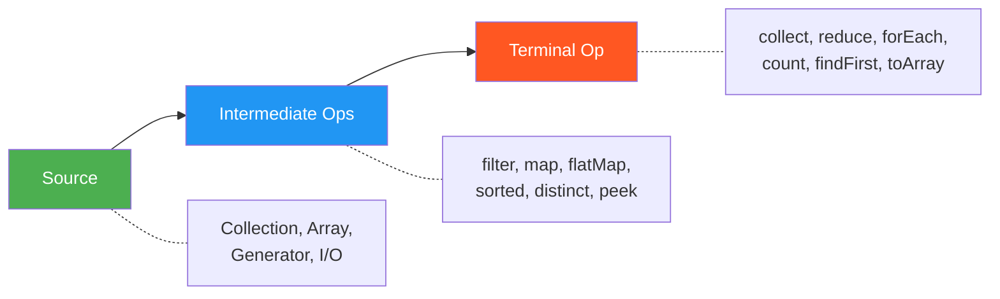
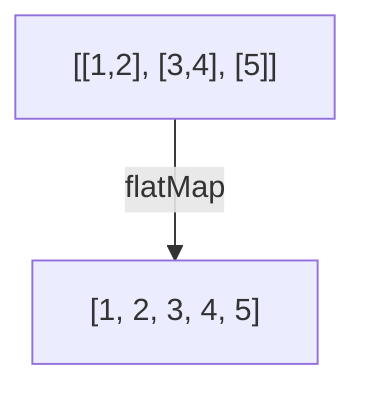
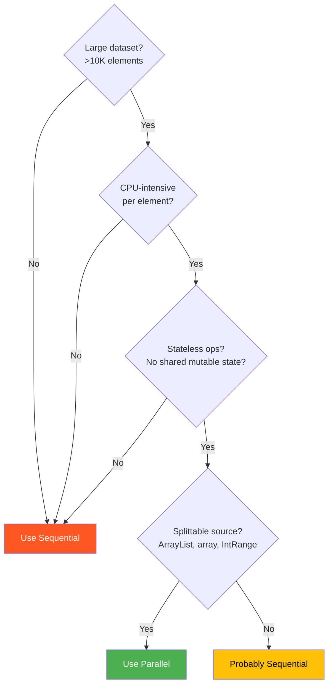
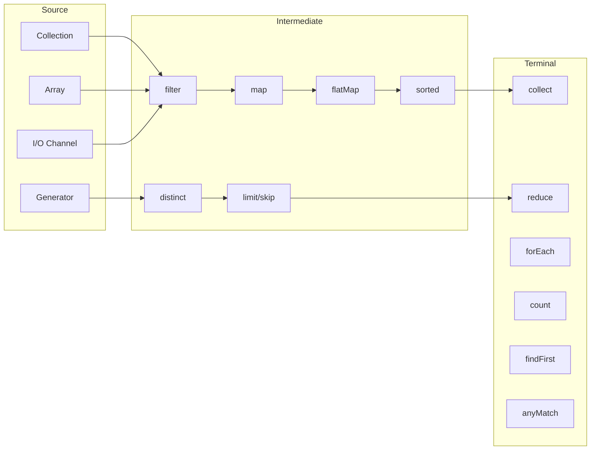

# Java Streams & Functional Programming — Complete Guide

> For engineers preparing for FAANG/top-tier interviews and building production-grade Java applications.
> Covers Java 8–17 functional idioms with realistic examples, pitfalls, and interview rapid-fire.

[← Previous: Collections Deep Dive](04-Java-Collections-Deep-Dive.md) | [Home](README.md) | [Next: Multithreading & Concurrency →](06-Java-Multithreading-and-Concurrency.md)

---

## Table of Contents

1. [Functional Programming Concepts in Java](#1-functional-programming-concepts-in-java)
2. [Lambda Expressions](#2-lambda-expressions)
3. [Functional Interfaces](#3-functional-interfaces)
4. [Method References](#4-method-references)
5. [Optional](#5-optional)
6. [Stream API Fundamentals](#6-stream-api-fundamentals)
7. [Intermediate Operations](#7-intermediate-operations)
8. [Terminal Operations](#8-terminal-operations)
9. [Collectors Deep Dive](#9-collectors-deep-dive)
10. [Parallel Streams](#10-parallel-streams)
11. [Stream vs Loop](#11-stream-vs-loop)
12. [Real-World Refactoring Examples](#12-real-world-refactoring-examples)
13. [Interview-Focused Summary](#13-interview-focused-summary)

---

## 1. Functional Programming Concepts in Java

Java is **not** a pure functional language (like Haskell or Erlang), but since **Java 8** it supports enough FP features to write declarative, composable code alongside its OOP roots.

### Core FP Principles

| Principle | Meaning | Java Support |
|-----------|---------|--------------|
| **Pure functions** | Same input → same output, no side effects | Supported by convention, not enforced |
| **First-class functions** | Functions can be stored in variables, passed around | Via functional interfaces + lambdas |
| **Higher-order functions** | Functions that accept or return other functions | `Function.compose()`, `Comparator.thenComparing()` |
| **Immutability** | Data is never modified after creation | `final`, unmodifiable collections, records |
| **Declarative style** | Describe *what*, not *how* | Stream API, `Optional` chaining |

### Imperative vs Declarative

```java
// Imperative — HOW to do it
List<String> result = new ArrayList<>();
for (Employee e : employees) {
    if (e.getSalary() > 100_000) {
        result.add(e.getName().toUpperCase());
    }
}

// Declarative — WHAT to do
List<String> result = employees.stream()
        .filter(e -> e.getSalary() > 100_000)
        .map(e -> e.getName().toUpperCase())
        .toList();
```

> **Interview tip:** Explain that Java's FP support is *opt-in*. You can mix imperative and functional styles freely. The Stream API is the flagship FP feature.

---

## 2. Lambda Expressions

A lambda is an **anonymous function** that can be passed around as a value. It must target a **functional interface** (an interface with exactly one abstract method).

### 2.1 Syntax Variations

```java
// Two parameters, expression body
BinaryOperator<Integer> add = (a, b) -> a + b;

// Single parameter (parentheses optional)
UnaryOperator<Integer> doubleIt = a -> a * 2;

// No parameters
Supplier<String> greeting = () -> "hello";

// Multi-line block body — requires explicit return
Function<String, Integer> parse = s -> {
    s = s.trim();
    return Integer.parseInt(s);
};
```

### 2.2 Target Typing

The compiler infers the lambda's type from the **target context** — assignment, method argument, or return statement.

```java
// Target type is Predicate<String> — compiler knows (s) is String and return is boolean
Predicate<String> nonEmpty = s -> !s.isEmpty();

// Same lambda body, different target type
Function<String, Boolean> nonEmptyFn = s -> !s.isEmpty();
```

### 2.3 Variable Capture and Effectively Final

Lambdas can capture variables from the enclosing scope, but those variables must be **effectively final** (assigned exactly once).

```java
int threshold = 50; // effectively final — never reassigned
Predicate<Integer> aboveThreshold = n -> n > threshold;

int counter = 0;
// counter++; // uncommenting makes counter non-effectively-final
// Predicate<Integer> bad = n -> n > counter; // COMPILE ERROR
```

**Why this restriction?** Lambdas may execute on a different thread (e.g., parallel streams). Allowing mutation of local variables would introduce race conditions without any synchronization. The captured value is effectively a *copy*, so mutation would be invisible — better to disallow it outright.

### 2.4 `this` in Lambdas vs Anonymous Classes

```java
public class Outer {
    private String name = "Outer";

    public void demo() {
        // Lambda — `this` refers to the enclosing Outer instance
        Runnable lambda = () -> System.out.println(this.name); // "Outer"

        // Anonymous class — `this` refers to the anonymous class instance
        Runnable anon = new Runnable() {
            private String name = "Anon";
            @Override
            public void run() {
                System.out.println(this.name); // "Anon"
            }
        };
    }
}
```

### 2.5 Lambda vs Anonymous Inner Class

| Aspect | Lambda | Anonymous Class |
|--------|--------|-----------------|
| Bytecode | Uses `invokedynamic` — JVM generates implementation at runtime | Separate `.class` file per anonymous class |
| `this` reference | Enclosing class | Anonymous class itself |
| Can implement | Only functional interfaces (1 abstract method) | Any interface or abstract class |
| State / fields | Cannot have instance fields | Can have fields |
| Performance | Generally faster (no class loading, metafactory optimized) | Slight overhead from extra class |

### 2.6 Checked Exceptions in Lambdas

Built-in functional interfaces (`Function`, `Predicate`, etc.) do **not** declare checked exceptions, making IO-heavy lambdas awkward.

```java
// COMPILE ERROR — parseInt doesn't throw, but imagine a method that does:
// Function<String, byte[]> readFile = path -> Files.readAllBytes(Path.of(path));

// Workaround 1: wrap in try-catch inside the lambda
Function<String, byte[]> readFile = path -> {
    try {
        return Files.readAllBytes(Path.of(path));
    } catch (IOException e) {
        throw new UncheckedIOException(e);
    }
};

// Workaround 2: custom functional interface that allows checked exceptions
@FunctionalInterface
interface ThrowingFunction<T, R> {
    R apply(T t) throws Exception;
}
```

---

## 3. Functional Interfaces

A **functional interface** has exactly **one abstract method** (SAM — Single Abstract Method). It may have any number of `default` or `static` methods.

### 3.1 Core Functional Interfaces

| Interface | SAM Signature | Use Case |
|-----------|---------------|----------|
| `Function<T, R>` | `R apply(T t)` | Transform T → R |
| `BiFunction<T, U, R>` | `R apply(T t, U u)` | Transform (T, U) → R |
| `Predicate<T>` | `boolean test(T t)` | Test a condition |
| `BiPredicate<T, U>` | `boolean test(T t, U u)` | Test two-arg condition |
| `Consumer<T>` | `void accept(T t)` | Perform side-effect |
| `BiConsumer<T, U>` | `void accept(T t, U u)` | Side-effect on two args |
| `Supplier<T>` | `T get()` | Lazy value production |
| `UnaryOperator<T>` | `T apply(T t)` | Transform T → T (extends `Function<T,T>`) |
| `BinaryOperator<T>` | `T apply(T t1, T t2)` | Combine two T → T (extends `BiFunction<T,T,T>`) |

### 3.2 Primitive Specializations

Boxing and unboxing between `int`↔`Integer` creates garbage and hurts performance in tight loops. Java provides specialized interfaces to avoid this.

```java
// Without specialization — autoboxes int to Integer and back
Function<Integer, Integer> square = n -> n * n;

// With specialization — no boxing
IntUnaryOperator squarePrim = n -> n * n;
```

Key specializations: `IntFunction<R>`, `IntPredicate`, `IntConsumer`, `IntSupplier`, `ToIntFunction<T>`, `LongBinaryOperator`, `DoubleSupplier`, `ObjIntConsumer<T>`, etc.

### 3.3 Composing Functions

```java
Function<String, String> trim = String::trim;
Function<String, String> lower = String::toLowerCase;
Function<String, Integer> length = String::length;

// andThen: trim → lower → length
Function<String, Integer> pipeline = trim.andThen(lower).andThen(length);
System.out.println(pipeline.apply("  HELLO ")); // 5

// compose: length ∘ lower ∘ trim (reads right-to-left)
Function<String, Integer> composed = length.compose(lower).compose(trim);

// Predicate composition
Predicate<String> notEmpty = s -> !s.isEmpty();
Predicate<String> shortEnough = s -> s.length() < 100;
Predicate<String> valid = notEmpty.and(shortEnough);
Predicate<String> invalid = valid.negate();
Predicate<String> emptyOrLong = notEmpty.negate().or(shortEnough.negate());
```

### 3.4 Custom Functional Interfaces

```java
@FunctionalInterface
interface TriFunction<A, B, C, R> {
    R apply(A a, B b, C c);
}

TriFunction<String, String, String, String> fullName =
        (first, middle, last) -> first + " " + middle + " " + last;
```

---

## 4. Method References

A **method reference** is shorthand for a lambda that simply delegates to an existing method.

### Four Types with Equivalent Lambdas

| Type | Method Reference | Equivalent Lambda |
|------|-----------------|-------------------|
| **Static method** | `Integer::parseInt` | `s -> Integer.parseInt(s)` |
| **Instance of particular object** | `System.out::println` | `x -> System.out.println(x)` |
| **Instance of arbitrary object** | `String::toLowerCase` | `s -> s.toLowerCase()` |
| **Constructor** | `ArrayList::new` | `() -> new ArrayList<>()` |

### Examples in Context

```java
List<String> words = List.of("42", "7", "100", "3");

// Static method reference
List<Integer> nums = words.stream()
        .map(Integer::parseInt)
        .toList();

// Instance method of a particular object
PrintStream out = System.out;
nums.forEach(out::println);

// Instance method of an arbitrary object of the type
List<String> lower = words.stream()
        .map(String::toLowerCase)
        .toList();

// Constructor reference
List<StringBuilder> builders = words.stream()
        .map(StringBuilder::new)  // new StringBuilder(word)
        .toList();
```

> **Interview tip:** The "arbitrary object" type confuses people. `String::toLowerCase` means "call `toLowerCase()` on whatever `String` the stream provides". The stream element becomes `this`.

---

## 5. Optional

`Optional<T>` is a container that may or may not hold a non-null value. It replaces `null` returns with an explicit type that forces the caller to handle absence.

### 5.1 Creation

```java
Optional<String> present   = Optional.of("value");         // must be non-null
Optional<String> nullable   = Optional.ofNullable(null);    // may be null → empty
Optional<String> absent     = Optional.empty();             // always empty
```

### 5.2 Safe Value Extraction

```java
Optional<User> userOpt = repository.findById(42);

// orElse — always evaluates the fallback (eager)
User user1 = userOpt.orElse(User.guest());

// orElseGet — evaluates the supplier only if empty (lazy)
User user2 = userOpt.orElseGet(() -> userService.createGuest());

// orElseThrow — throws if empty (preferred over .get())
User user3 = userOpt.orElseThrow(() -> new UserNotFoundException(42));

// orElseThrow() no-arg — throws NoSuchElementException (Java 10+)
User user4 = userOpt.orElseThrow();
```

### 5.3 Transformation Pipeline

```java
String city = userOpt
        .filter(u -> u.isActive())
        .map(User::getAddress)
        .flatMap(Address::getCity)   // Address.getCity() returns Optional<String>
        .map(String::toUpperCase)
        .orElse("UNKNOWN");
```

### 5.4 `orElse()` vs `orElseGet()` — The Eager Trap

```java
// orElse — expensiveCall() runs EVEN IF the Optional has a value
Optional.of("cached").orElse(expensiveCall());

// orElseGet — supplier only invoked when Optional is empty
Optional.of("cached").orElseGet(() -> expensiveCall());
```

This matters when the fallback has side effects or is expensive (DB query, network call).

### 5.5 Anti-Patterns

```java
// BAD: Optional as method parameter
public void process(Optional<String> name) { ... }  // callers must wrap

// BAD: Optional as a field
class User { Optional<String> nickname; }  // not serializable, adds overhead

// BAD: isPresent() + get() — defeats the purpose
if (opt.isPresent()) {
    doSomething(opt.get());
}
// GOOD: use ifPresent or map
opt.ifPresent(this::doSomething);

// BAD: Optional.get() without checking — can throw NoSuchElementException
String v = opt.get();  // use orElseThrow() instead for clarity
```

> **FAANG style guide:** Use `Optional` as a return type to signal "this may be absent". Never use it as a field, parameter, or collection element.

---

## 6. Stream API Fundamentals

### 6.1 What Is a Stream?

A Stream is a **sequence of elements** supporting aggregate operations. It is:

- **Not a data structure** — it doesn't store elements
- **Lazy** — intermediate operations are not executed until a terminal operation is invoked
- **One-use** — a stream cannot be reused after a terminal operation consumes it
- **Potentially unbounded** — `Stream.iterate()`, `Stream.generate()` can be infinite

### 6.2 Stream Pipeline Architecture



**Key rule:** A pipeline does *nothing* until the terminal operation triggers evaluation.

### 6.3 Creating Streams

```java
// From a Collection
List<String> names = List.of("Alice", "Bob", "Charlie");
Stream<String> s1 = names.stream();

// From varargs
Stream<String> s2 = Stream.of("x", "y", "z");

// From an array
int[] arr = {1, 2, 3, 4};
IntStream s3 = Arrays.stream(arr);

// Infinite stream with iterate (seed + unary operator)
Stream<Integer> evens = Stream.iterate(0, n -> n + 2);

// Infinite stream with generate (supplier)
Stream<Double> randoms = Stream.generate(Math::random);

// Bounded iterate (Java 9+) — like a for-loop
Stream<Integer> bounded = Stream.iterate(0, n -> n < 100, n -> n + 5);

// Range of ints
IntStream range = IntStream.range(0, 10);       // 0..9
IntStream rangeClosed = IntStream.rangeClosed(1, 10); // 1..10

// From file lines
try (Stream<String> lines = Files.lines(Path.of("data.csv"))) {
    lines.filter(l -> !l.startsWith("#")).forEach(System.out::println);
}
```

### 6.4 Lazy Evaluation — Proof with `peek()`

```java
List<String> names = List.of("Alice", "Bob", "Charlie", "Diana");

Stream<String> stream = names.stream()
        .filter(n -> {
            System.out.println("filtering: " + n);
            return n.length() > 3;
        })
        .map(n -> {
            System.out.println("mapping: " + n);
            return n.toUpperCase();
        });

System.out.println("Pipeline built — nothing executed yet.");

// Terminal operation triggers evaluation
List<String> result = stream.toList();
```

Output:

```text
Pipeline built — nothing executed yet.
filtering: Alice
mapping: Alice
filtering: Bob
filtering: Charlie
mapping: Charlie
filtering: Diana
mapping: Diana
```

Notice: operations are fused element-by-element, not stage-by-stage.

### 6.5 Short-Circuiting Operations

Short-circuiting operations **don't need to process the entire stream**.

```java
// findFirst — stops after finding one match
Optional<String> first = names.stream()
        .filter(n -> n.startsWith("C"))
        .findFirst();  // "Charlie" — never processes "Diana"

// anyMatch — stops at first true
boolean hasShort = names.stream().anyMatch(n -> n.length() < 4); // "Bob" → true, stops

// limit — takes only first N
List<Integer> firstFive = Stream.iterate(1, n -> n + 1)
        .limit(5)
        .toList(); // [1, 2, 3, 4, 5]
```

---

## 7. Intermediate Operations

All intermediate operations return a new `Stream` and are **lazy**.

### 7.1 Common Operations

```java
List<Employee> employees = getEmployees();

// filter — keep elements matching the predicate
employees.stream().filter(e -> e.getDepartment().equals("Engineering"));

// map — transform each element
employees.stream().map(Employee::getName);

// distinct — removes duplicates (uses equals/hashCode)
employees.stream().map(Employee::getDepartment).distinct();

// sorted — natural order or custom comparator
employees.stream().sorted(Comparator.comparing(Employee::getSalary).reversed());

// peek — for debugging only (not a substitute for forEach)
employees.stream()
        .peek(e -> log.debug("Before filter: {}", e))
        .filter(e -> e.getSalary() > 80_000)
        .peek(e -> log.debug("After filter: {}", e))
        .toList();

// limit and skip — pagination
employees.stream().skip(20).limit(10); // page 3 with page size 10

// mapToInt — avoid boxing when computing numeric results
IntStream salaries = employees.stream().mapToInt(Employee::getSalary);
```

### 7.2 `flatMap` Deep Dive

`flatMap` takes each element, maps it to a stream, and **flattens** all resulting streams into one.



#### Flattening Nested Collections

```java
List<Order> orders = getOrders(); // each Order has List<LineItem>

List<LineItem> allItems = orders.stream()
        .flatMap(order -> order.getItems().stream())
        .toList();
```

#### Flattening Optionals

```java
List<Optional<String>> opts = List.of(
        Optional.of("a"), Optional.empty(), Optional.of("b"));

List<String> values = opts.stream()
        .flatMap(Optional::stream)  // Optional.stream() returns 0-or-1 element stream
        .toList(); // ["a", "b"]
```

#### Splitting Strings

```java
List<String> sentences = List.of("hello world", "foo bar baz");

List<String> words = sentences.stream()
        .flatMap(s -> Arrays.stream(s.split(" ")))
        .toList(); // ["hello", "world", "foo", "bar", "baz"]
```

> **Interview tip:** `map` is 1-to-1. `flatMap` is 1-to-many followed by flatten. If the mapper returns a collection or Optional, you probably need `flatMap`.

---

## 8. Terminal Operations

Terminal operations **consume** the stream and produce a result or side-effect. After a terminal operation, the stream is closed.

### 8.1 Iteration

```java
// forEach — no guaranteed order in parallel streams
employees.forEach(e -> sendWelcomeEmail(e));

// forEachOrdered — guarantees encounter order even in parallel
employees.parallelStream().forEachOrdered(System.out::println);
```

### 8.2 Collection

```java
// toList() — Java 16+ unmodifiable list
List<String> names = employees.stream().map(Employee::getName).toList();

// collect(Collectors.toList()) — mutable ArrayList (pre-Java 16)
List<String> mutableNames = employees.stream()
        .map(Employee::getName)
        .collect(Collectors.toList());

// toArray
String[] nameArray = employees.stream()
        .map(Employee::getName)
        .toArray(String[]::new);
```

### 8.3 Searching and Matching

```java
Optional<Employee> any   = employees.stream().findAny();       // any element (faster in parallel)
Optional<Employee> first = employees.stream().findFirst();     // first in encounter order

boolean anyRich    = employees.stream().anyMatch(e -> e.getSalary() > 200_000);
boolean allActive  = employees.stream().allMatch(Employee::isActive);
boolean noneIntern = employees.stream().noneMatch(e -> e.getRole().equals("Intern"));
```

### 8.4 Aggregation

```java
long count = employees.stream().count();

Optional<Employee> highestPaid = employees.stream()
        .max(Comparator.comparingInt(Employee::getSalary));

Optional<Employee> lowestPaid = employees.stream()
        .min(Comparator.comparingInt(Employee::getSalary));
```

### 8.5 `reduce()` Deep Dive

`reduce()` combines elements into a single result using an **associative** accumulator.

```java
// Sum with identity
int total = IntStream.of(1, 2, 3, 4, 5).reduce(0, Integer::sum); // 15

// Product
int product = IntStream.of(1, 2, 3, 4).reduce(1, (a, b) -> a * b); // 24

// Without identity — returns Optional (stream might be empty)
Optional<Integer> max = Stream.of(3, 1, 4, 1, 5)
        .reduce(Integer::max); // Optional[5]

// String concatenation (prefer Collectors.joining() in practice)
String csv = List.of("a", "b", "c").stream()
        .reduce((a, b) -> a + "," + b)
        .orElse("");
```

#### Three-Argument Reduce (for Parallel Streams)

```java
// reduce(identity, accumulator, combiner)
int totalSalary = employees.parallelStream()
        .reduce(0,                              // identity
                (sum, e) -> sum + e.getSalary(), // accumulator: int + Employee → int
                Integer::sum);                   // combiner: int + int → int (merges partial results)
```

The **combiner** is only used in parallel to merge results from different threads. It must be compatible with the accumulator: `combiner(identity, accumulator(identity, e))` must equal `accumulator(identity, e)`.

---

## 9. Collectors Deep Dive

The `Collectors` utility class provides factory methods for common collection strategies.

### 9.1 Basic Collectors

```java
// toList, toSet
List<String> list = stream.collect(Collectors.toList());
Set<String> set = stream.collect(Collectors.toSet());

// toMap — key mapper, value mapper
Map<Long, String> idToName = employees.stream()
        .collect(Collectors.toMap(Employee::getId, Employee::getName));

// toMap with merge function (handle duplicate keys)
Map<String, Integer> deptHeadcount = employees.stream()
        .collect(Collectors.toMap(
                Employee::getDepartment,
                e -> 1,
                Integer::sum));    // merge: if duplicate key, sum values

// toMap with merge + custom map supplier
Map<String, Employee> byName = employees.stream()
        .collect(Collectors.toMap(
                Employee::getName,
                Function.identity(),
                (existing, replacement) -> existing,  // keep first on conflict
                TreeMap::new));                        // sorted map
```

### 9.2 Unmodifiable Collectors (Java 10+)

```java
List<String> immutableList = stream.collect(Collectors.toUnmodifiableList());
Set<String> immutableSet = stream.collect(Collectors.toUnmodifiableSet());
Map<K, V> immutableMap = stream.collect(
        Collectors.toUnmodifiableMap(keyMapper, valueMapper));
```

### 9.3 `groupingBy()`

```java
// Simple grouping
Map<String, List<Employee>> byDept = employees.stream()
        .collect(Collectors.groupingBy(Employee::getDepartment));

// groupingBy with downstream: count per department
Map<String, Long> deptCount = employees.stream()
        .collect(Collectors.groupingBy(
                Employee::getDepartment,
                Collectors.counting()));

// groupingBy with downstream: average salary per department
Map<String, Double> avgSalary = employees.stream()
        .collect(Collectors.groupingBy(
                Employee::getDepartment,
                Collectors.averagingDouble(Employee::getSalary)));

// groupingBy with downstream: names per department
Map<String, List<String>> namesByDept = employees.stream()
        .collect(Collectors.groupingBy(
                Employee::getDepartment,
                Collectors.mapping(Employee::getName, Collectors.toList())));

// groupingBy with downstream: max salary employee per department
Map<String, Optional<Employee>> topEarner = employees.stream()
        .collect(Collectors.groupingBy(
                Employee::getDepartment,
                Collectors.maxBy(Comparator.comparingInt(Employee::getSalary))));

// Nested grouping: department → role → list of employees
Map<String, Map<String, List<Employee>>> nested = employees.stream()
        .collect(Collectors.groupingBy(
                Employee::getDepartment,
                Collectors.groupingBy(Employee::getRole)));
```

### 9.4 `partitioningBy()`

Always returns a `Map<Boolean, List<T>>` with exactly two entries (`true` and `false`).

```java
Map<Boolean, List<Student>> passedFailed = students.stream()
        .collect(Collectors.partitioningBy(s -> s.getGrade() >= 60));

List<Student> passed = passedFailed.get(true);
List<Student> failed = passedFailed.get(false);

// With downstream collector
Map<Boolean, Long> counts = students.stream()
        .collect(Collectors.partitioningBy(
                s -> s.getGrade() >= 60,
                Collectors.counting()));
```

### 9.5 `joining()`

```java
String csv = employees.stream()
        .map(Employee::getName)
        .collect(Collectors.joining(", "));                    // "Alice, Bob, Charlie"

String html = employees.stream()
        .map(Employee::getName)
        .collect(Collectors.joining("</li><li>", "<ul><li>", "</li></ul>"));
// <ul><li>Alice</li><li>Bob</li><li>Charlie</li></ul>
```

### 9.6 `collectingAndThen()`

Apply a final transformation after collecting.

```java
// Collect to list, then make unmodifiable
List<String> immutable = employees.stream()
        .map(Employee::getName)
        .collect(Collectors.collectingAndThen(
                Collectors.toList(),
                Collections::unmodifiableList));

// Collect to list, then get size
int count = employees.stream()
        .collect(Collectors.collectingAndThen(
                Collectors.toList(),
                List::size));
```

### 9.7 `teeing()` (Java 12+)

Sends each element to **two** collectors simultaneously, then merges results.

```java
record SalaryStats(int min, int max) {}

SalaryStats stats = employees.stream()
        .collect(Collectors.teeing(
                Collectors.minBy(Comparator.comparingInt(Employee::getSalary)),
                Collectors.maxBy(Comparator.comparingInt(Employee::getSalary)),
                (minOpt, maxOpt) -> new SalaryStats(
                        minOpt.map(Employee::getSalary).orElse(0),
                        maxOpt.map(Employee::getSalary).orElse(0))));

// Another example: average and count in one pass
record Summary(double average, long count) {}

Summary summary = employees.stream()
        .map(Employee::getSalary)
        .collect(Collectors.teeing(
                Collectors.averagingInt(Integer::intValue),
                Collectors.counting(),
                Summary::new));
```

### 9.8 Custom Collector with `Collector.of()`

```java
// Custom collector: build a comma-separated string with a max of 3 items
Collector<String, ?, String> topThreeJoiner = Collector.of(
        () -> new ArrayList<String>(),             // supplier
        (list, item) -> { if (list.size() < 3) list.add(item); }, // accumulator
        (left, right) -> {                         // combiner (for parallel)
            left.addAll(right);
            return left.subList(0, Math.min(left.size(), 3));
        },
        list -> String.join(", ", list),           // finisher
        Collector.Characteristics.UNORDERED);

String top3 = Stream.of("A", "B", "C", "D", "E")
        .collect(topThreeJoiner); // "A, B, C"
```

### 9.9 Complex Real-World Examples

#### Frequency Map

```java
String text = "the quick brown fox jumps over the lazy dog the fox";
Map<String, Long> freq = Arrays.stream(text.split(" "))
        .collect(Collectors.groupingBy(
                Function.identity(),
                Collectors.counting()));
// {the=3, quick=1, brown=1, fox=2, jumps=1, over=1, lazy=1, dog=1}
```

#### Top N by Group

```java
// Top 2 highest-paid employees per department
Map<String, List<Employee>> top2ByDept = employees.stream()
        .collect(Collectors.groupingBy(
                Employee::getDepartment,
                Collectors.collectingAndThen(
                        Collectors.toList(),
                        list -> list.stream()
                                .sorted(Comparator.comparingInt(Employee::getSalary).reversed())
                                .limit(2)
                                .toList())));
```

---

## 10. Parallel Streams

### 10.1 Creating Parallel Streams

```java
// From a collection
List<Order> orders = getOrders();
Stream<Order> parallel1 = orders.parallelStream();

// From an existing stream
Stream<Order> parallel2 = orders.stream().parallel();

// Check if a stream is parallel
boolean isParallel = parallel1.isParallel(); // true
```

Parallel streams use the **common ForkJoinPool** by default, which has `Runtime.getRuntime().availableProcessors() - 1` threads.

### 10.2 When to Use Parallel Streams



| Use Parallel When | Avoid Parallel When |
|-------------------|---------------------|
| Large data (>10K elements) | Small collections |
| CPU-intensive per-element work | I/O-bound work (DB, network) |
| Stateless, independent operations | Order-dependent logic |
| Easily splittable source (ArrayList, arrays) | LinkedList, single-element-iterator sources |
| No shared mutable state | Shared mutable state / synchronized blocks |

### 10.3 Custom ForkJoinPool

To avoid saturating the common pool (which affects the entire JVM), submit parallel stream work to a custom pool.

```java
ForkJoinPool customPool = new ForkJoinPool(4); // 4 threads

List<Result> results = customPool.submit(() ->
        orders.parallelStream()
                .map(this::expensiveTransform)
                .toList()
).get(); // .get() blocks until complete

customPool.shutdown();
```

### 10.4 Order Preservation

```java
List<Integer> nums = List.of(1, 2, 3, 4, 5, 6, 7, 8);

// forEach in parallel — order is NOT guaranteed
nums.parallelStream().forEach(System.out::print);      // might print: 65127348

// forEachOrdered — order IS guaranteed (but loses some parallelism benefit)
nums.parallelStream().forEachOrdered(System.out::print); // always: 12345678
```

### 10.5 Thread Safety Concerns

```java
// DANGEROUS — shared mutable list
List<Integer> results = new ArrayList<>(); // NOT thread-safe
IntStream.range(0, 10_000)
        .parallel()
        .forEach(results::add); // race condition, may lose elements or throw

// SAFE — use collect instead (handles thread safety internally)
List<Integer> safeResults = IntStream.range(0, 10_000)
        .parallel()
        .boxed()
        .toList();
```

> **Interview tip:** The golden rule of parallel streams — never mutate shared state from within a stream pipeline. Use `collect()` or `reduce()` to accumulate results safely.

---

## 11. Stream vs Loop

### 11.1 Readability Comparison

#### Task: Find names of active employees earning > 100K, sorted alphabetically

```java
// Imperative loop
List<String> result = new ArrayList<>();
for (Employee e : employees) {
    if (e.isActive() && e.getSalary() > 100_000) {
        result.add(e.getName());
    }
}
Collections.sort(result);

// Stream
List<String> result = employees.stream()
        .filter(Employee::isActive)
        .filter(e -> e.getSalary() > 100_000)
        .map(Employee::getName)
        .sorted()
        .toList();
```

The stream version reads top-to-bottom as a data transformation pipeline. The loop requires mental tracking of the mutable `result` list.

### 11.2 Performance Considerations

| Aspect | Stream | Loop |
|--------|--------|------|
| Object creation overhead | Higher (stream infrastructure, lambda instances) | Lower |
| JIT optimization | Good — JIT can inline lambdas and eliminate stream overhead | Excellent — tight loops are JIT's sweet spot |
| Small collections (<100 elements) | Negligible difference | Negligible difference |
| Hot path / micro-benchmark | May show 10-30% overhead | Slightly faster |
| Real-world impact | Almost never the bottleneck | Almost never the bottleneck |

> **Bottom line:** Don't choose between streams and loops based on performance unless profiling proves it matters. Choose based on **readability and maintainability**.

### 11.3 Debugging

Streams are harder to debug because the pipeline is a single expression. Strategies:

1. **`peek()`** — add temporary peek() calls to inspect elements at each stage
2. **Break the chain** — assign intermediate streams to variables, set breakpoints
3. **IDE support** — IntelliJ's "Trace Current Stream Chain" shows element flow through each stage

### 11.4 When to Prefer Each

**Prefer loops when:**
- Simple iteration with early `break`/`continue` with complex conditions
- Performance-critical inner loops (rare in practice)
- You need indexed access (`for (int i = 0; ...)`)
- Logic involves multiple mutable accumulators that are awkward with `reduce()`

**Prefer streams when:**
- Filter-map-collect transformations
- Grouping, partitioning, aggregation
- The pipeline is a natural chain of data transformations
- You want immutability and no side effects

---

## 12. Real-World Refactoring Examples

### 12.1 Filtering and Transforming Orders

```java
// BEFORE: imperative
List<OrderDTO> highValueOrders = new ArrayList<>();
for (Order order : orders) {
    if (order.getStatus() == Status.COMPLETED && order.getTotal() > 500) {
        OrderDTO dto = new OrderDTO();
        dto.setId(order.getId());
        dto.setCustomerName(order.getCustomer().getName());
        dto.setTotal(order.getTotal());
        highValueOrders.add(dto);
    }
}

// AFTER: stream
List<OrderDTO> highValueOrders = orders.stream()
        .filter(o -> o.getStatus() == Status.COMPLETED)
        .filter(o -> o.getTotal() > 500)
        .map(o -> new OrderDTO(o.getId(), o.getCustomer().getName(), o.getTotal()))
        .toList();
```

### 12.2 Grouping and Aggregating

```java
// BEFORE: imperative
Map<String, Double> avgSalaryByDept = new HashMap<>();
Map<String, Integer> countByDept = new HashMap<>();
for (Employee e : employees) {
    String dept = e.getDepartment();
    avgSalaryByDept.merge(dept, (double) e.getSalary(), Double::sum);
    countByDept.merge(dept, 1, Integer::sum);
}
for (String dept : avgSalaryByDept.keySet()) {
    avgSalaryByDept.put(dept, avgSalaryByDept.get(dept) / countByDept.get(dept));
}

// AFTER: stream
Map<String, Double> avgSalaryByDept = employees.stream()
        .collect(Collectors.groupingBy(
                Employee::getDepartment,
                Collectors.averagingInt(Employee::getSalary)));
```

### 12.3 Flattening Nested Structures

```java
// BEFORE: imperative
List<String> allTags = new ArrayList<>();
for (Article article : articles) {
    for (String tag : article.getTags()) {
        if (!allTags.contains(tag)) {
            allTags.add(tag);
        }
    }
}

// AFTER: stream
List<String> allTags = articles.stream()
        .flatMap(article -> article.getTags().stream())
        .distinct()
        .toList();
```

### 12.4 Building a Map with Duplicate Key Handling

```java
// BEFORE: imperative
Map<String, Employee> seniorByDept = new HashMap<>();
for (Employee e : employees) {
    String dept = e.getDepartment();
    Employee existing = seniorByDept.get(dept);
    if (existing == null || e.getJoinDate().isBefore(existing.getJoinDate())) {
        seniorByDept.put(dept, e);
    }
}

// AFTER: stream — toMap with merge function picks the more senior employee
Map<String, Employee> seniorByDept = employees.stream()
        .collect(Collectors.toMap(
                Employee::getDepartment,
                Function.identity(),
                (e1, e2) -> e1.getJoinDate().isBefore(e2.getJoinDate()) ? e1 : e2));
```

---

## 13. Interview-Focused Summary

### Quick Reference: Stream Pipeline Flow



### Rapid-Fire Q&A

| # | Question | Key Answer |
|---|----------|------------|
| 1 | What is lazy evaluation in streams? | Intermediate operations are not executed until a terminal operation is invoked. This allows optimization like short-circuiting and loop fusion. |
| 2 | Difference between `map()` and `flatMap()`? | `map` is 1-to-1 (T → R). `flatMap` is 1-to-many then flatten (T → Stream\<R\> → R). Use `flatMap` for nested collections/Optionals. |
| 3 | Can you reuse a stream? | No. A stream can only be consumed once. Calling a terminal operation closes it. Create a new stream from the source. |
| 4 | What is a Spliterator? | An iterator designed for parallel traversal. It can `trySplit()` to partition data for ForkJoinPool. Array-backed spliterators split efficiently; LinkedList ones do not. |
| 5 | Intermediate vs terminal operations? | Intermediate: return a Stream, are lazy (filter, map, sorted). Terminal: produce a result or side-effect, trigger execution (collect, reduce, forEach). |
| 6 | What if no terminal operation is called? | Nothing happens. The pipeline is never executed. No filtering, no mapping, no side-effects. |
| 7 | `orElse()` vs `orElseGet()`? | `orElse` always evaluates its argument (eager). `orElseGet` only calls the supplier when the Optional is empty (lazy). Use `orElseGet` for expensive fallbacks. |
| 8 | Why can't lambdas use mutable local variables? | Lambdas capture a copy of the variable. Allowing mutation would be misleading (changes wouldn't propagate) and unsafe in concurrent contexts. Hence: effectively final only. |
| 9 | What is a functional interface? | An interface with exactly one abstract method. It can have default/static methods. `@FunctionalInterface` is optional but recommended for compile-time safety. |
| 10 | `findFirst()` vs `findAny()`? | `findFirst` returns the first element in encounter order. `findAny` may return any element and is faster in parallel streams (no ordering constraint). |
| 11 | How does `reduce()` work? | It combines elements: `reduce(identity, accumulator)`. Identity is the starting value. Accumulator merges current result with next element. Must be associative. |
| 12 | What is the combiner in `reduce()`? | Used in parallel streams to merge partial results from different threads. E.g., `Integer::sum` merges two subtotals. |
| 13 | `collect()` vs `reduce()`? | `collect` uses a mutable container (efficient for building lists/maps). `reduce` creates new immutable values at each step (better for numeric aggregation). |
| 14 | How do parallel streams work internally? | They use the ForkJoinPool. The Spliterator splits the data; ForkJoinPool distributes chunks to worker threads; results are merged. |
| 15 | Dangers of parallel streams? | Shared mutable state → race conditions. Order-dependent logic may break. Small datasets → overhead exceeds benefit. Common ForkJoinPool saturation. |
| 16 | What does `peek()` do? | Performs a side-effect (like logging) for each element. It's an intermediate operation. Use only for debugging, never for business logic. |
| 17 | `Collectors.groupingBy()` vs `partitioningBy()`? | `groupingBy` groups by any classifier into a Map\<K, List\<V\>\>. `partitioningBy` groups by a predicate into a Map\<Boolean, List\<V\>\> — always has two keys. |
| 18 | What is `Collectors.teeing()`? | Java 12+. Sends each element to two collectors simultaneously, then merges results. Useful for computing two aggregates in one pass (e.g., min and max). |
| 19 | Stream vs Collection? | A Collection stores elements. A Stream is a pipeline of computations over elements — it doesn't store data, it's lazy, and it's single-use. |
| 20 | How to handle checked exceptions in lambdas? | Wrap in try-catch inside the lambda (converting to unchecked), or create a custom functional interface that declares the exception. |
| 21 | What is `invokedynamic` in the context of lambdas? | JVM instruction used to implement lambdas. Instead of generating a class file per lambda, the JVM uses a metafactory to create the implementation at runtime, improving performance and reducing class count. |
| 22 | `this` in a lambda vs anonymous class? | In a lambda, `this` refers to the enclosing class instance. In an anonymous class, `this` refers to the anonymous class instance itself. |
| 23 | Can a functional interface have multiple methods? | Yes — it can have multiple `default` and `static` methods. It must have exactly one **abstract** method. |
| 24 | What is `Stream.iterate()` vs `Stream.generate()`? | `iterate(seed, f)` produces seed, f(seed), f(f(seed))... (ordered, depends on previous). `generate(supplier)` calls the supplier independently each time (unordered, no dependency). |
| 25 | How to create a custom Collector? | Use `Collector.of(supplier, accumulator, combiner, finisher, characteristics)`. Supplier creates the mutable container, accumulator adds elements, combiner merges containers, finisher produces the final result. |

---

> **Final advice for interviews:** Know the *why* behind design choices — why streams are lazy, why lambdas need effectively-final, why parallel streams use ForkJoinPool. Interviewers at top companies care about understanding, not just syntax.

---

[← Previous: Collections Deep Dive](04-Java-Collections-Deep-Dive.md) | [Home](README.md) | [Next: Multithreading & Concurrency →](06-Java-Multithreading-and-Concurrency.md)
