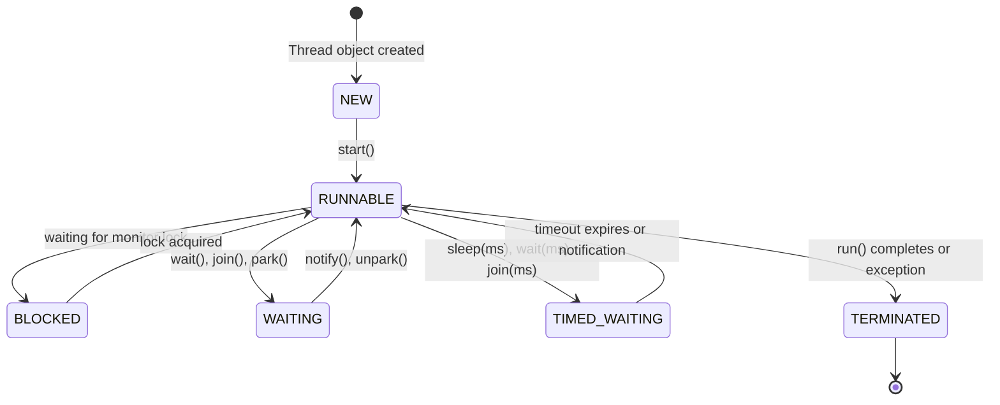
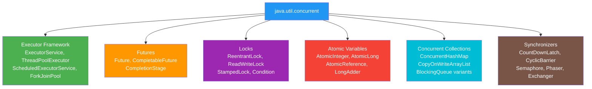
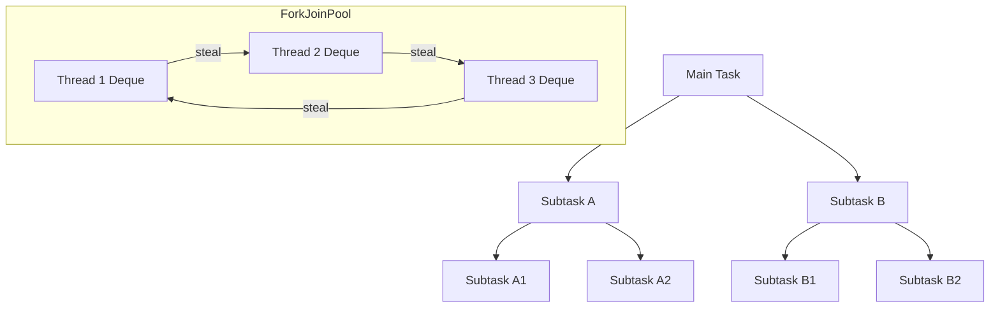

# Java Multithreading and Concurrency — Complete FAANG Interview Guide

> For senior engineers preparing for FAANG system design and coding interviews.  
> Covers thread fundamentals through virtual threads (Java 21), with production-grade examples.

[← Previous: Streams & Functional Programming](05-Java-Streams-and-Functional-Programming.md) | [Home](README.md) | [Next: Memory Model & JVM Internals →](07-Java-Memory-Model-and-JVM-Internals.md)

---

## Table of Contents

1. [Why Concurrency Matters](#1-why-concurrency-matters)
2. [Thread Fundamentals](#2-thread-fundamentals)
3. [Synchronization](#3-synchronization)
4. [java.util.concurrent Overview](#4-javautilconcurrent-overview)
5. [ExecutorService and Thread Pools](#5-executorservice-and-thread-pools)
6. [Future and CompletableFuture](#6-future-and-completablefuture)
7. [Locks (java.util.concurrent.locks)](#7-locks-javautilconcurrentlocks)
8. [Atomic Classes](#8-atomic-classes)
9. [Concurrent Collections](#9-concurrent-collections)
10. [Synchronizers](#10-synchronizers)
11. [ForkJoinPool and Work-Stealing](#11-forkjoinpool-and-work-stealing)
12. [ThreadLocal](#12-threadlocal)
13. [Virtual Threads (Project Loom, Java 21)](#13-virtual-threads-project-loom-java-21)
14. [Common Concurrency Bugs](#14-common-concurrency-bugs)
15. [Interview-Focused Summary](#15-interview-focused-summary)

---

## 1. Why Concurrency Matters

Modern CPUs ship with 8–64+ cores. A single-threaded application uses **one** core and wastes the rest. Concurrency lets programs overlap work — either to improve **throughput** (requests/sec) or reduce **latency** (time per request).

### Concurrency vs Parallelism

| Aspect | Concurrency | Parallelism |
|---|---|---|
| **Definition** | Managing multiple tasks in overlapping time periods | Executing multiple tasks at the exact same instant |
| **Requirement** | Single core is sufficient (time-slicing) | Multiple cores required |
| **Goal** | Structure, responsiveness | Raw speed |
| **Example** | Web server handling 1000 connections on 4 cores | Matrix multiplication across 8 cores |

### Amdahl's Law

Speedup is limited by the **serial fraction** of the program:

```text
Speedup(N) = 1 / (S + (1 - S) / N)

S = serial fraction (0 to 1)
N = number of processors

If 25% of your code is serial (S = 0.25):
  - 4 cores  → 2.28x speedup
  - 16 cores → 3.37x speedup
  - ∞ cores  → 4x speedup (hard ceiling)
```

**Interview tip:** If asked "will adding more threads always help?", cite Amdahl's law and coordination overhead (lock contention, context switching, cache coherence).

---

## 2. Thread Fundamentals

### 2.1 What Is a Thread?

A thread is the smallest unit of execution within a process. All threads in a process share the same heap memory but each has its own **stack**, **program counter**, and **register set**.

| Feature | Process | Thread |
|---|---|---|
| **Memory** | Separate address space | Shared heap, separate stack |
| **Creation cost** | High (fork, new address space) | Low (new stack + registers) |
| **Communication** | IPC (pipes, sockets, shared memory) | Direct shared memory access |
| **Context switch** | Expensive (TLB flush, page tables) | Cheaper (same address space) |
| **Isolation** | One crash doesn't affect others | One crash can take down all threads |
| **Use case** | Chrome tabs, microservices | Request handlers, background tasks |

### 2.2 Thread Lifecycle / States



**Key states (`Thread.State` enum):**

- **NEW** — Created but `start()` not yet called.
- **RUNNABLE** — Eligible to run (may or may not be on a CPU core).
- **BLOCKED** — Waiting to enter a `synchronized` block/method.
- **WAITING** — Waiting indefinitely for another thread's action.
- **TIMED_WAITING** — Waiting with a timeout.
- **TERMINATED** — Execution completed.

### 2.3 Creating Threads

**Approach 1: Extending Thread**

```java
public class DownloadThread extends Thread {
    private final String url;

    public DownloadThread(String url) {
        super("Downloader-" + url.hashCode());
        this.url = url;
    }

    @Override
    public void run() {
        System.out.println(Thread.currentThread().getName() + " downloading " + url);
    }
}

// Usage
Thread t = new DownloadThread("https://api.example.com/data");
t.start();
```

**Approach 2: Implementing Runnable (preferred — allows extending another class)**

```java
public class OrderProcessor implements Runnable {
    private final Order order;

    public OrderProcessor(Order order) {
        this.order = order;
    }

    @Override
    public void run() {
        validatePayment(order);
        reserveInventory(order);
        sendConfirmation(order);
    }
}

// Usage — or pass to an ExecutorService
Thread t = new Thread(new OrderProcessor(order), "OrderProcessor-" + order.getId());
t.start();
```

**Approach 3: Implementing Callable\<V\> (returns a result, can throw checked exceptions)**

```java
public class PriceCalculator implements Callable<BigDecimal> {
    private final String productId;

    public PriceCalculator(String productId) {
        this.productId = productId;
    }

    @Override
    public BigDecimal call() throws Exception {
        BigDecimal base = fetchBasePrice(productId);
        BigDecimal discount = fetchDiscount(productId);
        return base.subtract(discount);
    }
}

// Usage with ExecutorService
ExecutorService executor = Executors.newFixedThreadPool(4);
Future<BigDecimal> future = executor.submit(new PriceCalculator("SKU-1234"));
BigDecimal price = future.get(); // blocks until result is available
```

### 2.4 `start()` vs `run()` — The Classic Trap

```java
Thread t = new Thread(() -> System.out.println("Thread: " + Thread.currentThread().getName()));

t.run();   // Executes in CALLER's thread — no new thread is created!
t.start(); // Creates a new OS thread, then invokes run() on it
```

**Interview trap:** Calling `run()` directly is a common bug. It executes synchronously in the calling thread. Always use `start()`.

### 2.5 Thread Priority, Daemon Threads, and Utility Methods

```java
Thread worker = new Thread(task);

// Priority: MIN_PRIORITY=1, NORM_PRIORITY=5, MAX_PRIORITY=10
// Hints only — OS scheduler may ignore them
worker.setPriority(Thread.MAX_PRIORITY);

// Daemon threads are killed when all non-daemon threads finish
// GC thread is a daemon. Use for background housekeeping.
worker.setDaemon(true);

// Naming aids debugging — visible in jstack, thread dumps, logs
worker.setName("CacheRefresher-1");

worker.start();
```

**Key utility methods:**

| Method | Description |
|---|---|
| `Thread.sleep(ms)` | Pauses current thread; does NOT release locks |
| `Thread.yield()` | Hints scheduler to let other threads run; rarely used |
| `t.join()` | Calling thread waits until `t` finishes |
| `t.join(ms)` | Waits up to `ms` milliseconds for `t` to finish |
| `t.interrupt()` | Sets interrupt flag; throws `InterruptedException` if sleeping/waiting |
| `Thread.currentThread()` | Returns reference to the currently executing thread |
| `t.isAlive()` | Returns true if thread has been started and not yet terminated |

```java
// join() example — wait for all workers to finish
List<Thread> workers = new ArrayList<>();
for (int i = 0; i < 5; i++) {
    Thread w = new Thread(new BatchProcessor(i));
    workers.add(w);
    w.start();
}
for (Thread w : workers) {
    w.join(); // main thread waits for each worker
}
System.out.println("All batches processed");
```

---

## 3. Synchronization

### 3.1 Race Condition Example

```java
public class UnsafeCounter {
    private int count = 0;

    public void increment() {
        count++; // NOT atomic: read → modify → write (3 steps)
    }

    public int getCount() {
        return count;
    }
}

// 10 threads each increment 100,000 times
// Expected: 1,000,000   Actual: varies (e.g., 873,412)
```

The `count++` operation is a **read-modify-write** compound operation. Two threads can read the same value, both increment it, and both write back — losing one update.

### 3.2 `synchronized` Keyword

**Method-level synchronization:**

```java
public class SafeCounter {
    private int count = 0;

    public synchronized void increment() {
        count++;
    }

    public synchronized int getCount() {
        return count;
    }
}
```

**Block-level synchronization (finer granularity, preferred):**

```java
public class BankAccount {
    private final Object balanceLock = new Object();
    private double balance;

    public void deposit(double amount) {
        synchronized (balanceLock) {
            balance += amount;
        }
    }

    public void withdraw(double amount) {
        synchronized (balanceLock) {
            if (balance >= amount) {
                balance -= amount;
            }
        }
    }
}
```

**Static method synchronization — locks on the Class object:**

```java
public class ConnectionRegistry {
    private static final Set<String> activeConnections = new HashSet<>();

    public static synchronized void register(String connId) {
        activeConnections.add(connId);
    }

    public static synchronized void deregister(String connId) {
        activeConnections.remove(connId);
    }
}
// Equivalent to: synchronized(ConnectionRegistry.class) { ... }
```

### 3.3 Intrinsic Locks (Monitor Locks)

Every Java object has an **intrinsic lock** (a.k.a. monitor lock). When a thread enters a `synchronized` block, it acquires that object's intrinsic lock. Key properties:

- **Mutual exclusion:** Only one thread holds the lock at a time.
- **Reentrant:** A thread can re-enter a `synchronized` block it already holds the lock for. Java counts lock acquisitions.
- **Automatic release:** Lock is released when the thread exits the block (even via exception).

```java
public class ReentrantDemo {
    public synchronized void outer() {
        System.out.println("outer");
        inner(); // same thread re-acquires the lock — no deadlock
    }

    public synchronized void inner() {
        System.out.println("inner");
    }
}
```

### 3.4 `volatile` Keyword

`volatile` guarantees **visibility**: when one thread writes to a volatile variable, all other threads immediately see the updated value (establishes a **happens-before** relationship).

```java
public class GracefulShutdown {
    private volatile boolean running = true;

    public void run() {
        while (running) {       // always reads from main memory
            processNextTask();
        }
        System.out.println("Shutdown complete");
    }

    public void stop() {
        running = false;        // write is immediately visible to run()
    }
}
```

**When `volatile` is NOT enough:**

```java
private volatile int counter = 0;

public void increment() {
    counter++; // STILL NOT SAFE — read-modify-write is not atomic
               // volatile only guarantees visibility, not atomicity
}
```

**Use `volatile` for:** flags, status indicators, single-writer scenarios.  
**Don't use `volatile` for:** counters, compound check-then-act, multi-field updates.

### 3.5 `wait()`, `notify()`, `notifyAll()`

These methods are defined on `Object` and **must be called within a `synchronized` block** (otherwise: `IllegalMonitorStateException`).

```java
synchronized (lock) {
    while (!condition) {   // MUST use while, not if — spurious wakeups!
        lock.wait();       // releases the lock and suspends the thread
    }
    // condition is true — proceed
}

synchronized (lock) {
    condition = true;
    lock.notifyAll();      // wakes ALL waiting threads (prefer over notify())
}
```

**Why `while` and not `if`?**  
A thread can wake up without being notified (**spurious wakeup**). The `while` loop re-checks the condition. Also, by the time a notified thread reacquires the lock, another thread may have changed the condition.

### 3.6 Producer-Consumer with wait/notify

```java
public class BoundedBuffer<T> {
    private final Queue<T> queue = new LinkedList<>();
    private final int capacity;

    public BoundedBuffer(int capacity) {
        this.capacity = capacity;
    }

    public synchronized void produce(T item) throws InterruptedException {
        while (queue.size() == capacity) {
            wait(); // buffer full — wait for consumer
        }
        queue.add(item);
        System.out.println("Produced: " + item + " | Size: " + queue.size());
        notifyAll(); // wake up consumers
    }

    public synchronized T consume() throws InterruptedException {
        while (queue.isEmpty()) {
            wait(); // buffer empty — wait for producer
        }
        T item = queue.poll();
        System.out.println("Consumed: " + item + " | Size: " + queue.size());
        notifyAll(); // wake up producers
        return item;
    }
}

// Usage
BoundedBuffer<String> buffer = new BoundedBuffer<>(5);

Thread producer = new Thread(() -> {
    for (int i = 0; i < 20; i++) {
        try {
            buffer.produce("Item-" + i);
        } catch (InterruptedException e) {
            Thread.currentThread().interrupt();
        }
    }
});

Thread consumer = new Thread(() -> {
    for (int i = 0; i < 20; i++) {
        try {
            buffer.consume();
            Thread.sleep(100); // simulate slow consumer
        } catch (InterruptedException e) {
            Thread.currentThread().interrupt();
        }
    }
});

producer.start();
consumer.start();
```

---

## 4. java.util.concurrent Overview

The `java.util.concurrent` (JUC) package is the backbone of modern Java concurrency. It provides high-level building blocks that replace error-prone manual thread management.



---

## 5. ExecutorService and Thread Pools

### 5.1 Why Thread Pools?

Creating a new `Thread` for every task is expensive — each platform thread maps to an OS thread (~1 MB stack, kernel scheduling overhead). Thread pools solve this:

- **Resource management:** Bounded number of threads prevents OOM.
- **Thread reuse:** Amortizes creation cost across many tasks.
- **Bounded concurrency:** Controls parallelism to avoid overwhelming downstream systems.

### 5.2 Factory Methods

```java
// Fixed pool — N threads, unbounded queue. Use for predictable, steady workloads.
ExecutorService fixed = Executors.newFixedThreadPool(8);

// Cached pool — 0 to Integer.MAX_VALUE threads, 60s idle timeout.
// Good for many short-lived tasks. Dangerous if tasks block — can create thousands of threads.
ExecutorService cached = Executors.newCachedThreadPool();

// Single thread — sequential execution, guaranteed ordering.
ExecutorService single = Executors.newSingleThreadExecutor();

// Scheduled pool — for delayed or periodic tasks.
ScheduledExecutorService scheduled = Executors.newScheduledThreadPool(4);
```

### 5.3 ThreadPoolExecutor Deep Dive

```java
ThreadPoolExecutor executor = new ThreadPoolExecutor(
    4,                                  // corePoolSize
    16,                                 // maximumPoolSize
    60L, TimeUnit.SECONDS,             // keepAliveTime for excess threads
    new ArrayBlockingQueue<>(1000),    // work queue
    new ThreadFactory() {              // custom thread naming
        private final AtomicInteger counter = new AtomicInteger(1);
        @Override
        public Thread newThread(Runnable r) {
            Thread t = new Thread(r, "OrderWorker-" + counter.getAndIncrement());
            t.setDaemon(false);
            return t;
        }
    },
    new ThreadPoolExecutor.CallerRunsPolicy()  // rejection policy
);
```

**Task submission flow:**

```text
New task arrives
  → corePoolSize threads busy?
      NO  → create new core thread
      YES → queue full?
          NO  → enqueue task
          YES → maxPoolSize reached?
              NO  → create non-core thread
              YES → apply rejection policy
```

**Work queue types:**

| Queue Type | Bounded? | Behavior |
|---|---|---|
| `LinkedBlockingQueue` | Unbounded (default) | Tasks queue forever — maxPoolSize is irrelevant |
| `ArrayBlockingQueue` | Bounded | Predictable memory; triggers non-core thread creation |
| `SynchronousQueue` | Zero capacity | Direct handoff — requires available thread or creates one |
| `PriorityBlockingQueue` | Unbounded | Tasks ordered by priority |

**Rejection policies:**

| Policy | Action |
|---|---|
| `AbortPolicy` (default) | Throws `RejectedExecutionException` |
| `CallerRunsPolicy` | Calling thread executes the task (natural back-pressure) |
| `DiscardPolicy` | Silently drops the task |
| `DiscardOldestPolicy` | Drops the oldest queued task, retries submission |

### 5.4 Pool Sizing

**CPU-bound tasks** (computation, no I/O):

```text
threads = number of cores (Runtime.getRuntime().availableProcessors())
```

**IO-bound tasks** (network calls, database, file I/O) — **Brian Goetz formula**:

```text
threads = N_cores × (1 + W/C)

N_cores = available processors
W = wait time (time spent blocking on I/O)
C = compute time

Example: 8 cores, W/C ratio = 5 (tasks spend 5x more time waiting than computing)
threads = 8 × (1 + 5) = 48
```

### 5.5 submit() vs execute(), Shutdown

```java
ExecutorService executor = Executors.newFixedThreadPool(4);

// execute() — fire and forget, no return value, Runnable only
executor.execute(() -> processOrder(orderId));

// submit() — returns Future, accepts Runnable or Callable
Future<Invoice> future = executor.submit(() -> generateInvoice(orderId));

// Graceful shutdown
executor.shutdown();                          // no new tasks; finish existing
boolean done = executor.awaitTermination(30, TimeUnit.SECONDS);
if (!done) {
    List<Runnable> dropped = executor.shutdownNow();  // interrupt running + return queued
    System.err.println("Dropped " + dropped.size() + " tasks");
}
```

### 5.6 ScheduledExecutorService

```java
ScheduledExecutorService scheduler = Executors.newScheduledThreadPool(2);

// One-shot delay
scheduler.schedule(() -> sendReminder(userId), 24, TimeUnit.HOURS);

// Fixed rate — every 30 seconds (task overlap possible if task > 30s)
scheduler.scheduleAtFixedRate(
    () -> collectMetrics(),
    0,    // initial delay
    30,   // period
    TimeUnit.SECONDS
);

// Fixed delay — 30 seconds AFTER previous task completes (no overlap)
scheduler.scheduleWithFixedDelay(
    () -> syncToReplica(),
    0,    // initial delay
    30,   // delay between end of prev and start of next
    TimeUnit.SECONDS
);
```

---

## 6. Future and CompletableFuture

### 6.1 Future\<V\>

```java
ExecutorService executor = Executors.newFixedThreadPool(4);
Future<UserProfile> future = executor.submit(() -> userService.fetchProfile(userId));

// Blocking get
UserProfile profile = future.get();                         // blocks indefinitely
UserProfile profile = future.get(5, TimeUnit.SECONDS);      // blocks with timeout

// Check status
boolean done = future.isDone();
boolean cancelled = future.isCancelled();

// Cancel
future.cancel(true);  // true = may interrupt if running
```

**Limitations of `Future`:**
- `get()` blocks the calling thread.
- No chaining — can't say "when this finishes, do that".
- No combining — can't merge results of two futures.
- No exception handling without try/catch around `get()`.

### 6.2 CompletableFuture\<T\>

`CompletableFuture` (Java 8) is the answer to all `Future` limitations. It implements both `Future<T>` and `CompletionStage<T>`.

**Creation:**

```java
// Async with return value — runs on ForkJoinPool.commonPool() by default
CompletableFuture<UserProfile> cf = CompletableFuture.supplyAsync(
    () -> userService.fetchProfile(userId)
);

// Async without return value
CompletableFuture<Void> cf = CompletableFuture.runAsync(
    () -> auditService.logAccess(userId)
);

// With custom executor
ExecutorService ioPool = Executors.newFixedThreadPool(32);
CompletableFuture<UserProfile> cf = CompletableFuture.supplyAsync(
    () -> userService.fetchProfile(userId),
    ioPool
);
```

**Transform — thenApply (map), thenAccept (consume), thenRun (side effect):**

```java
CompletableFuture<String> greeting = CompletableFuture
    .supplyAsync(() -> userService.fetchProfile(userId))
    .thenApply(profile -> profile.getFirstName())       // UserProfile → String
    .thenApply(name -> "Hello, " + name + "!");         // String → String

// thenAccept — consumes result, returns Void
cf.thenAccept(profile -> cache.put(userId, profile));

// thenRun — ignores result, runs action
cf.thenRun(() -> metricsCounter.increment());
```

**Async variants — run transformation on a different thread:**

```java
cf.thenApplyAsync(profile -> expensiveTransform(profile));
cf.thenApplyAsync(profile -> expensiveTransform(profile), customExecutor);
```

### thenApply vs thenCompose

This is the `map` vs `flatMap` equivalent:

```java
// thenApply — transform value: T → U
// Use when the function returns a plain value
CompletableFuture<String> name = fetchUser(id)
    .thenApply(user -> user.getName());    // User → String

// thenCompose — chain async operations: T → CompletableFuture<U>
// Use when the function itself returns a CompletableFuture (avoids nesting)
CompletableFuture<List<Order>> orders = fetchUser(id)
    .thenCompose(user -> fetchOrders(user.getId()));  // User → CF<List<Order>>

// If you used thenApply here, you'd get CompletableFuture<CompletableFuture<List<Order>>>
```

| Method | Signature | Analogy |
|---|---|---|
| `thenApply` | `T → U` | `Stream.map()` |
| `thenCompose` | `T → CompletableFuture<U>` | `Stream.flatMap()` |

**Combine — thenCombine, allOf, anyOf:**

```java
CompletableFuture<UserProfile> profileCF = fetchProfile(userId);
CompletableFuture<List<Order>> ordersCF = fetchOrders(userId);

// Combine two futures
CompletableFuture<DashboardData> dashboard = profileCF.thenCombine(
    ordersCF,
    (profile, orders) -> new DashboardData(profile, orders)
);

// Wait for ALL
CompletableFuture<Void> all = CompletableFuture.allOf(profileCF, ordersCF);
all.thenRun(() -> System.out.println("All data loaded"));

// Wait for ANY (first to complete)
CompletableFuture<Object> fastest = CompletableFuture.anyOf(
    fetchFromPrimary(), fetchFromReplica()
);
```

**Error handling:**

```java
CompletableFuture<UserProfile> cf = fetchProfile(userId)
    .exceptionally(ex -> {
        log.error("Failed to fetch profile", ex);
        return UserProfile.defaultProfile();     // fallback value
    });

// handle() — receives both result and exception (exactly one is non-null)
cf.handle((result, ex) -> {
    if (ex != null) {
        return UserProfile.defaultProfile();
    }
    return result;
});

// whenComplete() — observe result/exception without transforming
cf.whenComplete((result, ex) -> {
    if (ex != null) log.error("Failed", ex);
    else metricsCounter.recordSuccess();
});
```

### 6.3 Real-World Example: Parallel API Calls

```java
public DashboardResponse buildDashboard(String userId) {
    ExecutorService ioPool = Executors.newFixedThreadPool(16);

    CompletableFuture<UserProfile> profileCF = CompletableFuture.supplyAsync(
        () -> userClient.getProfile(userId), ioPool);

    CompletableFuture<List<Order>> ordersCF = CompletableFuture.supplyAsync(
        () -> orderClient.getRecentOrders(userId), ioPool);

    CompletableFuture<List<Notification>> notifsCF = CompletableFuture.supplyAsync(
        () -> notificationClient.getUnread(userId), ioPool);

    CompletableFuture<WalletBalance> walletCF = CompletableFuture.supplyAsync(
        () -> walletClient.getBalance(userId), ioPool);

    return CompletableFuture.allOf(profileCF, ordersCF, notifsCF, walletCF)
        .thenApply(ignored -> new DashboardResponse(
            profileCF.join(),
            ordersCF.join(),
            notifsCF.join(),
            walletCF.join()
        ))
        .exceptionally(ex -> {
            log.error("Dashboard build failed for user {}", userId, ex);
            return DashboardResponse.partial(profileCF, ordersCF, notifsCF, walletCF);
        })
        .join();
}
```

---

## 7. Locks (java.util.concurrent.locks)

### 7.1 ReentrantLock

`ReentrantLock` gives explicit control over locking — features that `synchronized` lacks: tryLock, timed lock, fairness, multiple condition variables.

```java
public class InventoryService {
    private final ReentrantLock lock = new ReentrantLock();
    private final Map<String, Integer> stock = new HashMap<>();

    public boolean reserve(String sku, int qty) {
        lock.lock();
        try {
            int available = stock.getOrDefault(sku, 0);
            if (available >= qty) {
                stock.put(sku, available - qty);
                return true;
            }
            return false;
        } finally {
            lock.unlock(); // ALWAYS in finally — prevents lock leaks
        }
    }
}
```

**tryLock — non-blocking or timed:**

```java
public boolean tryReserve(String sku, int qty) throws InterruptedException {
    if (lock.tryLock(500, TimeUnit.MILLISECONDS)) {
        try {
            return reserveInternal(sku, qty);
        } finally {
            lock.unlock();
        }
    }
    log.warn("Could not acquire lock within 500ms for SKU {}", sku);
    return false;
}
```

**Fairness:**

```java
// Fair lock: longest-waiting thread gets the lock first. Reduces starvation.
// Costs ~10-20% throughput.
ReentrantLock fairLock = new ReentrantLock(true);
```

**Condition variables — more flexible than wait/notify:**

```java
public class BoundedBuffer<T> {
    private final ReentrantLock lock = new ReentrantLock();
    private final Condition notFull = lock.newCondition();
    private final Condition notEmpty = lock.newCondition();
    private final Queue<T> queue = new LinkedList<>();
    private final int capacity;

    public BoundedBuffer(int capacity) {
        this.capacity = capacity;
    }

    public void put(T item) throws InterruptedException {
        lock.lock();
        try {
            while (queue.size() == capacity) {
                notFull.await();        // wait only on "not full" condition
            }
            queue.add(item);
            notEmpty.signal();          // signal only "not empty" waiters
        } finally {
            lock.unlock();
        }
    }

    public T take() throws InterruptedException {
        lock.lock();
        try {
            while (queue.isEmpty()) {
                notEmpty.await();
            }
            T item = queue.poll();
            notFull.signal();
            return item;
        } finally {
            lock.unlock();
        }
    }
}
```

### 7.2 ReadWriteLock / ReentrantReadWriteLock

Allows **multiple concurrent readers** OR **a single writer** — ideal for read-heavy data structures like caches.

```java
public class ConfigCache {
    private final ReadWriteLock rwLock = new ReentrantReadWriteLock();
    private final Map<String, String> config = new HashMap<>();

    public String get(String key) {
        rwLock.readLock().lock();
        try {
            return config.get(key);
        } finally {
            rwLock.readLock().unlock();
        }
    }

    public void put(String key, String value) {
        rwLock.writeLock().lock();
        try {
            config.put(key, value);
        } finally {
            rwLock.writeLock().unlock();
        }
    }

    public Map<String, String> snapshot() {
        rwLock.readLock().lock();
        try {
            return new HashMap<>(config);
        } finally {
            rwLock.readLock().unlock();
        }
    }
}
```

### 7.3 StampedLock (Java 8)

`StampedLock` adds **optimistic reading** — read without actually acquiring a lock, then validate. Huge performance win when writes are rare.

```java
public class Point {
    private final StampedLock sl = new StampedLock();
    private double x, y;

    public void move(double deltaX, double deltaY) {
        long stamp = sl.writeLock();
        try {
            x += deltaX;
            y += deltaY;
        } finally {
            sl.unlockWrite(stamp);
        }
    }

    public double distanceFromOrigin() {
        long stamp = sl.tryOptimisticRead();    // no lock acquired
        double currentX = x, currentY = y;      // read fields
        if (!sl.validate(stamp)) {               // check if a write occurred
            stamp = sl.readLock();               // fall back to pessimistic read
            try {
                currentX = x;
                currentY = y;
            } finally {
                sl.unlockRead(stamp);
            }
        }
        return Math.sqrt(currentX * currentX + currentY * currentY);
    }
}
```

### 7.4 Lock vs synchronized Comparison

| Feature | `synchronized` | `ReentrantLock` | `StampedLock` |
|---|---|---|---|
| **Acquire** | Implicit (enter block) | `lock()` / `tryLock()` | `readLock()` / `writeLock()` / `tryOptimisticRead()` |
| **Release** | Implicit (exit block) | Explicit `unlock()` (must be in `finally`) | Explicit `unlock*(stamp)` |
| **Reentrant** | Yes | Yes | No |
| **Fairness** | No | Configurable | No |
| **Conditions** | Single (`wait/notify`) | Multiple (`newCondition()`) | Not supported |
| **tryLock** | No | Yes (with timeout) | Yes |
| **Optimistic read** | No | No | Yes |
| **Performance** | Good (JVM-optimized) | Similar | Best for read-heavy |
| **Risk** | None (auto-release) | Lock leak if `unlock()` missed | More complex API |

**Interview tip:** Default to `synchronized`. Use `ReentrantLock` when you need tryLock, timed lock, fairness, or multiple conditions. Use `StampedLock` for read-heavy hot paths where writes are rare.

---

## 8. Atomic Classes

### 8.1 Core Atomic Classes

Atomic classes use **Compare-And-Swap (CAS)** — a CPU-level instruction that atomically compares a memory location to an expected value and, only if they match, swaps in the new value.

```java
AtomicInteger counter = new AtomicInteger(0);

counter.incrementAndGet();           // ++counter (atomic)
counter.getAndIncrement();           // counter++ (atomic)
counter.addAndGet(5);                // counter += 5
counter.compareAndSet(5, 10);        // if (counter == 5) counter = 10; return true/false
counter.updateAndGet(x -> x * 2);   // apply function atomically

AtomicLong sequence = new AtomicLong(0);
AtomicBoolean initialized = new AtomicBoolean(false);

AtomicReference<UserProfile> cachedProfile = new AtomicReference<>();
cachedProfile.set(newProfile);
cachedProfile.compareAndSet(oldProfile, newProfile);
```

### 8.2 CAS (Compare-And-Swap) Explained

```text
CAS(memoryLocation, expectedValue, newValue):
  atomically {
    if (*memoryLocation == expectedValue) {
      *memoryLocation = newValue
      return true
    } else {
      return false  // another thread changed it — retry
    }
  }
```

CAS is a single CPU instruction (`CMPXCHG` on x86). It's the foundation of all lock-free algorithms.

**Typical CAS loop pattern:**

```java
public int incrementAndGet(AtomicInteger ai) {
    int oldValue, newValue;
    do {
        oldValue = ai.get();
        newValue = oldValue + 1;
    } while (!ai.compareAndSet(oldValue, newValue));
    return newValue;
}
```

### 8.3 The ABA Problem

Thread 1 reads A, gets preempted. Thread 2 changes A→B→A. Thread 1 wakes up, sees A, CAS succeeds — but the value went through an intermediate state.

**Solution: `AtomicStampedReference`** — pairs the reference with a version stamp.

```java
AtomicStampedReference<String> ref = new AtomicStampedReference<>("A", 0);

int[] stampHolder = new int[1];
String current = ref.get(stampHolder);
int stamp = stampHolder[0];

// CAS checks BOTH the reference AND the stamp
ref.compareAndSet(current, "B", stamp, stamp + 1);
```

### 8.4 AtomicIntegerArray / AtomicReferenceArray

```java
AtomicIntegerArray counters = new AtomicIntegerArray(16);
counters.incrementAndGet(0);    // atomically increment index 0
counters.addAndGet(5, 100);     // atomically add 100 to index 5
```

### 8.5 LongAdder and LongAccumulator (Java 8)

Under high contention, `AtomicLong` degrades because all threads CAS on the same memory location. `LongAdder` distributes across cells — each thread updates its own cell, and `sum()` aggregates.

```java
LongAdder requestCounter = new LongAdder();

// In each request handler thread:
requestCounter.increment();       // very fast under contention
requestCounter.add(5);

// When you need the total:
long total = requestCounter.sum();     // not atomic snapshot, but eventually consistent
```

```java
LongAccumulator max = new LongAccumulator(Long::max, Long.MIN_VALUE);
max.accumulate(42);
max.accumulate(99);
max.get(); // 99
```

**When to use what:**

| Class | Contention | Use Case |
|---|---|---|
| `AtomicLong` | Low-moderate | Sequence generators, exact counters |
| `LongAdder` | High | Metrics, request counters, stats |
| `LongAccumulator` | High | Custom aggregation (max, min, sum) |

---

## 9. Concurrent Collections

### 9.1 ConcurrentHashMap

`ConcurrentHashMap` (Java 8+) uses **node-level (bucket-level) locking** with CAS for updates — far more concurrent than `Collections.synchronizedMap()`.

```java
ConcurrentHashMap<String, AtomicLong> metrics = new ConcurrentHashMap<>();

// Atomic compute operations — no external synchronization needed
metrics.computeIfAbsent("requests", k -> new AtomicLong()).incrementAndGet();
metrics.compute("errors", (k, v) -> v == null ? new AtomicLong(1) : { v.incrementAndGet(); return v; });
metrics.merge("latency_sum", new AtomicLong(latency), (old, val) -> {
    old.addAndGet(val.get());
    return old;
});

// Bulk parallel operations (Java 8) — uses ForkJoinPool.commonPool()
long totalRequests = metrics.reduceValuesToLong(
    4,                          // parallelism threshold
    AtomicLong::get,
    0L,
    Long::sum
);

metrics.forEach(4, (key, value) ->
    System.out.println(key + " = " + value.get())
);
```

**Key point:** `ConcurrentHashMap` does NOT allow `null` keys or values (unlike `HashMap`). This is by design — `null` is ambiguous in concurrent contexts (is the key absent, or mapped to null?).

### 9.2 CopyOnWriteArrayList / CopyOnWriteArraySet

Every mutation creates a **new copy** of the underlying array. Reads never block. Ideal when reads vastly outnumber writes.

```java
CopyOnWriteArrayList<EventListener> listeners = new CopyOnWriteArrayList<>();

listeners.add(new LoggingListener());       // copies entire array
listeners.add(new MetricsListener());       // copies again

// Safe iteration — uses a snapshot, never throws ConcurrentModificationException
for (EventListener listener : listeners) {
    listener.onEvent(event);    // iterating over a snapshot
}
```

**Use cases:** Event listener lists, configuration lists read by many threads.  
**Avoid when:** Frequent writes — each write copies the entire array (O(n)).

### 9.3 BlockingQueue Implementations

`BlockingQueue` is the foundation of producer-consumer patterns.

```java
// ArrayBlockingQueue — bounded, backed by array, fair ordering optional
BlockingQueue<Task> taskQueue = new ArrayBlockingQueue<>(1000);

// LinkedBlockingQueue — optionally bounded, higher throughput than ABQ
BlockingQueue<Task> taskQueue = new LinkedBlockingQueue<>(5000);

// PriorityBlockingQueue — unbounded, elements sorted by natural order or comparator
BlockingQueue<Task> taskQueue = new PriorityBlockingQueue<>(100,
    Comparator.comparingInt(Task::getPriority));

// SynchronousQueue — zero capacity, direct handoff
// Each put() blocks until another thread calls take()
BlockingQueue<Task> handoff = new SynchronousQueue<>();

// DelayQueue — elements become available only after their delay expires
BlockingQueue<DelayedTask> delayQueue = new DelayQueue<>();
```

**Core operations:**

| Operation | Throws | Returns special value | Blocks | Times out |
|---|---|---|---|---|
| **Insert** | `add(e)` | `offer(e)` → boolean | `put(e)` | `offer(e, time, unit)` |
| **Remove** | `remove()` | `poll()` → null | `take()` | `poll(time, unit)` |
| **Examine** | `element()` | `peek()` → null | N/A | N/A |

### 9.4 ConcurrentLinkedQueue / ConcurrentLinkedDeque

Lock-free, unbounded, non-blocking queues based on CAS. Use when you need a concurrent queue without blocking semantics.

```java
ConcurrentLinkedQueue<LogEntry> logBuffer = new ConcurrentLinkedQueue<>();
logBuffer.offer(entry);         // non-blocking, always succeeds
LogEntry e = logBuffer.poll();  // returns null if empty, no blocking
```

### 9.5 ConcurrentSkipListMap / ConcurrentSkipListSet

Concurrent sorted collections — the concurrent equivalent of `TreeMap` / `TreeSet`.

```java
ConcurrentSkipListMap<Long, Trade> tradesByTimestamp = new ConcurrentSkipListMap<>();
tradesByTimestamp.put(System.nanoTime(), trade);

// Range queries — thread-safe
NavigableMap<Long, Trade> recentTrades = tradesByTimestamp.tailMap(cutoffTime);
```

### 9.6 Comparison Table

| Collection | Thread-safe? | Ordering | Null values | Best for |
|---|---|---|---|---|
| `ConcurrentHashMap` | Yes (node-level) | None | No nulls | General purpose concurrent map |
| `CopyOnWriteArrayList` | Yes (copy-on-write) | Insertion | Allowed | Read-heavy listener lists |
| `ArrayBlockingQueue` | Yes (lock) | FIFO | No nulls | Bounded producer-consumer |
| `LinkedBlockingQueue` | Yes (two-lock) | FIFO | No nulls | High-throughput producer-consumer |
| `ConcurrentLinkedQueue` | Yes (CAS) | FIFO | No nulls | Non-blocking message passing |
| `ConcurrentSkipListMap` | Yes (CAS) | Sorted | No nulls | Concurrent sorted map |
| `SynchronousQueue` | Yes | N/A | No nulls | Direct handoff (no buffering) |

---

## 10. Synchronizers

### 10.1 CountDownLatch

A **one-time** barrier. One or more threads wait until a counter reaches zero. Cannot be reset.

```java
public class ServiceStartupCoordinator {
    private final CountDownLatch latch;

    public ServiceStartupCoordinator(int serviceCount) {
        this.latch = new CountDownLatch(serviceCount);
    }

    public void startService(String name, Runnable initLogic) {
        new Thread(() -> {
            try {
                initLogic.run();
                System.out.println(name + " started");
                latch.countDown();
            } catch (Exception e) {
                System.err.println(name + " failed to start: " + e.getMessage());
                latch.countDown(); // still count down to avoid hanging
            }
        }).start();
    }

    public void awaitAllServices() throws InterruptedException {
        System.out.println("Waiting for all services to start...");
        latch.await();     // or await(30, TimeUnit.SECONDS)
        System.out.println("All services started!");
    }
}

// Usage
ServiceStartupCoordinator coordinator = new ServiceStartupCoordinator(3);
coordinator.startService("Database", () -> connectToDb());
coordinator.startService("Cache", () -> warmUpCache());
coordinator.startService("MessageQueue", () -> connectToMQ());
coordinator.awaitAllServices();
```

### 10.2 CyclicBarrier

A **reusable** barrier. N threads wait for each other, then all proceed simultaneously. Can be reset and reused across phases.

```java
public class ParallelMatrixComputation {
    private final int numWorkers;
    private final CyclicBarrier barrier;
    private final double[][] matrix;

    public ParallelMatrixComputation(double[][] matrix, int numWorkers) {
        this.matrix = matrix;
        this.numWorkers = numWorkers;
        this.barrier = new CyclicBarrier(numWorkers, () -> {
            System.out.println("Phase complete — all workers synchronized");
        });
    }

    public void compute() {
        for (int i = 0; i < numWorkers; i++) {
            final int workerId = i;
            new Thread(() -> {
                try {
                    for (int phase = 0; phase < 10; phase++) {
                        processPartition(workerId, phase);
                        barrier.await(); // wait for all workers to finish this phase
                    }
                } catch (InterruptedException | BrokenBarrierException e) {
                    Thread.currentThread().interrupt();
                }
            }).start();
        }
    }
}
```

### 10.3 Semaphore

Controls access to a resource by managing a set of **permits**. Threads `acquire()` permits and `release()` them.

```java
public class DatabaseConnectionPool {
    private final Semaphore semaphore;
    private final BlockingQueue<Connection> pool;

    public DatabaseConnectionPool(int maxConnections) {
        this.semaphore = new Semaphore(maxConnections, true); // fair
        this.pool = new ArrayBlockingQueue<>(maxConnections);
        for (int i = 0; i < maxConnections; i++) {
            pool.add(createConnection());
        }
    }

    public Connection acquire() throws InterruptedException {
        semaphore.acquire();    // blocks if no permits available
        return pool.poll();
    }

    public void release(Connection conn) {
        pool.offer(conn);
        semaphore.release();    // returns the permit
    }

    public Connection tryAcquire(long timeout, TimeUnit unit) throws InterruptedException {
        if (semaphore.tryAcquire(timeout, unit)) {
            return pool.poll();
        }
        throw new TimeoutException("Could not acquire connection within " + timeout);
    }
}
```

### 10.4 Phaser (Java 7)

A flexible synchronizer that combines features of `CountDownLatch` and `CyclicBarrier`, plus dynamic registration/deregistration.

```java
public class DynamicPipeline {
    private final Phaser phaser = new Phaser(1); // register self

    public void addWorker(Runnable task) {
        phaser.register(); // dynamically add participant
        new Thread(() -> {
            try {
                task.run();
            } finally {
                phaser.arriveAndDeregister(); // done — remove self
            }
        }).start();
    }

    public void awaitAllWorkers() {
        phaser.arriveAndAwaitAdvance(); // wait for all registered parties
    }
}
```

### 10.5 Exchanger

Allows two threads to **swap data** at a rendezvous point.

```java
Exchanger<List<LogEntry>> exchanger = new Exchanger<>();

// Producer thread fills a buffer, then swaps with consumer's empty buffer
Thread producer = new Thread(() -> {
    List<LogEntry> buffer = new ArrayList<>();
    while (running) {
        buffer.add(collectLogEntry());
        if (buffer.size() >= 1000) {
            buffer = exchanger.exchange(buffer); // swap full for empty
            buffer.clear();
        }
    }
});

// Consumer thread processes the full buffer, provides an empty one
Thread consumer = new Thread(() -> {
    List<LogEntry> buffer = new ArrayList<>();
    while (running) {
        buffer = exchanger.exchange(buffer); // swap empty for full
        persistToDatabase(buffer);
    }
});
```

### 10.6 Synchronizer Comparison

| Feature | CountDownLatch | CyclicBarrier | Semaphore | Phaser |
|---|---|---|---|---|
| **Reusable** | No (one-shot) | Yes (auto-reset) | Yes | Yes |
| **Parties** | 1 countdown, N waiters | N parties wait for each other | N permits | Dynamic |
| **Dynamic add** | No | No | N/A | Yes (`register()`) |
| **Barrier action** | No | Yes (on trip) | No | Yes (overridable) |
| **Use case** | Wait for N events | Multi-phase computation | Resource limiting | Flexible phased tasks |

---

## 11. ForkJoinPool and Work-Stealing

### 11.1 Concept

The Fork/Join framework divides a problem into smaller subproblems (**fork**), solves them recursively, and merges results (**join**). It uses a **work-stealing** algorithm: idle threads steal tasks from busy threads' queues.



### 11.2 RecursiveTask\<V\> vs RecursiveAction

- `RecursiveTask<V>` — returns a result.
- `RecursiveAction` — no return value (side effects only).

```java
public class ParallelArraySum extends RecursiveTask<Long> {
    private static final int THRESHOLD = 10_000;
    private final long[] array;
    private final int start, end;

    public ParallelArraySum(long[] array, int start, int end) {
        this.array = array;
        this.start = start;
        this.end = end;
    }

    @Override
    protected Long compute() {
        int length = end - start;
        if (length <= THRESHOLD) {
            long sum = 0;
            for (int i = start; i < end; i++) {
                sum += array[i];
            }
            return sum;
        }

        int mid = start + length / 2;
        ParallelArraySum left = new ParallelArraySum(array, start, mid);
        ParallelArraySum right = new ParallelArraySum(array, mid, end);

        left.fork();             // submit left half to the pool
        long rightResult = right.compute();  // compute right half in current thread
        long leftResult = left.join();       // wait for left half

        return leftResult + rightResult;
    }
}

// Usage
long[] data = new long[10_000_000];
Arrays.fill(data, 1);

ForkJoinPool pool = new ForkJoinPool();  // or ForkJoinPool.commonPool()
long total = pool.invoke(new ParallelArraySum(data, 0, data.length));
System.out.println("Sum: " + total);  // 10,000,000
```

### 11.3 Common Pool and Parallel Streams

`ForkJoinPool.commonPool()` is used by:
- `CompletableFuture.supplyAsync()` (default)
- Parallel streams (`list.parallelStream()`)
- `Arrays.parallelSort()`

```java
// Parallel stream uses commonPool
long sum = LongStream.rangeClosed(1, 1_000_000)
    .parallel()
    .sum();

// Common pool parallelism = availableProcessors() - 1
// Override with: -Djava.util.concurrent.ForkJoinPool.common.parallelism=16
```

**Warning:** Don't perform blocking I/O in tasks running on the common pool — it starves other parallel operations across the entire JVM.

---

## 12. ThreadLocal

### 12.1 What It Solves

`ThreadLocal` provides **per-thread isolated storage** — each thread gets its own independent copy of a variable, eliminating the need for synchronization.

```java
public class RequestContext {
    private static final ThreadLocal<String> currentUser =
        ThreadLocal.withInitial(() -> "anonymous");

    private static final ThreadLocal<String> requestId =
        ThreadLocal.withInitial(() -> UUID.randomUUID().toString());

    public static void setCurrentUser(String user) {
        currentUser.set(user);
    }

    public static String getCurrentUser() {
        return currentUser.get();
    }

    public static String getRequestId() {
        return requestId.get();
    }

    public static void clear() {
        currentUser.remove();
        requestId.remove();
    }
}
```

### 12.2 InheritableThreadLocal

Values are automatically copied to child threads:

```java
private static final InheritableThreadLocal<String> traceId =
    new InheritableThreadLocal<>();

traceId.set("trace-abc-123");

new Thread(() -> {
    System.out.println(traceId.get()); // "trace-abc-123" — inherited from parent
}).start();
```

### 12.3 Memory Leak Danger

**Critical:** Always call `remove()` in a `finally` block, especially with thread pools.

Thread pool threads are long-lived. If you `set()` a value but never `remove()` it:
- The `ThreadLocal` map entry persists for the life of the thread.
- Objects referenced by the value can't be garbage collected.
- The next task on that thread may see stale data from a previous task.

```java
public class SafeFilter implements Filter {
    @Override
    public void doFilter(ServletRequest req, ServletResponse res, FilterChain chain)
            throws IOException, ServletException {
        try {
            RequestContext.setCurrentUser(extractUser(req));
            chain.doFilter(req, res);
        } finally {
            RequestContext.clear();  // ALWAYS clean up
        }
    }
}
```

### 12.4 Common Use Cases

| Use Case | Why ThreadLocal? |
|---|---|
| User context in web requests | Each request runs on a different thread |
| Transaction context | Transaction ID must not leak between requests |
| `SimpleDateFormat` | Not thread-safe; one instance per thread |
| Database connections | Connection-per-thread in some pool designs |
| Random number generators | `ThreadLocalRandom` avoids contention |

```java
// ThreadLocalRandom — the correct way to generate random numbers in concurrent code
int randomInt = ThreadLocalRandom.current().nextInt(1, 100);
```

---

## 13. Virtual Threads (Project Loom, Java 21)

### 13.1 Platform Threads vs Virtual Threads

| Aspect | Platform Thread | Virtual Thread |
|---|---|---|
| **Mapping** | 1:1 to OS thread | M:N (many virtual → few carrier/OS threads) |
| **Stack** | ~1 MB fixed | Starts at ~1 KB, grows as needed |
| **Creation cost** | ~1 ms, kernel involved | ~1 μs, user-space |
| **Max count** | ~thousands (OS limit) | ~millions |
| **Scheduling** | OS scheduler | JVM scheduler (ForkJoinPool) |
| **Best for** | CPU-bound work | IO-bound / blocking work |

### 13.2 Creating Virtual Threads

```java
// Direct creation
Thread vt = Thread.ofVirtual()
    .name("worker-", 0)   // name prefix with counter
    .start(() -> {
        System.out.println("Hello from " + Thread.currentThread());
    });

// Using executor — one virtual thread per task (the recommended approach)
try (var executor = Executors.newVirtualThreadPerTaskExecutor()) {
    for (int i = 0; i < 100_000; i++) {
        executor.submit(() -> {
            String result = httpClient.send(request, BodyHandlers.ofString()).body();
            processResponse(result);
        });
    }
}  // auto-shutdown: waits for all tasks
```

### 13.3 Structured Concurrency (Preview, JEP 462)

```java
try (var scope = new StructuredTaskScope.ShutdownOnFailure()) {
    Subtask<UserProfile> profileTask = scope.fork(() -> fetchProfile(userId));
    Subtask<List<Order>> ordersTask = scope.fork(() -> fetchOrders(userId));

    scope.join();            // wait for both
    scope.throwIfFailed();   // propagate first exception

    return new Dashboard(profileTask.get(), ordersTask.get());
}
// If one subtask fails, the other is cancelled automatically
```

### 13.4 When to Use Virtual Threads

**Use virtual threads for:**
- HTTP servers handling many concurrent requests (IO-bound)
- Applications making many concurrent external calls (databases, APIs)
- Any task that spends most of its time blocked/waiting

**Do NOT use virtual threads for:**
- CPU-bound computation (no benefit, same number of cores)
- Tasks that hold `synchronized` locks during blocking (causes **pinning** — the virtual thread pins its carrier thread, negating the benefit)
- Long-running compute tasks

### 13.5 Pinning Problem

Virtual threads **pin** their carrier thread when they block inside a `synchronized` block. This is because `synchronized` uses OS-level monitors tied to the carrier thread.

```java
// BAD — causes pinning
synchronized (lock) {
    resultSet = statement.executeQuery(sql);  // blocking I/O while holding monitor
}

// GOOD — use ReentrantLock instead (supports virtual thread unmounting)
lock.lock();
try {
    resultSet = statement.executeQuery(sql);
} finally {
    lock.unlock();
}
```

### 13.6 Carrier Threads and Mounting/Unmounting

```text
Virtual Thread (blocking I/O)
  → unmounts from carrier thread (saves stack to heap)
  → carrier thread picks up another virtual thread
  → when I/O completes, virtual thread is remounted on any available carrier
```

The JVM's virtual thread scheduler is a `ForkJoinPool` with parallelism = number of cores.

### 13.7 Migration from Platform Threads

```java
// Before (platform threads)
ExecutorService executor = Executors.newFixedThreadPool(200);

// After (virtual threads) — one-line change
ExecutorService executor = Executors.newVirtualThreadPerTaskExecutor();
// No need to tune pool size — virtual threads are cheap
```

**Migration checklist:**
1. Replace `newFixedThreadPool` / `newCachedThreadPool` with `newVirtualThreadPerTaskExecutor()`.
2. Replace `synchronized` with `ReentrantLock` where blocking I/O happens inside.
3. Remove `ThreadLocal` caching of expensive objects (virtual threads are numerous — per-thread caching wastes memory).
4. Remove pool sizing logic — it's no longer needed.

---

## 14. Common Concurrency Bugs

### 14.1 Deadlock

Two or more threads block forever, each waiting for a lock held by the other.

**Four necessary conditions (Coffman conditions):**
1. **Mutual exclusion** — resource is held exclusively.
2. **Hold and wait** — thread holds one resource while waiting for another.
3. **No preemption** — resources can't be forcibly taken.
4. **Circular wait** — A waits for B, B waits for A.

**Deadlock example:**

```java
public class DeadlockExample {
    private final Object lockA = new Object();
    private final Object lockB = new Object();

    public void method1() {
        synchronized (lockA) {
            System.out.println("Thread 1: holding lockA, waiting for lockB...");
            try { Thread.sleep(100); } catch (InterruptedException e) {}
            synchronized (lockB) {
                System.out.println("Thread 1: acquired both locks");
            }
        }
    }

    public void method2() {
        synchronized (lockB) {  // OPPOSITE order — deadlock!
            System.out.println("Thread 2: holding lockB, waiting for lockA...");
            try { Thread.sleep(100); } catch (InterruptedException e) {}
            synchronized (lockA) {
                System.out.println("Thread 2: acquired both locks");
            }
        }
    }
}
```

**Fix — consistent lock ordering:**

```java
public void transferMoney(Account from, Account to, double amount) {
    // Always lock in order of account ID to prevent deadlock
    Account first = from.getId() < to.getId() ? from : to;
    Account second = from.getId() < to.getId() ? to : from;

    synchronized (first) {
        synchronized (second) {
            from.debit(amount);
            to.credit(amount);
        }
    }
}
```

**Fix — tryLock with timeout:**

```java
public boolean transferWithTryLock(Account from, Account to, double amount)
        throws InterruptedException {
    while (true) {
        if (from.getLock().tryLock(1, TimeUnit.SECONDS)) {
            try {
                if (to.getLock().tryLock(1, TimeUnit.SECONDS)) {
                    try {
                        from.debit(amount);
                        to.credit(amount);
                        return true;
                    } finally {
                        to.getLock().unlock();
                    }
                }
            } finally {
                from.getLock().unlock();
            }
        }
        Thread.sleep(ThreadLocalRandom.current().nextInt(10, 100)); // back off
    }
}
```

**Detection with `jstack`:**

```text
$ jstack <pid>

Found one Java-level deadlock:
=============================
"Thread-1":
  waiting to lock monitor 0x00007f... (object 0x00000..., a java.lang.Object),
  which is held by "Thread-2"
"Thread-2":
  waiting to lock monitor 0x00007f... (object 0x00000..., a java.lang.Object),
  which is held by "Thread-1"
```

### 14.2 Livelock

Threads keep responding to each other but make no progress — like two people in a corridor who keep stepping aside in the same direction.

```java
// Two threads both try to yield to each other, neither makes progress
while (resourceInUse) {
    releaseMyResource();       // give up mine
    Thread.yield();            // let other go
    tryAcquireResource();      // try again — but other thread did the same!
}
```

**Fix:** Add randomized back-off so threads don't move in lockstep.

### 14.3 Starvation

A thread never gets CPU time or lock access. Causes:
- Low priority threads vs high priority threads.
- Unfair locks where the same threads keep winning.
- A thread holding a lock for a long time.

**Fix:** Use fair locks (`new ReentrantLock(true)`), avoid priority manipulation, keep critical sections short.

### 14.4 Race Condition

**Check-then-act (TOCTOU):**

```java
// UNSAFE — another thread can modify between check and put
if (!map.containsKey(key)) {
    map.put(key, computeValue());
}

// SAFE — atomic operation
map.computeIfAbsent(key, k -> computeValue());
```

**Read-modify-write:**

```java
// UNSAFE
count = count + 1;

// SAFE
atomicCount.incrementAndGet();
```

### 14.5 Memory Visibility

Without proper synchronization, a thread may never see another thread's writes. The JMM (Java Memory Model) only guarantees visibility across **happens-before** edges:

- `synchronized` block exit → entry on same monitor
- `volatile` write → subsequent volatile read of same variable
- `Thread.start()` → first action of started thread
- Thread termination → `join()` return in waiting thread
- `Lock.unlock()` → `Lock.lock()` on same lock

```java
// BUG — running may never be seen as false by the worker thread
// Without volatile, the JIT may hoist the read out of the loop
private boolean running = true;  // should be volatile

public void run() {
    while (running) {       // may read cached value forever
        doWork();
    }
}
```

---

## 15. Interview-Focused Summary

### Quick-Reference Q&A

| # | Question | Key Answer |
|---|---|---|
| 1 | Thread vs Runnable vs Callable? | Thread is a class (single inheritance). Runnable is a no-return interface. Callable returns a value and can throw checked exceptions. |
| 2 | `start()` vs `run()`? | `start()` creates a new OS thread. `run()` executes in the caller's thread — no new thread. |
| 3 | What is happens-before? | A JMM guarantee that memory writes by one thread are visible to reads by another. Established by synchronized, volatile, thread start/join. |
| 4 | `synchronized` vs `ReentrantLock`? | `ReentrantLock` adds tryLock, timed lock, fairness, multiple Conditions. `synchronized` is simpler, auto-releases, JVM-optimized. |
| 5 | What is thread starvation? | A thread never gets CPU time or lock access due to low priority or unfair scheduling. |
| 6 | What is a race condition? | A bug where the outcome depends on unpredictable thread scheduling. Two forms: check-then-act, read-modify-write. |
| 7 | Explain `volatile`. | Guarantees visibility across threads (happens-before on read/write). Does NOT guarantee atomicity for compound operations. |
| 8 | Why use `while` with `wait()`? | Spurious wakeups can occur. Also, another thread may change the condition between `notify()` and lock reacquisition. |
| 9 | Explain CompletableFuture chaining. | `thenApply` (map), `thenCompose` (flatMap), `thenCombine` (merge two), `allOf` (wait all), `anyOf` (first). Non-blocking. |
| 10 | `thenApply` vs `thenCompose`? | `thenApply`: T→U (map). `thenCompose`: T→CF\<U\> (flatMap). Use `thenCompose` when the transformation itself is async. |
| 11 | What is CAS? | Compare-And-Swap: atomic CPU instruction. Read value, compute new, swap only if unchanged. Foundation of lock-free algorithms. |
| 12 | What is the ABA problem? | Value changes A→B→A. CAS sees A and succeeds, missing the intermediate mutation. Solve with `AtomicStampedReference`. |
| 13 | CountDownLatch vs CyclicBarrier? | Latch: one-shot, N count down, M wait. Barrier: reusable, N threads wait for each other. |
| 14 | What is a deadlock? | Threads block forever, each holding a lock the other needs. Requires mutual exclusion, hold-and-wait, no preemption, circular wait. |
| 15 | How to prevent deadlocks? | Consistent lock ordering, tryLock with timeout, lock-free algorithms, single global lock (trading concurrency). |
| 16 | What is a daemon thread? | Runs in the background, JVM exits when only daemon threads remain. GC is a daemon thread. |
| 17 | `submit()` vs `execute()`? | `submit()` returns a `Future`, accepts Callable or Runnable. `execute()` returns void, Runnable only. |
| 18 | `shutdown()` vs `shutdownNow()`? | `shutdown()`: no new tasks, finish running. `shutdownNow()`: interrupt running, return queued. |
| 19 | ConcurrentHashMap vs Collections.synchronizedMap? | CHM: node-level locking, high concurrency, no nulls. SynchronizedMap: full-map lock, lower throughput, allows nulls. |
| 20 | What is ForkJoinPool? | A pool that uses work-stealing — idle threads steal tasks from busy threads' deques. Used by parallel streams and CompletableFuture. |
| 21 | What are virtual threads? | Lightweight JVM-managed threads (Java 21). Millions possible. Best for IO-bound work. Not for CPU-bound or synchronized blocks (pinning). |
| 22 | What is thread pinning? | Virtual thread blocking inside `synchronized` pins its carrier OS thread, defeating the purpose. Use `ReentrantLock` instead. |
| 23 | `LongAdder` vs `AtomicLong`? | `LongAdder` distributes updates across cells — much faster under high contention. Use for counters. `AtomicLong` for exact real-time reads. |
| 24 | What is ThreadLocal? | Per-thread variable storage. Each thread has its own copy. Must call `remove()` with thread pools to avoid leaks. |
| 25 | How to size a thread pool? | CPU-bound: threads = cores. IO-bound: threads = cores × (1 + W/C). Tune via profiling. |
| 26 | What is a Semaphore? | Controls concurrent access via permits. `acquire()` takes a permit, `release()` returns it. Use for rate limiting, connection pools. |
| 27 | ReadWriteLock use case? | Read-heavy workloads: many readers can hold the read lock concurrently. A writer needs exclusive access. |
| 28 | What is optimistic locking? | `StampedLock.tryOptimisticRead()`: read without locking, then validate. If a write occurred, fall back to read lock. |
| 29 | Producer-consumer pattern? | Use `BlockingQueue` (preferred) or wait/notify on a bounded buffer. `put()` blocks when full, `take()` blocks when empty. |
| 30 | `Phaser` vs CyclicBarrier? | Phaser supports dynamic registration/deregistration and multiple phases. CyclicBarrier has a fixed party count. |

### Top 5 Patterns to Know Cold

1. **Producer-Consumer** — `BlockingQueue`, `wait()/notify()`, or `Condition` variables.
2. **Thread Pool** — `ThreadPoolExecutor` with bounded queue and `CallerRunsPolicy`.
3. **CompletableFuture pipeline** — parallel API calls → `allOf` → combine → error handling.
4. **Read-Write Lock** — `ReentrantReadWriteLock` for concurrent cache reads.
5. **CountDownLatch coordination** — wait for N services/threads to complete before proceeding.

### Debugging Concurrency Issues Checklist

```text
1. Thread dump:     jstack <pid> or kill -3 <pid>
2. Detect deadlock: jstack output shows "Found one Java-level deadlock"
3. Monitor contention: jconsole → Threads tab → thread states
4. Race conditions: use -XX:+UseThreadSafetyAnalysis, ThreadSanitizer, or stress tests
5. Memory visibility: check for missing volatile/synchronized
6. Thread pool saturation: monitor queue size, rejection count, active thread count
```

---

> **Final note:** Concurrency is tested in system design (thread pool sizing, async processing), coding (implement thread-safe data structures), and behavioral rounds (debugging production deadlocks). Master the fundamentals — most FAANG concurrency questions test deep understanding of a few core concepts, not breadth of API knowledge.

---

[← Previous: Streams & Functional Programming](05-Java-Streams-and-Functional-Programming.md) | [Home](README.md) | [Next: Memory Model & JVM Internals →](07-Java-Memory-Model-and-JVM-Internals.md)
