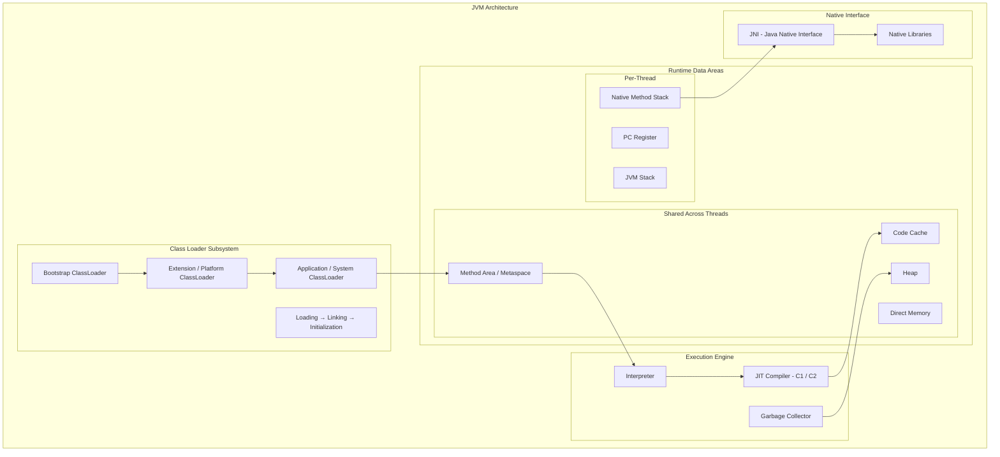
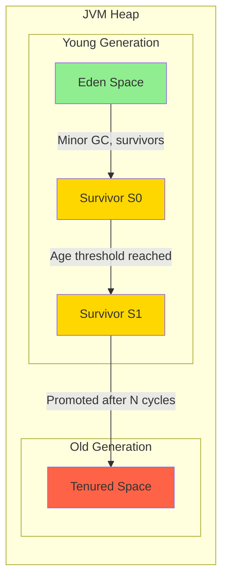
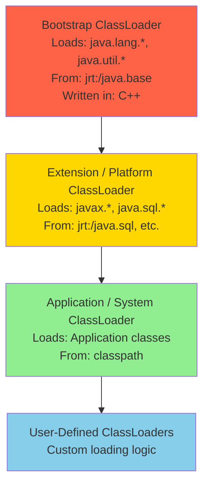
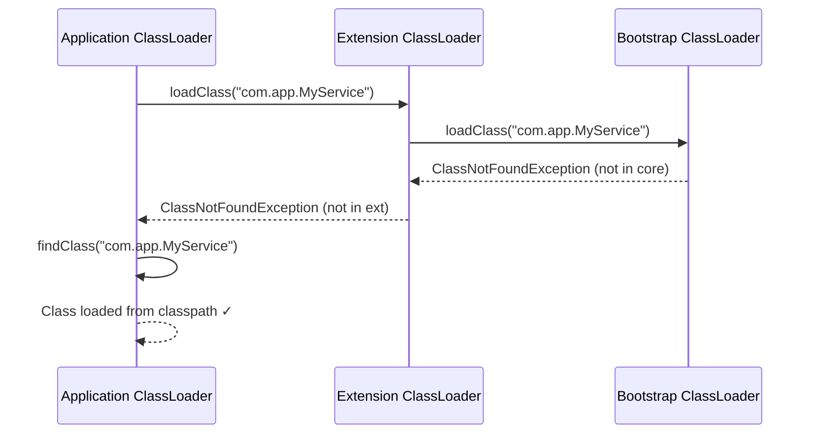
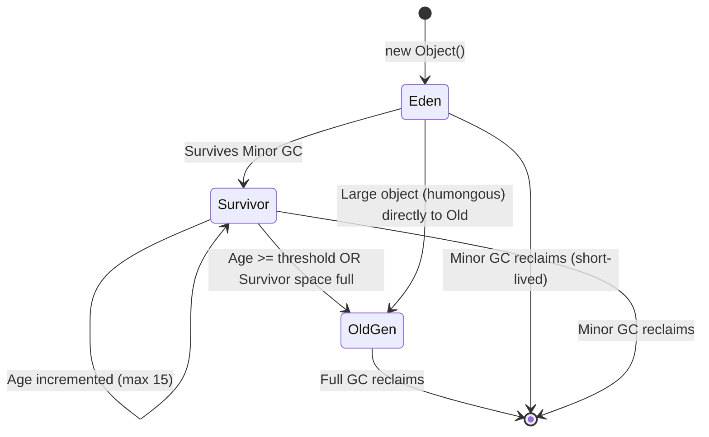
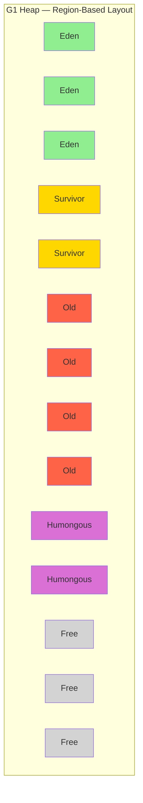

# Java Memory Model & JVM Internals — Complete Guide

> For senior engineers targeting Google, Meta, Amazon, Apple, Netflix, and top-tier systems roles.
> Covers JVM architecture, runtime data areas, GC algorithms, JMM semantics, class loading, and production diagnostics.

[← Previous: Multithreading & Concurrency](06-Java-Multithreading-and-Concurrency.md) | [Home](README.md) | [Next: Modern Features (8-21) →](08-Java-Modern-Features-8-to-21.md)

---

## Table of Contents

1. [JVM Architecture Deep Dive](#1-jvm-architecture-deep-dive)
2. [Runtime Data Areas](#2-runtime-data-areas)
3. [Object Memory Layout](#3-object-memory-layout)
4. [Class Loading](#4-class-loading)
5. [Linking](#5-linking)
6. [JIT Compilation](#6-jit-compilation)
7. [Garbage Collection Fundamentals](#7-garbage-collection-fundamentals)
8. [GC Algorithms](#8-gc-algorithms)
9. [GC Tuning](#9-gc-tuning)
10. [Memory Leaks](#10-memory-leaks)
11. [Java Memory Model (JMM)](#11-java-memory-model-jmm)
12. [Reference Types](#12-reference-types)
13. [Monitoring and Diagnostic Tools](#13-monitoring-and-diagnostic-tools)
14. [Interview-Focused Summary](#14-interview-focused-summary)

---

## 1. JVM Architecture Deep Dive

The Java Virtual Machine is an abstract computing machine that provides the runtime environment for Java bytecode. Understanding its internals is essential for writing performant, predictable software at scale.



### Component Overview

| Component | Role |
|-----------|------|
| **Class Loader Subsystem** | Loads `.class` files, verifies bytecode, resolves symbolic references, initializes classes |
| **Runtime Data Areas** | Memory regions managed by the JVM — heap, stack, method area, PC registers, native stack |
| **Execution Engine** | Interprets bytecode, JIT-compiles hot paths, runs garbage collection |
| **JNI** | Bridge between JVM and native code written in C/C++ |

The JVM specification defines the abstract behavior; implementations like **HotSpot** (Oracle/OpenJDK), **OpenJ9** (Eclipse), and **GraalVM** provide concrete implementations with different performance characteristics.

### Execution Flow

1. **javac** compiles `.java` → `.class` (bytecode)
2. Class loader subsystem loads the `.class` into memory
3. Bytecode verifier checks structural correctness
4. Interpreter begins executing bytecode instruction by instruction
5. JIT compiler identifies **hot methods** and compiles them to native machine code
6. GC reclaims memory for unreachable objects in the heap

> **Interview Tip:** Interviewers at Google/Meta often ask "Walk me through what happens from `java MyApp` to the first line of `main()` executing." Mention class loading, linking, initialization, and the interpreter.

---

## 2. Runtime Data Areas

### 2.1 Heap

The heap is the largest runtime data area and is shared across all threads. Every object instance and array is allocated here.



**Object Allocation Flow:**

1. New objects are allocated in **Eden** space (via thread-local allocation buffers — TLABs — for lock-free allocation)
2. When Eden fills up, a **Minor GC** is triggered
3. Surviving objects are copied to a **Survivor space** (S0 or S1, alternating)
4. Objects that survive enough Minor GC cycles (age threshold, default 15) are **promoted** to the **Old Generation**
5. When the Old Generation fills up, a **Major GC** or **Full GC** is triggered

```java
// Allocation example — all go to Eden initially
byte[] largeArray = new byte[1024 * 1024]; // 1 MB in Eden (or directly in Old if humongous)
List<String> list = new ArrayList<>();      // ArrayList header in Eden
String name = new String("data");           // String object in Eden
```

**Key sizing flags:**

- `-Xms` / `-Xmx`: initial / maximum heap size
- `-Xmn`: young generation size
- `-XX:NewRatio=2`: Old:Young ratio (default 2 means Old is 2x Young)
- `-XX:SurvivorRatio=8`: Eden:Survivor ratio (default 8 means Eden is 8x one Survivor)

### 2.2 Stack (JVM Stack)

Each thread gets its own JVM stack, created at thread creation time. The stack stores **stack frames** — one per method invocation.

```text
┌──────────────────────────────────────┐
│           Thread Stack               │
├──────────────────────────────────────┤
│  ┌────────────────────────────────┐  │
│  │ Frame: main()                  │  │
│  │  ├─ Local Variable Array       │  │
│  │  │   [0] this                  │  │
│  │  │   [1] args                  │  │
│  │  ├─ Operand Stack              │  │
│  │  │   (computation workspace)   │  │
│  │  └─ Frame Data                 │  │
│  │      (return addr, exception   │  │
│  │       table, constant pool ref)│  │
│  ├────────────────────────────────┤  │
│  │ Frame: processRequest()        │  │
│  │  ├─ Local Variable Array       │  │
│  │  ├─ Operand Stack              │  │
│  │  └─ Frame Data                 │  │
│  ├────────────────────────────────┤  │
│  │ Frame: handleData()            │  │
│  │  ├─ Local Variable Array       │  │
│  │  ├─ Operand Stack              │  │
│  │  └─ Frame Data                 │  │
│  └────────────────────────────────┘  │
└──────────────────────────────────────┘
```

**Stack Frame Components:**

| Component | Purpose |
|-----------|---------|
| **Local Variable Array** | Stores `this`, method parameters, and local variables. Indexed from 0. `long`/`double` occupy 2 slots. |
| **Operand Stack** | Working area for bytecode instructions. `iadd` pops two ints, pushes the sum. |
| **Frame Data** | Return address, reference to runtime constant pool, exception handler table. |

**StackOverflowError** occurs when the stack depth exceeds the limit (configurable with `-Xss`, default ~512KB-1MB depending on platform):

```java
// Classic StackOverflowError trigger
public void infiniteRecursion() {
    infiniteRecursion(); // each call adds a frame to the stack
}

// Fix: convert to iteration or add a base case
public long factorial(int n) {
    long result = 1;
    for (int i = 2; i <= n; i++) {
        result *= i;
    }
    return result;
}
```

### 2.3 Method Area / Metaspace

The **Method Area** stores per-class metadata:

- **Class structure**: field descriptors, method descriptors, access flags
- **Runtime Constant Pool**: literals, symbolic references resolved at link time
- **Method bytecode**: the actual bytecode for each method
- **Static variables**: class-level variables

**PermGen → Metaspace (Java 8):**

| Aspect | PermGen (Java ≤ 7) | Metaspace (Java ≥ 8) |
|--------|--------------------|-----------------------|
| **Location** | Inside the JVM heap | Native memory (OS) |
| **Default size** | 64-82 MB (fixed) | Unlimited (grows dynamically) |
| **OOM error** | `OutOfMemoryError: PermGen space` | `OutOfMemoryError: Metaspace` |
| **Tuning flag** | `-XX:MaxPermSize` | `-XX:MaxMetaspaceSize` |
| **GC** | Full GC collected it | Class metadata GC'd when classloader is GC'd |

```bash
# Limit metaspace to prevent unbounded native memory growth
java -XX:MaxMetaspaceSize=256m -XX:MetaspaceSize=128m MyApp
```

> **Interview Tip:** "Why was PermGen removed?" — PermGen had a fixed maximum size, making it hard to tune. Class metadata size depends on the application and is hard to predict. Metaspace uses native memory, auto-grows, and is bounded only by available system memory (unless `-XX:MaxMetaspaceSize` is set).

### 2.4 PC Register

Each thread has its own **Program Counter register** that holds the address of the currently executing JVM instruction. If the thread is executing a native method, the PC register is undefined.

- For non-native methods: points to the current bytecode instruction
- Used by the interpreter to know which instruction to execute next
- JIT-compiled code does not use the PC register (uses native CPU registers)

### 2.5 Native Method Stack

A per-thread stack used for native method invocations via **JNI**. When a Java method calls a `native` method, the JVM switches from the JVM stack to the native method stack.

```java
// System.currentTimeMillis() is a native method
public static native long currentTimeMillis();

// The JNI call transitions from JVM stack → Native Method Stack
```

Can also throw `StackOverflowError` or `OutOfMemoryError` if the native stack is exhausted.

### 2.6 Code Cache

Stores **JIT-compiled native code**. When the JIT compiler converts hot bytecode methods into optimized machine code, the result is stored in the code cache for fast re-execution.

```bash
# Code cache sizing
-XX:InitialCodeCacheSize=64m
-XX:ReservedCodeCacheSize=256m   # Max code cache size

# Segmented code cache (Java 9+): separates profiled, non-profiled, and non-method code
-XX:+SegmentedCodeCache
```

If the code cache fills up, the JIT compiler stops compiling new methods, and performance degrades silently. Monitor via `jcmd <pid> Compiler.codecache`.

### 2.7 Direct Memory (Off-Heap)

Allocated outside the JVM heap using `ByteBuffer.allocateDirect()`. Used for high-performance I/O to avoid copying data between JVM heap and native memory.

```java
// Allocate 64 MB of direct (off-heap) memory
ByteBuffer directBuffer = ByteBuffer.allocateDirect(64 * 1024 * 1024);

// Sizing flag
// -XX:MaxDirectMemorySize=512m
```

- Not managed by the GC directly — freed via `Cleaner` (phantom reference internally)
- Used extensively by **Netty**, **Kafka**, and **Cassandra** for zero-copy I/O
- `OutOfMemoryError: Direct buffer memory` if the limit is exceeded

---

## 3. Object Memory Layout

Every Java object in HotSpot JVM has three parts in memory:

```text
┌──────────────────────────────────────────────────────────┐
│                    Object Header                         │
│  ┌────────────────────────────────────────────────────┐  │
│  │ Mark Word (8 bytes on 64-bit)                      │  │
│  │  ├─ Identity hash code (31 bits)                   │  │
│  │  ├─ GC age (4 bits, max 15)                        │  │
│  │  ├─ Biased locking info (thread ID, epoch)         │  │
│  │  ├─ Lock state (2 bits: unlocked/biased/light/heavy)│  │
│  │  └─ GC forwarding pointer (during GC)              │  │
│  ├────────────────────────────────────────────────────┤  │
│  │ Klass Pointer (4 bytes compressed / 8 bytes)       │  │
│  │  └─ Points to class metadata in Metaspace          │  │
│  ├────────────────────────────────────────────────────┤  │
│  │ Array Length (4 bytes, only for arrays)             │  │
│  └────────────────────────────────────────────────────┘  │
├──────────────────────────────────────────────────────────┤
│                   Instance Data                          │
│  ├─ Fields laid out by type (longs, ints, shorts, etc.) │
│  ├─ Reference fields (4 bytes compressed / 8 bytes)     │
│  └─ Inherited fields from superclasses                  │
├──────────────────────────────────────────────────────────┤
│                    Padding                               │
│  └─ Pad to 8-byte boundary (object alignment)           │
└──────────────────────────────────────────────────────────┘
```

### Mark Word States (64-bit JVM)

| Lock State | Bits 0-1 | Content |
|-----------|----------|---------|
| **Unlocked** | 01 | Hash code, GC age |
| **Biased** | 01 (+ bias bit) | Thread ID, epoch, GC age |
| **Lightweight locked** | 00 | Pointer to lock record on stack |
| **Heavyweight locked** | 10 | Pointer to ObjectMonitor |
| **GC marked** | 11 | Forwarding address |

### Compressed Oops

On 64-bit JVMs with heap < 32 GB, **Compressed Ordinary Object Pointers** (`-XX:+UseCompressedOops`, enabled by default) shrink object references from 8 bytes to 4 bytes.

```text
Without compressed oops:  Reference = 8 bytes → addresses up to 2^64
With compressed oops:     Reference = 4 bytes → shifted by 3 bits → addresses up to 32 GB

// The JVM stores: actual_address >> 3 (since objects are 8-byte aligned)
// On access:      stored_value << 3  = actual_address
```

This reduces heap usage by 30-50% for reference-heavy applications.

### Estimating Object Size

```java
// Using JOL (Java Object Layout) — the standard tool
// Dependency: org.openjdk.jol:jol-core:0.17

import org.openjdk.jol.info.ClassLayout;

public class ObjectSizeDemo {
    int x;           // 4 bytes
    long y;          // 8 bytes
    boolean z;       // 1 byte
    Object ref;      // 4 bytes (compressed) or 8 bytes

    public static void main(String[] args) {
        System.out.println(ClassLayout.parseClass(ObjectSizeDemo.class).toPrintable());
        // Output shows: header (12 bytes) + fields + padding = total
        // Typical: 12 (header) + 4 (int) + 8 (long) + 1 (boolean) + 3 (padding)
        //          + 4 (ref) = 32 bytes
    }
}
```

> **Interview Tip:** "How much memory does `new Object()` use?" — On a 64-bit JVM with compressed oops: 12 bytes header + 4 bytes padding = **16 bytes**. Without compressed oops: 16 bytes header + 0 padding = **16 bytes**.

---

## 4. Class Loading

### 4.1 Built-in Class Loaders



| Class Loader | Loads | Source |
|-------------|-------|--------|
| **Bootstrap** | Core Java classes (`java.lang.*`, `java.util.*`) | `$JAVA_HOME/lib` (or `jrt:` in Java 9+) |
| **Extension / Platform** | Extension and platform modules | `$JAVA_HOME/lib/ext` (or platform modules in Java 9+) |
| **Application / System** | Application classes | `-classpath` / `-cp` / `CLASSPATH` |

### 4.2 Parent Delegation Model

When a class needs to be loaded, the class loader follows the **parent delegation model**:



**Why parent delegation?**

1. **Security**: prevents user code from replacing core classes (e.g., a malicious `java.lang.String`)
2. **Uniqueness**: ensures a class is loaded only once (same class loaded by different loaders = different Class objects)
3. **Consistency**: framework classes are always loaded by the same loader

### 4.3 Class Loading Phases

```text
Loading ──→ Linking ──→ Initialization
              │
              ├── Verification
              ├── Preparation
              └── Resolution
```

| Phase | What Happens |
|-------|-------------|
| **Loading** | Read `.class` file bytes, create `java.lang.Class` object |
| **Verification** | Check bytecode structural correctness, type safety, final class not subclassed |
| **Preparation** | Allocate memory for static fields, set to default values (0, null, false) |
| **Resolution** | Resolve symbolic references (class names, field names, method names) to direct references |
| **Initialization** | Execute `<clinit>` (static initializers and static blocks), guaranteed thread-safe and once-only |

### 4.4 Custom Class Loaders

```java
public class PluginClassLoader extends ClassLoader {

    private final Path pluginDir;

    public PluginClassLoader(Path pluginDir, ClassLoader parent) {
        super(parent);
        this.pluginDir = pluginDir;
    }

    @Override
    protected Class<?> findClass(String name) throws ClassNotFoundException {
        try {
            String fileName = name.replace('.', '/') + ".class";
            Path classFile = pluginDir.resolve(fileName);
            byte[] bytes = Files.readAllBytes(classFile);
            return defineClass(name, bytes, 0, bytes.length);
        } catch (IOException e) {
            throw new ClassNotFoundException("Could not load: " + name, e);
        }
    }
}

// Use cases:
// 1. Plugin systems (load/unload plugins at runtime)
// 2. Hot deployment (reload classes without restarting JVM)
// 3. Class isolation (different versions of the same library)
// 4. Encrypted class files (decrypt before defineClass)
```

### 4.5 Class.forName() vs ClassLoader.loadClass()

```java
// Class.forName() — loads, links, AND initializes the class
Class<?> clazz = Class.forName("com.mysql.cj.jdbc.Driver");
// Static initializer runs → driver registers with DriverManager

// ClassLoader.loadClass() — only loads the class (no initialization)
Class<?> clazz = ClassLoader.getSystemClassLoader().loadClass("com.mysql.cj.jdbc.Driver");
// Static initializer does NOT run yet

// Class.forName with explicit control
Class<?> clazz = Class.forName("com.mysql.cj.jdbc.Driver", false, classLoader);
// Second param: initialize=false → same as ClassLoader.loadClass()
```

### 4.6 Common Class Loading Issues

| Exception | Cause | When |
|-----------|-------|------|
| **ClassNotFoundException** | Class not found on classpath | Checked exception, thrown by `Class.forName()` or `ClassLoader.loadClass()` |
| **NoClassDefFoundError** | Class was found at compile time but missing at runtime, or static initializer failed | Runtime error, JVM cannot define the class |

```java
// ClassLoader leak example (common in app servers)
// Problem: a webapp classloader holds references that prevent GC
public class LeakyServlet extends HttpServlet {
    // ThreadLocal with webapp class reference prevents classloader GC on undeploy
    private static final ThreadLocal<MyCache> cache = ThreadLocal.withInitial(MyCache::new);

    // Fix: clean up in destroy()
    @Override
    public void destroy() {
        cache.remove();
    }
}
```

---

## 5. Linking

Linking connects a loaded class into the JVM's runtime state. It has three sub-phases:

### 5.1 Verification

The bytecode verifier ensures the `.class` file is structurally correct and type-safe:

- **Format check**: magic number `0xCAFEBABE`, valid constant pool entries
- **Semantic check**: `final` classes not subclassed, `final` methods not overridden
- **Bytecode verification**: stack map frames valid, no stack overflow/underflow, type-safe operations
- **Symbol table check**: referenced classes, fields, methods exist with correct access

```bash
# Skip verification (dangerous, only for trusted code in performance-critical scenarios)
java -Xverify:none MyApp        # Deprecated in Java 13
java -XX:-BytecodeVerificationLocal MyApp
```

### 5.2 Preparation

- Allocates memory for **static fields** of the class
- Sets fields to **default zero values** (not the programmer's assigned values)

```java
public class Config {
    static int timeout = 30;        // Preparation: timeout = 0
                                     // Initialization: timeout = 30
    static final int MAX = 100;     // Compile-time constant: inlined, set during preparation
    static final String NAME = computeName(); // Not a constant: set during initialization
}
```

### 5.3 Resolution

Converts **symbolic references** (names in the constant pool) to **direct references** (memory addresses or offsets).

```text
Symbolic reference:  "java/util/ArrayList.add:(Ljava/lang/Object;)Z"
                            ↓ Resolution ↓
Direct reference:    Method entry point at address 0x7f3a2b4c
```

Resolution can be **eager** (at link time) or **lazy** (on first use). HotSpot uses lazy resolution by default for better startup time.

---

## 6. JIT Compilation

### 6.1 Why Both Interpreter and JIT?

| Aspect | Interpreter | JIT Compiler |
|--------|------------|--------------|
| **Startup** | Fast (no compilation delay) | Slow (compilation overhead) |
| **Steady-state** | Slow (decode each instruction) | Fast (native machine code) |
| **Memory** | Low (no compiled code stored) | Higher (code cache usage) |
| **Profiling** | Collects execution profiles | Uses profiles for optimization |

The JVM starts by interpreting bytecode and profiles method execution. When a method becomes **hot** (exceeds invocation threshold), the JIT compiler compiles it to optimized native code.

### 6.2 C1 and C2 Compilers

| Compiler | Optimization Level | Compile Speed | Use Case |
|----------|-------------------|---------------|----------|
| **C1 (Client)** | Basic (inlining, simple optimizations) | Fast | Quick startup, client apps |
| **C2 (Server)** | Aggressive (escape analysis, vectorization) | Slow | Peak throughput, server apps |

### 6.3 Tiered Compilation

Default in modern JVMs (`-XX:+TieredCompilation`). Combines C1 and C2 for optimal warmup + peak performance.

```text
Level 0: Interpreter (collects invocation count)
Level 1: C1 compiled, no profiling (simple methods)
Level 2: C1 compiled, limited profiling (counters only)
Level 3: C1 compiled, full profiling (branch, type profiles)
Level 4: C2 compiled, aggressive optimizations (uses Level 3 profiles)
```

A method typically progresses: **Level 0 → Level 3 → Level 4**.

```bash
# Key JIT flags
-XX:CompileThreshold=10000       # Invocations before JIT (non-tiered)
-XX:+PrintCompilation            # Log JIT compilation events
-XX:-TieredCompilation           # Disable tiered, use only C2
-XX:+UnlockDiagnosticVMOptions -XX:+PrintInlining  # Show inlining decisions
```

### 6.4 Key JIT Optimizations

#### Method Inlining

Replaces a method call with the method body. Eliminates call overhead and enables further optimizations.

```java
// Before inlining
public int compute(int x) {
    return square(x) + 1;
}
private int square(int n) { return n * n; }

// After inlining (by JIT)
public int compute(int x) {
    return x * x + 1;  // square() body inlined
}
```

Controlled by `-XX:MaxInlineSize=35` (bytecode size threshold) and `-XX:FreqInlineSize=325` (for hot methods).

#### Escape Analysis

Determines if an object escapes the current method or thread. If it doesn't escape, the JIT can:

1. **Scalar replacement**: decompose the object into individual fields on the stack
2. **Lock elision**: remove synchronization on thread-local objects
3. **Stack allocation**: allocate the object on the stack instead of the heap

```java
public int sumPoints() {
    // Point does NOT escape this method
    Point p = new Point(3, 4);     // JIT can replace with two ints on the stack
    return p.x + p.y;              // No heap allocation, no GC pressure
}
```

#### Other Key Optimizations

| Optimization | Description |
|-------------|-------------|
| **Loop unrolling** | Replicates loop body to reduce branch overhead |
| **Dead code elimination** | Removes code whose result is never used |
| **Lock elision** | Removes locks on objects that don't escape the thread |
| **Lock coarsening** | Merges adjacent synchronized blocks on the same object |
| **On-stack replacement (OSR)** | Compiles a long-running loop mid-execution and switches to compiled code |
| **Null check elimination** | Removes redundant null checks after proving non-null |
| **Devirtualization** | Converts virtual method calls to direct calls when only one implementation exists |

### 6.5 GraalVM JIT Compiler

**Graal** is a JIT compiler written in Java (unlike C2 which is in C++) that can replace the C2 compiler:

```bash
# Use Graal as the JIT compiler (JDK 11-16 with JVMCI)
-XX:+UnlockExperimentalVMOptions -XX:+UseJVMCICompiler
```

Graal provides better optimizations for certain patterns (partial escape analysis, polymorphic inlining) and is the foundation for **GraalVM Native Image** (ahead-of-time compilation).

---

## 7. Garbage Collection Fundamentals

### 7.1 Why GC Exists

In C/C++, developers manually manage memory (`malloc`/`free`, `new`/`delete`), leading to:
- **Memory leaks**: forgetting to free memory
- **Dangling pointers**: using memory after it's freed
- **Double frees**: freeing the same memory twice

Java's automatic GC eliminates these categories of bugs at the cost of occasional **stop-the-world pauses**.

### 7.2 GC Roots

GC uses **reachability analysis** to determine which objects are alive. It starts from **GC roots** — objects that are always considered reachable:

| GC Root Type | Example |
|-------------|---------|
| **Local variables** | Variables on active thread stacks |
| **Active threads** | `Thread` objects that are alive |
| **Static fields** | `static` fields of loaded classes |
| **JNI references** | Objects referenced by native code |
| **Synchronized monitors** | Objects used as monitor locks |
| **JVM internal references** | Class objects, system class loader, exception objects |

### 7.3 Mark Phase and Reachability

```java
// Reachability example
Object a = new Object();  // a is reachable (local variable → GC root)
Object b = new Object();  // b is reachable
a = b;                     // the original object of 'a' is now UNREACHABLE → eligible for GC
b = null;                  // the object is still reachable through 'a'
```

### 7.4 Generational Hypothesis

> **"Most objects die young."**

Empirical observation: 80-98% of newly allocated objects become garbage very quickly. This insight drives generational GC design — separate young objects (frequent, cheap collection) from old objects (infrequent, expensive collection).

### 7.5 GC Types

| GC Type | Scope | Trigger |
|---------|-------|---------|
| **Minor GC** | Young generation only | Eden space full |
| **Major GC** | Old generation | Old gen occupancy threshold |
| **Full GC** | Entire heap + metaspace | `System.gc()`, metaspace full, promotion failure, concurrent mode failure |

### 7.6 Object Lifecycle Through Generations



### 7.7 Stop-the-World and Safepoints

**Stop-the-world (STW)**: All application threads are paused during certain GC phases (e.g., root scanning, compaction). No application code executes.

**Safepoints**: Specific points in code where the JVM can safely pause a thread. Threads must reach a safepoint before a STW pause can begin.

Safepoint locations:
- Method returns
- Loop back-edges (with exceptions for counted loops)
- Allocation sites
- JNI call transitions

```bash
# Log safepoint activity
-XX:+PrintSafepointStatistics
-Xlog:safepoint
```

> **Interview Tip:** "What is a safepoint?" — A point in the program execution where the JVM can safely examine and modify the thread state, including its stack. All threads must reach a safepoint before a GC STW pause can begin. A long-running counted loop without a safepoint poll can delay GC pauses for all threads — known as a "safepoint bias" or "time-to-safepoint" issue.

---

## 8. GC Algorithms

### 8.1 Serial GC

```bash
-XX:+UseSerialGC
```

- **Single-threaded** mark-sweep-compact for both young and old generations
- Full STW during collection
- Lowest footprint, simplest implementation
- Suitable for: single-core machines, small heaps (< 100 MB), containers with 1 CPU

### 8.2 Parallel GC (Throughput Collector)

```bash
-XX:+UseParallelGC          # Default before Java 9
-XX:ParallelGCThreads=8     # Number of GC threads
```

- **Multi-threaded** mark-sweep-compact
- Maximizes **throughput** (ratio of app time to GC time)
- Full STW during collection (but shorter pauses than Serial due to parallelism)
- Suitable for: batch processing, offline analytics, throughput-sensitive apps

### 8.3 CMS (Concurrent Mark Sweep)

```bash
-XX:+UseConcMarkSweepGC     # Deprecated Java 9, removed Java 14
```

Phases:
1. **Initial Mark (STW)**: mark direct GC root references
2. **Concurrent Mark**: trace object graph concurrently with app threads
3. **Remark (STW)**: fix changes made during concurrent mark (using card table / SATB)
4. **Concurrent Sweep**: reclaim garbage concurrently

**Problem**: no compaction → **memory fragmentation** → eventually falls back to a full STW compacting GC (`Concurrent Mode Failure`).

### 8.4 G1 GC (Garbage-First)

```bash
-XX:+UseG1GC                    # Default since Java 9
-XX:MaxGCPauseMillis=200        # Target pause time (default 200ms)
-XX:G1HeapRegionSize=4m         # Region size (1MB - 32MB, power of 2)
```



**Key concepts:**
- Heap divided into **equal-sized regions** (1-32 MB each, typically 2048 regions)
- Regions dynamically assigned as Eden, Survivor, Old, or Humongous
- **Humongous objects**: objects > 50% of a region go directly to humongous regions
- **Mixed collections**: collect young + selectively collect old regions with highest garbage density (hence "Garbage-First")
- **Remembered sets (RSet)**: track cross-region references for incremental collection
- **SATB (Snapshot-at-the-Beginning)**: concurrent marking algorithm

**G1 Collection Phases:**
1. Young-only GC: evacuate Eden + Survivor regions (STW)
2. Concurrent marking cycle: identify old regions with lots of garbage
3. Mixed GC: evacuate young + selected old regions (STW)
4. Full GC (fallback): if mixed GC can't keep up

### 8.5 ZGC

```bash
-XX:+UseZGC                     # Production-ready since Java 15
-XX:+ZGenerational              # Generational ZGC (Java 21+, default in Java 23+)
```

- **Sub-millisecond pauses** (typically < 1ms) regardless of heap size
- Scalable to **multi-terabyte heaps** (up to 16 TB)
- **Colored pointers**: metadata stored in unused bits of 64-bit object pointers
- **Load barriers**: intercept object reference loads to handle relocated objects transparently
- All heavy work (marking, relocation, reference processing) is concurrent
- Only brief STW pauses for root scanning

### 8.6 Shenandoah

```bash
-XX:+UseShenandoahGC            # Available in OpenJDK (not in Oracle JDK)
```

- **Concurrent compaction** (unlike CMS which couldn't compact)
- **Brooks forwarding pointer**: extra word in every object header pointing to the current copy
- When an object is relocated, the forwarding pointer is updated atomically
- Read/write barriers handle concurrent relocation
- Low-pause alternative to G1, similar goals as ZGC

### 8.7 GC Algorithm Comparison

| GC Algorithm | Pause Time | Throughput | Heap Size | Best Use Case |
|-------------|-----------|-----------|----------|---------------|
| **Serial** | High (100s ms) | Low | < 100 MB | Single-core, small apps, containers |
| **Parallel** | Medium (100s ms) | **Highest** | 1-8 GB | Batch processing, throughput priority |
| **CMS** | Low-Medium | Medium | 1-8 GB | *(Deprecated)* Legacy low-latency |
| **G1** | Medium-Low (< 200ms) | High | 4-64 GB | General-purpose server apps |
| **ZGC** | **Ultra-low** (< 1ms) | High | 8 GB - 16 TB | Latency-critical, large heaps |
| **Shenandoah** | **Ultra-low** (< 10ms) | High | 4-64 GB | Low-latency (OpenJDK only) |

> **Interview Tip:** "Which GC would you choose for a real-time trading system?" — ZGC or Shenandoah for sub-millisecond pauses. "For a batch data pipeline?" — Parallel GC for maximum throughput. "For a general microservice?" — G1 GC (the default) is usually the right starting point.

---

## 9. GC Tuning

### 9.1 Key JVM Flags

| Flag | Description | Default |
|------|-------------|---------|
| `-Xms` | Initial heap size | 1/64 of physical memory |
| `-Xmx` | Maximum heap size | 1/4 of physical memory |
| `-Xmn` | Young generation size | Varies by GC |
| `-Xss` | Thread stack size | 512KB-1MB (platform-dependent) |
| `-XX:NewRatio=N` | Old:Young ratio (e.g., 2 means Old = 2× Young) | 2 |
| `-XX:SurvivorRatio=N` | Eden:Survivor ratio (e.g., 8 means Eden = 8× one Survivor) | 8 |
| `-XX:MaxGCPauseMillis=N` | Target max GC pause (G1/ZGC) | 200ms (G1) |
| `-XX:GCTimeRatio=N` | Throughput goal: app time / GC time ≥ N (Parallel GC) | 99 |
| `-XX:MaxTenuringThreshold=N` | Max GC age before promotion to Old gen | 15 |
| `-XX:+UseCompressedOops` | Compress object pointers (heap < 32 GB) | Enabled (heap < 32 GB) |
| `-XX:MaxMetaspaceSize=N` | Limit metaspace growth | Unlimited |
| `-XX:MaxDirectMemorySize=N` | Limit direct (off-heap) memory | Same as `-Xmx` |
| `-XX:+AlwaysPreTouch` | Touch all heap pages at startup (avoid page faults later) | Disabled |
| `-XX:+UseNUMA` | NUMA-aware memory allocation | Disabled |

### 9.2 Choosing Heap Size

```text
Too small  → Frequent GCs, high pause overhead, OutOfMemoryError
Too large  → Long GC pauses (more to scan), wasted memory, OS swapping risk
Sweet spot → 2-4× live data set size, GC overhead < 5%
```

**Production rule of thumb:**

```bash
# Step 1: Measure live data set (objects surviving Full GC)
# Step 2: Set heap to 3-4× live data set
# Step 3: Set young gen to 1-1.5× live data set
java -Xms4g -Xmx4g -Xmn1g -XX:+UseG1GC -XX:MaxGCPauseMillis=100 MyApp
```

Set `-Xms` = `-Xmx` in production to avoid heap resizing overhead. Use `-XX:+AlwaysPreTouch` to fault all pages at startup.

### 9.3 GC Log Analysis

```bash
# Java 9+ unified logging
java -Xlog:gc*:file=gc.log:time,uptime,level,tags:filecount=5,filesize=10m MyApp

# Key metrics to watch:
# 1. Pause time: how long application was stopped
# 2. Throughput: % of time spent in application vs GC
# 3. Allocation rate: MB/s of new object allocation
# 4. Promotion rate: MB/s promoted from Young → Old
# 5. Heap occupancy: after GC, how full is the heap?
```

**Sample G1 GC log entry:**

```text
[2024-01-15T10:23:45.123+0000][gc] GC(42) Pause Young (Normal)
  (G1 Evacuation Pause) 1024M->256M(4096M) 12.345ms
       ↑ before   ↑ after  ↑ total    ↑ pause time
```

### 9.4 Common Tuning Patterns

| Problem | Symptom | Solution |
|---------|---------|----------|
| High allocation rate | Frequent Minor GCs | Reduce object creation (reuse, pooling, primitives) |
| Premature promotion | Objects promoted too early, Old gen fills fast | Increase young gen size or survivor ratio |
| Humongous allocations (G1) | Full GC triggered by humongous objects | Increase region size (`-XX:G1HeapRegionSize`) |
| Long Full GC pauses | App freezes for seconds | Switch to ZGC/Shenandoah, or tune G1 pause target |
| Metaspace growth | `OutOfMemoryError: Metaspace` | Set `-XX:MaxMetaspaceSize`, fix class loader leaks |

---

## 10. Memory Leaks

### 10.1 What Is a Memory Leak in Java?

In Java, a memory leak occurs when objects remain **reachable** (preventing GC) but are **no longer needed** by the application. The GC cannot reclaim them because it can only collect unreachable objects.

### 10.2 Common Causes

#### Static Collections Growing Unbounded

```java
public class MetricsCollector {
    // Leak: this list grows forever, never cleared
    private static final List<Metric> allMetrics = new ArrayList<>();

    public void record(Metric m) {
        allMetrics.add(m);
    }

    // Fix: use a bounded structure or evict old entries
    private static final Queue<Metric> metrics = new ArrayDeque<>(10_000) {
        @Override
        public boolean add(Metric m) {
            if (size() >= 10_000) poll();
            return super.add(m);
        }
    };
}
```

#### Listener / Callback References Not Removed

```java
public class EventBus {
    private final List<EventListener> listeners = new ArrayList<>();

    public void register(EventListener listener) {
        listeners.add(listener);
    }

    // Leak: if unregister() is never called, listener objects are retained forever
    public void unregister(EventListener listener) {
        listeners.remove(listener);
    }
}
```

#### ThreadLocal Not Cleaned in Thread Pools

```java
public class RequestContext {
    // Leak: thread pool threads are reused, ThreadLocal values persist across requests
    private static final ThreadLocal<UserSession> session = new ThreadLocal<>();

    public void handleRequest(Request req) {
        try {
            session.set(loadSession(req));
            processRequest(req);
        } finally {
            session.remove(); // CRITICAL: always remove in finally block
        }
    }
}
```

#### Inner Classes Holding Outer Class Reference

```java
public class DataProcessor {
    private byte[] largeBuffer = new byte[10 * 1024 * 1024]; // 10 MB

    // Leak: non-static inner class holds implicit reference to DataProcessor
    public Runnable createTask() {
        return new Runnable() {
            @Override
            public void run() {
                System.out.println("Processing...");
                // This Runnable retains 'DataProcessor.this' → retains largeBuffer
            }
        };
    }

    // Fix: use a static inner class or lambda (which captures only what it uses)
    public Runnable createTaskFixed() {
        return () -> System.out.println("Processing..."); // no outer class reference
    }
}
```

#### Cache Without Eviction

```java
// Leak: unbounded cache
Map<String, Bitmap> imageCache = new HashMap<>();

// Fix 1: WeakHashMap (entries removed when keys are no longer referenced)
Map<String, Bitmap> imageCache = new WeakHashMap<>();

// Fix 2: LRU cache with bounded size (e.g., using LinkedHashMap)
Map<String, Bitmap> lruCache = new LinkedHashMap<>(100, 0.75f, true) {
    @Override
    protected boolean removeEldestEntry(Map.Entry<String, Bitmap> eldest) {
        return size() > MAX_CACHE_SIZE;
    }
};

// Fix 3: Caffeine or Guava cache with explicit eviction policy
Cache<String, Bitmap> cache = Caffeine.newBuilder()
    .maximumSize(1000)
    .expireAfterWrite(Duration.ofMinutes(10))
    .build();
```

#### Other Common Causes

- **ClassLoader leaks**: webapp redeploy retains old classloader via static references, ThreadLocals, or shutdown hooks
- **Unclosed resources**: connections, streams, `ResultSet` objects not closed in finally/try-with-resources
- **String.substring() in JDK < 7u6**: shared the original char array, holding a reference to the full string
- **Interned strings**: `String.intern()` on dynamic data fills the string pool

### 10.3 Detection and Diagnosis

```bash
# Capture heap dump
jmap -dump:live,format=b,file=heap.hprof <pid>
# Or trigger on OOM
java -XX:+HeapDumpOnOutOfMemoryError -XX:HeapDumpPath=/var/dumps/ MyApp

# Analyze with Eclipse MAT (Memory Analyzer Tool)
# Key views:
# 1. Dominator tree — largest retained objects
# 2. Leak suspects report — automatic leak detection
# 3. Histogram — object count by class
# 4. Path to GC roots — why an object is retained

# Quick histogram (no full dump)
jmap -histo:live <pid> | head -30
```

### 10.4 Prevention Strategies

1. **Use try-with-resources** for all `AutoCloseable` resources
2. **Always `remove()` ThreadLocals** in `finally` blocks
3. **Use bounded collections** (max size, eviction policies)
4. **Prefer static inner classes** over non-static when outer reference isn't needed
5. **Unregister listeners** in lifecycle methods (`destroy()`, `close()`, `@PreDestroy`)
6. **Monitor heap usage** in production (alerts on growing Old Gen)
7. **Regular heap dump analysis** in CI/staging environments

---

## 11. Java Memory Model (JMM)

The **Java Memory Model** (JSR-133, refined in Java 5) defines the rules for how threads interact through memory: **visibility**, **atomicity**, and **ordering** of operations.

### 11.1 The Visibility Problem

```text
┌───────────────┐         ┌───────────────┐
│   Thread 1    │         │   Thread 2    │
│  ┌─────────┐  │         │  ┌─────────┐  │
│  │CPU Cache │  │         │  │CPU Cache │  │
│  │ x = 42   │  │         │  │ x = 0    │  │  ← stale value!
│  └─────────┘  │         │  └─────────┘  │
└───────┬───────┘         └───────┬───────┘
        │                         │
        ▼                         ▼
┌─────────────────────────────────────────┐
│           Main Memory (RAM)             │
│               x = ???                   │
│       (may or may not be 42 yet)        │
└─────────────────────────────────────────┘
```

Without proper synchronization:
- Thread 1 writes `x = 42` — value may stay in Thread 1's CPU cache (store buffer)
- Thread 2 reads `x` — may see the old value `0` from its own CPU cache
- This is **not** a bug in the JVM; it's a hardware optimization that the JMM exposes

### 11.2 Happens-Before Relationship

The **happens-before** (HB) relationship is the foundation of the JMM. If action A happens-before action B, then the effects of A are guaranteed to be visible to B.

**All 8 Happens-Before Rules:**

| # | Rule | Description |
|---|------|-------------|
| 1 | **Program Order** | Within a single thread, each action HB every subsequent action |
| 2 | **Monitor Lock** | An `unlock` on a monitor HB every subsequent `lock` on the same monitor |
| 3 | **Volatile Variable** | A `write` to a volatile field HB every subsequent `read` of that field |
| 4 | **Thread Start** | `thread.start()` HB any action in the started thread |
| 5 | **Thread Join** | Any action in a thread HB the return of `join()` on that thread |
| 6 | **Thread Interrupt** | `thread.interrupt()` HB detection of interrupt (`isInterrupted()`, `InterruptedException`) |
| 7 | **Finalizer** | End of constructor HB start of `finalize()` |
| 8 | **Transitivity** | If A HB B and B HB C, then A HB C |

```java
// Happens-before via volatile
volatile boolean ready = false;
int value = 0;

// Thread 1
value = 42;           // (A)
ready = true;         // (B) volatile write

// Thread 2
if (ready) {          // (C) volatile read — happens-after (B)
    // By volatile HB rule: (B) HB (C)
    // By program order: (A) HB (B)
    // By transitivity: (A) HB (C)
    // Therefore: value is guaranteed to be 42 here
    assert value == 42; // always true
}
```

### 11.3 Instruction Reordering

Both the compiler and CPU may reorder instructions for performance, as long as the **single-thread semantics** (as-if-serial) are preserved. However, reordering can break multi-threaded correctness.

```java
// Original code
int a = 1;     // (1)
int b = 2;     // (2)
int c = a + b; // (3)

// Compiler/CPU may reorder (1) and (2) since they are independent
// But (3) cannot be moved before (1) or (2) because of data dependency

// Cross-thread reordering problem:
// Thread 1              Thread 2
// x = 1;               y = 1;
// r1 = y;              r2 = x;
// Result: r1 == 0 AND r2 == 0 is POSSIBLE due to reordering!
```

### 11.4 Double-Checked Locking

```java
// BROKEN — before Java 5 or without volatile
public class BrokenSingleton {
    private static BrokenSingleton instance;

    public static BrokenSingleton getInstance() {
        if (instance == null) {                    // First check (no lock)
            synchronized (BrokenSingleton.class) {
                if (instance == null) {            // Second check (with lock)
                    instance = new BrokenSingleton();
                    // Problem: the constructor may not have completed
                    // when 'instance' becomes non-null due to reordering:
                    //   1. Allocate memory
                    //   2. Assign reference to 'instance' ← reordered before (3)!
                    //   3. Call constructor
                    // Another thread sees non-null instance with uninitialized fields
                }
            }
        }
        return instance;
    }
}

// CORRECT — volatile prevents reordering around the write
public class CorrectSingleton {
    private static volatile CorrectSingleton instance;

    public static CorrectSingleton getInstance() {
        if (instance == null) {
            synchronized (CorrectSingleton.class) {
                if (instance == null) {
                    instance = new CorrectSingleton();
                    // volatile write ensures full construction HB reference publication
                }
            }
        }
        return instance;
    }

    // Even better: use an enum or holder class
    private static class Holder {
        static final CorrectSingleton INSTANCE = new CorrectSingleton();
    }
    public static CorrectSingleton getInstanceV2() {
        return Holder.INSTANCE; // lazy, thread-safe, no synchronization needed
    }
}
```

### 11.5 Final Field Semantics

The JMM guarantees that once a constructor completes, any `final` fields are visible to all threads without synchronization — this is called the **freeze action**.

```java
public class ImmutableConfig {
    private final Map<String, String> settings;

    public ImmutableConfig(Map<String, String> source) {
        // The JMM guarantees that 'settings' is fully populated
        // before any other thread can see this object
        this.settings = Collections.unmodifiableMap(new HashMap<>(source));
    }

    public String get(String key) {
        return settings.get(key); // safe without synchronization
    }
}

// IMPORTANT: final field guarantee only works if 'this' does not escape
// during construction. Leaking 'this' in the constructor breaks the guarantee.
public class Broken {
    final int value;

    public Broken() {
        // BAD: 'this' escapes before construction completes
        GlobalRegistry.register(this);
        this.value = 42;
    }
}
```

### 11.6 Atomicity

The JMM guarantees atomicity for:
- Reads and writes of reference variables
- Reads and writes of all primitive types except `long` and `double`
- Reads and writes of `volatile long` and `volatile double`

```java
// NOT atomic (on 32-bit JVMs)
long counter = 0;
// Thread 1: counter = 0xFFFFFFFF_00000000L;
// Thread 2 might read a partially updated value (torn read)

// Atomic
volatile long counter = 0; // volatile guarantees atomicity for long/double

// For compound operations (read-modify-write), use AtomicLong
AtomicLong atomicCounter = new AtomicLong(0);
atomicCounter.incrementAndGet(); // atomic CAS-based increment
```

---

## 12. Reference Types

Java provides four reference types with different GC behavior, enabling fine-grained control over object lifecycle.

### 12.1 Strong Reference

```java
Object obj = new Object(); // strong reference — GC will NEVER collect while reachable
obj = null;                 // now eligible for GC
```

### 12.2 Soft Reference

```java
// Cleared only when memory is low (before OutOfMemoryError is thrown)
SoftReference<byte[]> cacheEntry = new SoftReference<>(new byte[10 * 1024 * 1024]);

byte[] data = cacheEntry.get();
if (data != null) {
    // use cached data
} else {
    // cache was cleared by GC under memory pressure — reload
    data = loadFromDisk();
    cacheEntry = new SoftReference<>(data);
}
```

- Ideal for **memory-sensitive caches**
- JVM clears soft references using a LRU-like policy: `-XX:SoftRefLRUPolicyMSPerMB=1000`
- Cleared **before** `OutOfMemoryError` is thrown

### 12.3 Weak Reference

```java
// Cleared at the NEXT GC, regardless of memory pressure
WeakReference<ExpensiveObject> weakRef = new WeakReference<>(new ExpensiveObject());

ExpensiveObject obj = weakRef.get();
if (obj != null) {
    obj.use();
} else {
    // object was already GC'd
}
```

**WeakHashMap** — keys are weak references; entries are automatically removed when keys are GC'd:

```java
// Commonly used for metadata/caches associated with objects
WeakHashMap<ClassLoader, CacheData> classLoaderCaches = new WeakHashMap<>();
// When a ClassLoader is GC'd, its cache entry is automatically removed
```

### 12.4 Phantom Reference

```java
// NEVER returns the referent (get() always returns null)
// Used for post-mortem cleanup actions via ReferenceQueue
ReferenceQueue<LargeResource> queue = new ReferenceQueue<>();
PhantomReference<LargeResource> phantom =
    new PhantomReference<>(new LargeResource(), queue);

// Cleanup thread
new Thread(() -> {
    while (true) {
        try {
            Reference<?> ref = queue.remove(); // blocks until a phantom ref is enqueued
            // The referent has been finalized and is about to be reclaimed
            cleanupNativeResource(ref);
            ref.clear();
        } catch (InterruptedException e) {
            Thread.currentThread().interrupt();
            break;
        }
    }
}).start();
```

**Cleaner API (Java 9+)** — preferred over phantom references for cleanup:

```java
public class NativeBuffer implements AutoCloseable {
    private static final Cleaner CLEANER = Cleaner.create();

    private final long nativePointer;
    private final Cleaner.Cleanable cleanable;

    public NativeBuffer(int size) {
        this.nativePointer = allocateNative(size);
        this.cleanable = CLEANER.register(this, new CleanupAction(nativePointer));
    }

    @Override
    public void close() {
        cleanable.clean(); // explicit cleanup
    }

    private static class CleanupAction implements Runnable {
        private final long pointer;
        CleanupAction(long pointer) { this.pointer = pointer; }

        @Override
        public void run() {
            freeNative(pointer); // release native memory
        }
    }
}
```

### 12.5 Reference Types Comparison

| Property | Strong | Soft | Weak | Phantom |
|----------|--------|------|------|---------|
| **get() returns** | Object | Object or null | Object or null | **Always null** |
| **GC behavior** | Never collected | Cleared before OOM | Cleared at next GC | Enqueued after finalization |
| **Use case** | Normal references | Memory-sensitive caches | Canonical mappings, metadata | Native resource cleanup |
| **ReferenceQueue** | N/A | Optional | Optional | **Required** |
| **Example** | Regular variables | Image cache | WeakHashMap | Cleaner, DirectByteBuffer |

> **Interview Tip:** "When would you use each reference type?" — Strong is default. Soft for caches that should survive as long as memory allows. Weak for auxiliary data tied to object identity (like classloader caches). Phantom for cleanup of native resources after the Java object is GC'd (replacement for `finalize()`).

---

## 13. Monitoring and Diagnostic Tools

### 13.1 Command-Line Tools

#### jps — List JVM Processes

```bash
$ jps -lv
12345 com.example.MyApp -Xmx4g -XX:+UseG1GC
12678 sun.tools.jps.Jps
```

#### jstat — GC and Class Loading Statistics

```bash
# GC utilization (percentage of each space used)
$ jstat -gcutil <pid> 1000 10    # every 1s, 10 samples
  S0     S1     E      O      M     CCS    YGC   YGCT    FGC   FGCT    CGC   CGCT     GCT
  0.00  45.23  67.89  34.56  97.12  94.56   142   1.234    3   0.567    12   0.089   1.890

# Column meanings:
# S0/S1  — Survivor space 0/1 utilization %
# E      — Eden space utilization %
# O      — Old generation utilization %
# M      — Metaspace utilization %
# YGC    — Young GC count
# YGCT   — Young GC total time (seconds)
# FGC    — Full GC count
# FGCT   — Full GC total time (seconds)
```

#### jmap — Heap Dumps and Histograms

```bash
# Heap dump (for offline analysis with MAT)
$ jmap -dump:live,format=b,file=heap_dump.hprof <pid>

# Object histogram (quick top-N memory consumers)
$ jmap -histo:live <pid> | head -20
 num     #instances         #bytes  class name
   1:       2345678       93827120  [B           (byte arrays)
   2:       1234567       29629608  java.lang.String
   3:        567890       18172480  java.util.HashMap$Node
```

#### jstack — Thread Dumps

```bash
$ jstack <pid> > thread_dump.txt

# Key patterns to look for:
# - BLOCKED threads (deadlock potential)
# - WAITING/TIMED_WAITING threads (resource contention)
# - "Found one Java-level deadlock:" section

# Force thread dump (even if JVM is hung)
$ jstack -F <pid>
```

#### jcmd — Unified Diagnostic Commands

```bash
# List available commands for a JVM process
$ jcmd <pid> help

# View all VM flags (including defaults)
$ jcmd <pid> VM.flags -all

# Heap information
$ jcmd <pid> GC.heap_info

# Trigger GC
$ jcmd <pid> GC.run

# Heap dump
$ jcmd <pid> GC.heap_dump /tmp/heap.hprof

# Start Java Flight Recorder
$ jcmd <pid> JFR.start name=recording duration=60s filename=/tmp/recording.jfr

# Thread dump
$ jcmd <pid> Thread.print
```

#### jinfo — View/Modify JVM Flags

```bash
# View a specific flag
$ jinfo -flag MaxHeapSize <pid>
-XX:MaxHeapSize=4294967296

# Modify a manageable flag at runtime
$ jinfo -flag +HeapDumpOnOutOfMemoryError <pid>
```

### 13.2 GUI and Profiling Tools

#### VisualVM

Free tool for real-time monitoring:
- CPU and memory usage graphs
- Thread visualization (state, count, deadlock detection)
- Heap dump analysis
- Profiling (CPU sampling and memory allocation)
- Plugin support (GC viewer, MBeans, etc.)

```bash
# Launch
$ visualvm
# Or attach to remote JVM with JMX
$ java -Dcom.sun.management.jmxremote.port=9090 \
       -Dcom.sun.management.jmxremote.authenticate=false \
       -Dcom.sun.management.jmxremote.ssl=false MyApp
```

#### Java Flight Recorder (JFR)

Low-overhead (< 2%) continuous profiling built into the JVM:

```bash
# Start with JFR enabled
$ java -XX:StartFlightRecording=duration=60s,filename=app.jfr MyApp

# Or attach to running JVM
$ jcmd <pid> JFR.start name=profile duration=120s filename=/tmp/profile.jfr

# Continuous recording (ring buffer, dump on demand)
$ java -XX:StartFlightRecording=disk=true,maxage=1h,maxsize=1g,dumponexit=true,filename=continuous.jfr MyApp
```

JFR captures: GC events, thread activity, I/O operations, lock contention, allocation profiling, CPU usage, exceptions, class loading, JIT compilation events.

#### Java Mission Control (JMC)

Desktop application for analyzing JFR recordings:
- Automated analysis with rule-based insights
- GC visualization
- Thread and lock analysis
- Memory allocation flame graphs
- Method profiling

#### async-profiler

Low-overhead CPU and allocation profiler (no safepoint bias):

```bash
# CPU profiling
$ ./profiler.sh -d 30 -f cpu_profile.html <pid>

# Allocation profiling
$ ./profiler.sh -e alloc -d 30 -f alloc_profile.html <pid>

# Generate flame graph
$ ./profiler.sh -d 60 -f flamegraph.svg <pid>
```

### 13.3 Tools Decision Table

| Need | Tool | Why |
|------|------|-----|
| Quick process list | `jps` | Minimal, just lists JVMs |
| GC behavior overview | `jstat -gcutil` | Real-time GC stats without overhead |
| Memory leak investigation | `jmap` + **Eclipse MAT** | Heap dump + dominator tree analysis |
| Deadlock detection | `jstack` | Thread dump with deadlock detection |
| Production profiling | **JFR** + **JMC** | < 2% overhead, rich event data |
| CPU hotspot analysis | **async-profiler** | No safepoint bias, flame graphs |
| Real-time monitoring | **VisualVM** | Visual dashboards, plugin ecosystem |
| Runtime flag inspection | `jcmd` / `jinfo` | View/modify flags without restart |
| Comprehensive diagnostics | `jcmd` | Unified interface to all diagnostic commands |

> **Interview Tip:** "How would you diagnose a production memory leak?" — (1) Enable `-XX:+HeapDumpOnOutOfMemoryError` proactively, (2) capture heap dump with `jmap -dump:live` or `jcmd`, (3) analyze with Eclipse MAT dominator tree to find the largest retained objects, (4) trace path to GC roots to identify why objects aren't being collected, (5) check for common patterns: static collections, ThreadLocals, unclosed resources.

---

## 14. Interview-Focused Summary

### Rapid-Fire Q&A

| # | Question | Key Answer |
|---|----------|-----------|
| 1 | What are the main components of JVM architecture? | Class Loader Subsystem, Runtime Data Areas (Heap, Stack, Method Area, PC Register, Native Stack), Execution Engine (Interpreter, JIT, GC), JNI |
| 2 | Explain heap structure and generations | Young Gen (Eden + S0 + S1) for new objects; Old Gen (Tenured) for long-lived. Objects promoted after surviving N minor GCs |
| 3 | What causes StackOverflowError? | Stack depth exceeds limit (default ~512KB-1MB). Usually infinite/deep recursion. Fix: increase `-Xss` or convert to iteration |
| 4 | What is Metaspace? | Replaced PermGen in Java 8. Stores class metadata in native memory. Auto-grows (bound with `-XX:MaxMetaspaceSize`) |
| 5 | How does class loading delegation work? | Child classloader asks parent first (Bootstrap → Extension → Application). Parent tries to load; only if it can't, child tries. Prevents core class spoofing |
| 6 | Difference between ClassNotFoundException and NoClassDefFoundError? | CNFE: class not found on classpath (checked exception). NCDFE: class found at compile time but missing/failed at runtime (Error) |
| 7 | Explain G1 GC regions | Heap divided into equal-sized regions (1-32 MB). Regions dynamically assigned as Eden/Survivor/Old/Humongous. G1 collects regions with most garbage first |
| 8 | What is ZGC? | Ultra-low-latency GC with < 1ms pauses. Uses colored pointers and load barriers. Scales to 16 TB heaps. Production-ready since Java 15 |
| 9 | Serial vs Parallel vs G1 — when to use each? | Serial: tiny heaps, 1 CPU. Parallel: batch jobs, max throughput. G1: general-purpose servers, predictable pauses |
| 10 | What are GC roots? | Starting points for reachability analysis: local variables, active threads, static fields, JNI references, synchronized monitors |
| 11 | Explain happens-before | JMM rule: if A HB B, effects of A are visible to B. Established by synchronized, volatile, thread start/join, and transitivity |
| 12 | Why was double-checked locking broken? | Without volatile, JVM can reorder constructor and reference assignment. Thread 2 sees non-null reference to incompletely constructed object |
| 13 | Strong vs Soft vs Weak vs Phantom reference? | Strong: never GC'd. Soft: GC'd before OOM (caches). Weak: GC'd at next collection (WeakHashMap). Phantom: post-mortem cleanup (Cleaner) |
| 14 | How to detect a memory leak? | Heap dump (`jmap`/`jcmd`) + Eclipse MAT. Look at dominator tree, path to GC roots. Monitor Old Gen growth over time with `jstat` |
| 15 | What is escape analysis? | JIT optimization that determines if an object escapes its method/thread. Enables scalar replacement (stack allocation), lock elision |
| 16 | What is a safepoint? | A point where thread state is known and can be examined. All threads must reach a safepoint before STW GC pause. Located at method returns, loop back-edges |
| 17 | Explain compressed oops | On 64-bit JVM with heap < 32 GB, object pointers compressed from 8 to 4 bytes. Uses 3-bit shift (8-byte aligned objects). Saves 30-50% heap |
| 18 | What is the Code Cache? | JVM memory area storing JIT-compiled native code. If full, JIT stops compiling. Size: `-XX:ReservedCodeCacheSize` |
| 19 | How does JIT tiered compilation work? | Level 0 (interpreter) → Level 3 (C1 with profiling) → Level 4 (C2 aggressive optimization). Balances startup speed with peak performance |
| 20 | What is the generational hypothesis? | "Most objects die young." 80-98% of objects become garbage shortly after creation. Drives young/old gen separation for efficient GC |
| 21 | Common causes of memory leaks? | Static collections, ThreadLocal not cleaned, unclosed resources, listener references, inner classes holding outer refs, caches without eviction |
| 22 | Difference between Minor, Major, and Full GC? | Minor: young gen only. Major: old gen only. Full: entire heap + metaspace. Full GC is the most expensive (longest STW) |
| 23 | What is a mark word in the object header? | 8 bytes storing: identity hash code, GC age (4 bits), lock state (biased/lightweight/heavyweight), forwarding pointer during GC |
| 24 | How to tune GC for low latency? | Use ZGC/Shenandoah. For G1: set `-XX:MaxGCPauseMillis`, reduce allocation rate, avoid humongous objects, size heap 3-4× live set |
| 25 | What are JFR and async-profiler? | JFR: built-in low-overhead profiler capturing GC, threads, I/O events. async-profiler: external profiler without safepoint bias, produces flame graphs |
| 26 | What does `-Xms` equal to `-Xmx` achieve? | Prevents heap resizing during runtime (expansion triggers Full GC). Consistent performance. Always recommended for production |
| 27 | Explain the final field freeze action | JMM guarantees: after constructor completes, all final fields are visible to all threads without synchronization. 'this' must not escape constructor |
| 28 | What is a TLAB? | Thread-Local Allocation Buffer: per-thread chunk of Eden for lock-free object allocation. Eliminates contention on Eden pointer |
| 29 | CMS vs G1 — why was CMS deprecated? | CMS: no compaction → fragmentation → eventual Full GC. G1: region-based with compaction, predictable pauses, better overall |
| 30 | What is direct memory and when to use it? | Off-heap memory via `ByteBuffer.allocateDirect()`. Used for high-perf I/O (Netty, Kafka). Avoids heap-to-native copy. Freed by Cleaner |

### Key JVM Flags Cheat Sheet

```bash
# Memory sizing
-Xms4g -Xmx4g                        # Heap: initial = max (recommended for prod)
-Xmn1g                                # Young generation size
-Xss512k                              # Thread stack size
-XX:MaxMetaspaceSize=256m              # Metaspace upper bound
-XX:MaxDirectMemorySize=1g             # Direct memory limit

# GC selection
-XX:+UseG1GC                          # G1 (default since Java 9)
-XX:+UseZGC                           # ZGC (low-latency)
-XX:+UseParallelGC                    # Parallel (throughput)
-XX:+UseShenandoahGC                  # Shenandoah (OpenJDK)

# GC tuning
-XX:MaxGCPauseMillis=200              # G1/ZGC target pause
-XX:NewRatio=2                        # Old:Young ratio
-XX:SurvivorRatio=8                   # Eden:Survivor ratio
-XX:MaxTenuringThreshold=15           # Max age before promotion
-XX:+AlwaysPreTouch                   # Pre-touch heap pages at startup

# Diagnostics
-XX:+HeapDumpOnOutOfMemoryError       # Auto heap dump on OOM
-XX:HeapDumpPath=/var/dumps/           # Dump location
-Xlog:gc*:file=gc.log:time,level,tags # GC logging (Java 9+)
-XX:StartFlightRecording=duration=60s  # JFR recording

# Performance
-XX:+UseCompressedOops                # Compressed object pointers (default < 32GB)
-XX:+TieredCompilation                # C1 + C2 JIT (default)
-XX:ReservedCodeCacheSize=256m        # JIT code cache
```

### Mental Model for Interviews

```text
Thread creates object → Eden (TLAB) → Minor GC → Survivor → Old Gen → Major/Full GC
                           ↓                                       ↓
                    Most objects die here (generational hypothesis)  Potential STW pause

Class loaded → Bootstrap/Extension/App ClassLoader → Linking → Initialization → Metaspace
                (parent delegation)                   (Verify → Prepare → Resolve)

JMM: visibility via volatile/synchronized → happens-before → safe publication
     reordering allowed unless constrained by HB relationships
```

---

> **Final Note:** JVM internals are a deep topic — this guide covers the breadth expected at senior-level FAANG interviews. For hands-on mastery, practice with JOL for object layouts, async-profiler for flame graphs, and Eclipse MAT for heap analysis. Understanding these concepts separates senior engineers who can debug production issues from those who cannot.

---

[← Previous: Multithreading & Concurrency](06-Java-Multithreading-and-Concurrency.md) | [Home](README.md) | [Next: Modern Features (8-21) →](08-Java-Modern-Features-8-to-21.md)
