# Java Design Patterns — FAANG Interview & Production Guide

> A comprehensive reference for software engineers preparing for system design and coding interviews at Google, Meta, Amazon, Apple, Netflix, and Microsoft. Covers all 23 Gang of Four patterns with production-grade Java implementations, UML diagrams, and real-world JDK/Spring usage.

[← Previous: Modern Features (8-21)](08-Java-Modern-Features-8-to-21.md) | [Home](README.md) | [Next: Testing →](10-Java-Testing-Guide.md)

---

## Table of Contents

1. [Design Patterns Overview](#1-design-patterns-overview)
2. [Singleton](#2-singleton)
3. [Factory Method](#3-factory-method)
4. [Abstract Factory](#4-abstract-factory)
5. [Builder](#5-builder)
6. [Prototype](#6-prototype)
7. [Adapter](#7-adapter)
8. [Decorator](#8-decorator)
9. [Proxy](#9-proxy)
10. [Facade](#10-facade)
11. [Composite](#11-composite)
12. [Flyweight](#12-flyweight)
13. [Strategy](#13-strategy)
14. [Observer](#14-observer)
15. [Template Method](#15-template-method)
16. [Chain of Responsibility](#16-chain-of-responsibility)
17. [Command](#17-command)
18. [Iterator](#18-iterator)
19. [State](#19-state)
20. [Visitor](#20-visitor)
21. [Anti-Patterns](#21-anti-patterns)
22. [Interview-Focused Summary](#22-interview-focused-summary)

---

## 1. Design Patterns Overview

**Design patterns** are reusable solutions to commonly occurring problems in software design. They were formalized by the **Gang of Four** (Erich Gamma, Richard Helm, Ralph Johnson, John Vlissides) in their 1994 book *Design Patterns: Elements of Reusable Object-Oriented Software*.

### Why Patterns Matter in FAANG Interviews

- **Shared vocabulary** — communicating "use a Strategy here" is faster than describing the full solution
- **Proven architectures** — patterns encode decades of engineering experience
- **Code review fluency** — FAANG engineers recognize and expect idiomatic pattern usage
- **System design** — higher-level patterns (Facade, Proxy, Observer) map directly to distributed system concepts

### The Three Categories

| Category | Purpose | Patterns |
|---|---|---|
| **Creational** | Object creation mechanisms | Singleton, Factory Method, Abstract Factory, Builder, Prototype |
| **Structural** | Object composition and relationships | Adapter, Bridge, Composite, Decorator, Facade, Flyweight, Proxy |
| **Behavioral** | Object interaction and responsibility | Chain of Responsibility, Command, Interpreter, Iterator, Mediator, Memento, Observer, State, Strategy, Template Method, Visitor |

### All 23 GoF Patterns at a Glance

| # | Pattern | Category | Key Idea |
|---|---|---|---|
| 1 | Singleton | Creational | Exactly one instance |
| 2 | Factory Method | Creational | Subclass decides which class to instantiate |
| 3 | Abstract Factory | Creational | Families of related objects |
| 4 | Builder | Creational | Step-by-step complex construction |
| 5 | Prototype | Creational | Clone existing objects |
| 6 | Adapter | Structural | Convert one interface to another |
| 7 | Bridge | Structural | Separate abstraction from implementation |
| 8 | Composite | Structural | Tree structures, uniform treatment |
| 9 | Decorator | Structural | Add behavior dynamically |
| 10 | Facade | Structural | Simplify complex subsystem |
| 11 | Flyweight | Structural | Share common state to save memory |
| 12 | Proxy | Structural | Control access to an object |
| 13 | Chain of Responsibility | Behavioral | Pass request along handler chain |
| 14 | Command | Behavioral | Encapsulate request as object |
| 15 | Interpreter | Behavioral | Grammar and language parsing |
| 16 | Iterator | Behavioral | Traverse without exposing internals |
| 17 | Mediator | Behavioral | Centralize complex communication |
| 18 | Memento | Behavioral | Capture and restore state |
| 19 | Observer | Behavioral | One-to-many notification |
| 20 | State | Behavioral | Behavior changes with internal state |
| 21 | Strategy | Behavioral | Interchangeable algorithms |
| 22 | Template Method | Behavioral | Algorithm skeleton with customizable steps |
| 23 | Visitor | Behavioral | Add operations without modifying classes |

---

## 2. Singleton

**Problem:** Some resources must have exactly one instance across the entire application — database connection pools, configuration managers, thread pools, logging services.

### Approach 1: Eager Initialization

```java
public class EagerSingleton {
    private static final EagerSingleton INSTANCE = new EagerSingleton();

    private EagerSingleton() {}

    public static EagerSingleton getInstance() {
        return INSTANCE;
    }
}
```

**Thread-safe?** Yes — the JVM guarantees static field initialization is thread-safe.
**Downside:** Instance is created even if never used, wasting memory for heavy objects.

### Approach 2: Lazy Initialization (Not Thread-Safe)

```java
public class LazySingleton {
    private static LazySingleton instance;

    private LazySingleton() {}

    public static LazySingleton getInstance() {
        if (instance == null) {
            instance = new LazySingleton();
        }
        return instance;
    }
}
```

**Thread-safe?** No — two threads can both see `null` and create separate instances.

### Approach 3: Double-Checked Locking

```java
public class DCLSingleton {
    private static volatile DCLSingleton instance;

    private DCLSingleton() {}

    public static DCLSingleton getInstance() {
        if (instance == null) {                     // first check (no lock)
            synchronized (DCLSingleton.class) {
                if (instance == null) {             // second check (with lock)
                    instance = new DCLSingleton();
                }
            }
        }
        return instance;
    }
}
```

**Why `volatile`?** Without it, the JVM may reorder instructions so another thread sees a partially constructed object. `volatile` establishes a happens-before relationship.

### Approach 4: Bill Pugh (Inner Static Class)

```java
public class BillPughSingleton {
    private BillPughSingleton() {}

    private static class Holder {
        private static final BillPughSingleton INSTANCE = new BillPughSingleton();
    }

    public static BillPughSingleton getInstance() {
        return Holder.INSTANCE;
    }
}
```

**Thread-safe?** Yes — the JVM loads the inner class only when `getInstance()` is first called.
**Lazy?** Yes — leverages the class loader's guarantee.

### Approach 5: Enum Singleton (Recommended by Joshua Bloch)

```java
public enum EnumSingleton {
    INSTANCE;

    private final Map<String, String> configCache = new ConcurrentHashMap<>();

    public void loadConfig(String key, String value) {
        configCache.put(key, value);
    }

    public String getConfig(String key) {
        return configCache.get(key);
    }
}
```

**Why enum is best:**

| Concern | Enum | Other Approaches |
|---|---|---|
| Thread safety | Guaranteed by JVM | Must implement manually |
| Serialization | Safe (JVM handles) | Must add `readResolve()` |
| Reflection attacks | Immune (`newInstance()` throws) | Vulnerable unless guarded |
| Simplicity | 3 lines | 10–20 lines |

### Thread Safety Comparison

| Approach | Thread-Safe | Lazy | Serialization-Safe | Reflection-Safe |
|---|---|---|---|---|
| Eager | Yes | No | No | No |
| Lazy (basic) | No | Yes | No | No |
| Double-checked | Yes | Yes | No | No |
| Bill Pugh | Yes | Yes | No | No |
| Enum | Yes | Yes | Yes | Yes |

### Real-World Usage

- **JDK:** `Runtime.getRuntime()`, `Desktop.getDesktop()`, `System.getSecurityManager()`
- **Spring:** All beans are singletons by default (`@Scope("singleton")`)

### Anti-Pattern Warnings

- Singletons introduce **hidden global state** making unit testing difficult
- They violate the **Single Responsibility Principle** (lifecycle management + business logic)
- Prefer **dependency injection** — Spring manages singletons without the pattern's downsides

---

## 3. Factory Method

**Problem:** Client code needs to create objects but shouldn't know which concrete class to instantiate. The creation logic may vary by context.

### Class Diagram

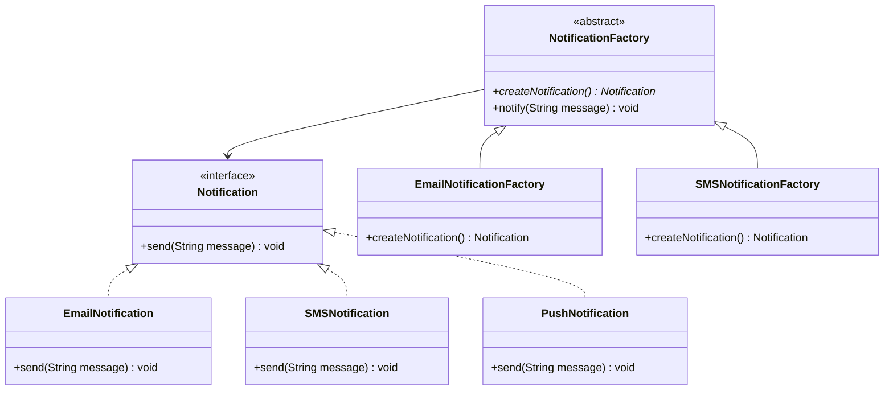

### Java Implementation

```java
public interface Notification {
    void send(String message);
}

public class EmailNotification implements Notification {
    private final String recipientEmail;

    public EmailNotification(String recipientEmail) {
        this.recipientEmail = recipientEmail;
    }

    @Override
    public void send(String message) {
        System.out.printf("Sending EMAIL to %s: %s%n", recipientEmail, message);
    }
}

public class SMSNotification implements Notification {
    private final String phoneNumber;

    public SMSNotification(String phoneNumber) {
        this.phoneNumber = phoneNumber;
    }

    @Override
    public void send(String message) {
        System.out.printf("Sending SMS to %s: %s%n", phoneNumber, message);
    }
}

public class PushNotification implements Notification {
    private final String deviceToken;

    public PushNotification(String deviceToken) {
        this.deviceToken = deviceToken;
    }

    @Override
    public void send(String message) {
        System.out.printf("Sending PUSH to device %s: %s%n", deviceToken, message);
    }
}

public abstract class NotificationFactory {
    public abstract Notification createNotification();

    public void notify(String message) {
        Notification notification = createNotification();
        notification.send(message);
    }
}

public class EmailNotificationFactory extends NotificationFactory {
    private final String email;

    public EmailNotificationFactory(String email) {
        this.email = email;
    }

    @Override
    public Notification createNotification() {
        return new EmailNotification(email);
    }
}
```

### Real-World JDK Usage

- `Calendar.getInstance()` — returns `GregorianCalendar` or locale-specific subclass
- `NumberFormat.getInstance()` — returns `DecimalFormat` or currency-specific formatter
- `Collection.iterator()` — each collection returns its own `Iterator` implementation

---

## 4. Abstract Factory

**Problem:** You need to create families of related objects that must be used together. Mixing products from different families would cause bugs.

### Class Diagram

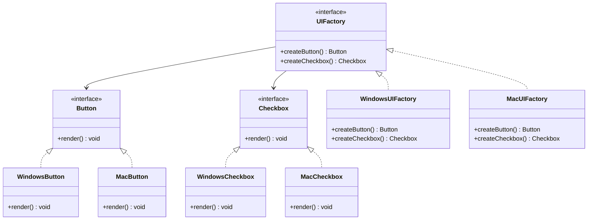

### Java Implementation

```java
public interface Button {
    void render();
    void onClick(Runnable handler);
}

public interface Checkbox {
    void render();
    boolean isChecked();
}

public interface UIFactory {
    Button createButton();
    Checkbox createCheckbox();
}

public class WindowsButton implements Button {
    @Override
    public void render() { System.out.println("Rendering Windows-style button"); }

    @Override
    public void onClick(Runnable handler) { handler.run(); }
}

public class MacButton implements Button {
    @Override
    public void render() { System.out.println("Rendering macOS-style button"); }

    @Override
    public void onClick(Runnable handler) { handler.run(); }
}

public class WindowsUIFactory implements UIFactory {
    @Override
    public Button createButton() { return new WindowsButton(); }

    @Override
    public Checkbox createCheckbox() { return new WindowsCheckbox(); }
}

public class MacUIFactory implements UIFactory {
    @Override
    public Button createButton() { return new MacButton(); }

    @Override
    public Checkbox createCheckbox() { return new MacCheckbox(); }
}

// Client code is decoupled from concrete classes
public class Application {
    private final Button button;
    private final Checkbox checkbox;

    public Application(UIFactory factory) {
        this.button = factory.createButton();
        this.checkbox = factory.createCheckbox();
    }

    public void render() {
        button.render();
        checkbox.render();
    }
}
```

### Real-World Usage

- **JDK:** `DocumentBuilderFactory.newInstance()`, `TransformerFactory.newInstance()`
- **JDBC:** `DriverManager.getConnection()` returns vendor-specific `Connection`, `Statement`, `ResultSet` family

---

## 5. Builder

**Problem:** A class has many parameters (telescoping constructor anti-pattern), some required, some optional, and validation logic is needed before construction.

### Class Diagram

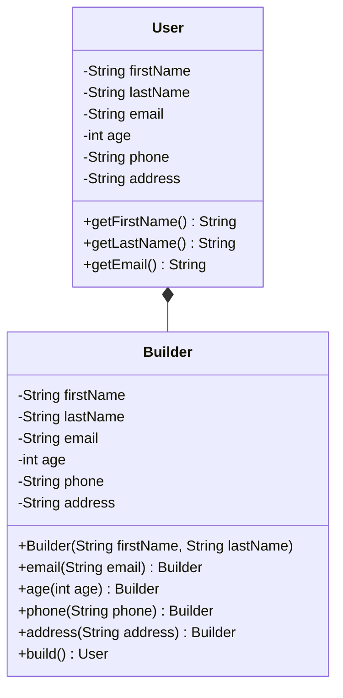

### Java Implementation (Effective Java Style)

```java
public class User {
    private final String firstName;   // required
    private final String lastName;    // required
    private final String email;       // required
    private final int age;            // optional
    private final String phone;       // optional
    private final String address;     // optional

    private User(Builder builder) {
        this.firstName = builder.firstName;
        this.lastName = builder.lastName;
        this.email = builder.email;
        this.age = builder.age;
        this.phone = builder.phone;
        this.address = builder.address;
    }

    public String getFirstName() { return firstName; }
    public String getLastName()  { return lastName; }
    public String getEmail()     { return email; }
    public int getAge()          { return age; }
    public String getPhone()     { return phone; }
    public String getAddress()   { return address; }

    public static class Builder {
        private final String firstName;
        private final String lastName;
        private final String email;

        private int age;
        private String phone;
        private String address;

        public Builder(String firstName, String lastName, String email) {
            this.firstName = Objects.requireNonNull(firstName, "firstName must not be null");
            this.lastName = Objects.requireNonNull(lastName, "lastName must not be null");
            this.email = Objects.requireNonNull(email, "email must not be null");
        }

        public Builder age(int age) {
            if (age < 0 || age > 150) throw new IllegalArgumentException("Invalid age: " + age);
            this.age = age;
            return this;
        }

        public Builder phone(String phone)     { this.phone = phone; return this; }
        public Builder address(String address) { this.address = address; return this; }

        public User build() {
            return new User(this);
        }
    }

    @Override
    public String toString() {
        return String.format("User{%s %s, email=%s, age=%d}", firstName, lastName, email, age);
    }
}

// Usage
User user = new User.Builder("John", "Doe", "john@example.com")
    .age(30)
    .phone("+1-555-0123")
    .address("Mountain View, CA")
    .build();
```

### Lombok Shortcut

```java
@lombok.Builder
@lombok.Value
public class UserDto {
    String firstName;
    String lastName;
    String email;
    int age;
}
// Generates: UserDto.builder().firstName("John").lastName("Doe").build();
```

### Real-World JDK Usage

- `StringBuilder` — `new StringBuilder().append("hello").append(" ").append("world").toString()`
- `Stream.Builder` — `Stream.<String>builder().add("a").add("b").build()`
- `HttpClient.newBuilder()` — fluent TLS, timeout, redirect configuration

---

## 6. Prototype

**Problem:** Creating a new object from scratch is expensive (database queries, network calls, heavy computation). Instead, clone an existing configured object.

### Java Implementation

```java
public abstract class Shape implements Cloneable {
    private String color;
    private int x, y;

    public Shape() {}

    protected Shape(Shape source) {
        this.color = source.color;
        this.x = source.x;
        this.y = source.y;
    }

    @Override
    public abstract Shape clone();

    public void setColor(String color) { this.color = color; }
    public void moveTo(int x, int y) { this.x = x; this.y = y; }
}

public class Circle extends Shape {
    private int radius;

    public Circle(int radius) { this.radius = radius; }

    private Circle(Circle source) {
        super(source);
        this.radius = source.radius;
    }

    @Override
    public Circle clone() {
        return new Circle(this);
    }
}

public class Rectangle extends Shape {
    private int width, height;

    public Rectangle(int width, int height) {
        this.width = width;
        this.height = height;
    }

    private Rectangle(Rectangle source) {
        super(source);
        this.width = source.width;
        this.height = source.height;
    }

    @Override
    public Rectangle clone() {
        return new Rectangle(this);
    }
}
```

### Prototype Registry

```java
public class ShapeRegistry {
    private final Map<String, Shape> prototypes = new HashMap<>();

    public void registerPrototype(String key, Shape prototype) {
        prototypes.put(key, prototype);
    }

    public Shape create(String key) {
        Shape prototype = prototypes.get(key);
        if (prototype == null) throw new IllegalArgumentException("Unknown prototype: " + key);
        return prototype.clone();
    }
}
```

### Shallow vs Deep Copy

| Aspect | Shallow Copy | Deep Copy |
|---|---|---|
| Primitives | Copied | Copied |
| Object references | Same reference (shared) | New independent copies |
| Performance | Faster | Slower |
| Use when | Object has only primitives/immutables | Object has mutable nested objects |

### Real-World Usage

- **JDK:** `Object.clone()`, `ArrayList.clone()`, `HashMap.clone()`

---

## 7. Adapter

**Problem:** You have an existing class with a useful interface but its interface is incompatible with what the client expects.

### Class Diagram

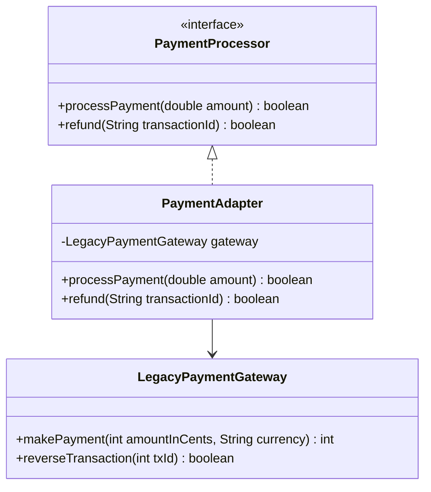

### Java Implementation (Object Adapter — Composition)

```java
public interface PaymentProcessor {
    boolean processPayment(double amount);
    boolean refund(String transactionId);
}

public class LegacyPaymentGateway {
    public int makePayment(int amountInCents, String currency) {
        System.out.printf("Legacy: charging %d cents (%s)%n", amountInCents, currency);
        return ThreadLocalRandom.current().nextInt(10000, 99999); // transaction ID
    }

    public boolean reverseTransaction(int txId) {
        System.out.printf("Legacy: reversing transaction %d%n", txId);
        return true;
    }
}

public class PaymentAdapter implements PaymentProcessor {
    private final LegacyPaymentGateway gateway;

    public PaymentAdapter(LegacyPaymentGateway gateway) {
        this.gateway = gateway;
    }

    @Override
    public boolean processPayment(double amount) {
        int cents = (int) Math.round(amount * 100);
        int txId = gateway.makePayment(cents, "USD");
        return txId > 0;
    }

    @Override
    public boolean refund(String transactionId) {
        return gateway.reverseTransaction(Integer.parseInt(transactionId));
    }
}
```

### Class Adapter vs Object Adapter

| Aspect | Class Adapter (Inheritance) | Object Adapter (Composition) |
|---|---|---|
| Mechanism | Extends adaptee class | Holds reference to adaptee |
| Flexibility | Tied to one adaptee class | Can adapt any subclass |
| Java support | Limited (single inheritance) | Preferred approach |
| Override behavior | Can override adaptee methods | Cannot override, only delegate |

### Real-World JDK Usage

- `Arrays.asList(T[])` — adapts array to `List` interface
- `InputStreamReader` — adapts `InputStream` (bytes) to `Reader` (chars)
- `OutputStreamWriter` — adapts `OutputStream` to `Writer`
- `Collections.enumeration()` — adapts `Collection` to `Enumeration`

---

## 8. Decorator

**Problem:** You need to add responsibilities to an object dynamically without altering existing classes. Inheritance would cause a class explosion.

### Class Diagram

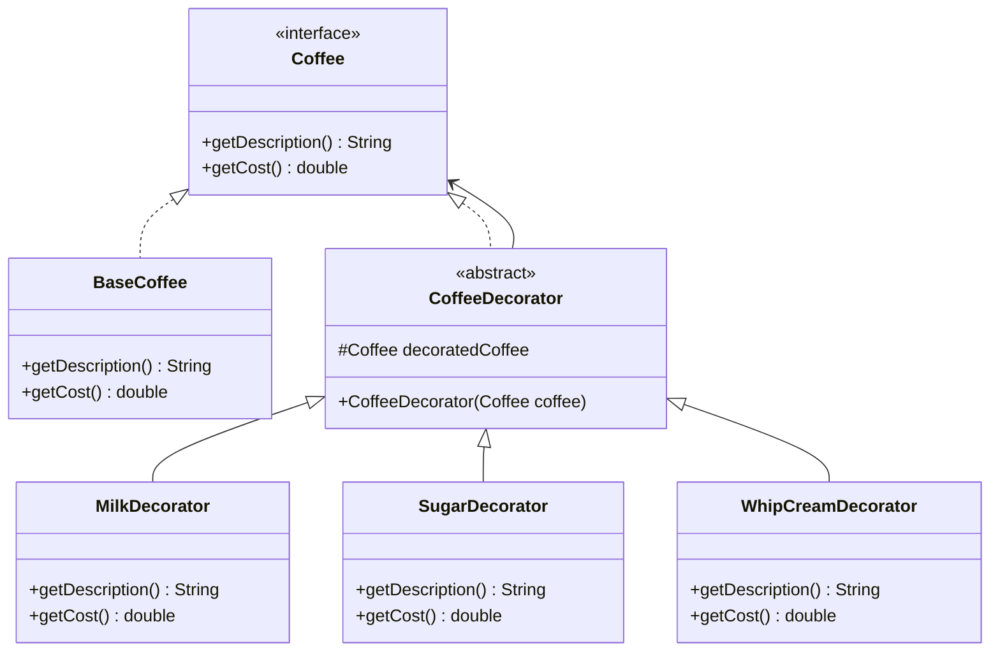

### Java Implementation

```java
public interface Coffee {
    String getDescription();
    double getCost();
}

public class BaseCoffee implements Coffee {
    @Override
    public String getDescription() { return "House Blend Coffee"; }

    @Override
    public double getCost() { return 1.99; }
}

public abstract class CoffeeDecorator implements Coffee {
    protected final Coffee decoratedCoffee;

    protected CoffeeDecorator(Coffee coffee) {
        this.decoratedCoffee = Objects.requireNonNull(coffee);
    }
}

public class MilkDecorator extends CoffeeDecorator {
    public MilkDecorator(Coffee coffee) { super(coffee); }

    @Override
    public String getDescription() {
        return decoratedCoffee.getDescription() + ", Milk";
    }

    @Override
    public double getCost() {
        return decoratedCoffee.getCost() + 0.50;
    }
}

public class SugarDecorator extends CoffeeDecorator {
    public SugarDecorator(Coffee coffee) { super(coffee); }

    @Override
    public String getDescription() {
        return decoratedCoffee.getDescription() + ", Sugar";
    }

    @Override
    public double getCost() {
        return decoratedCoffee.getCost() + 0.25;
    }
}

// Usage — decorators wrap each other
Coffee order = new WhipCreamDecorator(
                   new MilkDecorator(
                       new BaseCoffee()));
System.out.println(order.getDescription()); // House Blend Coffee, Milk, Whip Cream
System.out.printf("Total: $%.2f%n", order.getCost()); // $3.24
```

### Real-World Usage

- **JDK `java.io`:** `new BufferedReader(new InputStreamReader(new FileInputStream("f.txt")))` — classic decorator chain
- **JDK:** `Collections.unmodifiableList()`, `Collections.synchronizedList()`
- **Spring AOP:** `@Transactional`, `@Cacheable`, `@Async` — cross-cutting concerns applied as decorators via proxies

---

## 9. Proxy

**Problem:** You need to control access to an object — lazy initialization, access control, logging, caching, or remote access.

### Types of Proxy

| Type | Purpose | Example |
|---|---|---|
| **Virtual Proxy** | Lazy loading of heavy objects | Load image only when displayed |
| **Protection Proxy** | Access control | Check permissions before method call |
| **Remote Proxy** | Local representative of remote object | Java RMI stub |
| **Logging Proxy** | Transparent logging/metrics | Log every method call with timing |

### Class Diagram

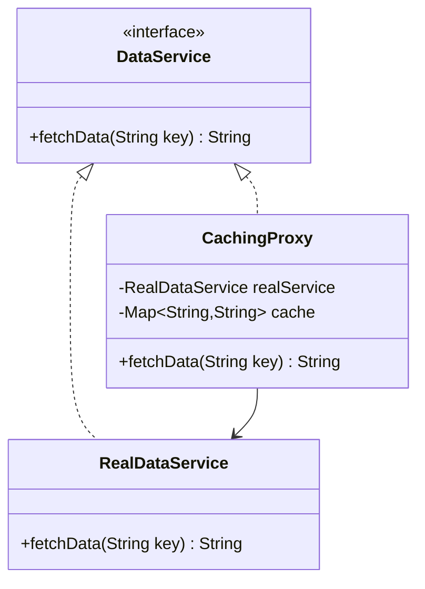

### Java Implementation: Caching Proxy

```java
public interface DataService {
    String fetchData(String key);
}

public class RealDataService implements DataService {
    @Override
    public String fetchData(String key) {
        simulateSlowDatabaseCall();
        return "data_for_" + key;
    }

    private void simulateSlowDatabaseCall() {
        try { Thread.sleep(2000); } catch (InterruptedException e) {
            Thread.currentThread().interrupt();
        }
    }
}

public class CachingProxy implements DataService {
    private final DataService realService;
    private final Map<String, String> cache = new ConcurrentHashMap<>();

    public CachingProxy(DataService realService) {
        this.realService = realService;
    }

    @Override
    public String fetchData(String key) {
        return cache.computeIfAbsent(key, realService::fetchData);
    }

    public void invalidate(String key) {
        cache.remove(key);
    }
}
```

### JDK Dynamic Proxy

```java
public class LoggingInvocationHandler implements InvocationHandler {
    private final Object target;
    private static final Logger log = Logger.getLogger("ProxyLogger");

    public LoggingInvocationHandler(Object target) {
        this.target = target;
    }

    @Override
    public Object invoke(Object proxy, Method method, Object[] args) throws Throwable {
        long start = System.nanoTime();
        log.info("Calling " + method.getName());
        try {
            return method.invoke(target, args);
        } finally {
            long elapsed = System.nanoTime() - start;
            log.info(method.getName() + " completed in " + (elapsed / 1_000_000) + " ms");
        }
    }

    @SuppressWarnings("unchecked")
    public static <T> T createProxy(T target, Class<T> iface) {
        return (T) Proxy.newProxyInstance(
            iface.getClassLoader(),
            new Class<?>[]{iface},
            new LoggingInvocationHandler(target)
        );
    }
}

// Usage
DataService proxied = LoggingInvocationHandler.createProxy(new RealDataService(), DataService.class);
proxied.fetchData("users"); // automatically logged with timing
```

### Real-World Usage

- **Spring AOP:** `@Transactional` wraps methods in a proxy that manages transaction begin/commit/rollback
- **Spring:** CGLIB proxies for classes without interfaces
- **JDK:** `java.lang.reflect.Proxy`, `java.rmi.*` stubs

---

## 10. Facade

**Problem:** A complex subsystem has many classes and interactions. Client code shouldn't need to understand all of them.

### Class Diagram

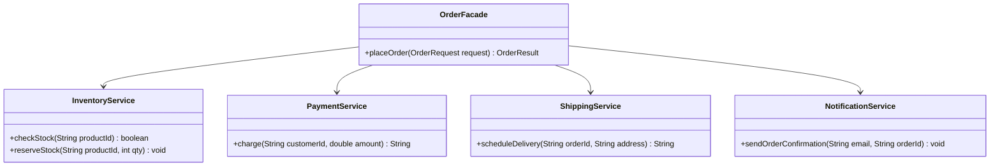

### Java Implementation

```java
public class OrderFacade {
    private final InventoryService inventory;
    private final PaymentService payment;
    private final ShippingService shipping;
    private final NotificationService notifications;

    public OrderFacade(InventoryService inventory, PaymentService payment,
                       ShippingService shipping, NotificationService notifications) {
        this.inventory = inventory;
        this.payment = payment;
        this.shipping = shipping;
        this.notifications = notifications;
    }

    public OrderResult placeOrder(OrderRequest request) {
        if (!inventory.checkStock(request.getProductId())) {
            return OrderResult.failure("Out of stock");
        }

        inventory.reserveStock(request.getProductId(), request.getQuantity());

        String paymentTxId = payment.charge(request.getCustomerId(), request.getTotalAmount());
        if (paymentTxId == null) {
            inventory.releaseStock(request.getProductId(), request.getQuantity());
            return OrderResult.failure("Payment declined");
        }

        String trackingNumber = shipping.scheduleDelivery(
            request.getOrderId(), request.getShippingAddress());

        notifications.sendOrderConfirmation(request.getCustomerEmail(), request.getOrderId());

        return OrderResult.success(request.getOrderId(), trackingNumber, paymentTxId);
    }
}
```

### Real-World Usage

- **JDK:** `javax.faces.context.FacesContext` — facade over JSF lifecycle
- **Spring:** `JdbcTemplate` — facade over raw JDBC (`Connection`, `PreparedStatement`, `ResultSet`, exception translation)
- **SLF4J:** `LoggerFactory.getLogger()` — facade over multiple logging frameworks

---

## 11. Composite

**Problem:** You need to represent part-whole hierarchies (tree structures) and treat individual objects and compositions uniformly.

### Class Diagram

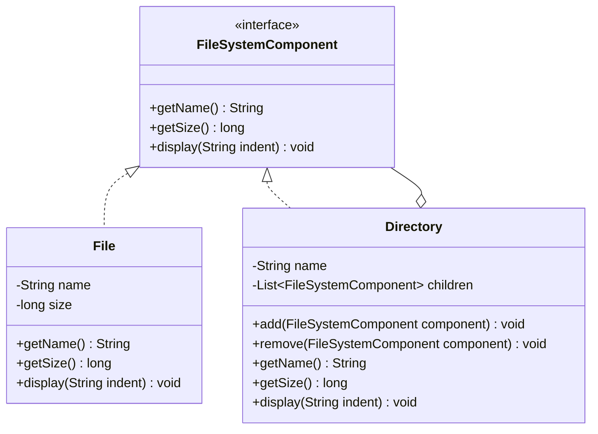

### Java Implementation

```java
public interface FileSystemComponent {
    String getName();
    long getSize();
    void display(String indent);
}

public class File implements FileSystemComponent {
    private final String name;
    private final long size;

    public File(String name, long size) {
        this.name = name;
        this.size = size;
    }

    @Override public String getName() { return name; }
    @Override public long getSize()   { return size; }

    @Override
    public void display(String indent) {
        System.out.printf("%s📄 %s (%d bytes)%n", indent, name, size);
    }
}

public class Directory implements FileSystemComponent {
    private final String name;
    private final List<FileSystemComponent> children = new ArrayList<>();

    public Directory(String name) { this.name = name; }

    public void add(FileSystemComponent component)    { children.add(component); }
    public void remove(FileSystemComponent component) { children.remove(component); }

    @Override public String getName() { return name; }

    @Override
    public long getSize() {
        return children.stream().mapToLong(FileSystemComponent::getSize).sum();
    }

    @Override
    public void display(String indent) {
        System.out.printf("%s📁 %s/%n", indent, name);
        children.forEach(child -> child.display(indent + "  "));
    }
}

// Usage
Directory root = new Directory("src");
Directory main = new Directory("main");
main.add(new File("App.java", 2048));
main.add(new File("Config.java", 512));
root.add(main);
root.add(new File("README.md", 256));
root.display(""); // recursively prints tree
System.out.println("Total size: " + root.getSize()); // 2816
```

### Real-World Usage

- **JDK:** `java.awt.Container` — components contain other components
- **JSP/XML:** DOM tree — `Node`, `Element`, `Document`

---

## 12. Flyweight

**Problem:** Your application creates millions of similar objects, most of which share common state, causing excessive memory usage.

**Key Concept:** Separate **intrinsic state** (shared, immutable) from **extrinsic state** (context-specific, varies per use).

### Class Diagram

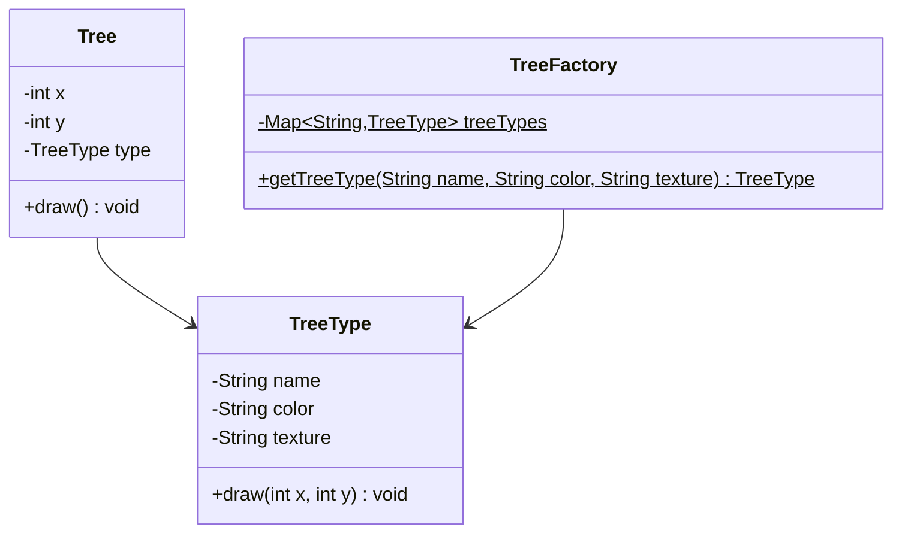

### Java Implementation

```java
public class TreeType {
    private final String name;
    private final String color;
    private final String texture;  // heavy resource, e.g., loaded from file

    TreeType(String name, String color, String texture) {
        this.name = name;
        this.color = color;
        this.texture = texture;
    }

    public void draw(int x, int y) {
        System.out.printf("Drawing %s tree (%s) at [%d,%d]%n", name, color, x, y);
    }
}

public class TreeFactory {
    private static final Map<String, TreeType> cache = new HashMap<>();

    public static TreeType getTreeType(String name, String color, String texture) {
        String key = name + "_" + color + "_" + texture;
        return cache.computeIfAbsent(key, k -> new TreeType(name, color, texture));
    }

    public static int getCacheSize() { return cache.size(); }
}

public class Tree {
    private final int x;       // extrinsic state — unique per tree
    private final int y;
    private final TreeType type; // intrinsic state — shared via flyweight

    public Tree(int x, int y, TreeType type) {
        this.x = x;
        this.y = y;
        this.type = type;
    }

    public void draw() { type.draw(x, y); }
}

// Usage — 1,000,000 trees but only a handful of TreeType objects
public class Forest {
    private final List<Tree> trees = new ArrayList<>();

    public void plantTree(int x, int y, String name, String color, String texture) {
        TreeType type = TreeFactory.getTreeType(name, color, texture);
        trees.add(new Tree(x, y, type));
    }
}
```

### Real-World JDK Examples

- **`Integer.valueOf(int)`** — caches values from **-128 to 127**; `Integer.valueOf(42) == Integer.valueOf(42)` is `true`
- **`String.intern()`** — returns canonical string from the pool
- **`Boolean.valueOf(boolean)`** — always returns `Boolean.TRUE` or `Boolean.FALSE`

---

## 13. Strategy

**Problem:** You have multiple algorithms for the same task, and the choice should be interchangeable at runtime without modifying client code.

### Class Diagram

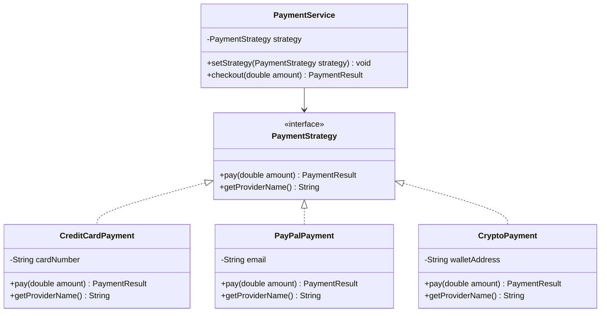

### Java Implementation

```java
@FunctionalInterface
public interface PaymentStrategy {
    PaymentResult pay(double amount);
}

public record PaymentResult(boolean success, String transactionId, String message) {
    public static PaymentResult success(String txId) {
        return new PaymentResult(true, txId, "Payment successful");
    }
    public static PaymentResult failure(String msg) {
        return new PaymentResult(false, null, msg);
    }
}

public class CreditCardPayment implements PaymentStrategy {
    private final String cardNumber;
    private final String cvv;

    public CreditCardPayment(String cardNumber, String cvv) {
        this.cardNumber = cardNumber;
        this.cvv = cvv;
    }

    @Override
    public PaymentResult pay(double amount) {
        String masked = "****" + cardNumber.substring(cardNumber.length() - 4);
        System.out.printf("Charging $%.2f to credit card %s%n", amount, masked);
        return PaymentResult.success(UUID.randomUUID().toString());
    }
}

public class PayPalPayment implements PaymentStrategy {
    private final String email;

    public PayPalPayment(String email) { this.email = email; }

    @Override
    public PaymentResult pay(double amount) {
        System.out.printf("Charging $%.2f via PayPal (%s)%n", amount, email);
        return PaymentResult.success(UUID.randomUUID().toString());
    }
}

public class PaymentService {
    private PaymentStrategy strategy;

    public void setStrategy(PaymentStrategy strategy) {
        this.strategy = strategy;
    }

    public PaymentResult checkout(double amount) {
        if (strategy == null) throw new IllegalStateException("No payment strategy set");
        return strategy.pay(amount);
    }
}
```

### Modern Java: Strategies as Lambdas

```java
PaymentService service = new PaymentService();

// Lambda strategy — no need for a full class
service.setStrategy(amount -> {
    System.out.printf("Charging $%.2f via Apple Pay%n", amount);
    return PaymentResult.success(UUID.randomUUID().toString());
});

service.checkout(49.99);
```

### Real-World Usage

- **JDK:** `Comparator<T>` — `list.sort(Comparator.comparing(User::getLastName))`
- **JDK:** `Collections.sort(list, comparator)`
- **Spring Security:** Multiple `AuthenticationProvider` implementations selected at runtime
- **Java Streams:** `Collector` interface — `toList()`, `groupingBy()`, `joining()` are different strategies

---

## 14. Observer

**Problem:** When one object changes state, all dependent objects must be notified and updated automatically, without tight coupling.

### Class Diagram

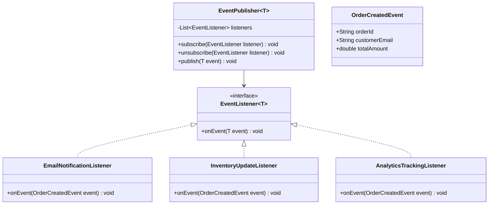

### Java Implementation

```java
@FunctionalInterface
public interface EventListener<T> {
    void onEvent(T event);
}

public class EventPublisher<T> {
    private final List<EventListener<T>> listeners = new CopyOnWriteArrayList<>();

    public void subscribe(EventListener<T> listener) {
        listeners.add(listener);
    }

    public void unsubscribe(EventListener<T> listener) {
        listeners.remove(listener);
    }

    public void publish(T event) {
        for (EventListener<T> listener : listeners) {
            try {
                listener.onEvent(event);
            } catch (Exception e) {
                System.err.println("Listener failed: " + e.getMessage());
            }
        }
    }
}

public record OrderCreatedEvent(String orderId, String customerEmail, double totalAmount) {}

// Listeners
public class EmailNotificationListener implements EventListener<OrderCreatedEvent> {
    @Override
    public void onEvent(OrderCreatedEvent event) {
        System.out.printf("Sending confirmation email to %s for order %s%n",
            event.customerEmail(), event.orderId());
    }
}

public class InventoryUpdateListener implements EventListener<OrderCreatedEvent> {
    @Override
    public void onEvent(OrderCreatedEvent event) {
        System.out.printf("Updating inventory for order %s%n", event.orderId());
    }
}

// Wiring
EventPublisher<OrderCreatedEvent> publisher = new EventPublisher<>();
publisher.subscribe(new EmailNotificationListener());
publisher.subscribe(new InventoryUpdateListener());
publisher.subscribe(event ->
    System.out.printf("Analytics: order %s worth $%.2f%n", event.orderId(), event.totalAmount()));

publisher.publish(new OrderCreatedEvent("ORD-001", "alice@example.com", 149.99));
```

### Real-World Usage

- **JDK:** `PropertyChangeListener`, `PropertyChangeSupport`
- **JDK (deprecated):** `java.util.Observer` / `Observable` — deprecated since Java 9
- **Spring:** `ApplicationEventPublisher.publishEvent()`, `@EventListener` annotation
- **Reactive Streams:** `Flow.Publisher`, `Flow.Subscriber` (Java 9+)

---

## 15. Template Method

**Problem:** Multiple classes share the same algorithm structure but differ in specific steps. You want to define the skeleton once and let subclasses customize the varying parts.

### Class Diagram

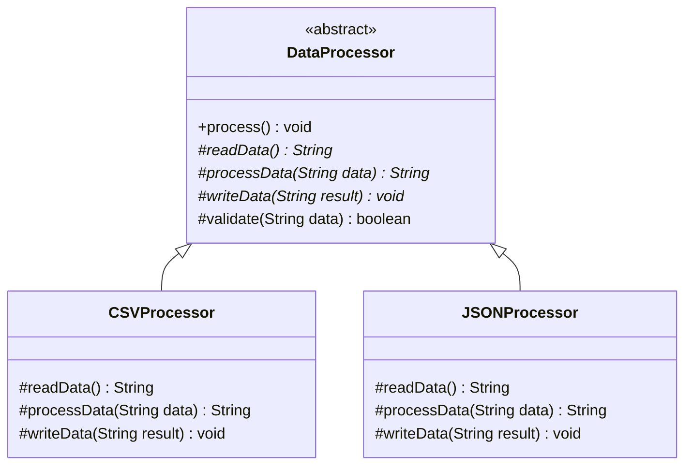

### Java Implementation

```java
public abstract class DataProcessor {

    // Template method — defines the algorithm skeleton
    public final void process() {
        String raw = readData();
        if (!validate(raw)) {
            throw new IllegalStateException("Validation failed");
        }
        String result = processData(raw);
        writeData(result);
    }

    protected abstract String readData();
    protected abstract String processData(String data);
    protected abstract void writeData(String result);

    // Hook method — optional override
    protected boolean validate(String data) {
        return data != null && !data.isEmpty();
    }
}

public class CSVProcessor extends DataProcessor {
    private final String filePath;

    public CSVProcessor(String filePath) { this.filePath = filePath; }

    @Override
    protected String readData() {
        System.out.println("Reading CSV from: " + filePath);
        return "name,age\nAlice,30\nBob,25";
    }

    @Override
    protected String processData(String data) {
        long recordCount = data.lines().count() - 1; // exclude header
        return String.format("Processed %d CSV records", recordCount);
    }

    @Override
    protected void writeData(String result) {
        System.out.println("Writing CSV result: " + result);
    }
}

public class JSONProcessor extends DataProcessor {
    private final String endpoint;

    public JSONProcessor(String endpoint) { this.endpoint = endpoint; }

    @Override
    protected String readData() {
        System.out.println("Fetching JSON from: " + endpoint);
        return "{\"users\": [{\"name\": \"Alice\"}, {\"name\": \"Bob\"}]}";
    }

    @Override
    protected String processData(String data) {
        return "Parsed 2 users from JSON";
    }

    @Override
    protected void writeData(String result) {
        System.out.println("Writing JSON result: " + result);
    }
}
```

### Real-World Usage

- **JDK:** `AbstractList.get()` — subclasses like `ArrayList` implement the abstract method
- **JDK:** `InputStream.read(byte[], int, int)` calls abstract `read()`
- **Spring:** `JdbcTemplate` — template for JDBC operations (connection, statement, result mapping handled)
- **Spring:** `RestTemplate`, `AbstractController`

---

## 16. Chain of Responsibility

**Problem:** A request must be processed by a series of handlers, each deciding whether to handle it or pass it along.

### Class Diagram

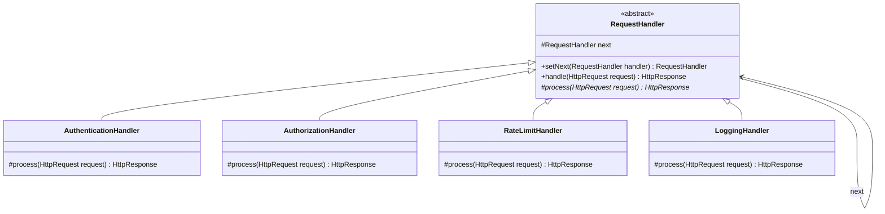

### Java Implementation

```java
public abstract class RequestHandler {
    protected RequestHandler next;

    public RequestHandler setNext(RequestHandler handler) {
        this.next = handler;
        return handler; // allows chaining: a.setNext(b).setNext(c)
    }

    public HttpResponse handle(HttpRequest request) {
        HttpResponse response = process(request);
        if (response != null) {
            return response; // handler consumed the request (rejected or produced response)
        }
        if (next != null) {
            return next.handle(request);
        }
        return HttpResponse.of(200, "OK");
    }

    protected abstract HttpResponse process(HttpRequest request);
}

public class AuthenticationHandler extends RequestHandler {
    @Override
    protected HttpResponse process(HttpRequest request) {
        String token = request.getHeader("Authorization");
        if (token == null || !token.startsWith("Bearer ")) {
            return HttpResponse.of(401, "Unauthorized: missing token");
        }
        request.setAttribute("userId", validateToken(token));
        return null; // pass to next handler
    }

    private String validateToken(String token) {
        return "user-123"; // simplified
    }
}

public class RateLimitHandler extends RequestHandler {
    private final Map<String, AtomicInteger> counters = new ConcurrentHashMap<>();
    private static final int MAX_REQUESTS = 100;

    @Override
    protected HttpResponse process(HttpRequest request) {
        String clientIp = request.getRemoteAddr();
        int count = counters.computeIfAbsent(clientIp, k -> new AtomicInteger(0))
                            .incrementAndGet();
        if (count > MAX_REQUESTS) {
            return HttpResponse.of(429, "Too Many Requests");
        }
        return null;
    }
}

// Building the chain
RequestHandler chain = new AuthenticationHandler();
chain.setNext(new AuthorizationHandler())
     .setNext(new RateLimitHandler())
     .setNext(new LoggingHandler());

HttpResponse response = chain.handle(incomingRequest);
```

### Real-World Usage

- **JDK:** `javax.servlet.Filter` — `doFilter(request, response, chain)`
- **Spring Security:** Filter chain — `SecurityFilterChain` with ordered filters
- **Spring MVC:** `HandlerInterceptor` — `preHandle()`, `postHandle()`, `afterCompletion()`

---

## 17. Command

**Problem:** You need to encapsulate a request as an object to support undo/redo, queuing, logging, and transactional behavior.

### Class Diagram

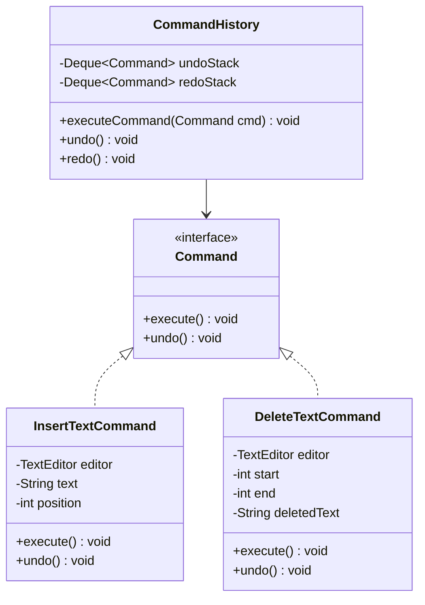

### Java Implementation

```java
public interface Command {
    void execute();
    void undo();
}

public class TextEditor {
    private final StringBuilder content = new StringBuilder();

    public void insertText(int position, String text) {
        content.insert(position, text);
    }

    public String deleteText(int start, int end) {
        String deleted = content.substring(start, end);
        content.delete(start, end);
        return deleted;
    }

    public String getContent() { return content.toString(); }
}

public class InsertTextCommand implements Command {
    private final TextEditor editor;
    private final String text;
    private final int position;

    public InsertTextCommand(TextEditor editor, int position, String text) {
        this.editor = editor;
        this.position = position;
        this.text = text;
    }

    @Override
    public void execute() { editor.insertText(position, text); }

    @Override
    public void undo() { editor.deleteText(position, position + text.length()); }
}

public class DeleteTextCommand implements Command {
    private final TextEditor editor;
    private final int start, end;
    private String deletedText;

    public DeleteTextCommand(TextEditor editor, int start, int end) {
        this.editor = editor;
        this.start = start;
        this.end = end;
    }

    @Override
    public void execute() { deletedText = editor.deleteText(start, end); }

    @Override
    public void undo() { editor.insertText(start, deletedText); }
}

public class CommandHistory {
    private final Deque<Command> undoStack = new ArrayDeque<>();
    private final Deque<Command> redoStack = new ArrayDeque<>();

    public void executeCommand(Command cmd) {
        cmd.execute();
        undoStack.push(cmd);
        redoStack.clear();
    }

    public void undo() {
        if (undoStack.isEmpty()) return;
        Command cmd = undoStack.pop();
        cmd.undo();
        redoStack.push(cmd);
    }

    public void redo() {
        if (redoStack.isEmpty()) return;
        Command cmd = redoStack.pop();
        cmd.execute();
        undoStack.push(cmd);
    }
}
```

### Real-World Usage

- **JDK:** `Runnable` — command without return value; `Callable<V>` — command with return value
- **JDK:** `CompletableFuture.supplyAsync(command)` — queued async command execution
- **Spring Batch:** `Tasklet` interface — encapsulated batch step

---

## 18. Iterator

**Problem:** Traverse elements of a collection without exposing its underlying representation (array, linked list, tree, graph).

### Java Implementation: Custom Iterable

```java
public class IntRange implements Iterable<Integer> {
    private final int start;
    private final int end;
    private final int step;

    public IntRange(int start, int end, int step) {
        if (step <= 0) throw new IllegalArgumentException("Step must be positive");
        this.start = start;
        this.end = end;
        this.step = step;
    }

    public IntRange(int start, int end) {
        this(start, end, 1);
    }

    @Override
    public Iterator<Integer> iterator() {
        return new Iterator<>() {
            private int current = start;

            @Override
            public boolean hasNext() { return current < end; }

            @Override
            public Integer next() {
                if (!hasNext()) throw new NoSuchElementException();
                int value = current;
                current += step;
                return value;
            }
        };
    }

    public Stream<Integer> stream() {
        return StreamSupport.stream(spliterator(), false);
    }
}

// Usage — works in enhanced for-loop
for (int i : new IntRange(0, 10, 2)) {
    System.out.println(i); // 0, 2, 4, 6, 8
}

// Works with streams
new IntRange(1, 100).stream()
    .filter(n -> n % 3 == 0)
    .forEach(System.out::println);
```

### Real-World JDK Usage

- `Iterator<E>` — foundational interface; `hasNext()`, `next()`, `remove()`
- `Iterable<E>` — any class implementing this works in enhanced for-loops
- `Spliterator<E>` — parallel-capable iterator for `Stream` framework
- `ListIterator<E>` — bidirectional iteration with `previous()`, `set()`, `add()`

---

## 19. State

**Problem:** An object must change its behavior when its internal state changes. The object should appear to change its class.

### State Diagram

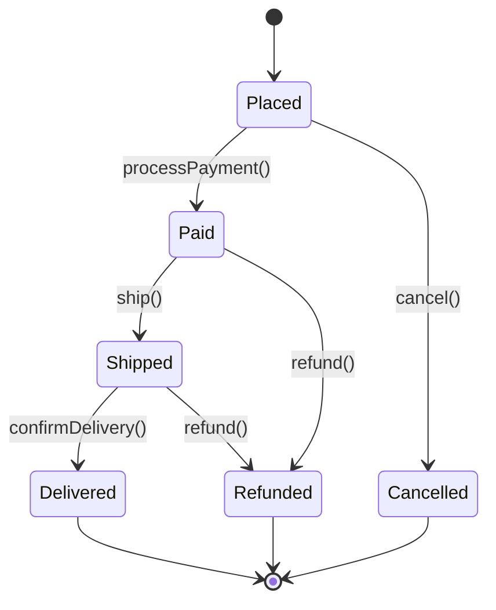

### Java Implementation

```java
public interface OrderState {
    void processPayment(OrderContext order);
    void ship(OrderContext order);
    void deliver(OrderContext order);
    void cancel(OrderContext order);

    String getStatus();
}

public class OrderContext {
    private OrderState state;

    public OrderContext() {
        this.state = new PlacedState();
    }

    public void setState(OrderState state) { this.state = state; }
    public String getStatus() { return state.getStatus(); }

    public void processPayment() { state.processPayment(this); }
    public void ship()           { state.ship(this); }
    public void deliver()        { state.deliver(this); }
    public void cancel()         { state.cancel(this); }
}

public class PlacedState implements OrderState {
    @Override
    public void processPayment(OrderContext order) {
        System.out.println("Payment processed. Order is now PAID.");
        order.setState(new PaidState());
    }

    @Override
    public void ship(OrderContext order) {
        throw new IllegalStateException("Cannot ship unpaid order");
    }

    @Override
    public void deliver(OrderContext order) {
        throw new IllegalStateException("Cannot deliver an unshipped order");
    }

    @Override
    public void cancel(OrderContext order) {
        System.out.println("Order cancelled.");
        order.setState(new CancelledState());
    }

    @Override
    public String getStatus() { return "PLACED"; }
}

public class PaidState implements OrderState {
    @Override
    public void processPayment(OrderContext order) {
        throw new IllegalStateException("Order already paid");
    }

    @Override
    public void ship(OrderContext order) {
        System.out.println("Order shipped.");
        order.setState(new ShippedState());
    }

    @Override
    public void deliver(OrderContext order) {
        throw new IllegalStateException("Cannot deliver before shipping");
    }

    @Override
    public void cancel(OrderContext order) {
        System.out.println("Refunding payment and cancelling order.");
        order.setState(new CancelledState());
    }

    @Override
    public String getStatus() { return "PAID"; }
}

public class ShippedState implements OrderState {
    @Override
    public void processPayment(OrderContext order) {
        throw new IllegalStateException("Order already paid");
    }

    @Override
    public void ship(OrderContext order) {
        throw new IllegalStateException("Order already shipped");
    }

    @Override
    public void deliver(OrderContext order) {
        System.out.println("Order delivered successfully.");
        order.setState(new DeliveredState());
    }

    @Override
    public void cancel(OrderContext order) {
        throw new IllegalStateException("Cannot cancel shipped order — initiate return instead");
    }

    @Override
    public String getStatus() { return "SHIPPED"; }
}
```

### Strategy vs State

| Aspect | Strategy | State |
|---|---|---|
| Who selects | **Client** chooses algorithm externally | **Object** transitions internally |
| Awareness | Strategies don't know about each other | States know which transitions are valid |
| Typical use | Swappable algorithms | State machines |
| Replaces | Long if-else chains for algorithms | Long switch-case on status fields |

---

## 20. Visitor

**Problem:** You need to add new operations to a class hierarchy without modifying the existing classes (respects Open/Closed Principle).

### Key Mechanism: Double Dispatch

Java uses single dispatch (method selected by receiver type). Visitor achieves **double dispatch**: the operation depends on both the element type and the visitor type.

### Class Diagram

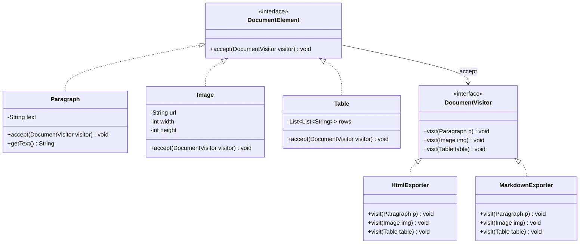

### Java Implementation

```java
public interface DocumentElement {
    void accept(DocumentVisitor visitor);
}

public interface DocumentVisitor {
    void visit(Paragraph paragraph);
    void visit(Image image);
    void visit(Table table);
}

public class Paragraph implements DocumentElement {
    private final String text;

    public Paragraph(String text) { this.text = text; }
    public String getText() { return text; }

    @Override
    public void accept(DocumentVisitor visitor) {
        visitor.visit(this); // double dispatch: calls visit(Paragraph)
    }
}

public class Image implements DocumentElement {
    private final String url;
    private final int width, height;

    public Image(String url, int width, int height) {
        this.url = url; this.width = width; this.height = height;
    }

    public String getUrl() { return url; }
    public int getWidth()  { return width; }
    public int getHeight() { return height; }

    @Override
    public void accept(DocumentVisitor visitor) {
        visitor.visit(this);
    }
}

public class HtmlExporter implements DocumentVisitor {
    private final StringBuilder html = new StringBuilder();

    @Override
    public void visit(Paragraph p) {
        html.append("<p>").append(p.getText()).append("</p>\n");
    }

    @Override
    public void visit(Image img) {
        html.append(String.format("\n",
            img.getUrl(), img.getWidth(), img.getHeight()));
    }

    @Override
    public void visit(Table table) {
        html.append("<table>\n");
        for (List<String> row : table.getRows()) {
            html.append("  <tr>");
            row.forEach(cell -> html.append("<td>").append(cell).append("</td>"));
            html.append("</tr>\n");
        }
        html.append("</table>\n");
    }

    public String getResult() { return html.toString(); }
}

// Usage
List<DocumentElement> doc = List.of(
    new Paragraph("Hello, World!"),
    new Image("logo.png", 200, 100),
    new Paragraph("Goodbye!")
);

HtmlExporter exporter = new HtmlExporter();
doc.forEach(el -> el.accept(exporter));
System.out.println(exporter.getResult());
```

### Modern Java: Sealed Classes + Pattern Matching (Java 17+)

```java
public sealed interface DocumentElement
    permits Paragraph, Image, Table {}

public record Paragraph(String text) implements DocumentElement {}
public record Image(String url, int width, int height) implements DocumentElement {}
public record Table(List<List<String>> rows) implements DocumentElement {}

// Pattern matching replaces the visitor pattern entirely
public String toHtml(DocumentElement element) {
    return switch (element) {
        case Paragraph p  -> "<p>" + p.text() + "</p>";
        case Image img    -> String.format("", img.url(), img.width());
        case Table t      -> renderTable(t);
    };
}
```

> **Interview insight:** With sealed classes and pattern matching, the compiler ensures exhaustiveness — if you add a new `DocumentElement` subtype, all switch expressions must be updated or the code won't compile. This provides the same safety as the Visitor pattern without the boilerplate.

---

## 21. Anti-Patterns

Anti-patterns are common but ineffective solutions that create more problems than they solve.

### God Class / Blob

**What:** A single class that contains too much logic, knows too much, or does too many things.

**Why it's bad:** Violates SRP, impossible to test in isolation, merge conflicts, tight coupling.

**Fix:** Decompose into focused classes with clear responsibilities. Apply Facade if a single entry point is needed.

### Singleton Abuse

**What:** Using Singleton as a vehicle for global mutable state — `AppConfig.getInstance().getDbUrl()` called from everywhere.

**Why it's bad:** Hidden dependencies, untestable (can't mock in unit tests), order-of-initialization bugs, breaks parallel test execution.

**Fix:** Use **dependency injection**. Spring manages singleton lifecycle without the anti-pattern's drawbacks. Pass dependencies explicitly via constructor.

### Service Locator

**What:** A central registry that hands out services on request — `ServiceLocator.get(UserService.class)`.

**Why it's bad:** Dependencies are hidden (not visible in constructor signature), hard to trace, compile-time safety lost.

**Fix:** Use **constructor-based dependency injection**. Dependencies are explicit, testable, and enforced at compile time.

```java
// Anti-pattern: hidden dependency
public class OrderService {
    public void placeOrder(Order order) {
        UserService userService = ServiceLocator.get(UserService.class); // hidden!
        userService.validate(order.getUserId());
    }
}

// Correct: explicit dependency
public class OrderService {
    private final UserService userService;

    public OrderService(UserService userService) { // visible, testable
        this.userService = userService;
    }

    public void placeOrder(Order order) {
        userService.validate(order.getUserId());
    }
}
```

### Premature Optimization

**What:** Optimizing code before profiling identifies actual bottlenecks. Writing complex, unreadable code "for performance."

**Why it's bad:** Wastes development time, introduces bugs, makes code harder to maintain. The optimized code path is often not the bottleneck.

**Fix:** Write clear code first. Profile under realistic load. Optimize the measured hotspots. *"Make it work, make it right, make it fast"* — Kent Beck.

### Copy-Paste Programming

**What:** Duplicating code blocks instead of extracting reusable methods or classes.

**Why it's bad:** Bug fixes must be applied N times. Inconsistencies accumulate. Violates DRY.

**Fix:** Extract methods, apply Template Method or Strategy pattern, use generics, create utility classes.

### Lava Flow

**What:** Dead code, obsolete modules, and "temporary" workarounds that remain in the codebase because nobody dares to remove them.

**Why it's bad:** Increases cognitive load, slows builds, confuses new engineers.

**Fix:** Aggressive code reviews, test coverage to enable safe deletion, feature flags for gradual rollout.

---

## 22. Interview-Focused Summary

### Quick-Reference Pattern Selection Guide

| Situation | Pattern |
|---|---|
| Need exactly one instance | Singleton (prefer enum or DI-managed) |
| Object creation varies by context | Factory Method |
| Families of related objects | Abstract Factory |
| Complex object with many optional params | Builder |
| Expensive object creation, clone instead | Prototype |
| Incompatible interfaces | Adapter |
| Add behavior without modifying class | Decorator |
| Control access, lazy load, log calls | Proxy |
| Simplify a complex subsystem | Facade |
| Tree structures, uniform treatment | Composite |
| Millions of similar objects, save memory | Flyweight |
| Interchangeable algorithms | Strategy |
| Notify dependents of state changes | Observer |
| Algorithm skeleton with customizable steps | Template Method |
| Series of handlers process a request | Chain of Responsibility |
| Encapsulate request, support undo | Command |
| Traverse without exposing internals | Iterator |
| Behavior changes with internal state | State |
| Add operations without modifying classes | Visitor |

### Rapid-Fire Interview Q&A

| # | Question | Key Answer |
|---|---|---|
| 1 | When to use Factory vs Builder? | **Factory** when the focus is choosing *which* class to instantiate. **Builder** when the focus is constructing a complex object step-by-step with many parameters. |
| 2 | Decorator vs Proxy? | **Decorator** adds new behavior (enhances). **Proxy** controls access to existing behavior (same interface, different purpose: caching, security, lazy init). |
| 3 | Strategy vs State? | **Strategy**: client *chooses* the algorithm externally. **State**: object *transitions* between behaviors internally based on its own state. |
| 4 | Why is Singleton considered an anti-pattern? | Introduces hidden global state, makes unit testing difficult (can't inject mocks), violates SRP. Use DI-managed singletons instead. |
| 5 | How does Spring use design patterns? | **Singleton** (bean scope), **Factory** (BeanFactory), **Proxy** (AOP, @Transactional), **Template Method** (JdbcTemplate), **Observer** (@EventListener), **Strategy** (AuthenticationProvider). |
| 6 | Adapter vs Facade? | **Adapter** converts one interface to another (1:1). **Facade** simplifies an entire subsystem behind a single interface (1:many). |
| 7 | Composition vs Inheritance? | Favor composition — it's more flexible, avoids fragile base class problem, enables runtime behavior changes. Decorator and Strategy use composition. |
| 8 | Abstract Factory vs Factory Method? | **Factory Method**: one method, one product. **Abstract Factory**: a factory interface with multiple creation methods producing a *family* of related products. |
| 9 | When to use Chain of Responsibility? | When multiple handlers might process a request, and you want to decouple sender from receiver. Classic use: middleware/filter chains, validation pipelines. |
| 10 | Command vs Strategy? | **Command** encapsulates a *request* (what to do + context), supports undo/redo/queuing. **Strategy** encapsulates an *algorithm* (how to do something), swappable at runtime. |
| 11 | How does `java.io` use Decorator? | `BufferedReader(FileReader)` — each wrapper adds functionality. `DataInputStream(BufferedInputStream(FileInputStream))`. Decorators share the same base interface (`Reader`, `InputStream`). |
| 12 | Template Method vs Strategy? | **Template Method** uses inheritance — subclass overrides steps. **Strategy** uses composition — algorithm injected as a dependency. Strategy is more flexible. |
| 13 | What is the Open/Closed Principle? | Classes should be open for extension, closed for modification. Visitor, Decorator, and Strategy all respect OCP. |
| 14 | Flyweight vs Object Pool? | **Flyweight** shares immutable state across objects. **Object Pool** reuses mutable objects (e.g., DB connections). Flyweight is about memory; pool is about creation cost. |
| 15 | Why use Builder over telescoping constructors? | Readable: named parameters. Safe: required params in constructor, optional via setters. Validated: `build()` checks invariants. Immutable: target object has only `final` fields. |
| 16 | How does JDK use Observer? | `PropertyChangeListener`/`PropertyChangeSupport` for JavaBeans. `Flow.Publisher`/`Flow.Subscriber` (Java 9 Reactive Streams). Event listeners in Swing/AWT. |
| 17 | Proxy in Spring? | Spring creates JDK dynamic proxies (interface-based) or CGLIB proxies (class-based) for AOP. `@Transactional` wraps methods in a proxy that manages transaction lifecycle. |
| 18 | Composite vs Decorator? | **Composite** models tree structures (parent-child). **Decorator** adds behavior linearly (wrapping). Both use recursive composition but for different purposes. |
| 19 | How does `Integer.valueOf()` use Flyweight? | Caches `Integer` objects for values -128 to 127. `Integer.valueOf(42) == Integer.valueOf(42)` is `true` because the same cached instance is returned. |
| 20 | What replaced Visitor in modern Java? | **Sealed classes + pattern matching** (Java 17+). The compiler ensures exhaustive handling without the accept/visit boilerplate. |
| 21 | Factory Method in Collections framework? | `Collection.iterator()` — each collection (`ArrayList`, `HashSet`, `TreeMap`) returns its own `Iterator` implementation via this factory method. |
| 22 | When NOT to use design patterns? | When the problem doesn't justify the abstraction. Over-engineering with patterns creates unnecessary complexity. YAGNI — introduce patterns when the need is clear. |
| 23 | Name patterns that use composition over inheritance. | **Strategy**, **Decorator**, **Proxy**, **Adapter** (object adapter), **Observer**, **Command** — all prefer composition/delegation over class inheritance. |
| 24 | What is double dispatch and which pattern uses it? | Method resolution based on two runtime types (element + visitor). The **Visitor** pattern uses `element.accept(visitor)` → `visitor.visit(element)` to achieve this. |
| 25 | How to make Singleton thread-safe? | 1) Eager init. 2) Double-checked locking with `volatile`. 3) Bill Pugh (inner static class). 4) **Enum** (best — also handles serialization and reflection). |

---

> **Final Advice for FAANG Interviews:** Don't just memorize patterns — understand the *problem* each pattern solves and when *not* to use one. Be ready to sketch UML diagrams on a whiteboard, discuss trade-offs, and identify patterns used in codebases you've worked with. The best answer to "which pattern would you use?" often starts with "it depends on..."

---

[← Previous: Modern Features (8-21)](08-Java-Modern-Features-8-to-21.md) | [Home](README.md) | [Next: Testing →](10-Java-Testing-Guide.md)
