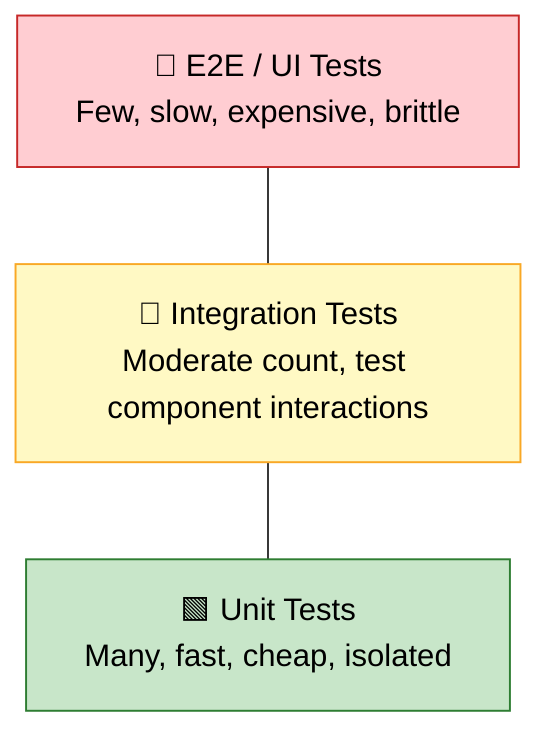
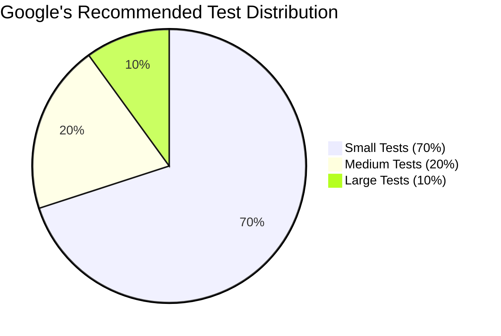
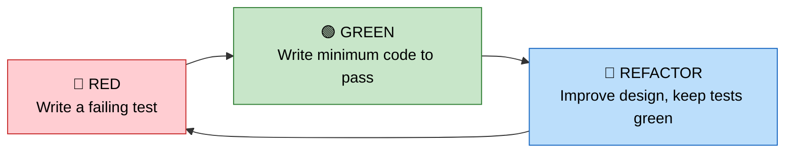
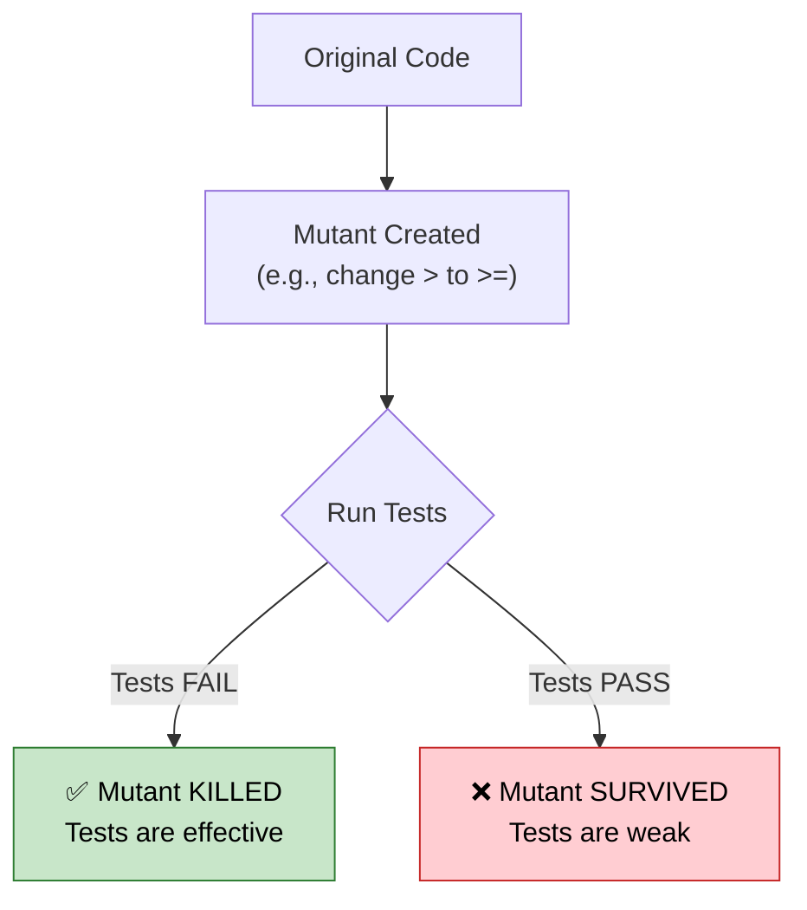

# Java Testing — Comprehensive Guide for FAANG Interview Preparation

**Target audience:** Experienced Java developers preparing for Google, Meta, Amazon, Apple, and other top-tier technical interviews. Covers JUnit 5, Mockito, Spring Boot testing, TDD, mutation testing, and the testing philosophies that define engineering excellence at scale.

[← Previous: Design Patterns](09-Java-Design-Patterns-Guide.md) | [Home](README.md) | [Next: Performance Tuning →](11-Java-Performance-Tuning-Guide.md)

---

## Table of Contents

1. [Why Testing Matters](#1-why-testing-matters)
2. [Google's Testing Philosophy](#2-googles-testing-philosophy)
3. [JUnit 5 (Jupiter)](#3-junit-5-jupiter)
4. [Mockito](#4-mockito)
5. [Testing Best Practices](#5-testing-best-practices)
6. [Testing Exceptions](#6-testing-exceptions)
7. [Testing Async Code](#7-testing-async-code)
8. [Integration Testing with Spring Boot](#8-integration-testing-with-spring-boot)
9. [TestContainers](#9-testcontainers)
10. [Code Coverage](#10-code-coverage)
11. [TDD Workflow](#11-tdd-workflow)
12. [Mutation Testing](#12-mutation-testing)
13. [Interview-Focused Summary](#13-interview-focused-summary)

---

## 1. Why Testing Matters

### 1.1 The Cost of Bugs Over Time

A defect found during unit testing costs **1x** to fix. The same defect found in production costs **100x or more** — not just in engineering hours, but in lost revenue, damaged reputation, and incident response overhead.

| Stage Detected | Relative Fix Cost | Example |
|---|---|---|
| **Design** | 1x | Caught in code review |
| **Unit Testing** | 2–5x | Test fails locally |
| **Integration Testing** | 10–15x | CI pipeline catches it |
| **QA / Staging** | 20–50x | Manual tester files a bug |
| **Production** | 100–1000x | Customer-facing outage, rollback, postmortem |

### 1.2 Testing as Documentation

Well-written tests serve as **living documentation**. They describe *what* the system does under specific conditions — in executable form. Unlike comments or wikis, tests fail when they go stale.

### 1.3 Confidence to Refactor

Without tests, refactoring is gambling. With a comprehensive test suite, you can restructure code aggressively and know within seconds if you broke something. This is non-negotiable at FAANG scale where services are refactored continuously.

### 1.4 CI/CD Prerequisite

No serious CI/CD pipeline ships code without automated tests. Tests are the gate that separates "code that compiles" from "code that works."

### 1.5 The Testing Pyramid



**Pyramid principles:**

- **Unit tests** form the base: they are fast (milliseconds), isolated, and test individual functions/classes. You should have **thousands** of them.
- **Integration tests** sit in the middle: they verify that components work together (database queries, REST endpoints, message queues). Slower, but essential.
- **E2E / UI tests** are at the top: they test the entire system from the user's perspective. They are slow, flaky, and expensive — keep them minimal.

> **FAANG Insight:** An inverted pyramid (many E2E tests, few unit tests) is a classic anti-pattern called the "ice cream cone." It leads to slow CI pipelines and brittle test suites.

---

## 2. Google's Testing Philosophy

Google classifies tests by **size**, not by type. Size determines what resources a test is allowed to use and how it is scheduled.

### 2.1 Test Size Definitions

| Size | Constraints | Typical Duration | What It Tests |
|---|---|---|---|
| **Small** | Single process, no I/O, no network, no database, no sleep | < 100 ms | Pure logic, algorithms, data transformations |
| **Medium** | Single machine, localhost I/O allowed, database access OK | < 300 s | Service + database, file I/O, local server |
| **Large** | Multi-machine, full network access, external services | < 900 s | End-to-end flows, multi-service integration |

### 2.2 Recommended Distribution



### 2.3 Key Principles

1. **Test behavior, not implementation** — Tests should verify *what* a method does, not *how* it does it internally. Refactoring should not break tests.
2. **Every bug gets a test** — When a bug is found, write a test that reproduces it *before* fixing it. This prevents regressions.
3. **Tests are production code** — They deserve the same care: readability, refactoring, code review.
4. **Prefer real objects over mocks** — Use fakes and real collaborators when practical. Over-mocking leads to tests that pass even when the system is broken.
5. **Flaky tests are treated as bugs** — A flaky test is worse than no test because it erodes trust in the entire suite.

> **Interview Tip:** When asked about testing philosophy, referencing Google's test-size framework and the 70/20/10 rule immediately signals depth.

---

## 3. JUnit 5 (Jupiter)

### 3.1 Architecture

JUnit 5 is not a single library — it is a platform composed of three modules:

| Module | Role |
|---|---|
| **JUnit Platform** | Foundation for launching test frameworks on the JVM. Defines the `TestEngine` API. |
| **JUnit Jupiter** | The new programming model and extension model for writing tests in JUnit 5. |
| **JUnit Vintage** | Backward-compatible `TestEngine` that runs JUnit 3 and JUnit 4 tests on the JUnit 5 platform. |

### 3.2 Dependency Setup

**Maven (`pom.xml`):**

```xml
<dependencies>
    <dependency>
        <groupId>org.junit.jupiter</groupId>
        <artifactId>junit-jupiter</artifactId>
        <version>5.10.2</version>
        <scope>test</scope>
    </dependency>
</dependencies>

<build>
    <plugins>
        <plugin>
            <groupId>org.apache.maven.plugins</groupId>
            <artifactId>maven-surefire-plugin</artifactId>
            <version>3.2.5</version>
        </plugin>
    </plugins>
</build>
```

**Gradle (`build.gradle`):**

```java
dependencies {
    testImplementation 'org.junit.jupiter:junit-jupiter:5.10.2'
}

test {
    useJUnitPlatform()
}
```

### 3.3 Core Annotations

| Annotation | Purpose | Scope |
|---|---|---|
| `@Test` | Marks a method as a test | Method |
| `@BeforeEach` | Runs before **each** test method | Method |
| `@AfterEach` | Runs after **each** test method | Method |
| `@BeforeAll` | Runs once before **all** tests in the class (must be `static`) | Class |
| `@AfterAll` | Runs once after **all** tests in the class (must be `static`) | Class |
| `@DisplayName` | Custom display name for the test | Method / Class |
| `@Disabled` | Disables a test or class | Method / Class |
| `@Tag` | Tags for filtering (e.g., `"slow"`, `"integration"`) | Method / Class |
| `@Nested` | Declares a nested test class for grouping | Class |
| `@RepeatedTest(n)` | Repeats the test `n` times | Method |
| `@Timeout` | Fails if execution exceeds the time limit | Method / Class |

### 3.4 Test Lifecycle

By default, JUnit 5 creates a **new instance** of the test class for each test method (`PER_METHOD`). This ensures complete isolation between tests.

```java
@TestInstance(TestInstance.Lifecycle.PER_CLASS)
class SharedStateTest {
    private int counter = 0;

    @BeforeAll
    void initOnce() { // no longer needs to be static
        counter = 100;
    }

    @Test
    void firstTest() {
        assertEquals(100, counter);
        counter++;
    }

    @Test
    void secondTest() {
        // WARNING: counter value depends on execution order — generally avoid shared mutable state
    }
}
```

### 3.5 Assertions

#### Standard Assertions

```java
import static org.junit.jupiter.api.Assertions.*;

class UserServiceTest {

    @Test
    @DisplayName("should create user with correct defaults")
    void createUser_withValidInput_returnsUserWithDefaults() {
        UserService service = new UserService();

        User user = service.createUser("alice@example.com", "Alice");

        assertEquals("alice@example.com", user.getEmail());
        assertNotEquals("bob@example.com", user.getEmail());
        assertTrue(user.isActive());
        assertFalse(user.isAdmin());
        assertNotNull(user.getCreatedAt());
        assertNull(user.getDeletedAt());
    }
}
```

#### assertThrows — Exception Testing

```java
@Test
void createUser_withNullEmail_throwsIllegalArgument() {
    UserService service = new UserService();

    IllegalArgumentException ex = assertThrows(
        IllegalArgumentException.class,
        () -> service.createUser(null, "Alice")
    );

    assertEquals("Email must not be null", ex.getMessage());
}
```

#### assertAll — Grouped Assertions

When multiple assertions are related, `assertAll` runs them **all** and reports every failure instead of stopping at the first:

```java
@Test
void createUser_returnsCompleteUserObject() {
    User user = service.createUser("alice@example.com", "Alice");

    assertAll("user properties",
        () -> assertEquals("alice@example.com", user.getEmail()),
        () -> assertEquals("Alice", user.getName()),
        () -> assertTrue(user.isActive()),
        () -> assertNotNull(user.getId())
    );
}
```

#### Timeout Assertions

```java
@Test
void fetchReport_completesWithinTimeout() {
    assertTimeout(Duration.ofSeconds(2), () -> {
        reportService.generateMonthlyReport(); // runs in same thread
    });
}

@Test
void fetchReport_preemptivelyAborted() {
    assertTimeoutPreemptively(Duration.ofMillis(500), () -> {
        reportService.generateMonthlyReport(); // runs in separate thread, killed on timeout
    });
}
```

#### Custom Assertion Messages with Lazy Evaluation

```java
@Test
void balanceCheck() {
    Account account = accountService.getAccount("ACC-001");

    assertEquals(1000.0, account.getBalance(),
        () -> "Expected balance 1000 but got " + account.getBalance()
             + " for account " + account.getId());
}
```

The message supplier (`Supplier<String>`) is only evaluated when the assertion **fails**, avoiding unnecessary string concatenation on success.

### 3.6 Parameterized Tests

Parameterized tests run the same test logic with different inputs, eliminating copy-paste duplication.

```java
@ParameterizedTest
@ValueSource(strings = {"racecar", "madam", "level", "kayak"})
void isPalindrome_withPalindromes_returnsTrue(String word) {
    assertTrue(StringUtils.isPalindrome(word));
}

@ParameterizedTest
@NullAndEmptySource
@ValueSource(strings = {"  ", "\t", "\n"})
void isBlank_withBlankStrings_returnsTrue(String input) {
    assertTrue(StringUtils.isBlank(input));
}
```

#### @CsvSource and @CsvFileSource

```java
@ParameterizedTest
@CsvSource({
    "1,  1,  2",
    "5,  3,  8",
    "-1, 1,  0",
    "0,  0,  0"
})
void add_withVariousInputs_returnsExpectedSum(int a, int b, int expected) {
    assertEquals(expected, calculator.add(a, b));
}

@ParameterizedTest
@CsvFileSource(resources = "/test-data/discount-rates.csv", numLinesToSkip = 1)
void calculateDiscount_fromCsvFile(String tier, double rate) {
    assertEquals(rate, discountService.getRateForTier(tier), 0.01);
}
```

#### @EnumSource

```java
@ParameterizedTest
@EnumSource(value = OrderStatus.class, names = {"PENDING", "PROCESSING"})
void isActiveStatus_returnsTrue(OrderStatus status) {
    assertTrue(status.isActive());
}
```

#### @MethodSource

```java
@ParameterizedTest
@MethodSource("provideOrdersForValidation")
void validateOrder_withEdgeCases(Order order, boolean expectedValid) {
    assertEquals(expectedValid, orderValidator.isValid(order));
}

static Stream<Arguments> provideOrdersForValidation() {
    return Stream.of(
        Arguments.of(new Order("ORD-1", List.of(item1), 99.99), true),
        Arguments.of(new Order("ORD-2", List.of(), 0.0), false),
        Arguments.of(new Order(null, List.of(item1), 50.0), false)
    );
}
```

#### Custom ArgumentsProvider

```java
class RandomOrderProvider implements ArgumentsProvider {
    @Override
    public Stream<? extends Arguments> provideArguments(ExtensionContext ctx) {
        return IntStream.range(0, 5)
            .mapToObj(i -> Arguments.of(OrderFixture.randomOrder()));
    }
}

@ParameterizedTest
@ArgumentsSource(RandomOrderProvider.class)
void processOrder_withRandomOrders_doesNotThrow(Order order) {
    assertDoesNotThrow(() -> orderProcessor.process(order));
}
```

### 3.7 Nested Tests — BDD-Style Grouping

```java
@DisplayName("Stack")
class StackTest {

    Stack<Integer> stack;

    @BeforeEach
    void setUp() {
        stack = new Stack<>();
    }

    @Nested
    @DisplayName("when new")
    class WhenNew {

        @Test
        @DisplayName("is empty")
        void isEmpty() {
            assertTrue(stack.isEmpty());
        }

        @Test
        @DisplayName("throws on pop")
        void throwsOnPop() {
            assertThrows(EmptyStackException.class, stack::pop);
        }

        @Nested
        @DisplayName("after pushing an element")
        class AfterPush {

            @BeforeEach
            void pushElement() {
                stack.push(42);
            }

            @Test
            @DisplayName("is no longer empty")
            void isNotEmpty() {
                assertFalse(stack.isEmpty());
            }

            @Test
            @DisplayName("returns element on pop")
            void returnsOnPop() {
                assertEquals(42, stack.pop());
                assertTrue(stack.isEmpty());
            }
        }
    }
}
```

### 3.8 Dynamic Tests

```java
@TestFactory
Stream<DynamicTest> dynamicTestsFromMap() {
    Map<String, Integer> testData = Map.of(
        "one", 1,
        "two", 2,
        "three", 3
    );

    return testData.entrySet().stream()
        .map(entry -> DynamicTest.dynamicTest(
            "parse '" + entry.getKey() + "' -> " + entry.getValue(),
            () -> assertEquals(entry.getValue(), WordParser.parse(entry.getKey()))
        ));
}
```

### 3.9 Test Ordering

```java
@TestMethodOrder(MethodOrderer.OrderAnnotation.class)
class OrderedTest {

    @Test @Order(1)
    void createAccount() { /* ... */ }

    @Test @Order(2)
    void depositFunds() { /* ... */ }

    @Test @Order(3)
    void withdrawFunds() { /* ... */ }
}
```

Other orderers: `MethodOrderer.Random` (detect order-dependent tests), `MethodOrderer.MethodName` (alphabetical).

### 3.10 Conditional Execution

```java
@Test
@EnabledOnOs(OS.LINUX)
void onlyOnLinux() { /* ... */ }

@Test
@EnabledOnJre(JRE.JAVA_17)
void onlyOnJava17() { /* ... */ }

@Test
@EnabledIfEnvironmentVariable(named = "CI", matches = "true")
void onlyOnCI() { /* ... */ }

@Test
@EnabledIf("customCondition")
void conditionallyEnabled() { /* ... */ }

boolean customCondition() {
    return LocalDate.now().getDayOfWeek() != DayOfWeek.SUNDAY;
}
```

---

## 4. Mockito

### 4.1 Why Mocking?

A **unit test** should test a single unit in isolation. When a class depends on a database, HTTP client, or message queue, you replace those dependencies with **mocks** — controlled substitutes that let you verify behavior without real I/O.

### 4.2 Setup with JUnit 5

```xml
<dependency>
    <groupId>org.mockito</groupId>
    <artifactId>mockito-junit-jupiter</artifactId>
    <version>5.11.0</version>
    <scope>test</scope>
</dependency>
```

```java
@ExtendWith(MockitoExtension.class)
class OrderServiceTest {

    @Mock
    private OrderRepository orderRepository;

    @Mock
    private PaymentGateway paymentGateway;

    @InjectMocks
    private OrderService orderService;
}
```

### 4.3 Core Annotations

| Annotation | Purpose |
|---|---|
| `@Mock` | Creates a mock instance of the class/interface |
| `@InjectMocks` | Creates a real instance and injects `@Mock` / `@Spy` fields into it |
| `@Spy` | Wraps a real object — real methods run unless explicitly stubbed |
| `@Captor` | Shorthand for `ArgumentCaptor.forClass(...)` |

### 4.4 Stubbing

#### Basic Stubbing

```java
@Test
void getOrderTotal_returnsCalculatedTotal() {
    Order order = new Order("ORD-001", List.of(
        new LineItem("Widget", 2, 25.00),
        new LineItem("Gadget", 1, 49.99)
    ));

    when(orderRepository.findById("ORD-001")).thenReturn(Optional.of(order));

    double total = orderService.getOrderTotal("ORD-001");

    assertEquals(99.99, total, 0.01);
}
```

#### Stubbing Exceptions

```java
when(paymentGateway.charge(any(), anyDouble()))
    .thenThrow(new PaymentDeclinedException("Insufficient funds"));
```

#### doReturn / doThrow / doNothing — For Spies and Void Methods

```java
// Void methods cannot use when(...).thenReturn(...)
doNothing().when(emailService).sendConfirmation(any());
doThrow(new SmtpException("timeout")).when(emailService).sendConfirmation(any());

// Spies: when(...).thenReturn() calls the real method before stubbing — use doReturn instead
List<String> spyList = spy(new ArrayList<>());
doReturn(100).when(spyList).size();
```

#### thenAnswer — Dynamic Responses

```java
when(idGenerator.nextId()).thenAnswer(invocation -> UUID.randomUUID().toString());

when(orderRepository.save(any(Order.class))).thenAnswer(invocation -> {
    Order saved = invocation.getArgument(0);
    saved.setId(UUID.randomUUID().toString());
    return saved;
});
```

### 4.5 Verification

```java
@Test
void placeOrder_chargesPaymentAndSendsEmail() {
    Order order = new Order("ORD-001", 99.99);
    when(orderRepository.save(any())).thenReturn(order);

    orderService.placeOrder(order);

    verify(paymentGateway).charge("ORD-001", 99.99);
    verify(emailService).sendConfirmation(order);
    verify(paymentGateway, times(1)).charge(anyString(), anyDouble());
    verify(auditLog, never()).logFailure(any());
}
```

#### verifyNoMoreInteractions / verifyNoInteractions

```java
verify(orderRepository).save(order);
verifyNoMoreInteractions(orderRepository); // fails if any other method was called

verifyNoInteractions(auditLog); // fails if auditLog was touched at all
```

#### InOrder Verification

```java
@Test
void placeOrder_chargesBeforeSaving() {
    orderService.placeOrder(order);

    InOrder inOrder = inOrder(paymentGateway, orderRepository);
    inOrder.verify(paymentGateway).charge(anyString(), anyDouble());
    inOrder.verify(orderRepository).save(any(Order.class));
}
```

### 4.6 Argument Matchers

```java
verify(repository).findByStatus(eq(OrderStatus.ACTIVE));
verify(gateway).charge(anyString(), anyDouble());
verify(logger).log(argThat(msg -> msg.contains("ORD-001")));
```

> **Critical Rule:** If one argument uses a matcher, **all** arguments must use matchers. `verify(mock).method(eq("literal"), anyInt())` — not `verify(mock).method("literal", anyInt())`.

#### Custom ArgumentMatcher

```java
class IsPositiveAmount implements ArgumentMatcher<Double> {
    @Override
    public boolean matches(Double amount) {
        return amount != null && amount > 0;
    }
}

verify(paymentGateway).charge(anyString(), argThat(new IsPositiveAmount()));
```

### 4.7 Argument Captors

Captors let you capture the actual argument passed to a mock and inspect it in detail:

```java
@Captor
private ArgumentCaptor<NotificationEvent> eventCaptor;

@Test
void placeOrder_publishesCorrectEvent() {
    orderService.placeOrder(order);

    verify(eventPublisher).publish(eventCaptor.capture());

    NotificationEvent captured = eventCaptor.getValue();
    assertEquals("ORDER_PLACED", captured.getType());
    assertEquals("ORD-001", captured.getOrderId());
    assertNotNull(captured.getTimestamp());
}
```

For multiple invocations, use `eventCaptor.getAllValues()` to get a list.

### 4.8 Spy vs Mock

| Aspect | Mock | Spy |
|---|---|---|
| **Underlying object** | Entirely fake — no real implementation | Wraps a **real** object |
| **Default behavior** | Returns defaults (null, 0, false, empty) | Calls the **real method** |
| **Stubbing** | `when(...).thenReturn(...)` | `doReturn(...).when(...)` (preferred to avoid real call) |
| **Use case** | External dependencies (DB, HTTP, queues) | Partial mocking, verifying calls on real objects |

```java
@Spy
private List<String> spyList = new ArrayList<>();

@Test
void spyDemonstration() {
    spyList.add("one");
    spyList.add("two");

    verify(spyList, times(2)).add(anyString());
    assertEquals(2, spyList.size()); // real list — actually has 2 elements

    doReturn(100).when(spyList).size();
    assertEquals(100, spyList.size()); // stubbed
}
```

> **Interview Tip:** "Use mocks for things you don't own (external APIs, databases). Use spies sparingly — if you need to spy, you might have a design problem."

### 4.9 Mocking Static Methods (Mockito 3.4+)

```java
@Test
void generateReport_usesCurrentTimestamp() {
    LocalDateTime fixedTime = LocalDateTime.of(2025, 1, 15, 10, 30);

    try (MockedStatic<LocalDateTime> mockedStatic = Mockito.mockStatic(LocalDateTime.class)) {
        mockedStatic.when(LocalDateTime::now).thenReturn(fixedTime);

        Report report = reportService.generate();

        assertEquals(fixedTime, report.getGeneratedAt());
    } // static mock is automatically closed
}
```

### 4.10 Mocking Constructors (Mockito 3.5+)

```java
@Test
void processFile_mocksInternalReader() {
    try (MockedConstruction<FileReader> mocked = Mockito.mockConstruction(FileReader.class,
            (mock, context) -> when(mock.readLine()).thenReturn("mocked line"))) {

        String result = fileProcessor.process("input.txt");

        assertEquals("MOCKED LINE", result);
        assertEquals(1, mocked.constructed().size());
    }
}
```

### 4.11 BDD Mockito

For teams using **Given-When-Then** style, Mockito provides BDD-friendly aliases:

```java
import static org.mockito.BDDMockito.*;

@Test
void shouldReturnOrderWhenExists() {
    // Given
    given(orderRepository.findById("ORD-001")).willReturn(Optional.of(order));

    // When
    Order result = orderService.getOrder("ORD-001");

    // Then
    then(orderRepository).should().findById("ORD-001");
    assertEquals(order, result);
}
```

---

## 5. Testing Best Practices

### 5.1 AAA Pattern

Every test should follow **Arrange → Act → Assert**:

```java
@Test
void applyDiscount_withGoldTier_applies20PercentOff() {
    // Arrange
    PricingService service = new PricingService();
    Customer customer = new Customer("C-001", Tier.GOLD);
    BigDecimal originalPrice = new BigDecimal("100.00");

    // Act
    BigDecimal discounted = service.applyDiscount(customer, originalPrice);

    // Assert
    assertEquals(new BigDecimal("80.00"), discounted);
}
```

### 5.2 One Concept Per Test

Each test should verify **one behavior**. If a test name requires "and," split it.

```java
// BAD: tests two behaviors
@Test
void createAndActivateUser() { /* ... */ }

// GOOD: separate concerns
@Test
void createUser_setsStatusToInactive() { /* ... */ }

@Test
void activateUser_setsStatusToActive() { /* ... */ }
```

### 5.3 Test Naming Conventions

| Convention | Example |
|---|---|
| `methodName_condition_expectedResult` | `withdraw_insufficientFunds_throwsException` |
| `should_expected_when_condition` | `should_throwException_when_fundsInsufficient` |
| `@DisplayName` (human-readable) | `@DisplayName("rejects withdrawal when balance is insufficient")` |

### 5.4 FIRST Principles

| Letter | Principle | Meaning |
|---|---|---|
| **F** | Fast | Tests run in milliseconds, not seconds |
| **I** | Isolated | No shared state, no execution order dependency |
| **R** | Repeatable | Same result every time, in every environment |
| **S** | Self-validating | Pass or fail — no manual log inspection |
| **T** | Timely | Written close to the code they test (ideally before, per TDD) |

### 5.5 Rules to Live By

- **Don't test private methods** — test them through the public API. If a private method is complex enough to need its own tests, extract it into a separate class.
- **Test edge cases** — `null` inputs, empty collections, boundary values (`Integer.MAX_VALUE`), negative numbers, concurrent access.
- **Avoid test interdependence** — tests must pass when run in isolation or in any order.
- **No logic in tests** — no `if/else`, no loops, no `try/catch`. A test with logic needs its own test.
- **Use test fixtures wisely** — `@BeforeEach` for common setup, but don't hide critical context. Readers should understand a test without jumping to setup.
- **Given-When-Then** — even if you don't use BDD Mockito, structure tests with clear sections.

---

## 6. Testing Exceptions

### 6.1 assertThrows Pattern

```java
@Test
void transfer_negativeAmount_throwsIllegalArgument() {
    IllegalArgumentException ex = assertThrows(
        IllegalArgumentException.class,
        () -> bankService.transfer("ACC-1", "ACC-2", -500.0)
    );

    assertTrue(ex.getMessage().contains("positive"));
}
```

### 6.2 Verifying Exception Message and Cause

```java
@Test
void processPayment_gatewayFailure_wrapsException() {
    when(paymentGateway.charge(any(), anyDouble()))
        .thenThrow(new IOException("Connection refused"));

    PaymentException ex = assertThrows(
        PaymentException.class,
        () -> orderService.processPayment(order)
    );

    assertEquals("Payment processing failed for ORD-001", ex.getMessage());
    assertInstanceOf(IOException.class, ex.getCause());
    assertEquals("Connection refused", ex.getCause().getMessage());
}
```

### 6.3 Asserting No Exception

```java
@Test
void processOrder_validInput_doesNotThrow() {
    assertDoesNotThrow(() -> orderService.processOrder(validOrder));
}
```

---

## 7. Testing Async Code

### 7.1 CompletableFuture.join()

```java
@Test
void fetchUserAsync_returnsUser() {
    when(userClient.fetchAsync("U-001"))
        .thenReturn(CompletableFuture.completedFuture(expectedUser));

    CompletableFuture<User> future = userService.fetchUserAsync("U-001");

    User result = future.join(); // blocks until complete
    assertEquals(expectedUser, result);
}
```

### 7.2 Awaitility — Polling-Based Assertions

**Awaitility** is a DSL for testing async code that eventually produces a result:

```xml
<dependency>
    <groupId>org.awaitility</groupId>
    <artifactId>awaitility</artifactId>
    <version>4.2.1</version>
    <scope>test</scope>
</dependency>
```

```java
import static org.awaitility.Awaitility.await;

@Test
void orderProcessor_eventuallyProcessesOrder() {
    orderQueue.submit(order);

    await()
        .atMost(Duration.ofSeconds(5))
        .pollInterval(Duration.ofMillis(200))
        .untilAsserted(() -> {
            Order processed = orderRepository.findById(order.getId()).orElseThrow();
            assertEquals(OrderStatus.COMPLETED, processed.getStatus());
        });
}
```

### 7.3 Timeout Assertions

```java
@Test
@Timeout(value = 3, unit = TimeUnit.SECONDS)
void longRunningCalculation_completesInTime() {
    BigInteger result = mathService.computePrimeFactors(BigInteger.valueOf(1_000_000_007L));
    assertNotNull(result);
}
```

---

## 8. Integration Testing with Spring Boot

### 8.1 @SpringBootTest

Loads the **full application context**. Suitable for end-to-end integration tests.

```java
@SpringBootTest(webEnvironment = SpringBootTest.WebEnvironment.RANDOM_PORT)
class OrderIntegrationTest {

    @Autowired
    private TestRestTemplate restTemplate;

    @Test
    void createOrder_returns201() {
        OrderRequest request = new OrderRequest("Widget", 3, 25.00);

        ResponseEntity<OrderResponse> response = restTemplate.postForEntity(
            "/api/orders", request, OrderResponse.class
        );

        assertEquals(HttpStatus.CREATED, response.getStatusCode());
        assertNotNull(response.getBody().getId());
    }
}
```

### 8.2 @WebMvcTest — Controller Layer Only

Loads only the web layer (controllers, filters, converters). Dependencies must be mocked.

```java
@WebMvcTest(OrderController.class)
class OrderControllerTest {

    @Autowired
    private MockMvc mockMvc;

    @MockBean
    private OrderService orderService;

    @Test
    void getOrder_existingId_returns200() throws Exception {
        Order order = new Order("ORD-001", "Widget", 99.99);
        when(orderService.findById("ORD-001")).thenReturn(Optional.of(order));

        mockMvc.perform(get("/api/orders/ORD-001")
                .accept(MediaType.APPLICATION_JSON))
            .andExpect(status().isOk())
            .andExpect(jsonPath("$.id").value("ORD-001"))
            .andExpect(jsonPath("$.total").value(99.99));
    }

    @Test
    void getOrder_nonExistentId_returns404() throws Exception {
        when(orderService.findById("INVALID")).thenReturn(Optional.empty());

        mockMvc.perform(get("/api/orders/INVALID"))
            .andExpect(status().isNotFound());
    }
}
```

### 8.3 @DataJpaTest — Repository Layer

Loads JPA components only, with an **in-memory H2 database** by default. Transactions are rolled back after each test.

```java
@DataJpaTest
class OrderRepositoryTest {

    @Autowired
    private OrderRepository orderRepository;

    @Autowired
    private TestEntityManager entityManager;

    @Test
    void findByStatus_returnsMatchingOrders() {
        entityManager.persist(new OrderEntity("ORD-1", OrderStatus.ACTIVE, 50.0));
        entityManager.persist(new OrderEntity("ORD-2", OrderStatus.CANCELLED, 30.0));
        entityManager.persist(new OrderEntity("ORD-3", OrderStatus.ACTIVE, 70.0));
        entityManager.flush();

        List<OrderEntity> activeOrders = orderRepository.findByStatus(OrderStatus.ACTIVE);

        assertEquals(2, activeOrders.size());
        assertTrue(activeOrders.stream().allMatch(o -> o.getStatus() == OrderStatus.ACTIVE));
    }
}
```

### 8.4 @MockBean vs @SpyBean

| Annotation | What It Does | When to Use |
|---|---|---|
| `@MockBean` | Replaces a bean in the Spring context with a Mockito **mock** | When you want to completely control the dependency |
| `@SpyBean` | Wraps the real bean with a Mockito **spy** | When you want real behavior but need to verify or override specific calls |

### 8.5 @TestConfiguration

```java
@TestConfiguration
class TestSecurityConfig {
    @Bean
    public SecurityFilterChain testFilterChain(HttpSecurity http) throws Exception {
        return http.csrf(c -> c.disable())
            .authorizeHttpRequests(auth -> auth.anyRequest().permitAll())
            .build();
    }
}

@SpringBootTest
@Import(TestSecurityConfig.class)
class SecuredEndpointTest { /* ... */ }
```

### 8.6 Test Slices Comparison

| Annotation | What It Loads | Use Case |
|---|---|---|
| `@SpringBootTest` | Full application context | End-to-end integration |
| `@WebMvcTest` | Controllers, filters, advice | Controller unit tests |
| `@DataJpaTest` | JPA repositories, EntityManager, H2 | Repository tests |
| `@DataMongoTest` | MongoDB repositories, MongoTemplate | MongoDB repository tests |
| `@WebFluxTest` | WebFlux controllers | Reactive controller tests |
| `@RestClientTest` | RestTemplate/WebClient auto-config | External API client tests |
| `@JsonTest` | Jackson ObjectMapper, JsonPath | JSON serialization tests |

> **Interview Tip:** "Test slices are faster than `@SpringBootTest` because they load only a subset of the context. Use the narrowest slice that covers your test scenario."

---

## 9. TestContainers

### 9.1 What It Solves

In-memory databases (H2) behave differently from production databases (PostgreSQL, MySQL). **TestContainers** spins up real databases (and other services) inside Docker containers during tests — giving you production-parity without environment setup.

### 9.2 Setup

```xml
<dependency>
    <groupId>org.testcontainers</groupId>
    <artifactId>junit-jupiter</artifactId>
    <version>1.19.7</version>
    <scope>test</scope>
</dependency>
<dependency>
    <groupId>org.testcontainers</groupId>
    <artifactId>postgresql</artifactId>
    <version>1.19.7</version>
    <scope>test</scope>
</dependency>
```

### 9.3 PostgreSQL Integration Test

```java
@SpringBootTest
@Testcontainers
class OrderRepositoryPostgresTest {

    @Container
    static PostgreSQLContainer<?> postgres = new PostgreSQLContainer<>("postgres:16-alpine")
        .withDatabaseName("testdb")
        .withUsername("test")
        .withPassword("test");

    @DynamicPropertySource
    static void configureProperties(DynamicPropertyRegistry registry) {
        registry.add("spring.datasource.url", postgres::getJdbcUrl);
        registry.add("spring.datasource.username", postgres::getUsername);
        registry.add("spring.datasource.password", postgres::getPassword);
    }

    @Autowired
    private OrderRepository orderRepository;

    @Test
    void save_persistsToRealPostgres() {
        OrderEntity order = new OrderEntity("ORD-001", OrderStatus.ACTIVE, 150.0);

        OrderEntity saved = orderRepository.save(order);

        assertNotNull(saved.getId());
        assertEquals("ORD-001", saved.getOrderNumber());
    }
}
```

### 9.4 Generic Containers

TestContainers can run **any** Docker image:

```java
@Container
static GenericContainer<?> redis = new GenericContainer<>("redis:7-alpine")
    .withExposedPorts(6379);

@Test
void cacheIntegration() {
    String host = redis.getHost();
    int port = redis.getMappedPort(6379);
    // connect to Redis at host:port
}
```

---

## 10. Code Coverage

### 10.1 What It Measures

| Metric | Definition | Example |
|---|---|---|
| **Line Coverage** | % of code lines executed | Did every line run? |
| **Branch Coverage** | % of branches (if/else) taken | Were both true and false paths hit? |
| **Method Coverage** | % of methods invoked | Was every method called? |
| **Class Coverage** | % of classes with at least one method tested | Were all classes touched? |

### 10.2 JaCoCo Setup (Maven)

```xml
<plugin>
    <groupId>org.jacoco</groupId>
    <artifactId>jacoco-maven-plugin</artifactId>
    <version>0.8.12</version>
    <executions>
        <execution>
            <goals>
                <goal>prepare-agent</goal>
            </goals>
        </execution>
        <execution>
            <id>report</id>
            <phase>test</phase>
            <goals>
                <goal>report</goal>
            </goals>
        </execution>
        <execution>
            <id>check</id>
            <goals>
                <goal>check</goal>
            </goals>
            <configuration>
                <rules>
                    <rule>
                        <element>BUNDLE</element>
                        <limits>
                            <limit>
                                <counter>BRANCH</counter>
                                <value>COVEREDRATIO</value>
                                <minimum>0.70</minimum>
                            </limit>
                        </limits>
                    </rule>
                </rules>
            </configuration>
        </execution>
    </executions>
</plugin>
```

### 10.3 Target Percentage

| Target | Assessment |
|---|---|
| **< 50%** | Dangerously low — major regression risk |
| **70–80%** | Reasonable target for most projects |
| **80–90%** | Good coverage, diminishing returns begin |
| **100%** | Counterproductive — tests for trivial code (getters, setters) add maintenance burden without value |

### 10.4 Coverage ≠ Quality

High coverage does not guarantee good tests. A test that calls a method without meaningful assertions gives coverage but catches nothing.

```java
// 100% line coverage, 0% real testing
@Test
void uselessCoverageTest() {
    service.processOrder(order); // no assertions!
}
```

> **Interview Tip:** "Branch coverage is more valuable than line coverage. A single `if` statement has two branches — you need two tests to fully cover it."

---

## 11. TDD Workflow

### 11.1 Red → Green → Refactor



### 11.2 TDD Cycle in Practice

**Step 1: RED — Write the test first**

```java
@Test
void fromCelsiusToFahrenheit_boilingPoint() {
    TemperatureConverter converter = new TemperatureConverter();
    assertEquals(212.0, converter.celsiusToFahrenheit(100.0), 0.01);
}
// Compile error: TemperatureConverter doesn't exist yet
```

**Step 2: GREEN — Write just enough code to pass**

```java
public class TemperatureConverter {
    public double celsiusToFahrenheit(double celsius) {
        return celsius * 9.0 / 5.0 + 32.0;
    }
}
```

**Step 3: REFACTOR — Improve without changing behavior**

```java
public class TemperatureConverter {
    private static final double SCALE_FACTOR = 9.0 / 5.0;
    private static final double OFFSET = 32.0;

    public double celsiusToFahrenheit(double celsius) {
        return celsius * SCALE_FACTOR + OFFSET;
    }
}
```

### 11.3 Benefits

- **Better design** — writing tests first forces you to think about the API from the consumer's perspective.
- **Confidence** — every line of production code is backed by a test.
- **Living documentation** — tests describe intended behavior.
- **Smaller increments** — you naturally write smaller, more focused methods.

### 11.4 When TDD Is Harder

| Scenario | Why | Alternative |
|---|---|---|
| **UI / Frontend** | Rapid visual iteration, hard to assert layout | Write tests after UI stabilizes |
| **Legacy code** | No existing tests, tightly coupled | Add characterization tests first, then TDD new features |
| **Exploratory / prototyping** | Requirements unclear, design evolving | Spike without tests, then rewrite with TDD |
| **External API integration** | Behavior not under your control | Use contract tests + integration tests |

---

## 12. Mutation Testing

### 12.1 Concept

Code coverage tells you which lines were *executed*. Mutation testing tells you which lines were *actually tested*. It works by introducing small changes (**mutations**) to your code and checking if your tests detect them.



- **Killed mutant** = your tests caught the change (good).
- **Survived mutant** = your tests missed the change (your assertions are too weak or missing).

### 12.2 PITest (PIT) for Java

```xml
<plugin>
    <groupId>org.pitest</groupId>
    <artifactId>pitest-maven</artifactId>
    <version>1.15.8</version>
    <dependencies>
        <dependency>
            <groupId>org.pitest</groupId>
            <artifactId>pitest-junit5-plugin</artifactId>
            <version>1.2.1</version>
        </dependency>
    </dependencies>
    <configuration>
        <targetClasses>
            <param>com.example.service.*</param>
        </targetClasses>
        <targetTests>
            <param>com.example.service.*Test</param>
        </targetTests>
        <mutators>
            <mutator>DEFAULTS</mutator>
        </mutators>
    </configuration>
</plugin>
```

Run with: `mvn org.pitest:pitest-maven:mutationCoverage`

### 12.3 Common Mutation Operators

| Operator | What It Does | Example |
|---|---|---|
| **Conditionals Boundary** | Changes `<` to `<=`, `>` to `>=` | `if (age > 18)` → `if (age >= 18)` |
| **Negate Conditionals** | Flips `==` to `!=`, `<` to `>=` | `if (x == 0)` → `if (x != 0)` |
| **Math** | Changes `+` to `-`, `*` to `/` | `a + b` → `a - b` |
| **Return Values** | Changes return values | `return true` → `return false` |
| **Void Method Calls** | Removes void method calls | `list.clear()` → *(removed)* |
| **Increments** | Changes `++` to `--` | `i++` → `i--` |

### 12.4 Mutation Testing vs Code Coverage

| Metric | Code Coverage | Mutation Testing |
|---|---|---|
| **Measures** | Was the code *executed*? | Was the code *actually tested*? |
| **Can be gamed** | Yes — call without asserting | No — mutations are detected by assertions |
| **Speed** | Fast | Slow (runs tests many times) |
| **Confidence** | Moderate | High |
| **False security** | Common | Rare |

> **Interview Tip:** "Mutation testing is the gold standard for test quality measurement. If a test suite has 95% mutation kill rate, you can be confident the tests are genuinely verifying behavior."

---

## 13. Interview-Focused Summary

### Quick-Fire Q&A

| # | Question | Key Answer |
|---|---|---|
| 1 | What is the testing pyramid? | More unit tests at the base, fewer integration in the middle, fewest E2E/UI at the top. Optimizes for speed and reliability. |
| 2 | Unit test vs integration test? | Unit: single class in isolation, mocked dependencies, fast. Integration: multiple components, real DB/network, slower. |
| 3 | Mock vs Spy? | Mock: entirely fake, all methods return defaults. Spy: wraps real object, calls real methods unless stubbed. |
| 4 | `@MockBean` vs `@Mock`? | `@Mock`: Mockito-only, no Spring context. `@MockBean`: replaces a bean in the Spring ApplicationContext with a mock. |
| 5 | How to test private methods? | Don't. Test through the public API. If it's complex enough, extract to its own class. |
| 6 | What is mutation testing? | Introduce small code changes (mutants). If tests still pass, tests are weak. Stronger quality metric than coverage. |
| 7 | What does `assertAll()` do? | Runs all enclosed assertions and reports all failures, instead of stopping at the first one. |
| 8 | When to use `doReturn` vs `when`? | `doReturn` for spies (avoids calling real method) and void methods. `when` for standard mock stubbing. |
| 9 | What is `@DataJpaTest`? | Test slice that loads only JPA components, uses in-memory DB, and rolls back transactions after each test. |
| 10 | What is TestContainers? | Library that runs real Docker containers (databases, message brokers) during tests for production parity. |
| 11 | What is the AAA pattern? | Arrange (setup), Act (execute), Assert (verify). Standard structure for readable tests. |
| 12 | FIRST principles? | Fast, Isolated, Repeatable, Self-validating, Timely. Guidelines for high-quality unit tests. |
| 13 | How do you test async code? | `CompletableFuture.join()` for direct blocking, Awaitility for polling, `@Timeout` for time limits. |
| 14 | What is TDD? | Red-Green-Refactor: write failing test, make it pass with minimal code, then refactor. Tests drive design. |
| 15 | What is JaCoCo? | Java Code Coverage library. Instruments bytecode to measure line, branch, method, and class coverage. |
| 16 | 100% code coverage — good or bad? | Generally counterproductive. Leads to testing trivial code (getters/setters). 70–80% is a healthy target. |
| 17 | What is `@WebMvcTest`? | Test slice that loads only the web layer (controllers, filters). Dependencies must be mocked with `@MockBean`. |
| 18 | Why avoid logic in tests? | `if/else` and loops in tests make tests harder to read and can mask bugs. Tests should be linear. |
| 19 | What is a flaky test? | A test that passes and fails non-deterministically. Worse than no test because it erodes trust. |
| 20 | Google's test size categories? | Small (single process, no I/O), Medium (single machine, some I/O), Large (multi-machine, full stack). 70/20/10 split. |
| 21 | `assertThrows` pattern? | `var ex = assertThrows(ExType.class, () -> code())` — captures the exception for further assertion on message/cause. |
| 22 | `@Nested` tests purpose? | BDD-style grouping of related tests within a class. Creates readable hierarchies like "when new → after push." |
| 23 | Argument matcher rule? | If one argument uses a matcher (`any()`, `eq()`), ALL arguments in that call must use matchers. |
| 24 | `mockStatic` usage? | `try (MockedStatic<Cls> m = Mockito.mockStatic(Cls.class)) { ... }` — scoped to try block, auto-cleaned. |
| 25 | Branch vs line coverage? | Branch coverage checks if both true/false paths of conditionals were taken. More valuable than line coverage. |

### Testing Strategy Cheat Sheet

```
┌──────────────────────────────────────────────────────────────┐
│                     TESTING STRATEGY                         │
├──────────────────────────────────────────────────────────────┤
│  Layer          │  Tool              │  Annotation           │
│─────────────────│────────────────────│───────────────────────│
│  Unit           │  JUnit 5 + Mockito │  @Test, @Mock         │
│  Controller     │  MockMvc           │  @WebMvcTest          │
│  Repository     │  H2 / TestContainers│ @DataJpaTest         │
│  Integration    │  TestRestTemplate  │  @SpringBootTest      │
│  Contract       │  Spring Cloud Contract│ @AutoConfigureStubRunner│
│  E2E            │  Selenium / Playwright│ Full deployment     │
├──────────────────────────────────────────────────────────────┤
│  Coverage       │  JaCoCo            │  Maven/Gradle plugin  │
│  Mutation       │  PITest            │  Maven plugin          │
│  Async          │  Awaitility        │  await().untilAsserted │
│  Containers     │  TestContainers    │  @Testcontainers      │
└──────────────────────────────────────────────────────────────┘
```

> **Final Interview Advice:** Testing is not just a technical skill — it's a mindset. At FAANG companies, every pull request is expected to include tests. The ability to write clean, targeted, and maintainable tests is as important as writing the production code itself. Focus on testing *behavior*, not *implementation details*, and always ask: "What would break if this code changed?"

---

[← Previous: Design Patterns](09-Java-Design-Patterns-Guide.md) | [Home](README.md) | [Next: Performance Tuning →](11-Java-Performance-Tuning-Guide.md)
