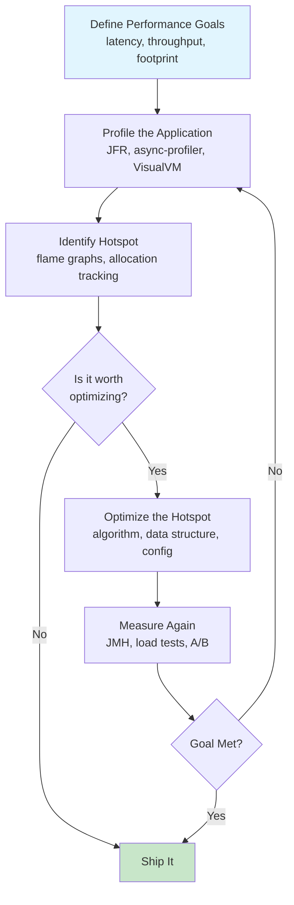
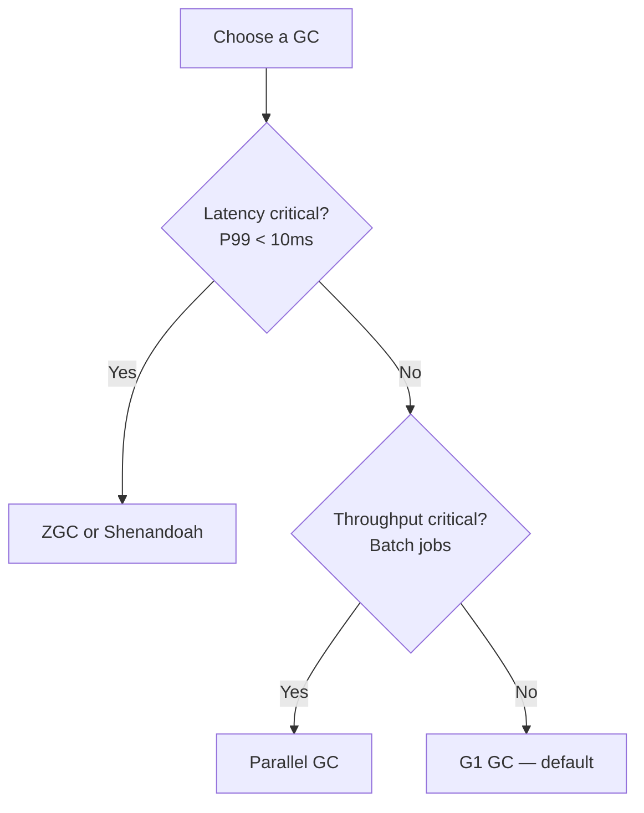

# Java Performance Tuning Guide

> A comprehensive guide to Java performance optimization covering profiling, benchmarking, common pitfalls, and tuning strategies — aimed at senior engineers preparing for FAANG-level system design and coding interviews.

[← Previous: Testing](10-Java-Testing-Guide.md) | [Home](README.md) | [Next: Serialization, I/O & Networking →](12-Java-Serialization-IO-and-Networking.md)

---

## Table of Contents

1. [Performance Mindset](#1-performance-mindset)
2. [String Performance](#2-string-performance)
3. [Collection Performance](#3-collection-performance)
4. [Primitive vs Boxed Types](#4-primitive-vs-boxed-types)
5. [JMH (Java Microbenchmark Harness)](#5-jmh-java-microbenchmark-harness)
6. [Common Performance Pitfalls](#6-common-performance-pitfalls)
7. [Connection Pooling (HikariCP)](#7-connection-pooling-hikaricp)
8. [Lazy Initialization Patterns](#8-lazy-initialization-patterns)
9. [Profiling Tools](#9-profiling-tools)
10. [GC Tuning Quick Reference](#10-gc-tuning-quick-reference)
11. [Application-Level Optimization Strategies](#11-application-level-optimization-strategies)
12. [Interview-Focused Summary](#12-interview-focused-summary)

---

## 1. Performance Mindset

> *"Premature optimization is the root of all evil."* — Donald Knuth

The single most important rule: **measure before you optimize**. Intuition about performance is notoriously unreliable — the JIT compiler, OS scheduler, and hardware caches make modern systems behave in ways that defy surface-level reasoning.

### The Performance Optimization Workflow



### Key Principles

1. **Set quantifiable goals first** — "make it faster" is not a goal. "P99 latency under 50 ms at 10K RPS" is.
2. **Profile in production-like conditions** — local benchmarks miss contention, GC pressure, and I/O patterns.
3. **Optimize the biggest bottleneck** — Amdahl's Law means a 10× speedup of a 5% component yields only 4.7% total improvement.
4. **Algorithmic improvements trump micro-optimizations** — O(n) to O(log n) beats any amount of loop unrolling.

---

## 2. String Performance

Strings are the most-allocated objects in most Java applications. Understanding their internals is critical.

### 2.1 String Immutability

Every `String` in Java is immutable. Concatenation with `+` creates a **new** object each time.

```java
String result = "";
for (int i = 0; i < 100_000; i++) {
    result += i; // creates a new String + StringBuilder per iteration
}
```

The compiler translates each `+=` into roughly:

```text
new StringBuilder(result).append(i).toString()
```

This means **100,000 StringBuilder objects** are created and discarded. The time complexity is **O(n²)** because each iteration copies the entire accumulated string.

### 2.2 StringBuilder vs StringBuffer

| Feature | `StringBuilder` | `StringBuffer` |
|---|---|---|
| Thread-safe | No | Yes (synchronized) |
| Performance | Fast | 15-30% slower due to locking |
| Introduced | Java 5 | Java 1.0 |
| Use when | Single-threaded (99% of cases) | Shared across threads (rare) |

**Rule:** Always use `StringBuilder`. If you need thread safety, rethink the design — sharing a mutable buffer across threads is almost never the right approach.

### 2.3 Concatenation in Loops

```java
// BAD — O(n²), creates n temporary objects
public String joinBad(List<String> items) {
    String result = "";
    for (String item : items) {
        result += item + ",";
    }
    return result;
}

// GOOD — O(n), single buffer
public String joinGood(List<String> items) {
    StringBuilder sb = new StringBuilder(items.size() * 16);
    for (String item : items) {
        sb.append(item).append(',');
    }
    return sb.toString();
}

// BEST — idiomatic Java 8+
public String joinBest(List<String> items) {
    return String.join(",", items);
}
```

> **Interview Tip:** Java 9+ uses `invokedynamic`-based string concat (`StringConcatFactory`) that is faster than explicit `StringBuilder` for **simple** expressions like `a + b + c`. But in loops, explicit `StringBuilder` still wins because it avoids re-allocation per iteration.

### 2.4 String Interning

```java
String a = new String("hello");       // heap allocation
String b = "hello";                    // string pool
String c = a.intern();                 // returns pool reference

System.out.println(b == c);           // true — same pool reference
System.out.println(a == b);           // false — different objects
```

**When interning helps:** Deduplicating millions of repeated strings (e.g., country codes, status enums parsed from CSV).

**When interning hurts:** The string pool is a fixed-size hash table in native memory. Over-interning causes hash collisions and increased GC pressure on the table entries. Tune with `-XX:StringTableSize=` (default ~60013 in modern JVMs).

### 2.5 Java 9+ Compact Strings

Before Java 9, every `char` was 2 bytes (UTF-16). Java 9+ introduced **compact strings**: strings containing only Latin-1 characters use a `byte[]` with 1 byte per character.

| String Content | Pre-Java 9 | Java 9+ |
|---|---|---|
| `"hello"` (ASCII) | 10 bytes | **5 bytes** |
| `"日本語"` (non-Latin) | 6 bytes | 6 bytes (UTF-16) |

This is transparent — no code changes needed. It reduces heap usage by ~20-30% in typical applications.

### 2.6 StringJoiner

```java
StringJoiner sj = new StringJoiner(", ", "[", "]");
sj.add("alpha").add("beta").add("gamma");
System.out.println(sj); // [alpha, beta, gamma]

// Or via Collectors
String csv = list.stream()
    .map(Object::toString)
    .collect(Collectors.joining(", ", "[", "]"));
```

### 2.7 Performance Comparison Table

| Technique | 100K Concats | Relative Speed |
|---|---|---|
| `String +=` in loop | ~4200 ms | 1× (baseline) |
| `StringBuilder` (default capacity) | ~2 ms | ~2100× faster |
| `StringBuilder` (pre-sized) | ~1.5 ms | ~2800× faster |
| `String.join()` | ~2 ms | ~2100× faster |
| `String.format()` | ~45 ms | ~93× faster |

> `String.format()` is convenient but significantly slower than `StringBuilder` due to format string parsing. Avoid in hot paths.

---

## 3. Collection Performance

### 3.1 Initial Capacity Matters

```java
// BAD — ArrayList resizes 17 times to hold 1M elements (10 → 15 → 22 → ... → 1M+)
List<String> list = new ArrayList<>();

// GOOD — single allocation
List<String> list = new ArrayList<>(1_000_000);

// BAD — HashMap with 10K entries rehashes multiple times (default capacity 16)
Map<String, String> map = new HashMap<>();

// GOOD — pre-size to avoid rehashing
// Formula: expectedSize / loadFactor + 1
Map<String, String> map = new HashMap<>(10_000 * 4 / 3 + 1);

// ALSO GOOD — Java 19+ factory (since Java 19)
Map<String, String> map = HashMap.newHashMap(10_000);
```

**HashMap resizing is expensive:** every entry must be re-hashed and re-distributed into the new bucket array. Pre-sizing avoids this entirely.

### 3.2 ArrayList vs LinkedList

`LinkedList` is almost never the right choice. Despite O(1) insertion at head/tail, the constant factors and cache misses make it slower in practice.

| Operation | `ArrayList` | `LinkedList` |
|---|---|---|
| `get(index)` | **O(1)** | O(n) |
| `add(end)` | **O(1) amortized** | O(1) |
| `add(middle)` | O(n) shift | O(1) after locating node |
| Iteration | **Cache-friendly** | Cache-hostile (pointer chasing) |
| Memory per element | **~4 bytes** (reference) | ~24 bytes (node + two pointers) |

> **Interview Tip:** "I'd use `ArrayList` as the default. `LinkedList` is only preferable in very specific queue/deque scenarios, and even then `ArrayDeque` is typically better."

### 3.3 EnumSet and EnumMap

For enum-typed keys, `EnumSet` and `EnumMap` use a **bit vector** internally — no hashing, no collisions, no boxing.

```java
enum Permission { READ, WRITE, EXECUTE, DELETE, ADMIN }

// Uses a single long bitmask — O(1) add/contains/remove
Set<Permission> perms = EnumSet.of(Permission.READ, Permission.WRITE);

// Array-indexed by ordinal — zero hash collisions
Map<Permission, String> descriptions = new EnumMap<>(Permission.class);
```

**Performance:** `EnumSet.contains()` is **5-10× faster** than `HashSet.contains()` for enums.

### 3.4 Iteration Performance

```java
List<Integer> list = new ArrayList<>(List.of(1, 2, 3, 4, 5));

// 1. Classic indexed — fastest for ArrayList (no Iterator allocation)
for (int i = 0, n = list.size(); i < n; i++) {
    process(list.get(i));
}

// 2. Enhanced for-each — compiles to Iterator, negligible overhead
for (Integer val : list) {
    process(val);
}

// 3. Stream — slight overhead from pipeline setup, wins with parallelism
list.stream().forEach(this::process);

// 4. forEach method — marginal difference from for-each
list.forEach(this::process);
```

For `ArrayList`, all four are within 5% of each other. The indexed loop avoids `Iterator` allocation, which matters only in extremely hot code.

### 3.5 Avoid Unnecessary Boxing

```java
// BAD — every int is boxed to Integer, then unboxed for sum
List<Integer> boxed = new ArrayList<>();
int sum = 0;
for (Integer val : boxed) {  // unboxing per element
    sum += val;
}

// GOOD — primitive stream, zero boxing
int sum = IntStream.range(0, 1_000_000).sum();
```

### 3.6 Collection Benchmark Comparison

| Operation (1M elements) | `ArrayList` | `LinkedList` | `HashSet` | `TreeSet` |
|---|---|---|---|---|
| Sequential add | 15 ms | 35 ms | 95 ms | 280 ms |
| `contains()` | 4.5 ms (linear) | 8 ms (linear) | **0.05 ms** | 0.3 ms |
| Iteration | **8 ms** | 22 ms | 15 ms | 18 ms |
| Memory (MB) | **~4** | ~24 | ~32 | ~40 |

---

## 4. Primitive vs Boxed Types

### 4.1 Memory Comparison

| Type | Primitive Size | Boxed Size (64-bit JVM) | Overhead |
|---|---|---|---|
| `int` / `Integer` | 4 bytes | 16 bytes | **4×** |
| `long` / `Long` | 8 bytes | 24 bytes | **3×** |
| `double` / `Double` | 8 bytes | 24 bytes | **3×** |
| `boolean` / `Boolean` | 1 byte | 16 bytes | **16×** |

Every boxed object carries a 12-byte object header (mark word + klass pointer) plus alignment padding.

### 4.2 Autoboxing Overhead in Loops

```java
// BAD — 10M autobox + unbox operations
public long sumBad() {
    Long sum = 0L;                    // boxed
    for (long i = 0; i < 10_000_000; i++) {
        sum += i;                     // unbox → add → rebox (new Long each time)
    }
    return sum;
}
// Time: ~92 ms, allocates ~240 MB of garbage

// GOOD — zero boxing
public long sumGood() {
    long sum = 0L;                    // primitive
    for (long i = 0; i < 10_000_000; i++) {
        sum += i;
    }
    return sum;
}
// Time: ~8 ms, allocates 0 bytes of garbage
```

**That's an 11× difference** from a single character change (`Long` → `long`).

### 4.3 Integer Cache

```java
Integer a = 127;
Integer b = 127;
System.out.println(a == b);   // true — cached

Integer c = 128;
Integer d = 128;
System.out.println(c == d);   // false — new objects

// Extend cache range with: -XX:AutoBoxCacheMax=1000
```

`Integer.valueOf(n)` returns a cached instance for values in [-128, 127] by default. Outside this range, a new object is allocated every time.

### 4.4 Primitive Streams

```java
// BAD — Stream<Integer> boxes every element
int max = list.stream()
    .map(x -> x * 2)              // Integer → Integer (boxing)
    .reduce(0, Integer::max);

// GOOD — IntStream avoids boxing entirely
int max = list.stream()
    .mapToInt(x -> x * 2)         // Integer → int (unbox once)
    .max()
    .orElse(0);
```

### 4.5 Specialized Primitive Collections

For performance-critical systems, consider libraries with primitive-backed collections:

| Library | Primitive Map | Primitive List | Notes |
|---|---|---|---|
| **Eclipse Collections** | `IntIntHashMap` | `IntArrayList` | Most comprehensive |
| **HPPC** | `IntIntHashMap` | `IntArrayList` | Smallest footprint |
| **Koloboke** | `HashIntIntMap` | — | Fastest hash maps |
| JDK (`int[]`) | — | Manual arrays | Zero dependency |

---

## 5. JMH (Java Microbenchmark Harness)

### 5.1 Why Naive Benchmarking Fails

```java
// WRONG — every aspect of this is flawed
long start = System.currentTimeMillis();
for (int i = 0; i < 1_000_000; i++) {
    new String("test");
}
long end = System.currentTimeMillis();
System.out.println("Time: " + (end - start) + " ms");
```

**Problems:**
- **JIT warm-up:** the first few thousand iterations run in interpreter mode, skewing results.
- **Dead code elimination:** the JIT may remove the entire loop because the result is never used.
- **Constant folding:** the JIT may compute the result at compile time.
- **No statistical rigor:** a single run tells you nothing about variance.

### 5.2 Maven Setup

```xml
<dependencies>
    <dependency>
        <groupId>org.openjdk.jmh</groupId>
        <artifactId>jmh-core</artifactId>
        <version>1.37</version>
    </dependency>
    <dependency>
        <groupId>org.openjdk.jmh</groupId>
        <artifactId>jmh-generator-annprocess</artifactId>
        <version>1.37</version>
        <scope>provided</scope>
    </dependency>
</dependencies>
```

### 5.3 Core Annotations

| Annotation | Purpose |
|---|---|
| `@Benchmark` | Marks a method as a benchmark |
| `@BenchmarkMode` | `Throughput`, `AverageTime`, `SampleTime`, `SingleShotTime` |
| `@OutputTimeUnit` | Result time unit (`NANOSECONDS`, `MICROSECONDS`, `MILLISECONDS`) |
| `@State` | Lifecycle scope: `Scope.Thread`, `Scope.Benchmark`, `Scope.Group` |
| `@Setup` / `@TearDown` | `Level.Trial`, `Level.Iteration`, `Level.Invocation` |
| `@Param` | Parameterized benchmarks (e.g., test multiple sizes) |
| `@Fork` | Number of JVM forks (isolates runs from each other) |
| `@Warmup` | Warm-up iterations before measurement |
| `@Measurement` | Actual measurement iterations |

### 5.4 Complete Benchmark Example

```java
@BenchmarkMode(Mode.AverageTime)
@OutputTimeUnit(TimeUnit.NANOSECONDS)
@State(Scope.Thread)
@Fork(2)
@Warmup(iterations = 5, time = 1)
@Measurement(iterations = 5, time = 1)
public class CollectionBenchmark {

    @Param({"100", "10000", "1000000"})
    private int size;

    private ArrayList<Integer> arrayList;
    private LinkedList<Integer> linkedList;

    @Setup(Level.Trial)
    public void setup() {
        arrayList = new ArrayList<>(size);
        linkedList = new LinkedList<>();
        for (int i = 0; i < size; i++) {
            arrayList.add(i);
            linkedList.add(i);
        }
    }

    @Benchmark
    public int arrayListGet(Blackhole bh) {
        int sum = 0;
        for (int i = 0; i < size; i++) {
            sum += arrayList.get(i);
        }
        bh.consume(sum);         // prevent dead code elimination
        return sum;
    }

    @Benchmark
    public int linkedListGet(Blackhole bh) {
        int sum = 0;
        for (int i = 0; i < size; i++) {
            sum += linkedList.get(i);
        }
        bh.consume(sum);
        return sum;
    }

    public static void main(String[] args) throws RunnerException {
        Options opt = new OptionsBuilder()
            .include(CollectionBenchmark.class.getSimpleName())
            .build();
        new Runner(opt).run();
    }
}
```

### 5.5 Common JMH Pitfalls

```java
@Benchmark
public void deadCodeTrap() {
    Math.log(42);  // JIT removes this — result is unused
}

@Benchmark
public double fixedWithReturn() {
    return Math.log(42);  // returning the value prevents DCE
}

@Benchmark
public void fixedWithBlackhole(Blackhole bh) {
    bh.consume(Math.log(42));  // Blackhole consumes the value
}
```

### 5.6 Reading JMH Output

```text
Benchmark                     (size)  Mode  Cnt       Score       Error  Units
CollectionBenchmark.arrayGet     100  avgt    10      42.3 ±     1.2  ns/op
CollectionBenchmark.arrayGet   10000  avgt    10    4201.5 ±    52.3  ns/op
CollectionBenchmark.linkedGet    100  avgt    10     387.1 ±    12.8  ns/op
CollectionBenchmark.linkedGet  10000  avgt    10  2841503.2 ± 15234.1  ns/op
```

**Key columns:** `Score` is the metric, `Error` is the 99.9% confidence interval, `Cnt` is the number of measurement forks × iterations.

---

## 6. Common Performance Pitfalls

### 6.1 Excessive Object Creation

```java
// BAD — creates a new DateTimeFormatter every call
public String formatDate(LocalDateTime dt) {
    return DateTimeFormatter.ofPattern("yyyy-MM-dd HH:mm:ss").format(dt);
}

// GOOD — formatter is immutable and thread-safe, create once
private static final DateTimeFormatter FORMATTER =
    DateTimeFormatter.ofPattern("yyyy-MM-dd HH:mm:ss");

public String formatDate(LocalDateTime dt) {
    return FORMATTER.format(dt);
}
```

### 6.2 Regex Compilation

```java
// BAD — compiles the regex on EVERY call (String.matches compiles internally)
for (String line : lines) {
    if (line.matches("\\d{4}-\\d{2}-\\d{2}")) { /* ... */ }
}

// GOOD — compile once, reuse
private static final Pattern DATE_PATTERN = Pattern.compile("\\d{4}-\\d{2}-\\d{2}");

for (String line : lines) {
    if (DATE_PATTERN.matcher(line).matches()) { /* ... */ }
}
```

`Pattern.compile()` is **50-100× more expensive** than `Matcher.matches()`. In a loop processing millions of lines, this difference is enormous.

### 6.3 Reflection Overhead

```java
// BAD — full reflection lookup + invocation on every call
Method method = obj.getClass().getMethod("process", String.class);
method.invoke(obj, "data");  // ~10-50× slower than direct call

// BETTER — cache the Method reference
private static final Method CACHED_METHOD;
static {
    try {
        CACHED_METHOD = MyClass.class.getMethod("process", String.class);
        CACHED_METHOD.setAccessible(true);  // skip access checks
    } catch (NoSuchMethodException e) { throw new RuntimeException(e); }
}

// BEST (Java 7+) — MethodHandle, can be inlined by JIT
private static final MethodHandle HANDLE;
static {
    try {
        HANDLE = MethodHandles.lookup()
            .findVirtual(MyClass.class, "process",
                MethodType.methodType(void.class, String.class));
    } catch (Exception e) { throw new RuntimeException(e); }
}
```

### 6.4 Exception as Control Flow

```java
// BAD — exceptions are expensive to create (fill in stack trace)
public int parseSafe(String s) {
    try {
        return Integer.parseInt(s);
    } catch (NumberFormatException e) {
        return 0;  // using exception for expected "not a number" case
    }
}

// GOOD — check first, avoid exception
public int parseSafe(String s) {
    if (s == null || !s.chars().allMatch(Character::isDigit)) {
        return 0;
    }
    return Integer.parseInt(s);
}
```

Creating a `Throwable` calls `fillInStackTrace()`, which walks the entire call stack. In deep stacks, this costs **10,000+ ns per exception**.

### 6.5 Pitfall Summary Table

| Pitfall | Impact | Fix |
|---|---|---|
| String `+=` in loop | O(n²) time, massive GC | `StringBuilder` or `String.join()` |
| Autoboxing in loop | 10× slower, garbage creation | Use primitive types |
| `String.matches()` in loop | Regex compiled per call | Pre-compile `Pattern` |
| Reflection per call | 10-50× slower | Cache `Method`/`MethodHandle` |
| Over-synchronization | Thread contention, deadlocks | `ConcurrentHashMap`, fine-grained locks |
| Exceptions for control flow | Stack trace is expensive | Check-then-act pattern |
| Uncapped collections | OOM on unbounded input | Set initial capacity, enforce limits |
| N+1 queries | DB round-trip per entity | `JOIN FETCH`, batch fetching |
| Unnecessary `Arrays.copyOf()` | Redundant allocation + copy | Use views, `Collections.unmodifiableList()` |
| Logging in hot loops | I/O + string formatting overhead | Guard with `log.isDebugEnabled()` |

---

## 7. Connection Pooling (HikariCP)

### 7.1 Why Pooling Matters

Creating a new database connection involves:
1. TCP handshake (~1 ms)
2. TLS negotiation (~5-10 ms if SSL)
3. Database authentication (~2-5 ms)
4. Connection initialization (~1-2 ms)

**Total: ~10-20 ms per connection.** A pool eliminates this cost for subsequent requests by reusing connections.

### 7.2 HikariCP Configuration

```java
HikariConfig config = new HikariConfig();
config.setJdbcUrl("jdbc:postgresql://localhost:5432/mydb");
config.setUsername("app_user");
config.setPassword("secret");

config.setMaximumPoolSize(10);          // max concurrent connections
config.setMinimumIdle(5);               // keep at least 5 idle
config.setConnectionTimeout(30_000);    // 30s wait before timeout
config.setIdleTimeout(600_000);         // 10m before idle conn is retired
config.setMaxLifetime(1_800_000);       // 30m max connection age
config.setLeakDetectionThreshold(60_000); // warn if conn held > 60s

config.addDataSourceProperty("cachePrepStmts", "true");
config.addDataSourceProperty("prepStmtCacheSize", "250");
config.addDataSourceProperty("prepStmtCacheSqlLimit", "2048");

HikariDataSource ds = new HikariDataSource(config);
```

### 7.3 Pool Sizing Formula

From the PostgreSQL wiki and HikariCP author:

```text
connections = ((core_count * 2) + effective_spindle_count)
```

For a 4-core server with SSD (spindle count = 1):

```text
connections = (4 * 2) + 1 = 9 ≈ 10
```

> **Counter-intuitive truth:** a smaller pool often delivers **higher** throughput. With too many connections, context switching and lock contention dominate. A 10-connection pool can handle thousands of concurrent requests if queries are fast.

### 7.4 Spring Boot Configuration

```text
spring.datasource.hikari.maximum-pool-size=10
spring.datasource.hikari.minimum-idle=5
spring.datasource.hikari.connection-timeout=30000
spring.datasource.hikari.idle-timeout=600000
spring.datasource.hikari.max-lifetime=1800000
spring.datasource.hikari.leak-detection-threshold=60000
spring.datasource.hikari.pool-name=MyAppPool
```

### 7.5 Common Pool Mistakes

| Mistake | Consequence | Fix |
|---|---|---|
| Pool too large (50+) | Context switch overhead, DB saturated | Use sizing formula |
| No `connectionTimeout` | Threads hang forever | Set 30s timeout |
| Not closing connections | Pool leak, exhaustion | Use try-with-resources |
| `maxLifetime` > DB timeout | Stale connections, errors | Set below DB `wait_timeout` |

```java
// CRITICAL — always close connections (returns to pool)
try (Connection conn = dataSource.getConnection();
     PreparedStatement ps = conn.prepareStatement("SELECT ...")) {
    ResultSet rs = ps.executeQuery();
    // process results
} // auto-closed here, returned to pool
```

---

## 8. Lazy Initialization Patterns

### 8.1 Initialization-on-Demand Holder

The most elegant thread-safe lazy init — no `synchronized`, no `volatile`, guaranteed by the JLS.

```java
public class ExpensiveService {

    private ExpensiveService() { /* heavy init */ }

    private static class Holder {
        static final ExpensiveService INSTANCE = new ExpensiveService();
    }

    public static ExpensiveService getInstance() {
        return Holder.INSTANCE;
    }
}
```

**How it works:** the inner class is not loaded until `getInstance()` is first called. Class loading is inherently thread-safe (the JVM holds a lock per class), so no explicit synchronization is needed.

### 8.2 Supplier-Based Lazy Evaluation

```java
public class Lazy<T> {
    private final Supplier<T> supplier;
    private volatile T value;
    private boolean initialized;

    public Lazy(Supplier<T> supplier) {
        this.supplier = Objects.requireNonNull(supplier);
    }

    public T get() {
        if (!initialized) {
            synchronized (this) {
                if (!initialized) {
                    value = supplier.get();
                    initialized = true;
                }
            }
        }
        return value;
    }
}

// Usage
Lazy<DatabaseConnection> conn = new Lazy<>(() -> connectToDatabase());
conn.get(); // initialized on first access
```

### 8.3 computeIfAbsent for Lazy Map Population

```java
private final Map<String, ExpensiveResult> cache = new ConcurrentHashMap<>();

public ExpensiveResult getResult(String key) {
    return cache.computeIfAbsent(key, k -> computeExpensiveResult(k));
}
```

**Warning:** `ConcurrentHashMap.computeIfAbsent()` holds a lock on the bin during computation. If the computation is slow or calls back into the same map, deadlock is possible.

### 8.4 Virtual Proxy Pattern

```java
public class LazyImage implements Image {
    private final String path;
    private Image realImage;

    public LazyImage(String path) {
        this.path = path;
    }

    @Override
    public void render() {
        if (realImage == null) {
            realImage = loadFromDisk(path); // heavy I/O on first call
        }
        realImage.render();
    }
}
```

---

## 9. Profiling Tools

### 9.1 async-profiler

A low-overhead sampling profiler for Linux and macOS. It captures CPU cycles and memory allocation events with **< 1% overhead**.

```bash
# CPU profiling for 30 seconds, output flame graph
./asprof -d 30 -f flamegraph.html <PID>

# Allocation profiling
./asprof -e alloc -d 30 -f alloc-flame.html <PID>

# Wall-clock profiling (captures I/O waits)
./asprof -e wall -d 30 -f wall-flame.html <PID>

# Profile from application start
java -agentpath:/path/to/libasyncProfiler.so=start,event=cpu,file=profile.html -jar app.jar
```

### 9.2 Java Flight Recorder (JFR)

Built into the JDK since Java 11 (free to use). Event-based, designed for always-on production profiling.

```bash
# Start recording from command line
java -XX:StartFlightRecording=duration=60s,filename=recording.jfr -jar app.jar

# Attach to running process
jcmd <PID> JFR.start duration=60s filename=recording.jfr

# Continuous recording with dump on demand
java -XX:StartFlightRecording=disk=true,maxsize=500m,maxage=1h -jar app.jar
jcmd <PID> JFR.dump filename=snapshot.jfr
```

**Programmatic control:**

```java
try (Recording recording = new Recording(Configuration.getConfiguration("profile"))) {
    recording.start();
    // ... application code ...
    recording.stop();
    recording.dump(Path.of("recording.jfr"));
}
```

**Key JFR event categories:**
- `jdk.CPULoad` — system and process CPU
- `jdk.GarbageCollection` — GC events, pause times
- `jdk.ObjectAllocationInNewTLAB` — allocation hotspots
- `jdk.ThreadPark` / `jdk.JavaMonitorWait` — contention
- `jdk.FileRead` / `jdk.SocketRead` — I/O latency

### 9.3 Java Mission Control (JMC)

JMC is the GUI tool for analyzing JFR recordings. Key features:

- **Automated Analysis:** scores issues by severity (CPU, memory, I/O, locking)
- **Method Profiling:** hierarchical view of CPU hotspots
- **Memory:** allocation rates, TLAB sizes, GC activity
- **Threads:** lock contention heat map, thread state timeline

### 9.4 How to Read Flame Graphs

```text
┌────────────────────────────────────────────────┐
│              main()                              │  ← bottom: entry point
├────────────────────┬───────────────────────────┤
│   processOrder()   │     sendEmail()            │  ← called by main
├──────┬─────────────┤                             │
│query │  serialize() │                             │  ← deeper calls
│ DB() │              │                             │
└──────┴─────────────┴───────────────────────────┘
```

- **X-axis:** percentage of total samples (wider = more CPU time)
- **Y-axis:** stack depth (bottom = entry, top = leaf)
- **Plateaus (wide flat bars):** the hotspot — this function is where time is spent
- **Color:** typically random, or indicates package/module

### 9.5 Tool Comparison

| Tool | Overhead | Best For | Output |
|---|---|---|---|
| **async-profiler** | < 1% | CPU hotspots, allocations | Flame graphs (HTML/SVG) |
| **JFR** | 1-2% | Always-on production profiling | `.jfr` files |
| **JMC** | N/A (offline) | Analyzing JFR recordings | GUI analysis |
| **VisualVM** | 3-5% | Real-time dev profiling | GUI, heap dumps |
| **jcmd** | Negligible | Diagnostic commands | Text |
| **jstack** | Brief pause | Thread dumps | Text |
| **jmap** | High (heap dump) | Memory analysis | `.hprof` files |

---

## 10. GC Tuning Quick Reference

### 10.1 Key GC Metrics

| Metric | Definition | Target |
|---|---|---|
| **Throughput** | % time not in GC | > 95% |
| **Latency** | Max GC pause time | < 50 ms (P99) |
| **Footprint** | Total heap memory | Minimize for cost |

> These three form a trade-off triangle. You can optimize for two at the expense of the third.

### 10.2 GC Selection Guide

| Collector | Flag | Best For | Pause Target |
|---|---|---|---|
| **G1** (default since Java 9) | `-XX:+UseG1GC` | General purpose, balanced | ~200 ms |
| **ZGC** | `-XX:+UseZGC` | Ultra-low latency | < 1 ms |
| **Shenandoah** | `-XX:+UseShenandoahGC` | Low latency (RedHat) | < 10 ms |
| **Parallel** | `-XX:+UseParallelGC` | Batch/throughput jobs | Higher, but max throughput |
| **Serial** | `-XX:+UseSerialGC` | Single-core, small heap | N/A |



### 10.3 Essential JVM Flags

| Flag | Purpose | Example |
|---|---|---|
| `-Xms` / `-Xmx` | Initial / max heap | `-Xms4g -Xmx4g` (set equal to avoid resizing) |
| `-XX:MaxGCPauseMillis` | G1 pause target | `-XX:MaxGCPauseMillis=100` |
| `-XX:+UseZGC` | Enable ZGC | — |
| `-Xlog:gc*` | GC logging | `-Xlog:gc*:file=gc.log:time,uptime,level,tags` |
| `-XX:+HeapDumpOnOutOfMemoryError` | Dump heap on OOM | Always enable in production |
| `-XX:HeapDumpPath` | Heap dump location | `-XX:HeapDumpPath=/var/dumps/` |
| `-XX:NewRatio` | Old/Young ratio | `-XX:NewRatio=2` (Old is 2× Young) |

### 10.4 GC Log Analysis

```bash
# Enable GC logging (Java 11+)
java -Xlog:gc*:file=gc.log:time,uptime,level,tags:filecount=5,filesize=50m -jar app.jar
```

**Patterns to look for:**
- Frequent **Full GC** → heap too small or memory leak
- **Long pause times** → consider switching to ZGC
- **Humongous allocation** (G1) → objects > 50% of region size, increase `-XX:G1HeapRegionSize`
- **Allocation failure** → Young gen too small, increase `-Xmn` or let G1 auto-tune
- **To-space exhausted** → survivor space overflow, increase survivor ratio

### 10.5 Common Tuning Actions

1. **Right-size the heap:** `-Xms` = `-Xmx` to avoid resizing. Aim for heap utilization ~60-70% after Full GC.
2. **Reduce allocation rate:** object pooling for hot paths, reuse buffers, avoid unnecessary boxing.
3. **Avoid humongous objects:** keep byte arrays, strings, and collections under 50% of G1 region size.
4. **Tune G1 pause target:** `-XX:MaxGCPauseMillis=100` — lower values mean more frequent, shorter pauses.
5. **Monitor with JFR:** enable continuous recording, alert on GC pause time degradation.

---

## 11. Application-Level Optimization Strategies

### 11.1 Optimization Priority Table

| Priority | Strategy | Typical Impact | Effort |
|---|---|---|---|
| 1 | **Fix N+1 queries** | 10-100× for affected endpoints | Low |
| 2 | **Add database indexes** | 10-1000× for affected queries | Low |
| 3 | **Add caching layer** | 5-50× for cached data | Medium |
| 4 | **Batch processing** | 3-10× for bulk operations | Medium |
| 5 | **Connection pooling** | 5-20× for DB-heavy apps | Low |
| 6 | **Async processing** | Improved perceived latency | Medium |
| 7 | **Pagination** | Prevents OOM, consistent latency | Low |
| 8 | **JVM tuning** | 10-30% overall | Medium |
| 9 | **Code-level micro-opts** | 1-5% typically | High |

> **Rule of thumb:** optimize I/O and algorithms first. Micro-optimizations come last.

### 11.2 Caching

```java
// In-memory cache with Caffeine (successor to Guava Cache)
Cache<String, User> userCache = Caffeine.newBuilder()
    .maximumSize(10_000)
    .expireAfterWrite(Duration.ofMinutes(15))
    .recordStats()
    .build();

User user = userCache.get(userId, id -> userRepository.findById(id));
```

See the **Caching and Redis Guide** for distributed caching strategies, cache-aside patterns, and eviction policies.

### 11.3 Batch Processing

```java
// BAD — one insert per entity, 1000 round-trips
for (Order order : orders) {
    jdbcTemplate.update("INSERT INTO orders ...", order.getValues());
}

// GOOD — single batch, 1 round-trip
jdbcTemplate.batchUpdate(
    "INSERT INTO orders (id, customer_id, total) VALUES (?, ?, ?)",
    new BatchPreparedStatementSetter() {
        @Override
        public void setValues(PreparedStatement ps, int i) throws SQLException {
            ps.setLong(1, orders.get(i).getId());
            ps.setLong(2, orders.get(i).getCustomerId());
            ps.setBigDecimal(3, orders.get(i).getTotal());
        }
        @Override
        public int getBatchSize() { return orders.size(); }
    }
);
```

### 11.4 Async Processing

```java
@Service
public class OrderService {

    public OrderResponse placeOrder(OrderRequest request) {
        Order order = orderRepository.save(request.toOrder());

        // Non-critical tasks — don't make the user wait
        CompletableFuture.runAsync(() -> emailService.sendConfirmation(order));
        CompletableFuture.runAsync(() -> analyticsService.trackOrder(order));
        CompletableFuture.runAsync(() -> inventoryService.updateStock(order));

        return new OrderResponse(order.getId(), "CONFIRMED");
    }
}
```

### 11.5 Database Query Optimization

```sql
-- Add composite index for common query patterns
CREATE INDEX idx_orders_customer_date ON orders (customer_id, order_date DESC);

-- Use EXPLAIN ANALYZE to verify index usage
EXPLAIN ANALYZE
SELECT * FROM orders WHERE customer_id = 123 ORDER BY order_date DESC LIMIT 20;
```

**Key principles:**
- Index columns used in `WHERE`, `JOIN`, `ORDER BY`
- Composite indexes: put equality columns first, range columns last
- Avoid `SELECT *` — fetch only needed columns
- Use pagination: `LIMIT` + `OFFSET` or keyset pagination for large datasets

### 11.6 Compression and HTTP/2

```java
// Spring Boot — enable response compression
// application.properties
server.compression.enabled=true
server.compression.mime-types=application/json,text/html,text/css
server.compression.min-response-size=1024
```

**HTTP/2 multiplexing:** multiple requests share a single TCP connection, eliminating head-of-line blocking. Enable in Spring Boot:

```text
server.http2.enabled=true
```

---

## 12. Interview-Focused Summary

### Rapid-Fire Q&A

| # | Question | Key Answer |
|---|---|---|
| 1 | How would you diagnose a slow Java application? | Profile first (async-profiler/JFR), check GC logs, thread dumps for contention, DB slow queries, APM traces. Never guess — measure. |
| 2 | `StringBuilder` vs `StringBuffer`? | Both mutable. `StringBuffer` is synchronized (legacy), `StringBuilder` is unsynchronized and faster. Always use `StringBuilder`. |
| 3 | Why is string concatenation in a loop bad? | Creates a new `StringBuilder` + `String` per iteration → O(n²) time, massive GC pressure. Use explicit `StringBuilder`. |
| 4 | How to size a connection pool? | `connections = (core_count × 2) + spindle_count`. Typically 5-10. Bigger is NOT better — causes contention. |
| 5 | What is JMH and why use it? | OpenJDK microbenchmark harness. Handles JIT warmup, dead code elimination, and provides statistically rigorous results. |
| 6 | How to detect memory leaks? | Enable heap dumps on OOM, analyze with Eclipse MAT. Look for growing retained sets, unclosed resources, static collections. |
| 7 | What are flame graphs? | Visualization of profiling data — x-axis is sample percentage (wider = hotter), y-axis is stack depth. Plateaus are hotspots. |
| 8 | When is optimization premature? | When you optimize without profiling data, before the code works correctly, or when the component isn't a bottleneck. |
| 9 | `ArrayList` vs `LinkedList`? | `ArrayList` is almost always better — cache-friendly, less memory, O(1) random access. `LinkedList` only for specialized queue/deque patterns. |
| 10 | How does `Integer` caching work? | `Integer.valueOf()` caches instances for -128 to 127. `==` works within range, fails outside. Extend with `-XX:AutoBoxCacheMax`. |
| 11 | What is the N+1 query problem? | Loading N child entities with 1 query per parent + 1 initial = N+1 total. Fix with `JOIN FETCH` or batch fetching. |
| 12 | How to reduce GC pauses? | Reduce allocation rate, right-size heap, use ZGC/Shenandoah for low-latency, avoid humongous objects. |
| 13 | Why pre-size `HashMap`? | Default capacity 16 rehashes multiple times as it grows. Pre-sizing to `expectedSize / 0.75 + 1` avoids costly rehashing. |
| 14 | What is string interning? | `String.intern()` deduplicates strings via a JVM-level pool. Helps when millions of identical strings exist. Over-use causes pool contention. |
| 15 | `EnumSet` vs `HashSet` for enums? | `EnumSet` uses a bitmask — O(1) operations, no hashing, no boxing. 5-10× faster than `HashSet` for enum types. |
| 16 | How to avoid autoboxing overhead? | Use primitive types, `IntStream`/`LongStream`, primitive arrays, and libraries like Eclipse Collections for primitive collections. |
| 17 | What is async-profiler? | Low-overhead (< 1%) sampling profiler for JVM. Produces flame graphs for CPU, allocation, and wall-clock profiling. |
| 18 | Java Flight Recorder vs VisualVM? | JFR is built-in, < 2% overhead, designed for production. VisualVM is 3-5% overhead, better for local development. |
| 19 | How to benchmark correctly in Java? | Use JMH. Never use `System.currentTimeMillis()` — it ignores JIT warmup, dead code elimination, and lacks statistical rigor. |
| 20 | What's the Holder pattern for lazy init? | Inner static class whose loading is deferred until first access. Thread-safe via JLS class loading guarantees, no `synchronized` needed. |
| 21 | Why is `Pattern.compile()` in a loop bad? | Regex compilation is expensive (~100× costlier than matching). Compile once into a `static final Pattern` and reuse. |
| 22 | What GC would you choose for a trading system? | ZGC — sub-millisecond pauses regardless of heap size. Shenandoah is also viable. Never Parallel GC for latency-sensitive apps. |
| 23 | How does HikariCP differ from other pools? | Fastest JDBC pool — uses bytecode-level optimizations, ConcurrentBag for lock-free connection retrieval, and minimal overhead. |
| 24 | What are compact strings in Java 9+? | Strings with only Latin-1 chars use 1-byte encoding instead of UTF-16. Saves ~20-30% heap with zero code changes. |
| 25 | First steps to optimize a slow API endpoint? | Check DB queries (EXPLAIN ANALYZE), look for N+1 problems, add caching, check for missing indexes, profile with JFR. |

---

> **Final Advice for Interviews:** Lead with the measurement-first mindset. When asked "How would you optimize X?", always start with: *"First, I'd profile to identify the actual bottleneck. Then I'd…"*. This signals maturity and distinguishes you from candidates who jump to micro-optimizations.

---

[← Previous: Testing](10-Java-Testing-Guide.md) | [Home](README.md) | [Next: Serialization, I/O & Networking →](12-Java-Serialization-IO-and-Networking.md)
