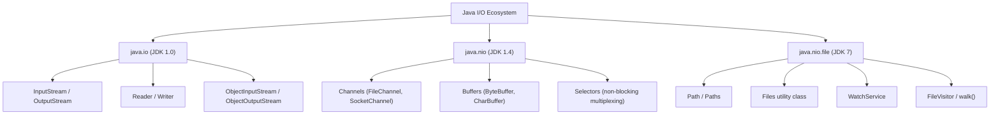
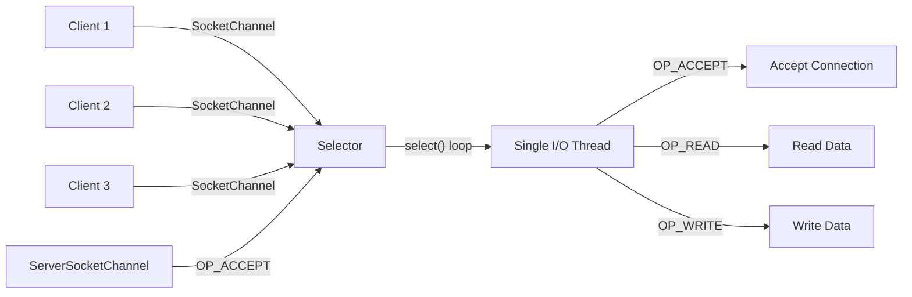

# Java Serialization, I/O & Networking — Comprehensive Guide

> For senior engineers preparing for FAANG/top-tier system design and coding interviews.
> Covers `java.io`, `java.nio`, serialization, JSON libraries, HTTP client, and socket programming.

[← Previous: Performance Tuning](11-Java-Performance-Tuning-Guide.md) | [Home](README.md)

---

## Table of Contents

1. [Java I/O Overview](#1-java-io-overview)
2. [Byte Streams (java.io)](#2-byte-streams-javaio)
3. [Character Streams](#3-character-streams)
4. [Buffered Streams](#4-buffered-streams)
5. [Java NIO (New I/O)](#5-java-nio-new-io)
6. [File Operations (java.nio.file)](#6-file-operations-javaniofile--java-7)
7. [Java Serialization](#7-java-serialization)
8. [JSON Serialization with Jackson](#8-json-serialization-with-jackson)
9. [JSON Serialization with Gson](#9-json-serialization-with-gson)
10. [Java HTTP Client (Java 11+)](#10-java-http-client-java-11)
11. [Socket Programming](#11-socket-programming)
12. [Interview-Focused Summary](#12-interview-focused-summary)

---

## 1. Java I/O Overview

Java I/O has evolved through three major phases:

| Era | Package | Java Version | Model |
|-----|---------|--------------|-------|
| Classic I/O | `java.io` | JDK 1.0 | Stream-based, blocking |
| New I/O | `java.nio` | JDK 1.4 | Channel/Buffer, non-blocking, selectors |
| NIO.2 / File API | `java.nio.file` | JDK 7 | Modern file operations, `Path`, `Files`, `WatchService` |

**Blocking I/O** — a thread calling `read()` blocks until data arrives. Simple but wastes threads under high concurrency.

**Non-blocking I/O** — a channel returns immediately if no data is ready; a single **Selector** thread can multiplex thousands of connections.



> **Interview tip:** Know when to use each package. `java.io` for simple file reads; `java.nio` for high-throughput network servers; `java.nio.file` for modern file manipulation.

---

## 2. Byte Streams (`java.io`)

### 2.1 `InputStream` / `OutputStream` Hierarchy

```text
InputStream (abstract)
├── FileInputStream
├── ByteArrayInputStream
├── BufferedInputStream
├── DataInputStream
├── ObjectInputStream
└── FilterInputStream

OutputStream (abstract)
├── FileOutputStream
├── ByteArrayOutputStream
├── BufferedOutputStream
├── DataOutputStream
├── ObjectOutputStream
└── FilterOutputStream
```

### 2.2 `FileInputStream` / `FileOutputStream`

```java
// Always use try-with-resources to guarantee stream closure
try (FileInputStream fis = new FileInputStream("input.dat");
     FileOutputStream fos = new FileOutputStream("output.dat")) {

    byte[] buffer = new byte[8192];
    int bytesRead;
    while ((bytesRead = fis.read(buffer)) != -1) {
        fos.write(buffer, 0, bytesRead);
    }
} // both streams auto-closed here, even if an exception is thrown
```

### 2.3 `ByteArrayInputStream` / `ByteArrayOutputStream`

Useful for in-memory byte manipulation, unit testing, or building payloads before sending over the network.

```java
byte[] data = "Hello, ByteArray!".getBytes(StandardCharsets.UTF_8);
try (ByteArrayInputStream bais = new ByteArrayInputStream(data)) {
    int b;
    while ((b = bais.read()) != -1) {
        System.out.print((char) b);
    }
}

ByteArrayOutputStream baos = new ByteArrayOutputStream();
baos.write("chunk1-".getBytes());
baos.write("chunk2".getBytes());
byte[] combined = baos.toByteArray(); // "chunk1-chunk2"
```

### 2.4 `DataInputStream` / `DataOutputStream`

Read/write Java primitives in a portable binary format.

```java
try (DataOutputStream dos = new DataOutputStream(
        new BufferedOutputStream(new FileOutputStream("data.bin")))) {
    dos.writeInt(42);
    dos.writeDouble(3.14159);
    dos.writeUTF("Hello");
    dos.writeBoolean(true);
}

try (DataInputStream dis = new DataInputStream(
        new BufferedInputStream(new FileInputStream("data.bin")))) {
    int i = dis.readInt();         // 42
    double d = dis.readDouble();   // 3.14159
    String s = dis.readUTF();      // "Hello"
    boolean b = dis.readBoolean(); // true
}
```

> **Interview tip:** `DataInputStream`/`DataOutputStream` write in big-endian format and are not human-readable — they're raw binary. Contrast with `ObjectOutputStream` which writes full object graphs.

---

## 3. Character Streams

### 3.1 `Reader` / `Writer` Hierarchy

```text
Reader (abstract)
├── InputStreamReader (bridge: bytes → chars)
│   └── FileReader
├── BufferedReader
├── StringReader
└── CharArrayReader

Writer (abstract)
├── OutputStreamWriter (bridge: chars → bytes)
│   └── FileWriter
├── BufferedWriter
├── PrintWriter
├── StringWriter
└── CharArrayWriter
```

### 3.2 Bridge Streams: `InputStreamReader` / `OutputStreamWriter`

These bridge byte streams to character streams and let you specify the **charset**.

```java
try (BufferedReader reader = new BufferedReader(
        new InputStreamReader(new FileInputStream("data.csv"), StandardCharsets.UTF_8))) {
    String line;
    while ((line = reader.readLine()) != null) {
        System.out.println(line);
    }
}

try (BufferedWriter writer = new BufferedWriter(
        new OutputStreamWriter(new FileOutputStream("out.txt"), StandardCharsets.UTF_8))) {
    writer.write("Héllo Wörld");
    writer.newLine();
}
```

### 3.3 `PrintWriter`

Convenient auto-flushing formatted output — combines `println()`, `printf()`, and `format()`.

```java
try (PrintWriter pw = new PrintWriter(new BufferedWriter(new FileWriter("report.txt")))) {
    pw.println("=== Sales Report ===");
    pw.printf("Total: $%,.2f%n", 1_234_567.89);
    pw.printf("Items: %d%n", 42_000);
}
```

### 3.4 `StringReader` / `StringWriter`

In-memory character I/O, handy for testing parsers or templating engines.

```java
String json = "{\"name\":\"Alice\"}";
try (StringReader sr = new StringReader(json)) {
    // pass sr to any API expecting a Reader
}

StringWriter sw = new StringWriter();
sw.write("built ");
sw.write("in memory");
String result = sw.toString(); // "built in memory"
```

### 3.5 Byte Streams vs Character Streams

| Aspect | Byte Streams | Character Streams |
|--------|-------------|-------------------|
| Base classes | `InputStream` / `OutputStream` | `Reader` / `Writer` |
| Unit of data | `byte` (8-bit) | `char` (16-bit Unicode) |
| Use case | Binary data (images, audio, serialized objects) | Text data (CSV, JSON, logs) |
| Encoding | No encoding awareness | Charset-aware via bridge streams |
| Line reading | Not built-in | `BufferedReader.readLine()` |

---

## 4. Buffered Streams

### 4.1 Why Buffering Matters

Each unbuffered `read()`/`write()` call can trigger a **system call** to the OS kernel. System calls are expensive (~1-10 μs each). Buffering batches multiple logical reads/writes into one system call.

### 4.2 Buffer Sizes

- **Default** internal buffer: **8192 bytes** (8 KB) for `BufferedInputStream`, `BufferedReader`, etc.
- Custom size via constructor: `new BufferedInputStream(fis, 65536)` for 64 KB buffer.

### 4.3 Performance Comparison

```java
public class BufferBenchmark {
    private static final String FILE = "large_file.bin"; // 100 MB file

    public static void main(String[] args) throws IOException {
        // Unbuffered: reads one byte at a time — extremely slow
        long start = System.nanoTime();
        try (FileInputStream fis = new FileInputStream(FILE)) {
            while (fis.read() != -1) { }
        }
        long unbuffered = System.nanoTime() - start;

        // Buffered: reads 8 KB chunks internally
        start = System.nanoTime();
        try (BufferedInputStream bis = new BufferedInputStream(new FileInputStream(FILE))) {
            while (bis.read() != -1) { }
        }
        long buffered = System.nanoTime() - start;

        // Manual array buffer: reads 8 KB chunks explicitly
        start = System.nanoTime();
        try (FileInputStream fis = new FileInputStream(FILE)) {
            byte[] buf = new byte[8192];
            while (fis.read(buf) != -1) { }
        }
        long manual = System.nanoTime() - start;

        System.out.printf("Unbuffered : %,d ms%n", unbuffered / 1_000_000);
        System.out.printf("Buffered   : %,d ms%n", buffered / 1_000_000);
        System.out.printf("Manual 8KB : %,d ms%n", manual / 1_000_000);
    }
}
```

Typical results on a 100 MB file:

| Method | Time |
|--------|------|
| Unbuffered (byte-at-a-time) | ~45,000 ms |
| `BufferedInputStream` | ~350 ms |
| Manual 8 KB byte[] | ~120 ms |

> **Interview tip:** Always wrap raw streams in buffered wrappers, or read into a `byte[]` array. Never read one byte at a time from a `FileInputStream` in production.

---

## 5. Java NIO (New I/O)

### 5.1 Channels

Channels are bidirectional conduits for data — unlike streams which are unidirectional.

| Channel | Purpose |
|---------|---------|
| `FileChannel` | Read/write files, memory mapping, file locking |
| `SocketChannel` | TCP client connections |
| `ServerSocketChannel` | TCP server listener |
| `DatagramChannel` | UDP send/receive |

#### Channel vs Stream

| Feature | Stream (`java.io`) | Channel (`java.nio`) |
|---------|-------------------|---------------------|
| Direction | Unidirectional | Bidirectional |
| Blocking | Always blocking | Configurable (blocking or non-blocking) |
| Data unit | Bytes or chars | Buffers |
| Scatter/Gather | No | Yes (`read(ByteBuffer[])`) |
| Selector support | No | Yes (non-blocking channels) |
| Memory-mapped I/O | No | Yes (`FileChannel.map()`) |

### 5.2 Buffers

All NIO data passes through `Buffer` objects. Key buffer types: `ByteBuffer`, `CharBuffer`, `IntBuffer`, `LongBuffer`, `FloatBuffer`, `DoubleBuffer`, `ShortBuffer`.

#### Buffer Properties

| Property | Meaning |
|----------|---------|
| **capacity** | Maximum number of elements (fixed at creation) |
| **position** | Index of next element to read/write |
| **limit** | First index that should NOT be read/written |
| **mark** | Saved position for later `reset()` |

Invariant: `0 ≤ mark ≤ position ≤ limit ≤ capacity`

#### Buffer Lifecycle

```java
// 1. Allocate
ByteBuffer buf = ByteBuffer.allocate(10);
// State: position=0, limit=10, capacity=10
// [ _, _, _, _, _, _, _, _, _, _ ]
//   ^pos                         ^lim/cap

// 2. Put data
buf.put((byte) 'H');
buf.put((byte) 'i');
// State: position=2, limit=10
// [ H, i, _, _, _, _, _, _, _, _ ]
//         ^pos                    ^lim

// 3. Flip (prepare for reading)
buf.flip();
// State: position=0, limit=2
// [ H, i, _, _, _, _, _, _, _, _ ]
//   ^pos  ^lim

// 4. Get data
byte b1 = buf.get(); // 'H', position=1
byte b2 = buf.get(); // 'i', position=2

// 5. Clear (prepare for rewriting)
buf.clear();
// State: position=0, limit=10 — data still there but will be overwritten

// Alternative: compact() shifts unread data to the beginning
buf.compact();
```

#### Direct vs Heap Buffers

```java
// Heap buffer: backed by Java byte[], GC-managed
ByteBuffer heap = ByteBuffer.allocate(1024);

// Direct buffer: off-heap OS memory, bypasses JVM heap
ByteBuffer direct = ByteBuffer.allocateDirect(1024);
```

| Aspect | Heap Buffer | Direct Buffer |
|--------|------------|---------------|
| Memory location | JVM heap | Native OS memory |
| Allocation cost | Fast | Slow (OS call) |
| I/O performance | Extra copy to/from native | Zero-copy I/O (faster) |
| GC pressure | Yes | Minimal |
| Best for | Short-lived, small buffers | Long-lived, large I/O buffers |

### 5.3 File Channel Example

```java
public static void copyWithChannel(Path src, Path dst) throws IOException {
    try (FileChannel srcCh = FileChannel.open(src, StandardOpenOption.READ);
         FileChannel dstCh = FileChannel.open(dst, StandardOpenOption.CREATE,
                 StandardOpenOption.WRITE, StandardOpenOption.TRUNCATE_EXISTING)) {

        // transferTo uses OS-level zero-copy when possible (sendfile on Linux)
        long transferred = 0;
        long size = srcCh.size();
        while (transferred < size) {
            transferred += srcCh.transferTo(transferred, size - transferred, dstCh);
        }
    }
}
```

### 5.4 Selectors (Non-blocking Multiplexing)

A **Selector** allows a single thread to monitor multiple channels for readiness (connect, accept, read, write).



#### Non-blocking Server with Selector

```java
public class NioEchoServer {

    public static void main(String[] args) throws IOException {
        Selector selector = Selector.open();

        ServerSocketChannel serverChannel = ServerSocketChannel.open();
        serverChannel.bind(new InetSocketAddress(8080));
        serverChannel.configureBlocking(false);
        serverChannel.register(selector, SelectionKey.OP_ACCEPT);

        System.out.println("NIO Echo Server listening on port 8080");
        ByteBuffer buffer = ByteBuffer.allocateDirect(4096);

        while (true) {
            selector.select(); // blocks until at least one channel is ready

            Iterator<SelectionKey> keys = selector.selectedKeys().iterator();
            while (keys.hasNext()) {
                SelectionKey key = keys.next();
                keys.remove();

                if (!key.isValid()) continue;

                if (key.isAcceptable()) {
                    ServerSocketChannel server = (ServerSocketChannel) key.channel();
                    SocketChannel client = server.accept();
                    client.configureBlocking(false);
                    client.register(selector, SelectionKey.OP_READ);
                    System.out.println("Accepted: " + client.getRemoteAddress());
                }

                if (key.isReadable()) {
                    SocketChannel client = (SocketChannel) key.channel();
                    buffer.clear();
                    int bytesRead = client.read(buffer);

                    if (bytesRead == -1) {
                        System.out.println("Disconnected: " + client.getRemoteAddress());
                        client.close();
                        continue;
                    }

                    buffer.flip();
                    client.write(buffer); // echo back
                }
            }
        }
    }
}
```

### 5.5 Memory-Mapped Files

Map a file region directly into process memory — the OS handles paging. Ideal for large files with random access patterns.

```java
public static long checksumMapped(Path path) throws IOException {
    try (FileChannel channel = FileChannel.open(path, StandardOpenOption.READ)) {
        long size = channel.size();
        MappedByteBuffer mapped = channel.map(FileChannel.MapMode.READ_ONLY, 0, size);

        long checksum = 0;
        while (mapped.hasRemaining()) {
            checksum += mapped.get() & 0xFF;
        }
        return checksum;
    }
}
```

> **Interview tip:** Memory-mapped files shine for large random-access reads (databases, search indices). Avoid for small sequential files where `BufferedInputStream` is simpler.

---

## 6. File Operations (`java.nio.file` — Java 7+)

### 6.1 `Path` Class

```java
Path p1 = Path.of("/Users", "alice", "docs", "report.pdf");
Path p2 = Path.of("/Users/alice/docs/report.pdf");

p1.getFileName();    // report.pdf
p1.getParent();      // /Users/alice/docs
p1.getRoot();        // /
p1.getNameCount();   // 4

// Resolve (join)
Path base = Path.of("/Users/alice");
Path full = base.resolve("docs/report.pdf"); // /Users/alice/docs/report.pdf

// Relativize
Path other = Path.of("/Users/alice/photos/pic.jpg");
Path rel = base.relativize(other); // photos/pic.jpg

// Normalize
Path messy = Path.of("/Users/alice/docs/../photos/./pic.jpg");
messy.normalize(); // /Users/alice/photos/pic.jpg
```

### 6.2 `Files` Utility Class

#### Reading Files

```java
// Read all lines into a List (loads entire file into memory)
List<String> lines = Files.readAllLines(Path.of("data.csv"), StandardCharsets.UTF_8);

// Read entire file as String (Java 11+)
String content = Files.readString(Path.of("config.json"));

// Read as byte[]
byte[] bytes = Files.readAllBytes(Path.of("image.png"));

// Lazy line stream — memory-efficient for large files
try (Stream<String> stream = Files.lines(Path.of("huge.log"))) {
    long errorCount = stream
        .filter(line -> line.contains("ERROR"))
        .count();
}
```

#### Writing Files

```java
Files.write(Path.of("output.txt"), List.of("line1", "line2"),
        StandardCharsets.UTF_8, StandardOpenOption.CREATE, StandardOpenOption.TRUNCATE_EXISTING);

// Java 11+
Files.writeString(Path.of("note.txt"), "Hello NIO.2!", StandardCharsets.UTF_8);
```

#### File Operations

```java
Files.copy(source, target, StandardCopyOption.REPLACE_EXISTING);
Files.move(source, target, StandardCopyOption.ATOMIC_MOVE);
Files.delete(path);                // throws if not found
Files.deleteIfExists(path);        // returns false if not found

Files.createFile(Path.of("new.txt"));
Files.createDirectory(Path.of("mydir"));
Files.createDirectories(Path.of("a/b/c/d"));

Path tmp = Files.createTempFile("prefix-", ".tmp");
```

#### File Attributes

```java
long size = Files.size(path);
FileTime modified = Files.getLastModifiedTime(path);
boolean isDir = Files.isDirectory(path);
boolean exists = Files.exists(path);
```

### 6.3 Walking File Trees

```java
// Files.walk() — depth-first stream of all paths
try (Stream<Path> paths = Files.walk(Path.of("/project/src"), 10)) {
    List<Path> javaFiles = paths
        .filter(p -> p.toString().endsWith(".java"))
        .collect(Collectors.toList());
}

// Files.find() — walk with a BiPredicate filter
try (Stream<Path> found = Files.find(Path.of("/project"), 10,
        (path, attrs) -> attrs.isRegularFile() && path.toString().endsWith(".log"))) {
    found.forEach(System.out::println);
}

// FileVisitor pattern for full control
Files.walkFileTree(Path.of("/project"), new SimpleFileVisitor<>() {
    @Override
    public FileVisitResult visitFile(Path file, BasicFileAttributes attrs) {
        System.out.println("File: " + file);
        return FileVisitResult.CONTINUE;
    }

    @Override
    public FileVisitResult preVisitDirectory(Path dir, BasicFileAttributes attrs) {
        if (dir.getFileName().toString().equals("node_modules")) {
            return FileVisitResult.SKIP_SUBTREE;
        }
        return FileVisitResult.CONTINUE;
    }
});
```

### 6.4 `WatchService` — Directory Change Notifications

```java
WatchService watcher = FileSystems.getDefault().newWatchService();
Path dir = Path.of("/watched/dir");
dir.register(watcher,
    StandardWatchEventKinds.ENTRY_CREATE,
    StandardWatchEventKinds.ENTRY_MODIFY,
    StandardWatchEventKinds.ENTRY_DELETE);

while (true) {
    WatchKey key = watcher.take(); // blocks until events available
    for (WatchEvent<?> event : key.pollEvents()) {
        WatchEvent.Kind<?> kind = event.kind();
        Path filename = (Path) event.context();
        System.out.printf("%s: %s%n", kind.name(), filename);
    }
    if (!key.reset()) break; // directory no longer accessible
}
```

### 6.5 Old `File` vs New `Path`/`Files`

| Feature | `java.io.File` | `java.nio.file.Path` / `Files` |
|---------|----------------|-------------------------------|
| Immutability | Mutable | `Path` is immutable |
| Error handling | Returns `false` on failure | Throws descriptive `IOException` |
| Symbolic links | Poor support | Full support |
| File attributes | Limited | Rich `BasicFileAttributes`, POSIX, DOS |
| Watch for changes | Not supported | `WatchService` |
| Walking trees | `listFiles()` (shallow) | `Files.walk()`, `FileVisitor` |
| Atomic moves | Not supported | `StandardCopyOption.ATOMIC_MOVE` |

> **Interview tip:** Always prefer `Path`/`Files` over `java.io.File` in modern codebases. The old API silently swallows errors.

---

## 7. Java Serialization

### 7.1 What Is Serialization?

Converting an **object graph** (object + all referenced objects) into a byte stream for storage or network transmission, and reconstructing it later (**deserialization**).

### 7.2 `Serializable` Interface

```java
public class Employee implements Serializable {
    @Serial
    private static final long serialVersionUID = 1L;

    private String name;
    private int age;
    private transient String password; // excluded from serialization

    private Department department; // Department must also be Serializable

    // constructors, getters, setters ...
}
```

**`serialVersionUID`** — a version fingerprint. If the receiver's class has a different UID than the byte stream, deserialization throws `InvalidClassException`. Always declare it explicitly; otherwise the JVM auto-generates one based on class structure, which breaks across compiler versions.

### 7.3 Basic Serialization / Deserialization

```java
// Serialize
Employee emp = new Employee("Alice", 30, "secret123", engineering);
try (ObjectOutputStream oos = new ObjectOutputStream(
        new BufferedOutputStream(new FileOutputStream("employee.ser")))) {
    oos.writeObject(emp);
}

// Deserialize
try (ObjectInputStream ois = new ObjectInputStream(
        new BufferedInputStream(new FileInputStream("employee.ser")))) {
    Employee restored = (Employee) ois.readObject();
    // restored.password will be null (transient)
}
```

### 7.4 Custom Serialization

```java
public class Account implements Serializable {
    @Serial
    private static final long serialVersionUID = 2L;

    private String accountId;
    private double balance;
    private transient String cachedDisplay;

    @Serial
    private void writeObject(ObjectOutputStream oos) throws IOException {
        oos.defaultWriteObject();
        oos.writeDouble(balance * 1.0); // could encrypt here
    }

    @Serial
    private void readObject(ObjectInputStream ois) throws IOException, ClassNotFoundException {
        ois.defaultReadObject();
        balance = ois.readDouble();
        cachedDisplay = accountId + ": $" + balance; // rebuild transient field
    }

    // Protect singleton during deserialization
    @Serial
    private Object readResolve() throws ObjectStreamException {
        return AccountRegistry.getOrCreate(this.accountId, this.balance);
    }
}
```

### 7.5 `Externalizable` Interface

Gives **full control** — no default serialization behavior.

```java
public class CompactEvent implements Externalizable {

    private long timestamp;
    private short eventType;
    private String payload;

    public CompactEvent() { } // required public no-arg constructor

    @Override
    public void writeExternal(ObjectOutput out) throws IOException {
        out.writeLong(timestamp);
        out.writeShort(eventType);
        out.writeUTF(payload != null ? payload : "");
    }

    @Override
    public void readExternal(ObjectInput in) throws IOException {
        timestamp = in.readLong();
        eventType = in.readShort();
        payload = in.readUTF();
    }
}
```

### 7.6 `Serializable` vs `Externalizable`

| Aspect | `Serializable` | `Externalizable` |
|--------|----------------|-------------------|
| Marker interface | Yes (no methods) | No — must implement `writeExternal`/`readExternal` |
| Default behavior | Serializes all non-transient fields | Nothing — you write everything |
| No-arg constructor | Not required | **Required** (public) |
| Performance | Slower (reflection-based) | Faster (explicit field writes) |
| Control | Partial (via `transient`, custom methods) | Full |
| Use case | General purpose | Performance-critical, compact formats |

### 7.7 Security Risks of Java Serialization

Java deserialization is **inherently dangerous**:

- **Gadget chains** — an attacker crafts a byte stream that chains existing library classes to execute arbitrary code during `readObject()`.
- **CVEs** — Apache Commons Collections, Spring, WebLogic, and many others have had critical RCE vulnerabilities via deserialization.
- **No type checking before deserialization** — the JVM instantiates objects *before* your code can validate them.

**JEP 290** (Java 9) introduced deserialization filters (`ObjectInputFilter`) to whitelist allowed classes:

```java
ObjectInputStream ois = new ObjectInputStream(input);
ois.setObjectInputFilter(filterInfo -> {
    Class<?> clazz = filterInfo.serialClass();
    if (clazz != null && !clazz.getName().startsWith("com.myapp.model.")) {
        return ObjectInputFilter.Status.REJECTED;
    }
    return ObjectInputFilter.Status.ALLOWED;
});
```

### 7.8 Alternatives to Java Serialization

| Format | Library | Pros | Cons |
|--------|---------|------|------|
| JSON | Jackson, Gson | Human-readable, language-agnostic | Verbose, no schema enforcement |
| Protocol Buffers | protobuf-java | Compact, fast, schema-enforced, backward-compatible | Binary, requires `.proto` files |
| Avro | Apache Avro | Schema evolution, compact, big-data ecosystem | Complex setup |
| Thrift | Apache Thrift | RPC + serialization in one | Less popular than gRPC/Protobuf |
| MessagePack | msgpack-java | Compact binary JSON | Less tooling |

> **Interview tip:** "Java serialization is effectively deprecated for new designs. Use JSON for APIs, Protocol Buffers for internal services, and Avro for data pipelines."

---

## 8. JSON Serialization with Jackson

### 8.1 Core API: `ObjectMapper`

```java
ObjectMapper mapper = new ObjectMapper();

// Object → JSON string
String json = mapper.writeValueAsString(employee);

// JSON string → Object
Employee emp = mapper.readValue(json, Employee.class);

// JSON string → JsonNode (tree model)
JsonNode tree = mapper.readTree(json);
String name = tree.get("name").asText();

// Write to file
mapper.writerWithDefaultPrettyPrinter().writeValue(new File("emp.json"), employee);

// Read from file
Employee fromFile = mapper.readValue(new File("emp.json"), Employee.class);
```

### 8.2 Common Annotations

| Annotation | Purpose | Example |
|------------|---------|---------|
| `@JsonProperty("n")` | Map field to JSON key `"n"` | `@JsonProperty("full_name") String name` |
| `@JsonIgnore` | Exclude single field | On getter or field |
| `@JsonIgnoreProperties` | Ignore listed / unknown properties | `@JsonIgnoreProperties(ignoreUnknown = true)` |
| `@JsonInclude` | Conditional inclusion | `@JsonInclude(Include.NON_NULL)` |
| `@JsonFormat` | Date/number format | `@JsonFormat(pattern = "yyyy-MM-dd")` |
| `@JsonCreator` | Custom deserialization constructor | With `@JsonProperty` on params |
| `@JsonValue` | Serialize entire object as one value | On a getter returning String |
| `@JsonSerialize` | Custom serializer class | `@JsonSerialize(using = MoneySerializer.class)` |
| `@JsonDeserialize` | Custom deserializer class | `@JsonDeserialize(using = MoneyDeserializer.class)` |

### 8.3 Example with Annotations

```java
@JsonIgnoreProperties(ignoreUnknown = true)
@JsonInclude(JsonInclude.Include.NON_NULL)
public class ApiResponse<T> {

    @JsonProperty("status_code")
    private int statusCode;

    private String message;

    @JsonFormat(shape = JsonFormat.Shape.STRING, pattern = "yyyy-MM-dd'T'HH:mm:ss.SSSZ")
    private Instant timestamp;

    private T data;

    @JsonCreator
    public ApiResponse(@JsonProperty("status_code") int statusCode,
                       @JsonProperty("message") String message,
                       @JsonProperty("data") T data) {
        this.statusCode = statusCode;
        this.message = message;
        this.data = data;
        this.timestamp = Instant.now();
    }
}
```

### 8.4 Generic Types with `TypeReference`

```java
// Deserializing List<Employee>
List<Employee> employees = mapper.readValue(json, new TypeReference<List<Employee>>() {});

// Deserializing Map<String, List<Integer>>
Map<String, List<Integer>> map = mapper.readValue(json,
        new TypeReference<Map<String, List<Integer>>>() {});
```

### 8.5 Custom Serializer / Deserializer

```java
public class MoneySerializer extends JsonSerializer<BigDecimal> {
    @Override
    public void serialize(BigDecimal value, JsonGenerator gen,
                          SerializerProvider provider) throws IOException {
        gen.writeString(value.setScale(2, RoundingMode.HALF_UP).toString());
    }
}

public class MoneyDeserializer extends JsonDeserializer<BigDecimal> {
    @Override
    public BigDecimal deserialize(JsonParser p, DeserializationContext ctx) throws IOException {
        return new BigDecimal(p.getValueAsString()).setScale(2, RoundingMode.HALF_UP);
    }
}
```

### 8.6 `ObjectMapper` Configuration

```java
ObjectMapper mapper = new ObjectMapper()
    .configure(DeserializationFeature.FAIL_ON_UNKNOWN_PROPERTIES, false)
    .configure(SerializationFeature.INDENT_OUTPUT, true)
    .configure(SerializationFeature.WRITE_DATES_AS_TIMESTAMPS, false)
    .setSerializationInclusion(JsonInclude.Include.NON_NULL)
    .registerModule(new JavaTimeModule()); // for java.time types
```

> **Important:** `ObjectMapper` is thread-safe after configuration. Create one shared instance and reuse it — constructing a new one on every request is a common performance anti-pattern.

### 8.7 Jackson vs Gson

| Feature | Jackson | Gson |
|---------|---------|------|
| Performance | Faster (streaming core) | Slower |
| Spring integration | First-class (default) | Manual |
| Annotation richness | Very rich | Basic |
| Streaming API | Yes (`JsonParser`/`JsonGenerator`) | Yes (`JsonReader`/`JsonWriter`) |
| Tree model | `JsonNode` | `JsonElement` |
| Module system | Yes (JavaTime, Kotlin, etc.) | Limited |
| Jar size | Larger (~1.7 MB total) | Smaller (~250 KB) |
| Learning curve | Steeper | Simpler |

---

## 9. JSON Serialization with Gson

### 9.1 Core API

```java
Gson gson = new GsonBuilder()
    .setPrettyPrinting()
    .setDateFormat("yyyy-MM-dd")
    .serializeNulls()
    .create();

// Serialize
String json = gson.toJson(employee);

// Deserialize
Employee emp = gson.fromJson(json, Employee.class);
```

### 9.2 Annotations

```java
public class User {
    @SerializedName("user_name")
    private String username;

    @Expose
    private String email;      // included when using excludeFieldsWithoutExposeAnnotation()

    @Expose(serialize = false)
    private String password;   // deserialized but not serialized

    private transient String sessionToken; // always excluded
}
```

### 9.3 Generic Types with `TypeToken`

```java
Type listType = new TypeToken<List<Employee>>() {}.getType();
List<Employee> employees = gson.fromJson(json, listType);

Type mapType = new TypeToken<Map<String, List<Integer>>>() {}.getType();
Map<String, List<Integer>> map = gson.fromJson(json, mapType);
```

### 9.4 Custom Type Adapter

```java
public class InstantAdapter extends TypeAdapter<Instant> {
    @Override
    public void write(JsonWriter out, Instant value) throws IOException {
        out.value(value == null ? null : value.toString());
    }

    @Override
    public Instant read(JsonReader in) throws IOException {
        String text = in.nextString();
        return Instant.parse(text);
    }
}

Gson gson = new GsonBuilder()
    .registerTypeAdapter(Instant.class, new InstantAdapter())
    .create();
```

> **When to choose Gson:** Android projects (smaller footprint), simple JSON tasks, or when you need a minimal dependency. For backend services with Spring, Jackson is the standard.

---

## 10. Java HTTP Client (Java 11+)

### 10.1 Architecture

The `java.net.http` module provides a modern, fluent HTTP client with HTTP/2, async support, and WebSocket.

```java
HttpClient client = HttpClient.newBuilder()
    .version(HttpClient.Version.HTTP_2)
    .followRedirects(HttpClient.Redirect.NORMAL)
    .connectTimeout(Duration.ofSeconds(10))
    .executor(Executors.newFixedThreadPool(4))
    .build();
```

### 10.2 GET Request

```java
HttpRequest request = HttpRequest.newBuilder()
    .uri(URI.create("https://api.example.com/users/42"))
    .header("Accept", "application/json")
    .header("Authorization", "Bearer " + token)
    .timeout(Duration.ofSeconds(30))
    .GET() // default, can be omitted
    .build();

HttpResponse<String> response = client.send(request, HttpResponse.BodyHandlers.ofString());

System.out.println("Status: " + response.statusCode());
System.out.println("Body: " + response.body());

User user = mapper.readValue(response.body(), User.class);
```

### 10.3 POST with JSON Body

```java
String jsonBody = mapper.writeValueAsString(new CreateUserRequest("Alice", "alice@example.com"));

HttpRequest postRequest = HttpRequest.newBuilder()
    .uri(URI.create("https://api.example.com/users"))
    .header("Content-Type", "application/json")
    .POST(HttpRequest.BodyPublishers.ofString(jsonBody))
    .build();

HttpResponse<String> postResponse = client.send(postRequest, HttpResponse.BodyHandlers.ofString());

if (postResponse.statusCode() == 201) {
    User created = mapper.readValue(postResponse.body(), User.class);
    System.out.println("Created user: " + created.getId());
}
```

### 10.4 Asynchronous Requests

```java
CompletableFuture<HttpResponse<String>> future = client.sendAsync(
    request, HttpResponse.BodyHandlers.ofString());

future
    .thenApply(HttpResponse::body)
    .thenApply(body -> mapper.readValue(body, User.class))
    .thenAccept(user -> System.out.println("Async user: " + user.getName()))
    .exceptionally(ex -> { ex.printStackTrace(); return null; });

// Fire multiple requests concurrently
List<URI> uris = List.of(
    URI.create("https://api.example.com/users/1"),
    URI.create("https://api.example.com/users/2"),
    URI.create("https://api.example.com/users/3")
);

List<CompletableFuture<String>> futures = uris.stream()
    .map(uri -> HttpRequest.newBuilder(uri).build())
    .map(req -> client.sendAsync(req, HttpResponse.BodyHandlers.ofString()))
    .map(cf -> cf.thenApply(HttpResponse::body))
    .collect(Collectors.toList());

CompletableFuture.allOf(futures.toArray(new CompletableFuture[0])).join();
futures.forEach(f -> System.out.println(f.join()));
```

### 10.5 Other Body Publishers and Handlers

```java
// Upload a file
HttpRequest.BodyPublishers.ofFile(Path.of("upload.zip"));

// Upload raw bytes
HttpRequest.BodyPublishers.ofByteArray(data);

// Download to file
HttpResponse.BodyHandlers.ofFile(Path.of("downloaded.zip"));

// Stream lines lazily
HttpResponse.BodyHandlers.ofLines(); // returns Stream<String>
```

### 10.6 Old `HttpURLConnection` vs New `HttpClient`

| Feature | `HttpURLConnection` | `HttpClient` (Java 11+) |
|---------|--------------------|-----------------------|
| API style | Imperative, verbose | Fluent builder |
| HTTP/2 | No | Yes |
| Async | Manual threading | Built-in `CompletableFuture` |
| WebSocket | No | Yes |
| Redirect handling | Manual | Configurable policies |
| Timeout | Global only | Per-request + connect timeout |
| Thread safety | Not reusable | Immutable, thread-safe |

---

## 11. Socket Programming

### 11.1 TCP Echo Server (Single-threaded)

```java
public class TcpEchoServer {
    public static void main(String[] args) throws IOException {
        try (ServerSocket serverSocket = new ServerSocket(9090)) {
            System.out.println("Echo server listening on port 9090");

            while (true) {
                Socket clientSocket = serverSocket.accept(); // blocks until a client connects
                handleClient(clientSocket);
            }
        }
    }

    private static void handleClient(Socket socket) {
        try (socket;
             BufferedReader in = new BufferedReader(new InputStreamReader(socket.getInputStream()));
             PrintWriter out = new PrintWriter(socket.getOutputStream(), true)) {

            String line;
            while ((line = in.readLine()) != null) {
                System.out.println("Received: " + line);
                out.println("ECHO: " + line);
            }
        } catch (IOException e) {
            System.err.println("Client error: " + e.getMessage());
        }
    }
}
```

### 11.2 TCP Client

```java
public class TcpClient {
    public static void main(String[] args) throws IOException {
        try (Socket socket = new Socket("localhost", 9090);
             PrintWriter out = new PrintWriter(socket.getOutputStream(), true);
             BufferedReader in = new BufferedReader(
                     new InputStreamReader(socket.getInputStream()))) {

            out.println("Hello Server!");
            String response = in.readLine();
            System.out.println("Server replied: " + response);
        }
    }
}
```

### 11.3 Multi-Threaded Server with Thread Pool

The single-threaded server above blocks on one client at a time. A production server uses a bounded thread pool:

```java
public class ThreadPoolServer {
    private static final int PORT = 9090;
    private static final int POOL_SIZE = Runtime.getRuntime().availableProcessors() * 2;

    public static void main(String[] args) throws IOException {
        ExecutorService pool = Executors.newFixedThreadPool(POOL_SIZE);

        try (ServerSocket serverSocket = new ServerSocket(PORT)) {
            serverSocket.setSoTimeout(0); // no accept timeout
            System.out.printf("Thread pool server (pool=%d) on port %d%n", POOL_SIZE, PORT);

            while (!Thread.currentThread().isInterrupted()) {
                Socket client = serverSocket.accept();
                pool.submit(() -> handleClient(client));
            }
        } finally {
            pool.shutdown();
            if (!pool.awaitTermination(30, TimeUnit.SECONDS)) {
                pool.shutdownNow();
            }
        }
    }

    private static void handleClient(Socket socket) {
        try (socket;
             BufferedReader in = new BufferedReader(new InputStreamReader(socket.getInputStream()));
             PrintWriter out = new PrintWriter(socket.getOutputStream(), true)) {

            String line;
            while ((line = in.readLine()) != null) {
                out.println("ECHO: " + line);
            }
        } catch (IOException e) {
            System.err.println("Client handler error: " + e.getMessage());
        }
    }
}
```

### 11.4 UDP Basics

```java
// UDP Server
try (DatagramSocket socket = new DatagramSocket(9091)) {
    byte[] buf = new byte[1024];
    DatagramPacket packet = new DatagramPacket(buf, buf.length);
    socket.receive(packet); // blocks

    String received = new String(packet.getData(), 0, packet.getLength());
    System.out.println("UDP received: " + received);

    byte[] response = ("ECHO: " + received).getBytes();
    DatagramPacket reply = new DatagramPacket(
            response, response.length, packet.getAddress(), packet.getPort());
    socket.send(reply);
}

// UDP Client
try (DatagramSocket socket = new DatagramSocket()) {
    byte[] data = "Hello UDP".getBytes();
    InetAddress address = InetAddress.getByName("localhost");
    socket.send(new DatagramPacket(data, data.length, address, 9091));

    byte[] buf = new byte[1024];
    DatagramPacket response = new DatagramPacket(buf, buf.length);
    socket.receive(response);
    System.out.println(new String(response.getData(), 0, response.getLength()));
}
```

### 11.5 When to Use What

| Approach | Best For | Concurrency Model |
|----------|----------|------------------|
| Raw TCP Sockets | Custom protocols, learning | Thread-per-connection or NIO |
| Raw UDP Sockets | Low-latency, loss-tolerant (gaming, DNS) | Single-threaded or thread pool |
| Java NIO Selector | High-concurrency servers (10K+ connections) | Single thread multiplexing |
| `HttpClient` (Java 11+) | REST API calls, HTTP communication | Built-in thread pool + async |
| Netty / Vert.x | Production network servers, proxies | Event loop (Reactor pattern) |
| gRPC | Microservice-to-microservice RPC | HTTP/2 + Protobuf |

### 11.6 TCP vs UDP vs HTTP

| Feature | TCP | UDP | HTTP |
|---------|-----|-----|------|
| Connection | Connection-oriented (3-way handshake) | Connectionless | Over TCP (or QUIC) |
| Reliability | Guaranteed delivery, ordering | Best effort, no ordering guarantee | Guaranteed (inherits TCP) |
| Speed | Slower (overhead) | Faster (no handshake) | Slowest (headers + TCP) |
| Use case | File transfer, web, email | Streaming, gaming, DNS | APIs, web pages |
| Flow control | Yes (TCP window) | No | Yes (inherits TCP) |
| Overhead | 20-byte header | 8-byte header | TCP + HTTP headers |

---

## 12. Interview-Focused Summary

### Quick-Fire Q&A

| # | Question | Key Answer |
|---|----------|------------|
| 1 | Byte stream vs character stream? | Byte streams handle raw binary data (8-bit); character streams handle Unicode text (16-bit) with charset encoding. |
| 2 | When to use `BufferedReader`? | Always when reading text line-by-line; reduces system calls from thousands to a few. |
| 3 | What does `flush()` do? | Forces buffered data to be written to the underlying stream/device immediately. |
| 4 | NIO vs IO? | IO is stream-based and blocking; NIO is channel/buffer-based, supports non-blocking I/O and selectors. |
| 5 | What is a `ByteBuffer`? | A fixed-size container with position/limit/capacity that channels read into and write from. |
| 6 | `flip()` vs `clear()` vs `compact()`? | `flip()` prepares for reading (limit=position, position=0). `clear()` resets for writing (position=0, limit=capacity). `compact()` shifts unread data to start and prepares remaining space for writing. |
| 7 | Direct vs heap `ByteBuffer`? | Direct buffers use native memory (faster I/O, slower allocation); heap buffers use JVM heap (faster allocation, extra copy on I/O). |
| 8 | How does a Selector work? | A single thread calls `select()` which blocks until registered channels are ready; it then iterates `SelectionKey`s to handle I/O events. |
| 9 | `Path` vs `File`? | `Path` (NIO.2) is immutable, throws descriptive exceptions, supports attributes and watch service. `File` is legacy. |
| 10 | What is `serialVersionUID`? | A version identifier for `Serializable` classes; mismatch causes `InvalidClassException` during deserialization. |
| 11 | What does `transient` do? | Excludes a field from Java serialization; the field gets its default value upon deserialization. |
| 12 | `Serializable` vs `Externalizable`? | `Serializable` is a marker interface with automatic field serialization. `Externalizable` requires explicit implementation, a no-arg constructor, and gives full control. |
| 13 | Why is Java serialization dangerous? | Deserialization can trigger arbitrary code execution via gadget chains in classpath libraries. |
| 14 | What replaced Java serialization? | JSON (Jackson), Protocol Buffers, Avro for cross-language; Records + JSON for modern Java services. |
| 15 | Jackson `ObjectMapper` thread safety? | Thread-safe after configuration. Create once, reuse everywhere. Never create per-request. |
| 16 | `@JsonIgnore` vs `@JsonIgnoreProperties`? | `@JsonIgnore` on a single field; `@JsonIgnoreProperties` on a class to ignore multiple or unknown fields. |
| 17 | How to deserialize generics in Jackson? | Use `TypeReference<>`: `mapper.readValue(json, new TypeReference<List<User>>() {})`. |
| 18 | Jackson vs Gson? | Jackson: faster, richer annotations, Spring default. Gson: simpler, smaller JAR, good for Android. |
| 19 | Java `HttpClient` vs `HttpURLConnection`? | `HttpClient` (Java 11+): fluent API, HTTP/2, async with `CompletableFuture`, WebSocket. `HttpURLConnection`: legacy, verbose, no HTTP/2. |
| 20 | TCP vs UDP? | TCP: reliable, ordered, connection-oriented. UDP: fast, unreliable, connectionless. |
| 21 | Thread-per-connection vs NIO? | Thread-per-connection is simple but doesn't scale (C10K problem). NIO selectors handle thousands of connections on one thread. |
| 22 | What is memory-mapped I/O? | `FileChannel.map()` maps a file region into process memory; the OS handles paging, enabling fast random access on large files. |
| 23 | `Files.lines()` vs `Files.readAllLines()`? | `lines()` returns a lazy `Stream<String>` (memory-efficient). `readAllLines()` loads everything into a `List` at once. |
| 24 | What is `WatchService`? | A NIO.2 API that monitors directories for file create/modify/delete events without polling. |
| 25 | How to send async HTTP requests in Java? | `httpClient.sendAsync(request, bodyHandler)` returns a `CompletableFuture<HttpResponse<T>>`. |

### Key Patterns to Remember

1. **Always use try-with-resources** for any `AutoCloseable` (streams, channels, sockets, connections).
2. **Always buffer** — wrap raw streams in `Buffered*` or read into `byte[]`/`char[]` arrays.
3. **Reuse `ObjectMapper`** — it's thread-safe and expensive to create.
4. **Prefer `Path`/`Files`** over `java.io.File` in all new code.
5. **Never use Java serialization** for untrusted input — use JSON or Protocol Buffers.
6. **Use NIO selectors** when you need to handle thousands of concurrent connections.
7. **Use `HttpClient`** (Java 11+) instead of `HttpURLConnection` or third-party libraries for simple HTTP.
8. **Direct `ByteBuffer`** for long-lived I/O buffers; heap `ByteBuffer` for short-lived operations.

---

*Last updated: April 2026*

---

[← Previous: Performance Tuning](11-Java-Performance-Tuning-Guide.md) | [Home](README.md)
